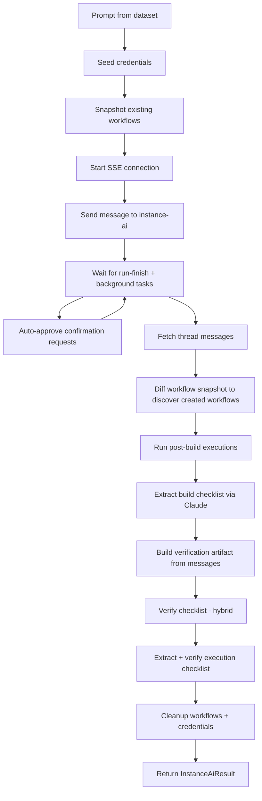

# Checklist Evaluator

Automated evaluation of the Instance AI agent. Sends prompts to a running n8n
instance, captures the agent's actions via SSE, then scores the outcome against
a checklist of requirements using hybrid (programmatic + LLM) verification.

## Quick Start

```bash
# From packages/@n8n/instance-ai

# Run all simple prompts against a local n8n instance
pnpm eval:instance-ai --complexity simple

# Single prompt
pnpm eval:instance-ai --prompt "Create a webhook workflow that returns Hello World"

# Verbose output
pnpm eval:instance-ai --complexity simple --verbose

# Skip execution testing (faster, build checklist only)
pnpm eval:instance-ai --complexity simple --skip-execution
```

### Prerequisites

1. A running n8n instance with Instance AI enabled:
   ```
   N8N_INSTANCE_AI_MODEL=anthropic/claude-sonnet-4-5
   ANTHROPIC_API_KEY=sk-ant-...
   ```
2. Login credentials (defaults: `N8N_EVAL_EMAIL` / `N8N_EVAL_PASSWORD` env vars,
   or `admin@n8n.io` / `password`)
3. `N8N_AI_ANTHROPIC_KEY` or `ANTHROPIC_API_KEY` for checklist extraction/verification

## Architecture

```
evaluations/
├── types.ts                          # Shared types and Zod schemas
├── clients/
│   ├── n8n-client.ts                 # HTTP client for n8n REST API
│   └── sse-client.ts                 # SSE stream parser
├── checklist/
│   ├── extractor.ts                  # Claude-powered build checklist extraction
│   ├── execution-extractor.ts        # Execution checklist + test payload extraction
│   ├── verifier.ts                   # Hybrid verification dispatcher
│   └── programmatic-checks.ts        # Pure functions for structural checks
├── outcome/
│   ├── event-parser.ts               # Extract resource IDs, metrics from SSE events
│   ├── workflow-discovery.ts          # Pre/post workflow snapshot diffing
│   ├── artifact-builder.ts           # Build markdown verification artifact
│   └── cleanup.ts                    # Delete workflows, credentials after eval
├── credentials/
│   └── seeder.ts                     # Credential lifecycle (seed/cleanup)
├── execution/
│   └── tester.ts                     # Trigger-specific execution testing
├── system-prompts/
│   ├── checklist-extract.ts          # Prompt for build checklist extraction
│   ├── checklist-verify.ts           # Prompt for LLM verification
│   └── execution-extract.ts          # Prompt for execution checklist
├── harness/
│   ├── runner.ts                     # Main orchestrator
│   ├── feedback.ts                   # Feedback formatting for LangSmith
│   ├── dataset.ts                    # LangSmith dataset read/write
│   └── logger.ts                     # Logging utilities
├── report/
│   ├── generator.ts                  # HTML report generation
│   └── storage.ts                    # JSON run persistence
├── data/
│   └── prompts.ts                    # Local prompt dataset (source of truth)
├── cli/
│   ├── index.ts                      # Entry point
│   └── args.ts                       # CLI argument parser
└── __tests__/
    ├── programmatic-checks.test.ts   # Unit tests for structural checks
    └── event-parser.test.ts          # Unit tests for event parsing
```

## How It Works

### Data Flow (single example)



### Hybrid Verification

Each checklist item is classified with a verification strategy:

| Strategy | When used | How verified |
|----------|-----------|--------------|
| `programmatic` | Structural facts verifiable from workflow JSON | Pure functions inspect nodes, connections, parameters |
| `llm` | Semantic requirements needing context understanding | Claude reads the verification artifact and judges pass/fail |

Programmatic checks run first (instant, deterministic), then LLM checks run
in a single batch. This reduces LLM calls and makes structural checks
reproducible.

#### Programmatic Check Types

| Type | What it verifies |
|------|-----------------|
| `node-exists` | A node of the given type exists in the workflow |
| `node-connected` | The node has incoming or outgoing connections |
| `trigger-type` | The first trigger node matches the expected type |
| `node-count-gte` | The workflow has at least N nodes |
| `connection-exists` | A direct connection exists between two node types |
| `node-parameter` | A node parameter at a dot-path matches an expected value |

### Concurrency Safety

Multiple examples run in parallel within a batch. Cross-run workflow
attribution is prevented by:

1. **Pre-run snapshot** — taken once per batch, shared across all examples
2. **Claimed IDs set** — when a run discovers workflows, it claims them so
   concurrent runs skip them
3. **Message-based filtering** — only workflows referenced in the thread's
   rich messages are attributed to that run

### SSE Event Handling

The evaluator connects to `/rest/instance-ai/events/:threadId` and processes:

- `run-start` / `run-finish` — track run lifecycle
- `text-delta` — accumulate agent text output
- `tool-call` / `tool-result` / `tool-error` — track tool usage and extract resource IDs
- `agent-spawned` / `agent-completed` — track sub-agents for background task waiting
- `confirmation-request` — auto-approved immediately

After `run-finish`, the evaluator waits for background tasks (sub-agents) to
complete via REST polling + SSE event matching. If the main agent resumes
(new `run-start`), the wait loop repeats.

## CLI Reference

```
pnpm eval:instance-ai [command] [options]

Commands:
  (default)          Run the evaluation pipeline
  report             Regenerate HTML report from saved runs
  upload-datasets    Upload local prompts to LangSmith datasets

Options:
  --prompt <text>          Single prompt to evaluate
  --tags <csv>             Filter by tags (e.g. build,webhook)
  --complexity <level>     simple | medium | complex
  --trigger-type <type>    manual | webhook | schedule | form
  --max-examples <n>       Limit examples to evaluate
  --concurrency <n>        Parallel evaluations (default: 3)
  --timeout-ms <ms>        Per-example timeout (default: 600000)
  --skip-execution         Skip execution testing
  --langsmith              Enable LangSmith mode
  --dataset <name>         LangSmith dataset name
  --name <experiment>      LangSmith experiment name
  --base-url <url>         n8n URL (default: http://localhost:5678)
  --email <email>          Login email (default: N8N_EVAL_EMAIL)
  --password <pass>        Login password (default: N8N_EVAL_PASSWORD)
  --verbose                Verbose logging
```

## Prompt Dataset

The local prompt dataset lives in `data/prompts.ts` and is the source of truth.
Each prompt has:

```typescript
interface PromptConfig {
  text: string;                          // The prompt sent to the agent
  complexity: 'simple' | 'medium' | 'complex';
  tags: string[];                        // For filtering (build, webhook, data-table, etc.)
  triggerType?: 'manual' | 'webhook' | 'schedule' | 'form';
  expectedCredentials?: string[];        // Credential types needed (slackApi, notionApi, etc.)
  dataset?: 'general' | 'builder';      // LangSmith dataset assignment
}
```

### Complexity Levels

- **Simple** (6 prompts) — Single-tool tasks: list workflows, create a basic
  workflow, query executions, create a data table
- **Medium** (14 prompts) — Multi-step builds: webhook + validation + data
  table, form triggers, branching, credential-based services
- **Complex** (6 prompts) — Autonomous multi-step tasks: lead scoring systems,
  feedback collection, CRUD APIs, content moderation pipelines

## Credential Seeding

External service credentials are seeded from environment variables before each
run:

| Env Var | Credential Type | Name |
|---------|----------------|------|
| `EVAL_SLACK_ACCESS_TOKEN` | `slackApi` | [eval] Slack |
| `EVAL_NOTION_API_KEY` | `notionApi` | [eval] Notion |
| `EVAL_GITHUB_ACCESS_TOKEN` | `githubApi` | [eval] GitHub |
| `EVAL_GMAIL_ACCESS_TOKEN` | `gmailOAuth2Api` | [eval] Gmail |
| `EVAL_TEAMS_ACCESS_TOKEN` | `microsoftTeamsOAuth2Api` | [eval] Teams |

Generic HTTP credentials (header auth, basic auth) are always seeded with
placeholder values. All seeded credentials are cleaned up after the run.

## Execution Testing

When `--skip-execution` is not set, the evaluator:

1. Force-executes created workflows that weren't already run by the agent
2. Extracts an execution checklist via Claude (test inputs + assertions)
3. Re-executes with generated test payloads by trigger type:

| Trigger | Strategy |
|---------|----------|
| Manual | `POST /rest/workflows/:id/run` with empty pin data |
| Webhook | Activate workflow, HTTP POST to webhook path, deactivate |
| Schedule | Pin data injection on schedule trigger node |
| Form | Pin data injection with form field values |

## Report

After each run, an HTML report is saved to `.data/instance-ai-report.html`.

The report includes:
- Summary dashboard (avg build score, exec score, success rate, timing)
- Complexity and tag filters
- Per-result detail panels with:
  - Build checklist with pass/fail per item and strategy badges (programmatic/llm)
  - Execution checklist results
  - Chat conversation with tool call details
  - Workflow previews via `<n8n-demo>` web component
  - Execution results with node outputs and webhook responses

Regenerate from saved runs:
```bash
pnpm eval:instance-ai report
```

## Feedback Metrics

When running with `--langsmith`, these metrics are reported per example:

| Metric | Type | Description |
|--------|------|-------------|
| `checklist_pass_rate` | score | Build checklist pass rate (primary metric) |
| `checklist_programmatic_rate` | metric | Programmatic items pass rate |
| `checklist_llm_rate` | metric | LLM-verified items pass rate |
| `execution_checklist_rate` | score | Execution checklist pass rate |
| `execution_success` | score | At least one execution succeeded |
| `duration_seconds` | metric | Total example time |
| `agent_duration_seconds` | metric | Time to run-finish |
| `tool_call_count` | metric | Tool calls observed |
| `sub_agents_spawned` | metric | Sub-agents spawned |
| `confirmation_count` | metric | Auto-approvals |
| `workflows_created` | metric | Workflows created count |
| `success` | score | No errors during eval |

## Testing

```bash
# Run unit tests
pnpm jest evaluations/__tests__ --no-coverage

# Run specific test file
pnpm jest evaluations/__tests__/programmatic-checks.test.ts --no-coverage
```

Unit tests cover the pure functions (programmatic checks, event parsing).
Integration tests require a running n8n instance — use the CLI for those.
