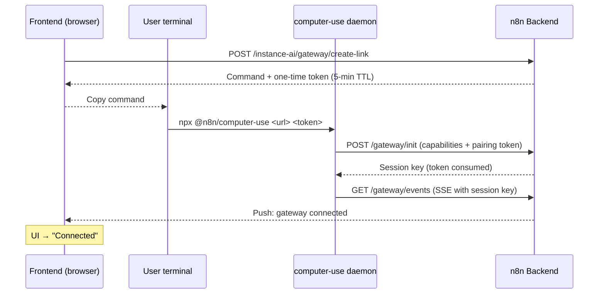
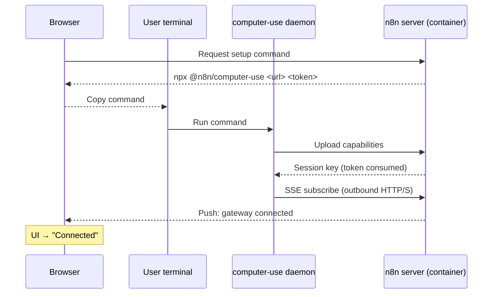
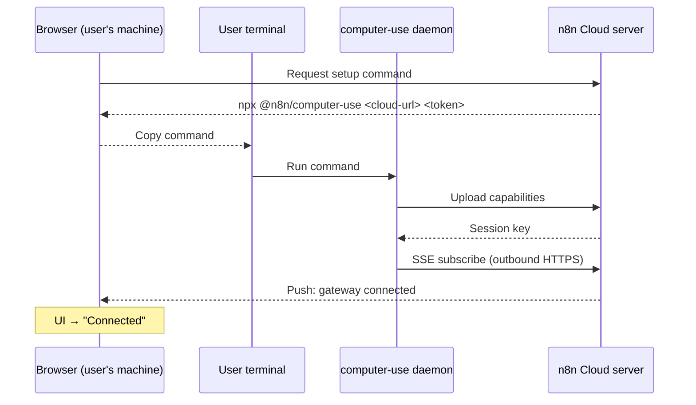
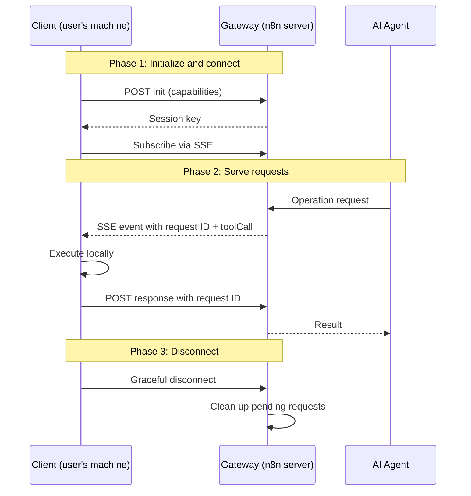

# Filesystem Access for Instance AI

> **ADR**: ADR-025 (gateway protocol), ADR-027 (setup command UX)
> **Status**: Implemented — gateway-only architecture via `@n8n/computer-use` daemon
> **Depends on**: ADR-002 (interface boundary)

## Problem

The instance AI builds workflows generically. When a user says "sync my users
to HubSpot", the agent guesses the data shape. If it could read the user's
actual code — API routes, schemas, configs — it would build workflows that fit
the project precisely.

## Architecture Overview

Filesystem access is provided exclusively through the **gateway protocol** —
a lightweight daemon (`@n8n/computer-use`) runs on the user's machine and
bridges file access to the n8n server via SSE.

```
┌─────────────────────────────────┐
│         AI Agent Tools          │
│  (created from MCP server)      │
└──────────────┬──────────────────┘
               │ calls
┌──────────────▼──────────────────┐
│  LocalMcpServer                 │  ← interface boundary
│  (getAvailableTools, callTool)  │
└──────────────┬──────────────────┘
               │ implemented by
               ▼
         LocalGateway
         (@n8n/computer-use daemon)
```

The gateway protocol provides filesystem access via a lightweight daemon
running on the user's machine.

The protocol is simple:
1. **Daemon initializes** with `POST /instance-ai/gateway/init`, uploading its
   MCP tools and consuming either a pairing token or static key
2. **Daemon subscribes** to `GET /instance-ai/gateway/events` (SSE)
3. **Server publishes** `filesystem-request` events when the agent calls a
   gateway tool
4. **Daemon executes** the requested tool locally
5. **Daemon POSTs** the result to `POST /instance-ai/gateway/response/:requestId`

```
Agent calls read_file({ filePath: "src/index.ts" })
  → LocalGateway publishes filesystem-request with toolCall to SSE subscriber
  → Daemon receives event and executes the local MCP tool
  → Daemon POSTs content to /instance-ai/gateway/response/:requestId
  → Gateway resolves pending Promise → tool gets MCP result back
```

The `@n8n/computer-use` CLI daemon is one implementation of this protocol. Any
application that speaks SSE + HTTP POST can serve as a gateway — a Mac app,
an Electron desktop app, a VS Code extension, or a mobile companion.

**Authentication**: Gateway endpoints use a shared API key
(`N8N_INSTANCE_AI_GATEWAY_API_KEY`) or a one-time pairing token that gets
upgraded to a session key on init (see [Authentication](#authentication) below).

---

## Service Interface

Defined in `packages/@n8n/instance-ai/src/types.ts`:

```typescript
interface LocalMcpServer {
  getAvailableTools(): McpTool[];
  getToolsByCategory(category: string): McpTool[];
  callTool(req: McpToolCallRequest): Promise<McpToolCallResult>;
}
```

The `localMcpServer` field in `InstanceAiContext` is **optional** — when no
gateway is connected, filesystem tools are not registered with the agent.

---

## Tools

Tools are **dynamically created** from the MCP server's advertised capabilities
when a gateway is connected. See `create-tools-from-mcp-server.ts`.

---

## Frontend UX (ADR-027)

The `LocalGatewaySection` component has 3 states:

| State | Condition | UI |
|-------|-----------|-----|
| **Connected** | `isGatewayConnected` | Green indicator with connected host and capabilities |
| **Connecting** | `isDaemonConnecting` | Spinner: "Connecting..." |
| **Setup needed** | Default | Paste-ready `npx @n8n/computer-use <url> <token>` command + copy button + waiting spinner |

### Setup command flow

The setup UI calls `POST /instance-ai/gateway/create-link` and shows the returned command.
The user runs that exact command in the terminal:

```bash
npx @n8n/computer-use <instance-url> <pairing-token>
```

The CLI requires both the n8n instance URL and the one-time pairing token. The
browser does not probe `localhost:7655` or POST connection details to the local
daemon.



The pairing token is ephemeral (5-min TTL, single-use), and once consumed, all
subsequent communication uses a session key.

### Setup by deployment scenario

#### Self-hosted (bare metal / Docker / Kubernetes)

Whether n8n runs on bare metal or inside a container, it **cannot** directly
read files from the user's project directory. The user runs the paste-ready
command on the machine whose files or browser should be exposed.



**Why this works:** the daemon connects outbound to the n8n server URL embedded
in the command. The n8n server never needs inbound access to the user's local
machine.

#### Cloud (n8n Cloud)

The flow is **identical** to the Docker/K8s path. The n8n server is remote,
so the gateway bridge is required.



The daemon connects **outbound** to the cloud server over standard HTTPS. No
ports need to be exposed, no firewall rules — SSE is a regular outbound
connection.

#### Deployment summary

| Deployment | Access path | Daemon needed? | User action |
|------------|-------------|----------------|-------------|
| Self-hosted | Gateway bridge | Yes | Run the setup command on the host |
| n8n Cloud | Gateway bridge | Yes | Run the setup command on the local machine |

Alternatively, setting `N8N_INSTANCE_AI_GATEWAY_API_KEY` on both the n8n
server and the daemon skips the pairing flow entirely — useful for permanent
daemon setups or headless environments.

---

## Gateway Protocol

The protocol has three phases:



- **SSE for push**: the server publishes operation requests to the client as events
- **HTTP POST for responses**: the client posts results back, keyed by request ID
- **Timeout per request**: 30 seconds; pending requests are rejected on disconnect
- **Keep-alive pings**: every 15 seconds to detect stale connections
- **Exponential backoff**: auto-reconnect from 1s up to 30s max

### Endpoint reference

| Step | Method | Path | Auth | Body |
|------|--------|------|------|------|
| Connect | `GET` | `/instance-ai/gateway/events` | `X-Gateway-Key` header | — (SSE stream) |
| Init | `POST` | `/instance-ai/gateway/init` | `X-Gateway-Key` header | `{ rootPath, tools, hostIdentifier?, toolCategories? }` |
| Respond | `POST` | `/instance-ai/gateway/response/:requestId` | `X-Gateway-Key` header | `{ result }` or `{ error }` |
| Create link | `POST` | `/instance-ai/gateway/create-link` | Session auth (cookie) | — |
| Status | `GET` | `/instance-ai/gateway/status` | Session auth (cookie) | — |
| Disconnect | `POST` | `/instance-ai/gateway/disconnect` | `X-Gateway-Key` header | — |

### SSE event format

```json
{
  "type": "filesystem-request",
  "payload": {
    "requestId": "gw_abc123",
    "toolCall": {
      "name": "read_file",
      "arguments": { "filePath": "src/index.ts" }
    }
  }
}
```

Tool calls use the MCP tool names advertised during init, for example
`read_file`, `search_files`, browser tools, shell tools, or any other capability
the daemon exposes.

### Authentication

Two options:
- **Static**: Set `N8N_INSTANCE_AI_GATEWAY_API_KEY` env var on the n8n server.
  The static key is used for all requests — no pairing/session upgrade.
- **Dynamic (pairing → session key)**:
  1. `POST /instance-ai/gateway/create-link` (requires session auth) →
     returns `{ token, command, expiresAt, ttlSeconds }`. The token is a
     **one-time pairing token** (5-min TTL).
  2. Daemon calls `POST /instance-ai/gateway/init` with the pairing token →
     server consumes the token and returns `{ ok: true, sessionKey }`.
  3. All subsequent requests (SSE, response) use the **session key** instead
     of the consumed pairing token. Session keys have an absolute expiry and
     are rotated on reconnect when the rotation window has elapsed.

```
create-link → pairingToken (5 min TTL, single-use)
                 │
                 ▼
            gateway/init  ──► consumed → sessionKey issued
                                            │
                                            ▼
                                  SSE + response use sessionKey
```

This prevents token replay: the pairing token is visible in terminal output
and `ps aux`, but it becomes useless after the first successful `init` call.
The setup UI shows the token expiry and suggests a leading space for shells
that support omitting commands from history.
All key comparisons use `timingSafeEqual()` to prevent timing attacks.

---

## Extending the Gateway: Building Custom Clients

The gateway protocol is **client-agnostic** — `@n8n/computer-use` is just one
implementation. Any application that speaks the protocol can serve as a
filesystem provider: a desktop app (Electron, Tauri), a VS Code extension,
a Go binary, a mobile companion, etc.

Any client that implements three interactions is a valid gateway client:
1. **Subscribe**: open an SSE connection to receive operation requests
2. **Initialize**: upload capabilities (`rootPath`, MCP tools, host, categories)
3. **Respond**: handle each request locally and POST the result back

### What you do NOT need to change

- **No agent changes** — tools call the interface, not the transport
- **No gateway changes** — `LocalGateway` is protocol-level
- **No controller changes** — endpoints are client-agnostic
- **No frontend changes** — unless you want a different setup UX

### Custom client connection UX

The setup UI does not auto-detect local clients. A custom client can either:

1. Accept the instance URL and pairing token from a command, deep link, or app
   handoff, then call the gateway endpoints directly.
2. Use a static `N8N_INSTANCE_AI_GATEWAY_API_KEY` for a permanent, headless
   connection.

No changes are needed on the n8n server. The protocol, auth, and lifecycle are
client-agnostic.

---

## Security

| Layer | Protection |
|-------|-----------|
| Read-only | No write methods on interface |
| File size | 512 KB max per read |
| Line limits | 200 default, 500 max per read |
| Binary detection | Null-byte, UTF-8, and control-character checks |
| Directory containment | `path.resolve()` + `fs.realpath()` when basePath is set |
| Directory exclusions | Read/search/list/tree reject excluded path segments |
| Auth | Timing-safe key comparison (`timingSafeEqual()`) |
| Pairing token | One-time use, 5-min TTL, consumed on init |
| Session key | Server-issued, expires absolutely, rotates on reconnect |
| Request timeout | 30s per gateway round-trip |
| Keep-alive | 15s ping interval to detect stale connections |

### Directory exclusions

The daemon excludes common non-essential directories from the tree scan:

`node_modules`, `.git`, `dist`, `build`, `.next`, `.nuxt`, `__pycache__`,
`.cache`, `.turbo`, `coverage`, `.venv`, `venv`, `.idea`, `.vscode`,
`.output`, `.svelte-kit`

### Entry count caps

| Component | Max entries | Default depth |
|-----------|-------------|---------------|
| `get_file_tree` scan | 10,000 | 2 |

The daemon scans on demand when the agent calls `get_file_tree`.

---

## Configuration

| Env var | Default | Purpose |
|---------|---------|---------|
| `N8N_INSTANCE_AI_GATEWAY_API_KEY` | none | Static auth key for gateway (skips pairing flow) |

No env vars needed for most deployments. The setup UI provides a tokenized
command, and the daemon pairs with that token.

See `docs/configuration.md` for the full configuration reference.

---

## Package Structure

| Package | Responsibility |
|---------|----------------|
| `@n8n/instance-ai` | Agent core: service interfaces, tool definitions, data shapes. Framework-agnostic, zero n8n dependencies. |
| `packages/cli/.../instance-ai/` | n8n backend: HTTP endpoints, gateway singleton, event bus. |
| `@n8n/computer-use` | Reference gateway client: standalone CLI daemon. SSE client, local MCP tool executor. Independently installable via npx. |

### On-demand tree behavior

The reference daemon (`@n8n/computer-use`) exposes a `get_file_tree` tool. It
scans the requested directory only when that tool is called:

- **Algorithm**: Breadth-first, broad top-level coverage before descending
  into deeply nested paths
- **Depth limit**: requested by the tool call, defaulting to 2 levels
- **Entry cap**: 10,000
- **Sort order**: Directories first, then files, alphabetical within each group
- **Excluded directories**: node_modules, .git, dist, build, coverage,
  \_\_pycache\_\_, .venv, venv, .vscode, .idea, .next, .nuxt, .cache, .turbo,
  .output, .svelte-kit
