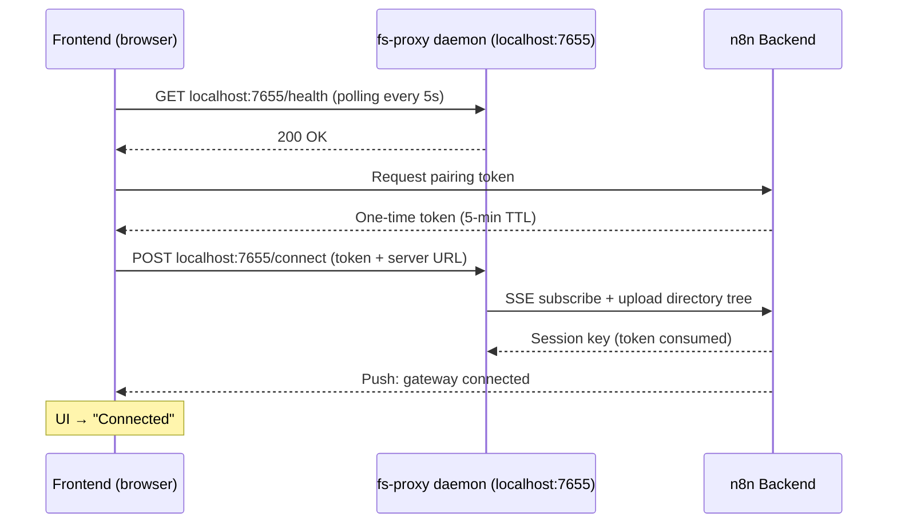
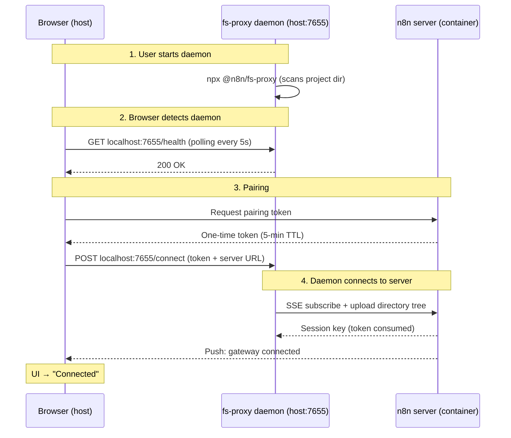
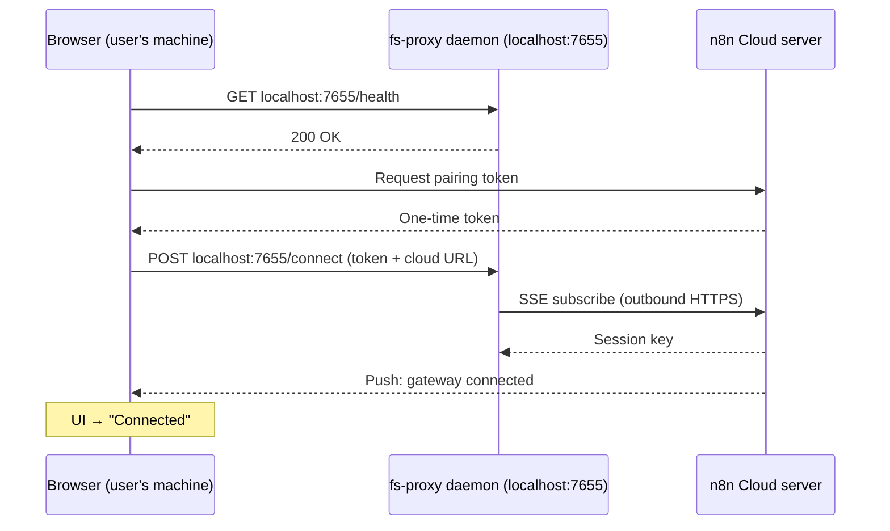
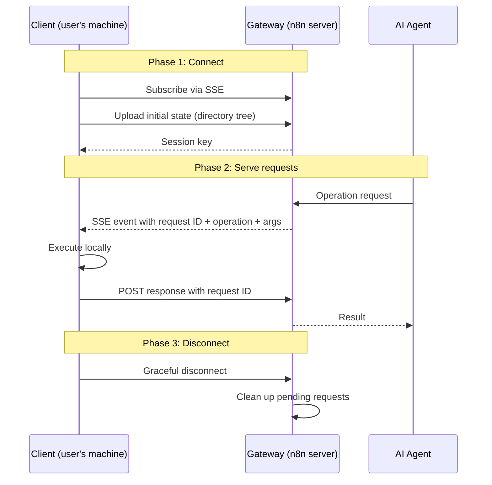

# Filesystem Access for Instance AI

> **ADR**: ADR-024 (local filesystem), ADR-025 (gateway protocol), ADR-026 (auto-detect), ADR-027 (auto-connect UX)
> **Status**: Implemented — two modes: local filesystem + gateway (auto-detected)
> **Depends on**: ADR-002 (interface boundary)

## Problem

The instance AI builds workflows generically. When a user says "sync my users
to HubSpot", the agent guesses the data shape. If it could read the user's
actual code — API routes, schemas, configs — it would build workflows that fit
the project precisely.

## Architecture Overview

Two modes provide filesystem access depending on where n8n runs:

```
┌─────────────────────────────────┐
│         AI Agent Tools          │
│  list-files · read-file · ...   │
└──────────────┬──────────────────┘
               │ calls
┌──────────────▼──────────────────┐
│  InstanceAiFilesystemService    │  ← interface boundary
│  (listFiles, readFile, ...)     │
└──────────────┬──────────────────┘
               │ implemented by
       ┌───────┴────────┐
       ▼                ▼
 LocalFsProvider   LocalGateway
 (bare metal)      (any remote client)
```

The agent never knows which path is active. It calls service interfaces, and
the transport is invisible.

**Provider priority**: `Gateway > Local Filesystem > None` — when both are
available, gateway wins so the daemon's targeted project directory is preferred
over unrestricted local FS.

### 1. Local Filesystem (auto-detected)

`LocalFilesystemProvider` reads files directly from disk using Node.js
`fs/promises`. **Auto-detected** — no boolean flag needed.

Detection heuristic:
1. `N8N_INSTANCE_AI_FILESYSTEM_PATH` explicitly set → local FS (restricted to that path)
2. Container detected (Docker, Kubernetes, systemd-nspawn) → gateway only
3. Bare metal (default) → local FS (unrestricted)

Container detection checks: `/.dockerenv` exists, `KUBERNETES_SERVICE_HOST`
env var, or `container` env var (systemd-nspawn/podman).

- **Zero configuration** — works out of the box when n8n runs on bare metal
- Optional `N8N_INSTANCE_AI_FILESYSTEM_PATH` to restrict access to a
  specific directory (with symlink escape protection)
- Entry count cap of **200** in tree walks to prevent large responses

### 2. Gateway Protocol (cloud/Docker/remote)

For n8n running on a remote server or in Docker, the **gateway protocol**
provides filesystem access via a lightweight daemon running on the user's
machine.

The protocol is simple:
1. **Daemon connects** to `GET /instance-ai/gateway/events` (SSE)
2. **Server publishes** `filesystem-request` events when the agent needs files
3. **Daemon reads** the file from local disk
4. **Daemon POSTs** the result to `POST /instance-ai/gateway/response/:requestId`

```
Agent calls readFile("src/index.ts")
  → LocalGateway publishes filesystem-request to SSE subscriber
  → Daemon receives event, reads file from disk
  → Daemon POSTs content to /instance-ai/gateway/response/:requestId
  → Gateway resolves pending Promise → tool gets FileContent back
```

The `@n8n/fs-proxy` CLI daemon is one implementation of this protocol. Any
application that speaks SSE + HTTP POST can serve as a gateway — a Mac app,
an Electron desktop app, a VS Code extension, or a mobile companion.

**Authentication**: Gateway endpoints use a shared API key
(`N8N_INSTANCE_AI_GATEWAY_API_KEY`) or a one-time pairing token that gets
upgraded to a session key on init (see [Authentication](#authentication) below).

---

## Service Interface

Defined in `packages/@n8n/instance-ai/src/types.ts`:

```typescript
interface InstanceAiFilesystemService {
  listFiles(
    dirPath: string,
    opts?: {
      pattern?: string;
      maxResults?: number;
      type?: 'file' | 'directory' | 'all';
      recursive?: boolean;
    },
  ): Promise<FileEntry[]>;

  readFile(
    filePath: string,
    opts?: { maxLines?: number; startLine?: number },
  ): Promise<FileContent>;

  searchFiles(
    dirPath: string,
    opts: {
      query: string;
      filePattern?: string;
      ignoreCase?: boolean;
      maxResults?: number;
    },
  ): Promise<FileSearchResult>;

  getFileTree(
    dirPath: string,
    opts?: { maxDepth?: number; exclude?: string[] },
  ): Promise<string>;
}
```

The `filesystemService` field in `InstanceAiContext` is **optional** — when no
filesystem is available, the filesystem tools are not registered with the agent.

---

## Tools

Tools are **conditionally registered** — only when `filesystemService` is
present on the context. Each tool throws a clear error if the service is missing.

### get-file-tree

Get a shallow directory tree as indented text. Start low and drill into
subdirectories for deeper exploration.

| Parameter | Type | Default | Max | Description |
|-----------|------|---------|-----|-------------|
| `dirPath` | string | — | — | Absolute path or `~/relative` |
| `maxDepth` | number | 2 | 5 | Directory depth to show |

### list-files

List files and/or directories matching optional filters.

| Parameter | Type | Default | Max | Description |
|-----------|------|---------|-----|-------------|
| `dirPath` | string | — | — | Absolute path or `~/relative` |
| `pattern` | string | — | — | Glob pattern (e.g. `**/*.ts`) |
| `type` | enum | `all` | — | `file`, `directory`, or `all` |
| `recursive` | boolean | `true` | — | Recurse into subdirectories |
| `maxResults` | number | 200 | 1000 | Maximum entries to return |

### read-file

Read the contents of a file with optional line range.

| Parameter | Type | Default | Max | Description |
|-----------|------|---------|-----|-------------|
| `filePath` | string | — | — | Absolute path or `~/relative` |
| `startLine` | number | 1 | — | 1-indexed start line |
| `maxLines` | number | 200 | 500 | Lines to read |

### search-files

Search file contents for a text pattern or regex.

| Parameter | Type | Default | Max | Description |
|-----------|------|---------|-----|-------------|
| `dirPath` | string | — | — | Absolute path or `~/relative` |
| `query` | string | — | — | Regex pattern |
| `filePattern` | string | — | — | File filter (e.g. `*.ts`) |
| `ignoreCase` | boolean | `true` | — | Case-insensitive search |
| `maxResults` | number | 50 | 100 | Maximum matching lines |

---

## Frontend UX (ADR-027)

The `InstanceAiDirectoryShare` component has 3 states:

| State | Condition | UI |
|-------|-----------|-----|
| **Connected** | `isGatewayConnected \|\| isLocalFilesystemEnabled` | Green indicator: "Files connected" |
| **Connecting** | `isDaemonConnecting` | Spinner: "Connecting..." |
| **Setup needed** | Default | `npx @n8n/fs-proxy` command + copy button + waiting spinner |

### Auto-connect flow

The user runs `npx @n8n/fs-proxy` and everything connects automatically. No
URLs, no tokens, no buttons.



The browser mediates the pairing — it is the only component with network
access to both the local daemon (`localhost:7655`) and the n8n server. The
pairing token is ephemeral (5-min TTL, single-use), and once consumed, all
subsequent communication uses a session key.

### Auto-connect by deployment scenario

#### Bare metal / self-hosted on the same machine

This is the **zero-config** path. When n8n runs directly on the user's machine
(not in a container), the system auto-detects this and uses **direct access** —
the agent reads the filesystem through local providers without any gateway,
daemon, or pairing.

- The UI immediately shows **"Connected"** (green indicator).
- No `npx @n8n/fs-proxy` needed.
- If `N8N_INSTANCE_AI_FILESYSTEM_PATH` is set, access is sandboxed to that
  directory. Otherwise it is unrestricted.

**Detection logic:** if no container markers are found (Docker, K8s), the
system assumes bare metal and enables direct access automatically.

#### Self-hosted in Docker / Kubernetes

n8n runs inside a container and **cannot** directly read files on the host
machine. The gateway bridge is required.



**Why this works:** the browser is the only component that can see **both** the
daemon (`localhost:7655` on the host) and the n8n server (container network or
mapped port). It brokers the pairing between the two.

#### Cloud (n8n Cloud)

The flow is **identical** to the Docker/K8s path. The n8n server is remote,
so the gateway bridge is required.



**Key difference from Docker self-hosted:** the daemon connects **outbound**
to the cloud server over standard HTTPS. No ports need to be exposed, no
firewall rules — SSE is a regular outbound connection.

#### Deployment summary

| Deployment | Access path | Daemon needed? | User action |
|------------|-------------|----------------|-------------|
| Bare metal | Direct (local providers) | No | None — auto-detected |
| Docker / K8s | Gateway bridge | Yes | `npx @n8n/fs-proxy` on host |
| n8n Cloud | Gateway bridge | Yes | `npx @n8n/fs-proxy` on local machine |

Alternatively, setting `N8N_INSTANCE_AI_GATEWAY_API_KEY` on both the n8n
server and the daemon skips the pairing flow entirely — useful for permanent
daemon setups or headless environments.

### Filesystem toggle

The UI includes a toggle switch to temporarily disable filesystem access
without disconnecting the gateway. This calls `POST /filesystem/toggle` and
the agent stops receiving filesystem tools until re-enabled.

---

## Gateway Protocol

The protocol has three phases:



- **SSE for push**: the server publishes operation requests to the client as events
- **HTTP POST for responses**: the client posts results back, keyed by request ID
- **Timeout per request**: 30 seconds; pending requests are rejected on disconnect
- **Keep-alive pings**: every 15 seconds to detect stale connections
- **Exponential backoff**: auto-reconnect from 1s up to 30s max

### Endpoint reference

| Step | Method | Path | Auth | Body |
|------|--------|------|------|------|
| Connect | `GET` | `/instance-ai/gateway/events?apiKey=<token>` | API key query param | — (SSE stream) |
| Init | `POST` | `/instance-ai/gateway/init` | `X-Gateway-Key` header | `{ rootPath, tree: [{path, type, sizeBytes}], treeText }` |
| Respond | `POST` | `/instance-ai/gateway/response/:requestId` | `X-Gateway-Key` header | `{ data }` or `{ error }` |
| Create link | `POST` | `/instance-ai/gateway/create-link` | Session auth (cookie) | — |
| Status | `GET` | `/instance-ai/gateway/status` | Session auth (cookie) | — |
| Disconnect | `POST` | `/instance-ai/gateway/disconnect` | `X-Gateway-Key` header | — |
| Toggle FS | `POST` | `/instance-ai/filesystem/toggle` | Session auth (cookie) | — |

### SSE event format

```json
{
  "type": "filesystem-request",
  "payload": {
    "requestId": "gw_abc123",
    "operation": "read-file",
    "args": { "filePath": "src/index.ts", "maxLines": 500 }
  }
}
```

Operations: `read-file` and `search-files`. Tree/list operations are served
from the cached directory tree uploaded during init — no round-trip needed.

### Authentication

Two options:
- **Static**: Set `N8N_INSTANCE_AI_GATEWAY_API_KEY` env var on the n8n server.
  The static key is used for all requests — no pairing/session upgrade.
- **Dynamic (pairing → session key)**:
  1. `POST /instance-ai/gateway/create-link` (requires session auth) →
     returns `{ token, command }`. The token is a **one-time pairing token**
     (5-min TTL).
  2. Daemon calls `POST /instance-ai/gateway/init` with the pairing token →
     server consumes the token and returns `{ ok: true, sessionKey }`.
  3. All subsequent requests (SSE, response) use the **session key** instead
     of the consumed pairing token.

```
create-link → pairingToken (5 min TTL, single-use)
                 │
                 ▼
            gateway/init  ──► consumed → sessionKey issued
                                            │
                                            ▼
                                  SSE + response use sessionKey
```

This prevents token replay: the pairing token is visible in terminal output
and `ps aux`, but it becomes useless after the first successful `init` call.
All key comparisons use `timingSafeEqual()` to prevent timing attacks.

---

## Extending the Gateway: Building Custom Clients

The gateway protocol is **client-agnostic** — `@n8n/fs-proxy` is just one
implementation. Any application that speaks the protocol can serve as a
filesystem provider: a desktop app (Electron, Tauri), a VS Code extension,
a Go binary, a mobile companion, etc.

Any client that implements three interactions is a valid gateway client:
1. **Subscribe**: open an SSE connection to receive operation requests
2. **Initialize**: upload initial state (for filesystem: the directory tree)
3. **Respond**: handle each request locally and POST the result back

### What you do NOT need to change

- **No agent changes** — tools call the interface, not the transport
- **No gateway changes** — `LocalGateway` is protocol-level
- **No controller changes** — endpoints are client-agnostic
- **No frontend changes** — unless you want auto-connect (see below)

### Optional: auto-connect support

The frontend probes `http://127.0.0.1:7655/health` every 5s to auto-detect
a running daemon. To support this for a custom client:

1. Listen on port 7655 (or any port, but 7655 gets auto-detected)
2. Respond to `GET /health` with `200 OK`
3. Accept `POST /connect` with `{ url, token }` — then use those to connect
   to the gateway endpoints above

If your client has its own auth/connection flow (e.g., a desktop app that
talks to n8n directly), you can skip auto-connect entirely and call the
gateway endpoints with your own token.

No changes are needed on the n8n server. The protocol, auth, and lifecycle
are client-agnostic.

---

## Security

| Layer | Protection |
|-------|-----------|
| Read-only | No write methods on interface |
| File size | 512 KB max per read |
| Line limits | 200 default, 500 max per read |
| Binary detection | Null-byte check in first 8 KB |
| Directory containment | `path.resolve()` + `fs.realpath()` when basePath is set |
| Auth | Timing-safe key comparison (`timingSafeEqual()`) |
| Pairing token | One-time use, 5-min TTL, consumed on init |
| Session key | Server-issued, replaces pairing token after init |
| Request timeout | 30s per gateway round-trip |
| Keep-alive | 15s ping interval to detect stale connections |

### Directory exclusions

Excluded directories differ slightly between server-side and daemon-side:

**LocalFilesystemProvider** (server, 12 dirs):
`node_modules`, `.git`, `dist`, `.next`, `__pycache__`, `.cache`, `.turbo`,
`coverage`, `.venv`, `venv`, `.idea`, `.vscode`

**Tree scanner & local reader** (daemon, 16 dirs — adds 4 more):
All of the above plus: `build`, `.nuxt`, `.output`, `.svelte-kit`

### Entry count caps

| Component | Max entries | Default depth |
|-----------|-------------|---------------|
| LocalFilesystemProvider (server) | 200 | 2 |
| Tree scanner (daemon) | 10,000 | 8 |
| `get-file-tree` tool | — | 2 (max 5) |

The daemon scans more broadly (10,000 entries, depth 8) because it uploads
the full tree on init for cached queries. The server-side provider uses a
smaller cap (200) because it builds tree text on-the-fly per tool call.

---

## Configuration

| Env var | Default | Purpose |
|---------|---------|---------|
| `N8N_INSTANCE_AI_FILESYSTEM_PATH` | none | Restrict direct filesystem access to this directory |
| `N8N_INSTANCE_AI_GATEWAY_API_KEY` | none | Static auth key for gateway (skips pairing flow) |

No env vars needed for most deployments. Bare metal auto-detects direct access.
Cloud/Docker auto-connects via the pairing flow.

See `docs/configuration.md` for the full configuration reference.

---

## Package Structure

| Package | Responsibility |
|---------|----------------|
| `@n8n/instance-ai` | Agent core: service interfaces, tool definitions, data shapes. Framework-agnostic, zero n8n dependencies. |
| `packages/cli/.../instance-ai/` | n8n backend: HTTP endpoints, gateway singleton, local providers, auto-detect logic, event bus. |
| `@n8n/fs-proxy` | Reference gateway client: standalone CLI daemon. HTTP server, SSE client, local file reader, directory scanner. Independently installable via npx. |

### Tree scanner behavior

The reference daemon (`@n8n/fs-proxy`) scans the user's project directory on
startup:

- **Algorithm**: Breadth-first, broad top-level coverage before descending
  into deeply nested paths
- **Depth limit**: 8 levels (default)
- **Entry cap**: 10,000
- **Sort order**: Directories first, then files, alphabetical within each group
- **Excluded directories**: node_modules, .git, dist, build, coverage,
  \_\_pycache\_\_, .venv, venv, .vscode, .idea, .next, .nuxt, .cache, .turbo,
  .output, .svelte-kit
