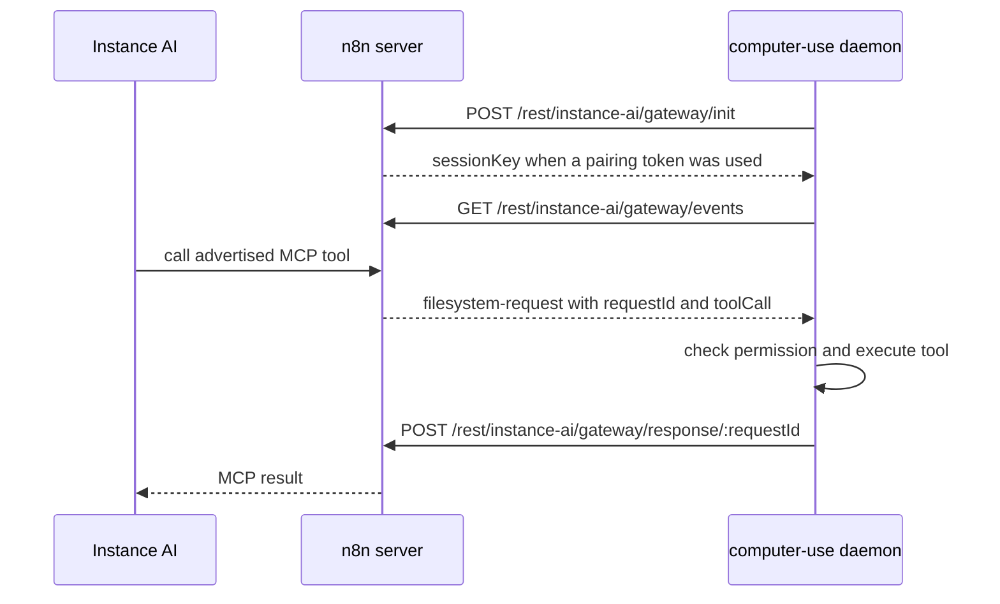

# Local Computer Use Gateway

Instance AI can call tools on a user's machine through the
`@n8n/computer-use` daemon. The transport was first built for filesystem
access, so some internal event and DTO names still use `filesystem`. The
current gateway is a generic MCP capability bridge.

## Architecture


```mermaid
sequenceDiagram
    participant Agent as Instance AI
    participant Server as n8n server
    participant Daemon as computer-use daemon

    Daemon->>Server: POST /rest/instance-ai/gateway/init
    Server-->>Daemon: sessionKey when a pairing token was used
    Daemon->>Server: GET /rest/instance-ai/gateway/events
    Agent->>Server: call advertised MCP tool
    Server-->>Daemon: filesystem-request with requestId and toolCall
    Daemon->>Daemon: check permission and execute tool
    Daemon->>Server: POST /rest/instance-ai/gateway/response/:requestId
    Server-->>Agent: MCP result
```

The daemon uploads MCP tool definitions, its root path, its host identifier,
and category metadata during initialization. It does not upload an initial
directory tree. Files and directory trees are read on demand through the
advertised tools.

The bridge is outbound from the daemon to n8n. It works for cloud deployments
without exposing a daemon port to the n8n server. For a self-hosted deployment,
the user must add `--allowed-origins <instance-origin>` to the generated command.

## Instance AI Interface

`packages/@n8n/instance-ai/src/types.ts` defines the transport boundary:

```typescript
interface LocalMcpServer {
  getAvailableTools(): McpTool[];
  getToolsByCategory(category: string): McpTool[];
  callTool(
    request: McpToolCallRequest,
    options?: { abortSignal?: AbortSignal },
  ): Promise<McpToolCallResult>;
}
```

The CLI module implements this interface with `LocalGateway`. A run receives
local tools only when a gateway is connected for that user. Instance policy
can remove an advertised category before tools reach the agent. For example,
the server removes browser tools when Browser Use is disabled.

## Advertised Capabilities

The reference daemon can advertise these tool groups:

| Group | Tools | Recommended default |
|-------|-------|---------------------|
| Filesystem read | `read_file`, `list_files`, `get_file_tree`, `search_files` | `allow` |
| Filesystem write | `write_file`, `edit_file`, `create_directory`, `delete`, `move`, `copy_file` | `ask` |
| Shell | `shell_execute` | `deny` |
| Computer | Screenshots, mouse, and keyboard tools | `deny` |
| Browser | Browser automation tools | `ask` |

The daemon does not register tool definitions for a group whose mode is `deny`.
It also omits tool definitions for a platform-dependent group when its native
requirements are unavailable. The category metadata still includes these
groups with `enabled: false`.

See the [Computer Use package reference](../../computer-use/README.md) for the
complete tool and command reference.

## User Connection Flow

The generated-command flow starts only after an explicit user action. It does
not require the frontend to contact a localhost endpoint.

1. The user selects the local-computer setup action in n8n.
2. The frontend requests a one-time link from
   `POST /rest/instance-ai/gateway/create-link`.
3. The frontend displays the generated command. The command contains the
   instance URL and short-lived pairing token.
4. The user runs the generated command. The user can add `--dir <path>` to
   select a different filesystem root.
5. The daemon initializes the server gateway and opens the SSE stream.
6. The backend pushes the new gateway status to the frontend.

The frontend displays the connected host, root directory, and tool-category
status from the backend response.

## Gateway Protocol

All daemon endpoints use `X-Gateway-Key`. The paths below are relative to the
n8n REST base.

| Method | Path | Authentication | Body or result |
|--------|------|----------------|----------------|
| `POST` | `/instance-ai/gateway/create-link` | User session and `instanceAi:gateway` scope | Returns `{ token, command, expiresAt, ttlSeconds }` |
| `POST` | `/instance-ai/gateway/init` | Gateway key | `{ rootPath, tools, hostIdentifier?, toolCategories }` |
| `GET` | `/instance-ai/gateway/events` | Gateway key | SSE stream |
| `POST` | `/instance-ai/gateway/response/:requestId` | Gateway key | `{ result?, error? }` |
| `POST` | `/instance-ai/gateway/disconnect` | Gateway key | Ends the daemon connection |
| `POST` | `/instance-ai/gateway/credentials` | User-scoped gateway key | `{ name, type, data, projectId? }`; returns `{ credentialId }` |
| `GET` | `/instance-ai/gateway/status` | User session and `instanceAi:gateway` scope | Connection metadata |
| `POST` | `/instance-ai/gateway/disconnect-session` | User session and `instanceAi:gateway` scope | Revokes the active session |

Initialization must finish before the SSE request. The event endpoint rejects
a gateway that has not initialized its state.

### Capabilities payload

```json
{
  "rootPath": "/work/project",
  "tools": [
    {
      "name": "read_file",
      "description": "Read a text file",
      "inputSchema": { "type": "object" }
    }
  ],
  "hostIdentifier": "user@host",
  "toolCategories": [
    { "name": "filesystem", "enabled": true, "writeAccess": false }
  ]
}
```

`tools` and `toolCategories` default to empty arrays. The server creates agent
tools directly from the uploaded MCP definitions.

### Request event

The SSE stream sends generic MCP calls in an event whose legacy type is
`filesystem-request`:

```json
{
  "type": "filesystem-request",
  "payload": {
    "requestId": "gw_abc123",
    "toolCall": {
      "name": "read_file",
      "arguments": { "filePath": "src/index.ts" }
    }
  }
}
```

A client can post an MCP `result` or a top-level error string to the matching
response endpoint. The reference daemon encodes tool failures as MCP results
with `isError`. The server waits up to 60 seconds for each call. It rejects
pending calls on explicit disconnect. The SSE endpoint sends a keep-alive
comment every 15 seconds.

The daemon reconnects with backoff from 1 second to 30 seconds. The server also
keeps gateway state for a reconnect grace period. The grace period starts at 10
seconds and doubles to a maximum of 120 seconds after repeated disconnects.

## Authentication

### User pairing

The normal flow uses a user-scoped pairing token.

- The token has a five-minute TTL.
- The first successful initialization consumes it.
- Initialization returns a new session key.
- The session key has no time-based expiry.
- The session key remains valid across transient SSE disconnects.
- Explicit disconnect revokes the session key.

The session key maps every request to the user who created the link. This
mapping lets the gateway create credentials through the user-scoped credential
endpoint.

### Static key

`N8N_INSTANCE_AI_GATEWAY_API_KEY` enables a static gateway key. The static key
maps to an environment gateway instead of a database user. It can authenticate
and initialize the gateway. The current per-user run wiring does not expose its
tools to agent runs. It cannot call the credential-creation endpoint, because
that endpoint requires a user-scoped key.

## Permissions and Safety

The daemon applies a permission mode to each tool group:

| Mode | Behavior |
|------|----------|
| `deny` | Do not register the group's tools |
| `ask` | Ask before execution and apply stored resource rules |
| `allow` | Execute without a per-call prompt, except for stored deny rules |

Resource rules can allow once, allow for the session, always allow, deny once,
or always deny. Filesystem write rules are scoped to paths. Shell rules are
scoped to normalized commands. Most browser navigation and page-action rules
are scoped to domains. Some browser tools use special resource identifiers,
such as `credentials`.

Filesystem operations are restricted to the configured root. `read_file` has a
1 MiB file limit and supports line-range pagination. Write tools use the same
root containment rules. Shell execution uses an OS sandbox unless the daemon is
started with its explicit unsafe override.

Credential values can be sent from the daemon to the dedicated credential
endpoint. They do not pass through an agent tool result. The static environment
key cannot use this endpoint.

## Custom Clients

Any client can implement the protocol. A client must:

1. Obtain an accepted gateway key.
2. Initialize with a root path and any MCP definitions or category metadata.
3. Open the authenticated SSE stream.
4. Execute each received MCP call under its own safety policy.
5. Post an MCP result or an error for each request.
6. Notify the server on explicit disconnect.

The server does not require a directory scanner or a fixed filesystem tool
set. Custom clients can advertise any MCP tools that pass the Instance AI name
and policy checks.

## Source Locations

| Path | Responsibility |
|------|----------------|
| `packages/@n8n/instance-ai/src/types.ts` | `LocalMcpServer` interface |
| `packages/@n8n/instance-ai/src/tools/filesystem/create-tools-from-mcp-server.ts` | MCP definition to agent-tool adapter |
| `packages/cli/src/modules/instance-ai/filesystem/local-gateway.ts` | Pending requests and generic MCP routing |
| `packages/cli/src/modules/instance-ai/filesystem/local-gateway-registry.ts` | Per-user tokens, sessions, and reconnect grace |
| `packages/cli/src/modules/instance-ai/instance-ai.controller.ts` | Gateway HTTP and SSE endpoints |
| `packages/@n8n/computer-use` | Reference daemon and local tool implementations |
