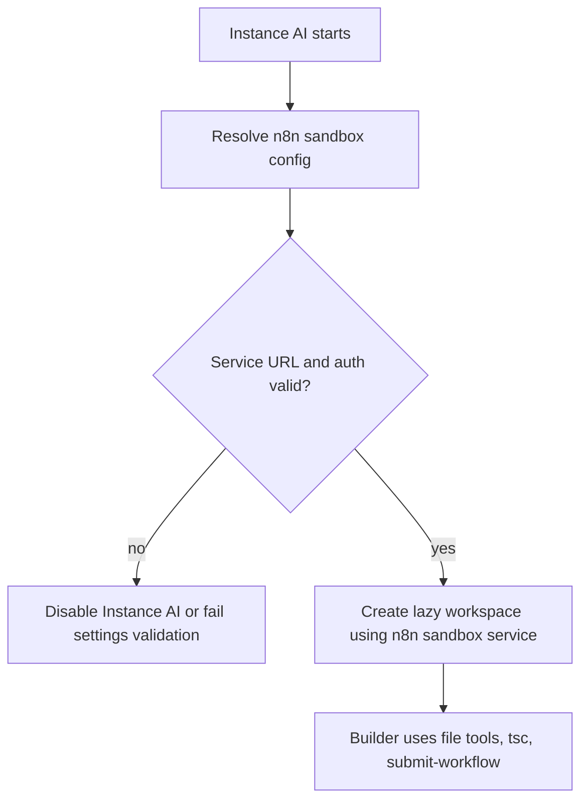

# n8n Sandbox Default for Instance AI

Status: implementation in progress

Last updated: 2026-05-28

## Context

Instance AI previously had two workflow-building paths:

1. Sandbox mode: the builder agent receives a Mastra workspace with file tools and
   `execute_command`, writes TypeScript files, runs `tsc`, and calls
   `submit-workflow`.
2. Tool mode: the builder agent has no workspace and calls `build-workflow`,
   which parses a TypeScript string in-process.

The goal of this change is to make the n8n sandbox service a hard requirement
for Instance AI. Tool mode should be removed rather than kept as a fallback,
because keeping two builder paths means production behavior can drift depending
on infrastructure.

PR https://github.com/n8n-io/n8n/pull/31051 shows the intended CI shape for the
n8n sandbox service: a sandbox API sidecar plus a DinD runner sidecar, with n8n
configured through:

```bash
N8N_INSTANCE_AI_SANDBOX_ENABLED=true
N8N_INSTANCE_AI_SANDBOX_PROVIDER=n8n-sandbox
N8N_SANDBOX_SERVICE_URL=http://sandbox-api:8080
N8N_SANDBOX_SERVICE_API_KEY=n8n-sandbox-ci-key
```

## Current Implementation

### Instance AI

`packages/@n8n/instance-ai/src/workspace/create-workspace.ts` defines two
providers:

| Provider | Workspace path | Notes |
| --- | --- | --- |
| `daytona` | `DaytonaSandbox` plus `DaytonaFilesystem` | Remote container provider. Supports direct API keys and proxy JWT auth. |
| `n8n-sandbox` | `N8nSandboxServiceSandbox` plus `N8nSandboxFilesystem` | HTTP API backed provider using `@n8n/sandbox-client`. No interactive process manager. |

`packages/cli/src/modules/instance-ai/instance-ai.service.ts` currently attaches
a lazy runtime workspace only when admin settings say sandboxing is enabled. The
builder requires this workspace; the former no-workspace tool fallback has been
removed.

Important current defaults:

| Setting | Current default |
| --- | --- |
| `N8N_INSTANCE_AI_SANDBOX_ENABLED` | `false` |
| `N8N_INSTANCE_AI_SANDBOX_PROVIDER` | `n8n-sandbox` |
| `N8N_INSTANCE_AI_SANDBOX_IMAGE` | `daytonaio/sandbox:0.5.0` |

### n8n sandbox adapter

`N8nSandboxServiceSandbox` creates a `SandboxClient` with `baseUrl` and optional
API key. It calls:

- `createSandbox()` on start
- `deleteSandbox(id)` on destroy
- `exec(id, { command, env, workdir, timeoutMs })` for shell commands

`N8nSandboxFilesystem` maps Mastra filesystem operations to the sandbox service
file API: read, write, append, delete, copy, move, mkdir, list, and stat.

The adapter assumes the remote home directory is `/home/user` and the builder
workspace is `/home/user/workspace`.

### @n8n/sandbox-client

The repository currently consumes `@n8n/sandbox-client@0.0.4` from npm, not from
a workspace package. Its public API covers:

- sandbox lifecycle: `createSandbox`, `getSandbox`, `deleteSandbox`
- command execution: `exec`, `resumeExecution`, `deleteExecution`
- file operations: `readFile`, `writeFile`, `appendFile`, `deleteFile`,
  `copyFile`, `moveFile`, `mkdir`, `listFiles`, `stat`

The client sends `X-Api-Key` when an API key is configured. It retries
idempotent requests on transport errors, `429`, and `503`. Command execution has
its own stream resume loop using `exec_id`.

The current client does not expose image creation, image reuse, runner
selection, labels, client-provided sandbox IDs, or interactive process handles.
Any spec that depends on those capabilities needs a sandbox-client and service
API bump first.

## Target Behavior

### Defaults

The default Instance AI runtime provider should be `n8n-sandbox`.

Instance AI should not run without a reachable n8n sandbox service. If the
sandbox service URL or authentication is missing, Instance AI should be disabled
at startup or fail its settings validation with a clear operator-facing error.
Daytona remains an explicit supported provider for Cloud and environments that
depend on Daytona until n8n sandbox reaches feature parity for those deployments.

Recommended effective behavior:

| Environment | Default behavior |
| --- | --- |
| Cloud / managed proxy | Sandbox enabled with provider `n8n-sandbox`; service URL and API key are managed, not user-editable. |
| Instance AI eval CI | Sandbox enabled with provider `n8n-sandbox`; sidecars are started before n8n. |
| `packages/testing/containers/start-sandbox.ts` | Starts the shared sandbox API and runner sidecars for eval CI. |
| Local `pnpm dev` | Operator points n8n at a running sandbox service with `N8N_SANDBOX_SERVICE_URL` and `N8N_SANDBOX_SERVICE_API_KEY`. |
| Plain self-host without sandbox service URL | Instance AI unavailable until the operator configures the sandbox service. |
| Explicit `provider=daytona` | Supported explicit provider while Cloud/managed deployments still require Daytona. |
| Explicit `provider=local` | Remove from Instance AI. It should not be exposed as a supported builder path. |

### Builder path

Workflow builders should always run through the sandbox builder prompt and
`submit-workflow`. If the sandbox service is misconfigured, the run should fail
with a clear operational error. It must not silently fall back to tool mode.



## Required Changes

### 1. Config and settings

- Change `InstanceAiConfig.sandboxProvider` default from `daytona` to
  `n8n-sandbox`.
- Keep `N8N_INSTANCE_AI_SANDBOX_ENABLED` for now as the rollout gate. When it is
  `false`, Instance AI must not run builder workflows through tool mode; builder
  capability should be unavailable or Instance AI should be disabled depending
  on the chosen product behavior. The target state remains that Instance AI
  requires sandboxing.
- Update config tests, Instance AI docs, eval docs, and settings UI default
  values from `daytona` to `n8n-sandbox`.
- Remove `local` from admin settings and production runtime config.
- Keep Daytona as an explicit supported provider until Cloud and managed
  deployments no longer require it.
- Validate the n8n sandbox service URL and auth before Instance AI starts or
  before admin settings are saved.
- Remove the no-workspace builder branch in `startBuildWorkflowAgentTask`.
- Remove `build-workflow` from the workflow-builder tool set and delete the
  string-based builder implementation once no call site needs tool mode.

### 2. n8n sandbox service provisioning

Move the sidecar setup from PR #31051 into `n8n-containers` so eval CI and
stack-based tests use one implementation.

Use the `sandbox` service added in PR #31192. It starts:

- sandbox API container: `n8nio/n8n-sandbox-service-api`
- sandbox runner container: `n8nio/n8n-sandbox-service-runner-dind`
- runner sandbox image: `n8nio/n8n-sandbox-service-sandbox`

The service should:

- generate ephemeral mTLS certificates using the sandbox API image bootstrap
  script
- copy or mount API certs into the API container
- copy or mount runner certs into the runner container
- start the API with `SANDBOX_API_KEYS`, runner registration token, runner API
  key, and mTLS env vars
- start the runner privileged, with Docker sandbox image and registration env
  vars
- expose an internal service URL for n8n containers
- return n8n env vars from `env(result, external)`
- include both containers in stack cleanup

### 3. Evals

- Change `evaluations/harness/sandbox-config.ts` default provider from
  `daytona` to `n8n-sandbox`.
- Update eval docs to describe n8n sandbox service as the default.
- In CI, assert every lane reports `sandboxEnabled=true` and
  `sandboxProvider=n8n-sandbox` by default.
- Record the provider in eval summaries as today.

### 4. Instance AI runtime behavior

- Keep lazy workspace creation so ordinary chat runs do not start a sandbox until
  a builder or runtime skill needs it, but require that the sandbox service
  configuration is present before Instance AI is considered enabled.
- Keep `n8n-sandbox` as file plus command capability only. Do not expose process
  tools unless the sandbox service adds process handles.
- Decide idle cleanup for n8n sandbox service sandboxes. Daytona has provider
  auto-stop behavior, but the current n8n sandbox adapter deletes only on
  explicit workspace destroy. If the service does not enforce TTL cleanup, idle
  eviction should call `workspace.destroy()` for `n8n-sandbox`.
- Clarify docs: the current `@n8n/sandbox-client@0.0.4` does not implement the
  image prewarming flow described in `docs/sandboxing.md`. Either update the
  docs to match current behavior or upgrade the client/service API before
  relying on prewarmed images.

### 5. UI

- Make the settings provider default `n8n-sandbox`.
- Remove `Local` from the settings UI.
- Remove `Daytona` from the settings UI after the migration window.
- For `n8n-sandbox`, keep credential selection limited to `httpHeaderAuth` with
  header name `x-api-key`, matching `InstanceAiSettingsService`.
- If managed cloud/proxy settings control sandbox fields, keep those fields
  read-only as they are today.

## Test Plan

Unit tests:

- `@n8n/config`: default sandbox provider is `n8n-sandbox`.
- `packages/cli/src/modules/instance-ai`: missing n8n sandbox service URL makes
  Instance AI unavailable with a clear error.
- `InstanceAiSettingsService`: rejects `local`, validates n8n sandbox service
  configuration, and handles persisted admin setting migration.
- `@n8n/api-types`: removes or narrows unsupported sandbox provider values.
- `@n8n/instance-ai`: `createSandbox` creates `N8nSandboxServiceSandbox` for the
  supported runtime path.
- `evaluations/harness/sandbox-config`: default provider is `n8n-sandbox`; missing
  service URL fails.

Integration / smoke tests:

- Start the sandbox sidecars with
  `pnpm tsx packages/testing/containers/start-sandbox.ts --network n8n-eval-net`
  and verify the API health endpoint.
- Run CI eval smoke with `sandbox-provider=n8n-sandbox`.

Package checks:

```bash
pushd packages/@n8n/instance-ai && pnpm test src/workspace/__tests__/n8n-sandbox-sandbox.test.ts && pnpm typecheck && popd
pushd packages/cli && pnpm test instance-ai.service.test.ts && pnpm typecheck && popd
pushd packages/testing/containers && pnpm lint && popd
```

## Rollout Plan

1. Use the `n8n-containers` sandbox service from PR #31192 in eval CI.
2. Move Instance AI evals to default `n8n-sandbox`.
3. Change code defaults and docs from Daytona/local to n8n sandbox.
4. Make Instance AI unavailable when `N8N_SANDBOX_SERVICE_URL` is not configured.
5. Remove the no-workspace builder branch and `build-workflow` tool-mode path.
6. Remove `local` from settings/runtime; keep Daytona as an explicit provider
   until managed deployments no longer require it.

## Open Questions

- Does the sandbox service enforce idle TTL cleanup? If not, Instance AI should
  destroy n8n sandbox workspaces on idle eviction.
- Do we need service-side image prewarming before making n8n sandbox the eval
  default? Current client version does not expose that API.
- Should `@n8n/sandbox-client` become a workspace dependency or stay pinned from
  npm?
- Is `httpHeaderAuth` with `x-api-key` enough for n8n sandbox service auth, or
  do we need a dedicated credential type?
- How long should the Daytona migration override exist, and who owns removing
  it?
