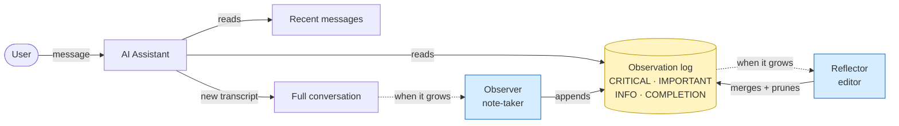

# Observational Memory

A plain-English guide to how the n8n AI Assistant remembers what's happened in a long conversation — and why it matters.

## The problem we're solving

The n8n AI Assistant is autonomous: it can plan, build, run, debug, and verify workflows over dozens of steps. A real session might involve looking at workflows, reading executions, calling external services, and adjusting along the way.

The trouble is that AI models read the **entire conversation history** every time they take a step. As that history grows:

- Conversations get **slower** — the model has more to re-read each turn.
- They get **more expensive** — every extra word in the transcript costs tokens.
- They get **less reliable** — important details get buried under tool output, JSON dumps, and back-and-forth.
- Eventually, they **hit a hard limit** — the model's context window fills up and the conversation just stops working.

We needed a way to keep the assistant focused over long sessions without it forgetting the things that matter.

## The idea, in one sentence

> While the conversation runs, two helper agents quietly maintain a **notepad of key observations** in the background, so the main assistant always has a tidy summary of what's happened — instead of re-reading the entire transcript every turn.

## How it works (the human analogy)

Imagine a long meeting. Instead of asking everyone to re-read the full transcript before they speak, you have:

1. A **note-taker** sitting at the back of the room. Every so often, they jot down the important points from the latest discussion — decisions made, problems found, things finished. They ignore the small talk.
2. An **editor** who occasionally tidies the notes — merging duplicates, dropping anything that's no longer relevant, keeping the page short and useful.

The main assistant then opens the meeting notes (not the full transcript) at the start of every turn. It still has the recent back-and-forth fresh in front of it, plus a clean summary of everything older.

That's it. That's observational memory.

## What the notes look like

Each observation is tagged with one of four markers, so the assistant knows what to pay attention to:

| Marker | What it means | Example |
|---|---|---|
| **CRITICAL** | Don't lose this — must inform every next step | "User's Slack workspace is `acme-prod`, not `acme-staging`" |
| **IMPORTANT** | Material context for the current task | "Workflow `Lead Capture` already has a Webhook trigger configured" |
| **INFO** | Background that's useful but not central | "User prefers Tuesdays for scheduled runs" |
| **COMPLETION** | Something has been finished | "Built and verified workflow `Daily Report` (id: wf-123)" |

When the assistant takes its next step, the active observations are rendered into its system prompt as a clean `## Memory` block — usually a few dozen lines instead of thousands of lines of raw transcript.

## What changed on this branch

Before, the assistant used a simpler approach: when the conversation got long, it ran an LLM to **summarise the older messages into a single blob of text** and stitched that into the next prompt. That worked, but:

- It was one big undifferentiated paragraph.
- It threw away the structure (what was important vs. what was background).
- It got re-summarised over and over, slowly drifting away from the truth.

This branch replaces that with the **observation log** described above:

- **Persistent**: observations live in their own database tables (`instance_ai_observations`, `instance_ai_observation_cursors`, `instance_ai_observation_locks`), so they survive restarts and follow the conversation across days.
- **Structured**: each observation has a marker, a parent link, a status (`active` / `superseded` / `dropped`), and a token count. The assistant can see *what kind* of fact it is, not just a wall of prose.
- **Self-tidying**: the Reflector merges and prunes the log so it stays well under the token budget, even on multi-day sessions.
- **Coordinated**: the locks table makes sure that only one note-taker runs at a time per conversation, even when n8n is running in a clustered/multi-process setup.
- **Scoped properly**: notes are tied to a specific conversation thread and never leak across users or projects.

The old "summarise the whole thing" code path (`compaction.service.ts`) has been removed.

## What this means for the people using it

### For end users of the n8n AI Assistant

- **Longer conversations just work.** You can keep iterating on the same project all day without the assistant getting slower, forgetting earlier decisions, or hitting a wall.
- **Lower cost per turn.** Each request sends a clean summary instead of the entire transcript, so the per-message bill stays roughly flat instead of growing the longer you chat.
- **Less repetition.** You won't have to re-explain things you told the assistant 50 messages ago — the important bits are pinned in its notes.

### For n8n administrators

A few new environment variables let you tune the behaviour (all have sensible defaults — you don't need to touch them):

| Setting | What it controls | Default |
|---|---|---|
| `N8N_INSTANCE_AI_OBSERVER_MODEL` | Which (cheap, fast) model writes the notes | `google/gemini-2.5-flash` |
| `N8N_INSTANCE_AI_OBSERVER_MESSAGE_TOKENS` | How much chat needs to pile up before the note-taker runs | ~30,000 tokens |
| `N8N_INSTANCE_AI_REFLECTOR_OBSERVATION_TOKENS` | How big the notepad can grow before the editor tidies it | ~40,000 tokens |
| `N8N_INSTANCE_AI_OBSERVATION_RENDER_TOKEN_BUDGET` | How much of the notepad gets rendered into each turn | ~4,500 tokens |

The note-taking and tidying agents run on a small, cheap model — so the savings on the main assistant's bill comfortably outweigh the extra calls.

### For developers working on Instance AI

- The full architecture (Observer, Reflector, scopes, markers, statuses) lives in `@n8n/agents` under `runtime/observation-log-*`.
- The n8n integration layer lives in `packages/cli/src/modules/instance-ai/`:
  - Entities: `instance-ai-observation*.entity.ts`
  - Repositories: `repositories/instance-ai-observation*.repository.ts`
  - Storage adapter: `storage/typeorm-agent-memory.ts` (implements `BuiltObservationLogStore`)
- Migration: `1784000000009-CreateInstanceAiObservationTables` adds the three new tables and drops the unused legacy `instance_ai_observational_memory` table.
- See `architecture.md` for how observational memory fits into the wider deep-agent architecture (planning, sub-agent delegation, structured prompts).

## The shape of it, visually

The two helpers on the right run **in the background**. The user never waits for them — they don't slow the conversation down. They just keep the notepad fresh so the assistant always has a good view of the past.

## In short

Observational memory turns the AI Assistant from a goldfish that re-reads everything every turn into a colleague who **takes notes during the meeting**. It's faster, cheaper, and far better at staying on track across long, complex workflow-building sessions — which is exactly the kind of work n8n users want help with.
