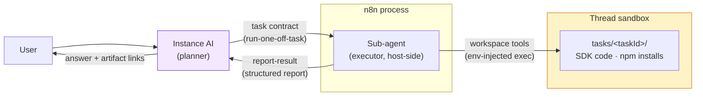

# One-Off Task Sandboxes

> **Status:** Implemented as a hackathon slice behind the
> `105_instance_ai_one_off_tasks` PostHog flag. Per-credential HITL approval
> and the items under Future Hardening are follow-ups.

## The Concept

Instance AI can already do one-off tasks, but only through a workflow. A
workflow is the wrong tool for a task that runs once — "create a Google Sheet
with these columns" does not need a trigger, a canvas, or persistence.

The idea: Instance AI delegates one-off tasks to a **coding sub-agent** that
writes code against the provider's SDK, executes it in a sandbox, verifies the
result by reading it back, and returns a structured report.

The core division of roles:

- **Instance AI (orchestrator) is the planner.** It writes the task contract:
  the goal, the guardrails, and which credentials to use. It does not write
  code.
- **The sub-agent is the executor.** It runs the full coding loop — write,
  run, fix, verify.
- **The sandbox is a dumb remote executor.** It runs commands and holds the
  generated code. It holds no LLM key and no long-lived secrets.

This boundary is the most important design decision. Keep it strict.

## Where the Executor Runs (Alternatives Considered)

Two architectures were evaluated:

1. **Harness-in-sandbox** (the original hackathon design): bundle a terminal
   coding harness ([pi](https://pi.dev)) into the sandbox image and drive it
   over a JSON event stream. Rejected because the executor's LLM loop inside
   the sandbox creates most of the security surface: the provider LLM key (or
   proxy billing token) must be injected into a box running LLM-written code;
   raw tool output streams out before any in-sandbox redaction hook fires; a
   mid-task credential request forces an exit-and-relaunch dance; and every
   harness event needs a translation layer onto the streaming protocol.
2. **Host-side sub-agent** (implemented): the executor loop is a `@n8n/agents`
   sub-agent running in the n8n process — the same pattern as the eval-setup
   agent. Its workspace tools execute in the sandbox; everything else is
   native. No LLM key ever enters the sandbox; redaction, streaming, HITL
   suspension, corrections, tracing, and credit metering are the existing
   runtime mechanisms; the sandbox degrades to a remote shell plus disk.

The trade: per-tool-call round-trips to the sandbox exec API (LLM inference
dominates loop wall-clock, so this is minor) and the executor consumes host
context/tokens, bounded by `MAX_STEPS.ONE_OFF_TASK` and metered by the
existing credit system.

## The Sandbox

One-off tasks reuse the **thread-scoped sandbox** (see
[sandboxing.md](./sandboxing.md)) — the same workspace the workflow builder
uses, created lazily on first use and reused across runs in a conversation.
Each task gets its own working directory, `tasks/<taskId>/`, and a
path-scoped workspace that cannot escape it.

### Lifecycle

The original design called for a per-task ephemeral sandbox destroyed the
moment the task ended, because the sandbox held decrypted credentials. With
the host-side executor that coupling is gone, and the requirement changed:
a run may hand off to the sub-agent, pause for HITL, set up a credential, and
hand off again — the generated code must survive all of that.

- **The sandbox lives as long as the thread is active** — across handoffs,
  HITL pauses, and follow-up runs — with the existing idle TTL as the reaper
  (`builderSandboxTtlMs`, default 15 minutes, extended while a run, a
  suspension, or a background task is live).
- **Credential exposure ends with the task.** Decrypted values live only in
  the host-side command wrapper (see Credentials below); they are handed to
  each exec call and die with it. Nothing persists them in the sandbox unless
  the generated code writes them to disk — which the sub-agent's instructions
  forbid and the write gate cannot fully prevent (see Future Hardening).
- **During a HITL pause** the workspace files persist; no process is holding
  injected env vars, because the executor loop (and its suspension state)
  lives host-side.
- **Follow-up tasks** ("actually, make it 5 columns") are new tasks with a new
  `tasks/<taskId>/` directory, the previous report passed as context. The
  previous task's code is still on disk if the sub-agent wants to reuse it.

Cancellation needs no special cleanup: aborting the background task kills the
host-side loop, and with it the only holder of injected env values. There is
no per-task sandbox to destroy.

### Provisioning

The task workspace needs only Node.js and npm — both already in the sandbox
runner image. The sub-agent installs the SDKs it needs (`npm install
googleapis`, …) into its task directory as its first step. Baking common SDKs
into the runner image (n8n-io/n8n-sandbox-service) is a startup-latency
optimization, not a requirement; note that it couples the image's release
cadence to this feature's (the builder path pins SDK versions from the host
for exactly this reason — see `workspace/sandbox-setup.ts`).

### Hard limits

- `MAX_STEPS.ONE_OFF_TASK` bounds the executor loop.
- The background-task concurrency limit and liveness timeout apply unchanged.
- The sandbox idle TTL reclaims the workspace after the thread goes quiet.

## The Executor

The `run-one-off-task` orchestration tool
(`src/tools/orchestration/one-off-task-agent.tool.ts`) spawns the sub-agent
as a background task — the same mechanics as `eval-setup-with-agent`:

- **Sub-agent** via `createSubAgent` with static instructions
  (`one-off-task-agent.prompt.ts`): one task, read credentials from env by
  name, never print values, verify by read-back, finish with `report-result`.
- **Workspace tools** from the attached scoped workspace, filtered to
  read/write/str-replace/execute by the standard allowlist.
- **Tool set**: `report-result` plus the `research` domain tool for SDK
  documentation lookups. No workflow tools, no MCP, no delegation.
- **Streaming** through `consumeStreamWithHitl`: events flow to the existing
  agent-branch UI under the sub-agent's `agentId` with `parentId` set; user
  corrections steer the running task; output redaction applies to every event
  before publish.

### The result contract

The sub-agent's last act must be calling **`report-result`** (a zod-schema
tool): status (`completed` / `partial` / `failed`), summary, actions taken,
verification evidence, artifact links. The task body reads the captured
report after the stream settles — a model-formatted text summary is never
trusted as the structured result. If the loop ends without a report, the task
result says "external state unknown" plus the last output.

**Verification means read-back.** After a write, the sub-agent reads the
resource through the API and compares it with the goal. "The create call
returned 200" is not verification. The artifact links in the report are the
final, free verification layer — the user can click and see.

The report is a **best-effort user summary, not an audit log**. A killed
executor never calls `report-result`; after an unclean stop Instance AI
reports the task as interrupted. A trusted, host-side audit log of API calls
arrives with the credential proxy (Future Hardening).

## Credentials

The security core of the design:

> **Credential values never enter the model transcript — by construction.**
> The sub-agent is told env var *names*. Values are resolved host-side and
> merged into each sandbox exec call by the scoped workspace's command
> wrapper (`createScopedWorkspace(workspace, taskRoot, env)`). They never
> appear in a tool call, a tool result, or an event.

This is stronger than the original harness-in-sandbox design, which depended
on scrubbing values out of a stream they had already entered. Two residual
paths remain and are named honestly: the generated code itself reads the
values from `process.env` and could print them (the instructions forbid it;
pattern-based output redaction is the in-stream backstop; exact-literal
redaction does not exist today), and code could persist them to disk (the
egress allowlist and credential proxy under Future Hardening are the real
answers).

### Resolution: one narrowly-scoped CLI service

`OneOffTaskCredentialEnvService` (`packages/cli/.../sandbox/`) resolves
credential IDs to env vars. The general Instance AI credential surface stays
metadata-only (`CredentialDetail` carries an explicit "never include
decrypted credential data" note); this service is not reachable from any
tool — its output flows only into the scoped workspace's env.

Per credential:

1. **User-scoped access recheck** at injection time:
   `findCredentialForUser(id, user, ['credential:read'])`. This always
   precedes the OAuth refresh (which authorizes by project, not user).
2. **Static-key credentials**: string fields map to
   `<TYPE_PREFIX>_<FIELD>` env vars (`airtableApi.apiKey` →
   `AIRTABLE_API_KEY`).
3. **OAuth credentials**: refresh the token first
   (`refreshOAuth2CredentialById`, best-effort), then inject **only the fresh
   access token** as `<TYPE_PREFIX>_ACCESS_TOKEN` — never the refresh token,
   never the client secret. The task's bounded lifetime sits well below the
   token TTL, so no refresh is needed mid-task; if a token does expire
   mid-task, the API call fails and the report says so — accepted.

### Consent

The orchestrator's skill instructs it to agree the credential use with the
user in conversation before passing IDs to the tool, and the resolver's
access recheck is the hard authorization gate. **Per-credential HITL approval
(a confirmation card before injection) is a deliberate follow-up**, not part
of the slice: the tool-suspend mechanism and the `credentialSelection`
confirmation kind already exist (`credentials.tool.ts` uses both), so the
follow-up is contained in the tool.

For credentials that do not exist yet, the orchestrator uses the existing
credential setup flow (including the Templated Custom Auth recipe path — the
masked setup card keeps pasted secrets out of the model context, `testUrl`
verifies before use) and then passes the new credential's ID.

## Instance AI Integration

The pattern is skill + tool, like the workflow builder:

- **The `one-off-task` skill** (`skills/one-off-task/SKILL.md`) teaches the
  orchestrator the routing rule (recurring → workflow, run-once → one-off
  task, user override wins), how to write a good task contract, the
  credential consent flow, and how to relay the report.
- **The thin `run-one-off-task` tool** validates input, resolves the task
  workspace, and spawns the background task. Contract quality lives in the
  skill.

Gating is the standard capability-presence idiom: the adapter resolves the
PostHog flag per user (fails closed); the service wires the
`oneOffTaskWorkspace` capability onto the orchestration context only when the
flag is on **and** the sandbox is enabled; the tool registers only when the
capability is present; the skill is hidden by the same flag.

Streaming, cancellation ("stop that", the stop button, global cancel),
corrections, tracing, and credit metering are all inherited from the
background-task machinery — nothing new at the protocol level.

## Evals and Test Tasks

Testing is manual at first. The task list below doubles as the manual test
script now and the eval suite later.

### Task families

| # | Family | Examples | Notes |
| --- | --- | --- | --- |
| 1 | Resource creation | Google Sheet with columns; Notion database with properties; Slack channel with topic and members; GitHub repo with labels; Drive folder structure | Simple, satisfying, low-risk. The demo tasks. |
| 2 | One-time data transfer | Airtable → Google Sheets; Notion pages → CSV; CSV of leads → HubSpot; Trello board → board | Probably the highest real demand. Users currently build a throwaway workflow and delete it — exactly the waste this feature removes. |
| 3 | Backfills | "My workflow started in June — fetch the January–May Shopify orders into the same sheet" | Complements an existing workflow instead of replacing it. Strong pitch story. |
| 4 | Bulk cleanup and edits | Dedupe CRM contacts; normalize phone numbers in a sheet; archive inactive Slack channels; rename 300 Drive files | The destructive family — scope confirmation and partial-report-on-failure earn their keep here. |
| 5 | Reports and analysis | Summarize last month's Stripe payments by product; HubSpot deals per stage; stats over GitHub issues | Read-only, safest. The sub-agent does real computation over data, which a workflow does awkwardly. |
| 6 | Audits and lookups | Drive files shared outside the org; Notion pages mentioning a customer; dead URLs in a sheet of 200 | Read-only, tedious by hand, no sane workflow shape. |
| 7 | External service configuration | Register a webhook; set up CRM pipeline stages; create a label taxonomy | Often a prerequisite for building a workflow — another complement. |
| 8 | One-time outbound sends | Personalized email to 40 people; digest to Slack; calendar invites | **Out of scope for now.** Outward-facing, unrecallable, retry-duplicates are visible to humans. Add later behind a confirmation gate. |

### Eval axes

The families are not the eval axes — the axes cut across them:

- **Read-only vs. write vs. destructive.**
- **Single service vs. cross-service.**
- **Single item vs. bulk** — pagination and rate limits are where LLM-written
  code typically fails.
- **Existing OAuth credential vs. new-key recipe path.**

A good early suite is a small grid over these axes rather than many tasks
from one family: a creation task, a transfer task, a bulk cleanup, and an
audit — each in a read-only and a write variant, at least one requiring the
recipe flow.

### Behavioral cases (no happy path)

- A task that should route to a **workflow** instead ("every Monday…") —
  asserts refusal to sandbox it.
- A task with a **wrong or missing credential** — asserts the request flow,
  not silent failure.
- An **ambiguous task** — asserts a clarifying question before execution.
- Data containing a **prompt injection** — asserts the token stays put
  (later, once guardrails mature).

The existing LangTracer suites already distinguish build cases from
behavior/process cases; these map onto that machinery.

### Manual testing

One task each from families 1, 2, 5, and 6 — creation, transfer, report,
audit. Together they cover both credential paths and stay non-destructive
while the guardrails are young.

## Decisions Made

| Decision | Choice |
| --- | --- |
| Where the executor runs | **Host-side `@n8n/agents` sub-agent** (eval-setup pattern). Harness-in-sandbox (pi) rejected: LLM key in the sandbox, redaction after the fact, exit-and-relaunch HITL, event translation layer. |
| Sandbox lifecycle | **Thread-scoped sandbox + per-task directory.** Generated code survives handoffs, HITL, and follow-ups; idle TTL reaps. Credential *exposure* is per-exec, not per-sandbox. |
| Convert one-off tasks to workflows | **No.** One-off tasks are one-off. The kept report covers the "again later" case. |
| Credential injection | **Host-side env into the scoped workspace's command wrapper.** Values never in a file, never in the transcript — by construction. |
| Credential decryption | **One narrowly-scoped CLI service** (`OneOffTaskCredentialEnvService`), user access recheck at injection time, unreachable from tools. The general metadata-only boundary stays. |
| OAuth support | **From day one.** User check → refresh → inject access token only. Google Sheets (OAuth) is the demo slice. |
| Credential approval | **Conversational consent + access recheck for the slice.** Per-credential HITL confirmation card is a contained follow-up (tool-suspend + `credentialSelection` kind already exist). |
| LLM access for the executor | **n/a — the loop is host-side.** No key in the sandbox; budget = `MAX_STEPS` + existing credit metering. |
| Report status | **Best-effort user summary, not an audit log.** Captured via the `report-result` tool, never parsed from free text. Unclean stop → "external state unknown". |
| Follow-up turns | **New task, new task directory, previous report as context.** No idle credential exposure "just in case". |
| Frontend | **None.** Existing agent-branch rendering + final text. A report card UI is a possible follow-up. |

## Future Hardening

In rough priority order:

1. **Per-credential HITL approval.** A confirmation card before injection,
   reusing the `credentialSelection` kind; optionally a thread-scoped lease
   so follow-up tasks get a one-click confirm.
2. **Egress allowlist.** The sandbox runs LLM-written code that reads
   external data — which can carry a prompt injection instructing it to
   exfiltrate a token. A domain allowlist derived from the credential types
   in use is the strongest single mitigation. Requires host metadata on
   credential types.
3. **Credential proxy.** A proxy at the sandbox boundary adds auth headers
   outside the sandbox, so raw tokens never enter it at all — and yields a
   trusted, host-side audit log of every API call as a side effect.
4. **Literal-value output redaction.** Today's redaction is pattern-based;
   scrubbing the exact injected values from streamed output closes the
   "generated code prints the token" path for unencoded values.
5. **Short-lived, scoped tokens.** Scope access tokens down where the
   provider supports it.
6. **Runner-image SDK bake.** Pre-install common SDKs in the sandbox runner
   image to cut task startup latency (mind the release-cadence coupling).

## One-Sentence Version

A host-side coding sub-agent executes a structured task contract from
Instance AI against a per-task, credential-env-injected directory in the
thread sandbox, and returns a read-back-verified structured report.
