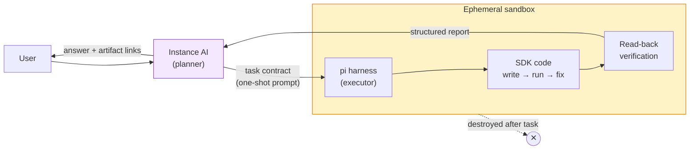
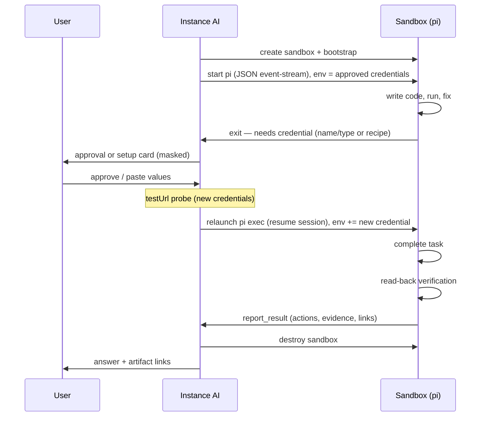

# One-Off Task Sandboxes

> **Status:** Hackathon prototype, working end-to-end (verified live against
> Google Sheets with OAuth injection, 2026-08-12). Gated behind
> `N8N_INSTANCE_AI_ONE_OFF_TASKS=true`. This document describes the concept,
> the decisions made, and the path from prototype to production.

## The Concept

Instance AI can already do one-off tasks, but only through a workflow. A
workflow is the wrong tool for a task that runs once — "create a Google Sheet
with these columns" does not need a trigger, a canvas, or persistence.

The idea: Instance AI delegates one-off tasks to an **ephemeral sandbox** that
runs a **pre-bundled coding harness** ([pi](https://pi.dev)). The harness
writes code against the provider's SDK, executes it, verifies the result, and
returns a structured report. Then the sandbox is destroyed.

The core division of roles:

- **Instance AI is the planner.** It writes the task contract: the goal, the
  guardrails, and which credentials to use. It does not write code.
- **The harness is the executor.** It runs the full coding loop — write, run,
  fix, verify — inside the sandbox.

This boundary is the most important design decision. Keep it strict.

## Why the Sandbox Is Ephemeral

The sandbox holds decrypted credentials. Therefore its lifetime equals the
lifetime of the secrets. This is a hard guarantee, not a preference:

- Destroy the sandbox on success.
- Destroy the sandbox on failure.
- Destroy the sandbox on timeout, on abort, and on crash.

This differs from the existing thread-scoped sandbox (see
[sandboxing.md](./sandboxing.md)), which persists across a conversation. A
one-off task sandbox is created per task and never reused.

## The Sandbox

Provider: the **n8n sandbox service** (the default provider). Two findings
shape the provisioning story:

1. **Pre-warmed snapshots are Daytona-only today.** The `SnapshotManager` is
   built on the Daytona SDK, and `create-workspace.ts` skips the snapshot path
   for the `n8n-sandbox` provider. The sandbox service API
   (`@n8n/sandbox-client`) has no image or snapshot parameter — the service
   runs one fixed runner image, chosen at service deployment.
2. **This is a match, not a blocker.** All one-off task sandboxes use the same
   image anyway. Per-sandbox image selection is not needed.

### Hackathon path: bootstrap at creation

Create a sandbox, then run a bootstrap script through the exec and filesystem
APIs:

- `npm install -g --ignore-scripts @earendil-works/pi-coding-agent`
- Write `SYSTEM.md`, `AGENTS.md`, and the guardrail extension files.

Zero changes outside this repo. Cost: tens of seconds of startup per task.
Acceptable for a demo, not for production.

### Production path: bake into the runner image

Add pi, the config files, the extensions, and the most common SDKs
(googleapis, Slack, …) to the sandbox service's runner image
(n8n-io/n8n-sandbox-service). Every sandbox the service creates is then
pre-warmed by definition. Sandbox start stays fast, which matters — the user
waits in a chat.

### Hard limits

- Maximum sandbox lifetime (wall clock).
- Token budget for the harness.
- Maximum wait time on a human-in-the-loop request (see credential flow).
- On any limit: abort the harness, destroy the sandbox, report the task as
  incomplete. A stuck loop must not hold decrypted credentials.

## The Harness

[pi](https://pi.dev) is a minimal terminal coding harness with the exact
mechanisms this design needs.

### Integration: JSON event-stream mode

Pi's RPC mode (JSONL over stdin/stdout) **cannot run on the default sandbox
provider**: the sandbox service exec API exposes a command, env, output
callbacks, and an abort signal — no writable stdin
(`n8n-sandbox-sandbox.ts`; [sandboxing.md](./sandboxing.md) marks
interactive process handles as unsupported). Instance AI therefore drives
pi in **JSON event-stream mode**: a one-shot invocation with the task as
the prompt argument and structured events on stdout.

- Send the task: prompt argument of the one-shot invocation.
- Receive streamed events through the exec `onStdout` callback.
- Done signal: process exit plus the final report.
- Kill switch: the exec `abortSignal` kills the pi process. Graceful abort
  is not needed — the sandbox is destroyed either way.

What is lost against RPC mode: mid-run steering. A mid-task credential
request becomes **exit-and-relaunch** — the harness exits with a
"needs credential" report, and Instance AI relaunches the exec with the
extra environment variable. RPC mode becomes an option again if the sandbox
service grows an interactive execution API (see Future Hardening).

Relaunch does not lose context, because only the pi **process** exits — the
sandbox stays up. Context survives in two places: the workspace files the
harness wrote, and pi's persisted session (a JSONL file under
`~/.pi/agent/sessions/`, relocatable via `--session-dir`). The relaunch
resumes the session, so the harness continues with its full prior context;
the new env var is the only thing that changed.

**Verified against pi source (v0.84.1):** session resolution runs before
the mode dispatch and honors `--continue` / `--session` / `--session-id`
unconditionally, so session resume composes with one-shot JSON mode. The
clean primitive is `--session-id <uuid>`: pi creates the session when the
ID is new and opens it when it exists — so Instance AI generates one UUID
per task and passes the same `--session-id` on every launch; the first exec
creates the session, every relaunch resumes it deterministically. (Only
`-r`/`--resume`, the interactive picker, needs a TTY.)

### Instruction layers

Static instructions are baked; only the task changes per run.

| Layer | Mechanism | Content |
| --- | --- | --- |
| Role and rules | `~/.pi/agent/SYSTEM.md` (baked) | Identity: "You execute one one-off task. You read credentials from the environment by name. You verify by read-back. You produce a final report. You never print secret values." |
| Conventions | `AGENTS.md` context file (baked) | Credential catalog format, how to request a new credential, report format. |
| The task | One-shot prompt (per run) | The task contract from Instance AI. |

### Guardrail extensions

Pi extensions are TypeScript modules baked into the image
(`.pi/extensions/`). They intercept every tool call before it executes and
every tool result before the model sees it.

| Extension hook / tool | Purpose | Strength |
| --- | --- | --- |
| `tool_call` hook | Block obvious env-dumping commands (`env`, `printenv`, `echo $SECRET_*`). | **Soft.** A tripwire, not a wall — code can always read `process.env`. Do not oversell it. |
| `tool_result` hook | Redact secret values from every tool output before the LLM sees them (`[REDACTED:NAME]`). The injector writes the secret env var names to a manifest; the hook compares outputs against the actual values, which are already inside the sandbox. | **Defense-in-depth, not a guarantee.** Pi streams `tool_execution_update` deltas *while* a tool runs — before this hook fires — so partial raw output can leave the sandbox first. The authoritative scrub is host-side, in the event translation layer (see Instance AI Integration). Exact-value matching also misses encoded or transformed secrets; that residual risk is what the egress allowlist addresses. |
| `list_credentials` tool | Returns credential names and types only. The model has no reason to poke at the environment — availability is a tool call, not a shell command. | Convenience + risk reduction. |
| `report_result` tool | Fixed schema: actions taken, verification evidence, artifact links. The system prompt requires it as the harness's last act. | Enforces the result contract by schema, not by hoping the model formats text. |
| `lookup_docs` tool | Calls the Context7 API directly for current SDK docs. Pi has no documented native MCP support; a direct HTTP tool is simpler than bridging an MCP client. | Capability. |

## Credentials

The security core of the design, stated explicitly:

> **The harness knows credential names and types. It never sees credential
> values in its context.** Values exist only in the pi process environment.
> The LLM transcript, the logs, and the report never contain a value.

### Injection: per-exec environment

The sandbox client's `ExecRequest` already supports
`env: Record<string, string>`. Decrypted values are passed as environment
variables **only to the exec call that starts the pi process**. They are
never written to a file and never baked into the sandbox. No service change
is needed.

### Decryption: one privileged adapter method

The existing Instance AI boundary deliberately returns credential metadata
only — `CredentialDetail` in `types.ts` carries an explicit "never include
decrypted credential data" note, and the setup flow resumes with IDs. That
convention stays for the general surface. Injection goes through **one new,
narrowly-scoped adapter method** in `packages/cli` — where decryption and
the OAuth machinery already live: *resolve credential X to injectable env
values for a one-off task*. The method:

- **Rechecks user/project access at injection time**, not only at catalog
  time.
- **Static-key credentials:** maps fields to env vars directly. Multi-field
  credentials become N env vars.
- **OAuth credentials:** refreshes the token first, then injects **only the
  fresh access token** — never the refresh token, never the client secret.
  The sandbox's hard lifetime is far below the token TTL, so no refresh is
  ever needed inside the sandbox; the expiry problem is solved by ordering,
  not new infrastructure. The harness uses the token as a plain Bearer
  token (the `AGENTS.md` conventions say so; SDKs accept raw access
  tokens). If the task needs a scope the credential lacks, the API call
  fails mid-task and the report says so — accepted.

Both credential shapes are supported from day one; the injection contract
(env var names → values) does not care about the type. Google Sheets
(OAuth) is the demo slice.

### Two request paths

**Path 1 — existing credential.** The harness reads the catalog (names and
types only) via `list_credentials`. When the task needs one, it sends a
structured request to Instance AI. The user approves. Instance AI decrypts
the credential and injects it. Explicit approval per credential is the
consent mechanism — do not skip it, even when the need is obvious. It is
the only gate for now.

An approval is a **thread-scoped lease**: it covers that credential, in
that thread, for a bounded window. A follow-up task inside the window gets
a one-click, pre-filled confirmation instead of a full re-approval; when
the lease expires (or the thread ends), full approval is required again.
This keeps consent per-injection honest without adding friction to the
common case.

**Path 2 — new credential.** The harness requests a credential that does not
exist. This reuses the **Templated Custom Auth** recipe flow
(`src/tools/credentials.tool.ts`): the model builds a recipe from provider
docs (placeholders, labels, masked inputs, `docsUrl`, `testUrl`), the user
pastes only the secret values into the setup card, and the credential is
tested via `testUrl` before injection. Three hard problems come solved with
this reuse:

1. The paste bypasses the model context (masked setup card, not a chat
   message).
2. The credential is verified before use — the harness does not burn tokens
   discovering that a key is wrong.
3. `docsUrl` guides the user to the exact page where they create the key.

At paste time, ask the user: "Save this for later, or use it once?" The
use-once option dies with the sandbox — a security feature the workflow path
does not have, and a natural fit for one-off tasks.

The placeholder names double as the environment contract: a recipe with
`{{api_key}}` tells the harness "read `API_KEY` from the environment" without
the harness ever knowing the value.

Note: in the existing flow, n8n applies the auth template at request time. In
the sandbox, the harness calls the SDK directly, so the template execution is
mostly unused. What is reused is the request–card–paste–verify UX and the
"values never enter model context" guarantee.

### The wait state

A mid-task credential request pauses the harness while already-injected
credentials sit in the sandbox. The pi process has exited, but the sandbox
**stays active** through the whole human-in-the-loop wait — its filesystem
and pi's session file are the context the relaunch resumes. Set a wait
timeout that spans the user's thinking time: if the user does not respond
in N minutes, destroy the sandbox and report the task as incomplete. The
user can restart; secrets must not sit idle.

The rule in one line: **the pi process is disposable mid-task; the sandbox
is disposable only at task end** — completion, wait timeout, abort, or
crash.

## Verification

Mandatory, and defined concretely so the harness cannot claim success
cheaply:

- **Verification means read-back.** After a write, the harness reads the
  resource through the API and compares the state with the goal. "The create
  call returned 200" is not verification. "I read the sheet and it has the 4
  columns you asked for" is.
- **Evidence goes in the report.** What was checked and what was found, plus
  the artifact link. The user can click the link and see for themselves —
  the final verification layer, and it is free.
- **Write operations get a gate.** For destructive actions, the harness makes
  a short plan first and Instance AI shows it to the user before execution. A
  failed retry can create the sheet twice; a wrong plan can delete data.

## The Result Contract

The harness must not return free text only. The `report_result` schema
carries:

- Actions taken (which API calls, against what).
- Verification evidence (what was read back, what matched).
- Artifacts (URLs to created resources).

The report is a **best-effort user summary, not an audit log**. A killed or
crashed harness never calls `report_result`, and a model-authored summary
is not trusted evidence. After an unclean stop, Instance AI reports "task
interrupted — external state unknown" plus whatever the streamed events
showed. A middle step: the `tool_call` hook appends every executed command
to a journal file that n8n reads after the fact — it survives harness
death, though it is still sandbox-resident and model-adjacent. A trusted,
host-side audit log arrives with the credential proxy (Future Hardening).

Keep the final report after the sandbox dies: if the user asks "do that
again next month," Instance AI starts a fresh one-off task with the old
report as a hint — knowledge reuse without any workflow machinery.

## Instance AI Integration

The existing architecture has slots for every integration point. Nothing new
is invented at the protocol level. The frozen implementation contracts
between workstreams live in `src/one-off-task/contracts.ts`.

### Skill plus tool

The workflow builder already uses the pattern: a skill teaches the
orchestrator when and how, an orchestration tool does the spawning.

- **A `one-off-task` skill** teaches the orchestrator to write a good task
  contract: the goal, the constraints, which catalog credentials fit, and
  what "verified" means for this task. It also carries the routing rule —
  recurring work → workflow, run-once work → sandbox — with user override.
- **A thin `run-one-off-task` orchestration tool** creates the sandbox,
  bootstraps it, and runs pi **inline within the tool call**. Per the
  engineering rules, the tool validates input, calls the service, returns
  output — the contract quality lives in the skill, not the tool.

**Inline first, background later.** Running the exec inline keeps the whole
loop in one run: the tool returns a `needs_credential` outcome, the
orchestrator calls the credential setup tool, that tool **suspends the run**
(existing machinery — `suspend`/`resumeData` in `credentials.tool.ts`), the
user answers the card, the run resumes, and the orchestrator calls
`run-one-off-task` again, which relaunches pi in the still-active sandbox
with the session resumed. One continuous conversation with a card in the
middle. The background-task variant (as the workflow builder uses) is the
later upgrade for tasks long enough that the user should keep chatting
meanwhile.

### Streaming: reuse the event schema

The streaming protocol already supports multiple agent branches: every event
carries an `agentId`, spawned background agents carry a `parentId`, and the
frontend renders those branches (see
[streaming-protocol.md](./streaming-protocol.md)). The integration is a
translation layer: pi's JSON-stream events (read from the exec `onStdout`
callback) map onto existing event types under the sandbox agent's ID.

| pi event (JSON stream) | Instance AI event |
| --- | --- |
| `message_update` (text deltas) | `text-delta` |
| `tool_execution_start` / `end` | tool events in the agent branch |
| milestone progress | `status` ("Creating the sheet…") |
| process exit + `report_result` | task completion → report card |

Raw tool activity streams into the collapsible agent branch; occasional
`status` lines keep the main view readable.

**The translation layer is also the authoritative redaction point.** n8n
injected the secret values, so it scrubs every streamed delta against them
before anything is persisted or emitted — building on the existing
pattern-based redaction (`N8N_INSTANCE_AI_OUTPUT_REDACTION_SECRETS`). This
closes the window the in-sandbox `tool_result` hook cannot: pi streams
partial tool output before that hook fires. Encoded or transformed secrets
can evade both layers; the egress allowlist (Future Hardening) is the
answer to that.

### Abort and cleanup: three layers

Inline execution inherits run cancellation directly: the global stop aborts
the run, the tool's abort signal kills the exec. The later background-task
variant inherits the two existing task cancel paths
(`cancelRun` → `cancelBackgroundTasks(threadId)` and the
`cancel-background-task` tool). Either way, for this sandbox type
**cancellation is a security event** — aborting the exec kills the pi
process, and the sandbox must be destroyed.

Destruction cannot rely on manager callbacks: the background task registry
is in-memory, and `cancelTask` drops the callbacks without invoking
`onSettled` (`background-task-manager.ts`). Cleanup therefore has three
layers:

1. **`try/finally` in the task function itself.** The abort signal reaches
   the task body; the `finally` destroys the sandbox on every in-process
   path — success, failure, cancel.
2. **A persisted sandbox lifecycle record.** Written at creation, cleared
   at destruction. A restarted n8n sweeps it and reaps orphans
   (deterministic IDs or labels make the sweep cheap — the same trick the
   thread-scoped workspace uses for reattachment).
3. **Service-enforced sandbox TTL.** The backstop that works when n8n
   itself dies and never comes back.

Layers 2 and 3 are not implemented in the prototype, and the gap is
observed in practice: every dev-server restart orphans the in-memory
registry and its sandbox, and orphans accumulate until removed by hand.
They are the first post-hackathon work item.

One transport lesson from live testing: the sandbox service can fail to
deliver an execution's final exit event after large-output runs, hanging
the exec stream indefinitely. The lifecycle layer therefore treats the
harness's own `report.json` as the source of truth on every failure path
except user cancellation — a settle watchdog aborts the dead stream ~60s
after pi's terminal events and recovers the outcome from the report file.
(The underlying exit-event loss is an n8n-sandbox-service bug to fix in
that repo.)

### Confirmation and result UI

- The destructive-write gate renders through the existing confirmation
  mechanism (severity levels via `instanceAiConfirmationSeveritySchema`) —
  not a new UI.
- The `report_result` payload renders as a card: actions, verification
  evidence, artifact links. This is the moment the user judges whether the
  feature is trustworthy — not a text blob.
- On a limit kill (timeout, token budget, credential wait expiry) the user
  gets a **partial report** — what was done before the stop. The harness may
  have half-created things; the user must know what exists.

### Follow-up turns

The report arrives, the sandbox dies, the user replies "actually, make it 5
columns." That is a **new task**: new sandbox, previous report passed as
context, credential access via the thread-scoped approval lease (one-click
confirm inside the window, full approval after expiry). This keeps the security
story clean (no idle sandbox holding credentials "just in case") and reuses
the keep-the-report decision. The alternative — a short grace period — is
what users may intuitively expect, so this stays an explicit product
decision.

### LLM access for the harness

The harness runs its own LLM loop, so it needs model access. Decision:
**reuse the same provider and model as Instance AI.** The harness does real
coding work, so the same Opus-class model is justified, and one model config
means no new settings surface. Per deployment shape:

| Deployment | Instance AI model source | pi mechanism |
| --- | --- | --- |
| Self-hosted, built-in provider (`N8N_INSTANCE_AI_MODEL=anthropic/…`) | Direct provider key | Native pi provider; key injected per-exec like any credential. Hackathon path. |
| Self-hosted, custom endpoint (`N8N_INSTANCE_AI_MODEL_URL`) | OpenAI-compatible URL + key | Custom-provider TypeScript module baked into the image, reading URL/key/model from env. |
| Cloud / proxy-managed | n8n's managed proxy | Same custom-provider module pointed at the proxy. |

The caveat: the injected key or proxy token is n8n's billing identity inside
a sandbox running LLM-written code. For the hackathon, a separate
rate-limited key is the minimum. The real fix is proxy-minted short-lived
per-run tokens with a token budget — which also yields per-task cost
accounting. See Future Hardening.

### Production trio

- **Feature flag** gating the skill and tool. Implemented as the
  `N8N_INSTANCE_AI_ONE_OFF_TASKS=true` env var for the hackathon; a PostHog
  flag is the eventual rollout mechanism.
- **Telemetry** through the `@n8n/telemetry` registry: task started,
  credentials requested/approved, task completed/failed/timed out, tokens
  spent.
- **Evals**: a LangTracer suite for one-off tasks — a new behavior class the
  workflow evals do not cover.

## Evals and Test Tasks

Testing is manual at first. The task list below doubles as the manual test
script now and the eval suite later.

### Task families

| # | Family | Examples | Notes |
| --- | --- | --- | --- |
| 1 | Resource creation | Google Sheet with columns; Notion database with properties; Slack channel with topic and members; GitHub repo with labels; Drive folder structure | Simple, satisfying, low-risk. The demo tasks. |
| 2 | One-time data transfer | Airtable → Google Sheets; Notion pages → CSV; CSV of leads → HubSpot; Trello board → board | Probably the highest real demand. Users currently build a throwaway workflow and delete it — exactly the waste this feature removes. |
| 3 | Backfills | "My workflow started in June — fetch the January–May Shopify orders into the same sheet" | Complements an existing workflow instead of replacing it. Strong pitch story. |
| 4 | Bulk cleanup and edits | Dedupe CRM contacts; normalize phone numbers in a sheet; archive inactive Slack channels; rename 300 Drive files | The destructive family — the write gate and partial-report-on-failure earn their keep here. |
| 5 | Reports and analysis | Summarize last month's Stripe payments by product; HubSpot deals per stage; stats over GitHub issues | Read-only, safest. The harness does real computation over data, which a workflow does awkwardly. |
| 6 | Audits and lookups | Drive files shared outside the org; Notion pages mentioning a customer; dead URLs in a sheet of 200 | Read-only, tedious by hand, no sane workflow shape. |
| 7 | External service configuration | Register a webhook; set up CRM pipeline stages; create a label taxonomy | Often a prerequisite for building a workflow — another complement. |
| 8 | One-time outbound sends | Personalized email to 40 people; digest to Slack; calendar invites | **Out of hackathon scope.** Outward-facing, unrecallable, retry-duplicates are visible to humans. Add later behind the confirmation gate. |

### Eval axes

The families are not the eval axes — the axes cut across them:

- **Read-only vs. write vs. destructive.**
- **Single service vs. cross-service.**
- **Single item vs. bulk** — pagination and rate limits are where LLM-written
  code typically fails.
- **Existing OAuth credential vs. new-key recipe path.**

A good early suite is a small grid over these axes rather than many tasks
from one family: a creation task, a transfer task, a bulk cleanup, and an
audit — each in a read-only and a write variant, at least one requiring the
recipe flow.

### Behavioral cases (no happy path)

- A task that should route to a **workflow** instead ("every Monday…") —
  asserts refusal to sandbox it.
- A task with a **wrong or missing credential** — asserts the request flow,
  not silent failure.
- An **ambiguous task** — asserts a clarifying question before execution.
- Data containing a **prompt injection** — asserts the token stays put
  (later, once guardrails mature).

The existing LangTracer suites already distinguish build cases from
behavior/process cases; these map onto that machinery.

### Manual testing this week

One task each from families 1, 2, 5, and 6 — creation, transfer, report,
audit. Together they cover both credential paths and stay non-destructive
while the guardrails are young.

## Decisions Made

| Decision | Choice |
| --- | --- |
| Convert one-off tasks to workflows | **No.** One-off tasks are one-off. No tokens wasted on workflow generation. The kept report covers the "again later" case. |
| Credential proxy at the sandbox boundary | **Not now.** Noted as future hardening. |
| Egress allowlist per credential type | **Not now.** Credentials from n8n do not carry host metadata today. Noted as future hardening. Human approval per credential per task is the consent gate instead. |
| Env vars vs proxy | Env vars, but per-exec — only the pi process sees them, never a file, never the sandbox image. |
| MCP for Context7 | **No.** Pi has no native MCP support; a direct HTTP `lookup_docs` extension tool is simpler. |
| LLM for the harness | **Same provider and model as Instance AI.** No new settings surface; per-run budget tokens are future hardening. |
| Follow-up turns | **New task, new sandbox.** Previous report passed as context; credential access via the thread-scoped approval lease. No idle sandbox holding credentials. |
| Harness drive mode | **JSON event-stream one-shot.** The sandbox exec API has no stdin, so pi RPC mode cannot run on the default provider. Exit-and-relaunch replaces mid-run steering; RPC returns if the service grows interactive execs. |
| Credential decryption | **One privileged adapter method in `packages/cli`**, with access recheck at injection time. The general metadata-only boundary stays. |
| OAuth support | **From day one.** Refresh-then-inject, access token only, sandbox lifetime below token TTL. Google Sheets (OAuth) is the demo slice. |
| Credential approval | **Thread-scoped lease.** Per-injection consent with one-click confirm inside the window; full approval after expiry. |
| Report status | **Best-effort user summary, not an audit log.** Unclean stop → "task interrupted — external state unknown." |
| Execution placement | **Inline in the tool call first**; the whole task loop, including credential HITL via suspend/resume, stays in one run. Background-task variant later for long tasks. |
| HITL relaunch | **Resume the same pi session** via a per-task `--session-id <uuid>` (create-or-open semantics, verified in pi source) in the still-active sandbox. Only the pi process is disposable mid-task; the sandbox dies only at task end. |

## Future Hardening

In rough priority order:

1. **Egress allowlist.** The sandbox has secrets, runs LLM-written code, and
   reads external data — which can carry a prompt injection instructing the
   harness to exfiltrate a token. An allowlist of domains derived from the
   credential types in use (Google Sheets task → Google API domains only) is
   the strongest single mitigation. Requires host metadata on credential
   types.
2. **Credential proxy.** A small proxy at the sandbox boundary adds auth
   headers outside the sandbox, so raw tokens never enter it at all.
   Supersedes env injection entirely — and yields a trusted, host-side
   audit log of every API call as a side effect.
3. **Runner image bake.** Move from bootstrap-at-creation to pi baked into
   the sandbox service runner image (the production provisioning path above).
   Live-testing findings that raise its priority: the current sandbox image
   ships Node 18 (pi needs ≥ 22) and a non-root user with no `/usr/local`
   write access, so the bootstrap must download a standalone Node 22 plus a
   local pi install per fresh sandbox (~40 MB, 30–90 s) — and that makes
   bootstrap depend on egress to nodejs.org and registry.npmjs.org, which a
   future egress allowlist would otherwise have to permit. Baking Node 22 +
   pi into the image removes the delay, the egress dependency, and the
   (TLS-only today) tarball-integrity question in one move.
4. **Short-lived, scoped tokens.** Inject access tokens only (never refresh
   tokens), scoped down where the provider supports it.
5. **Per-run LLM budget tokens.** Replace the injected provider key with
   proxy-minted, short-lived tokens carrying a per-task token budget. Caps
   the damage of a prompt-injected harness and yields per-task cost
   accounting.
6. **Interactive execution API on the sandbox service.** Writable stdin (or
   a process handle) enables pi RPC mode: mid-run steering and a credential
   pause instead of exit-and-relaunch.

## One-Sentence Version

An ephemeral, credential-scoped sandbox runs a pre-bundled pi coding agent
against a structured task contract from Instance AI, and returns a
structured, read-back-verified report before it is destroyed.
