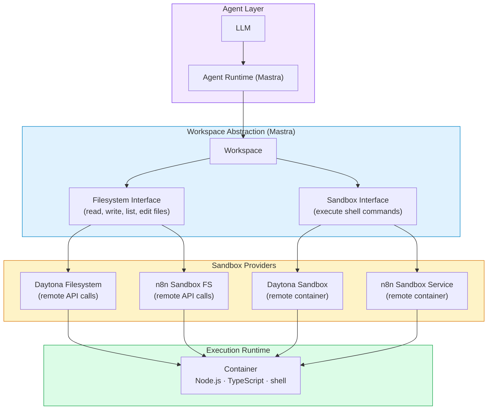
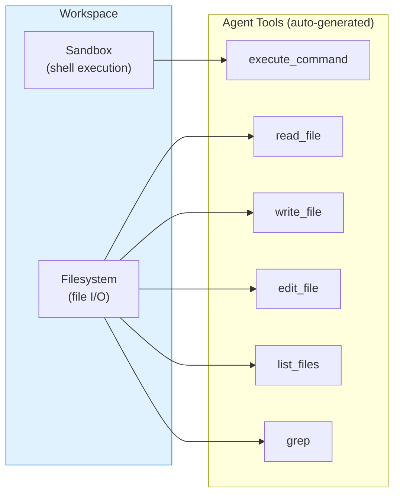
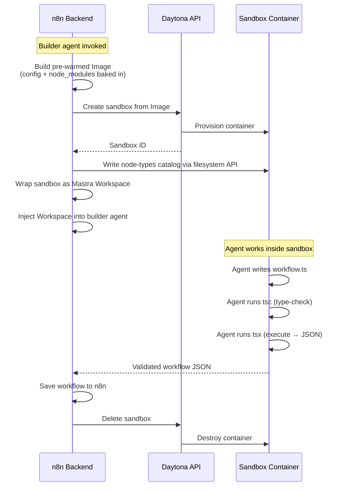
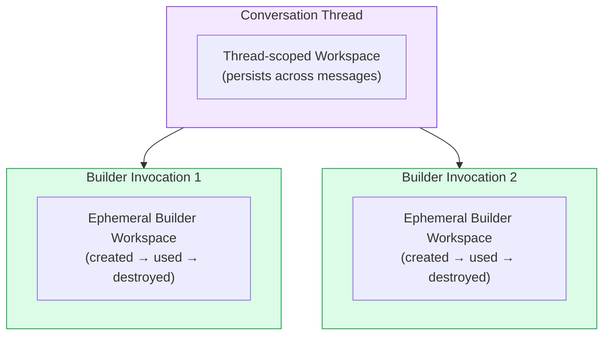
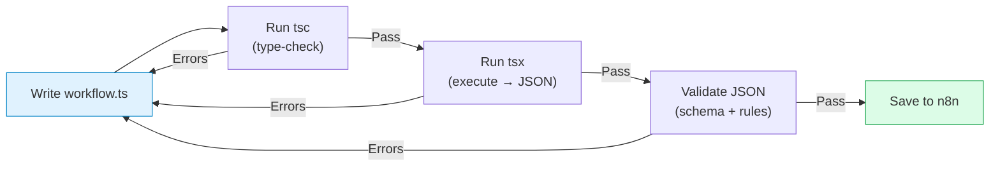

# Sandboxing in Instance AI

When the Instance AI agent builds workflows, it needs somewhere to write code, run a compiler, install packages, and execute scripts. Running all of that directly on the n8n host is risky and hard to control. Sandboxing solves this by giving the agent a dedicated, disposable environment — a workspace with its own filesystem and shell — where it can do all of that without touching the host.

Today the main consumer is the workflow builder. The agent writes TypeScript files, validates them with the TypeScript compiler, executes them to produce workflow JSON, and only saves to n8n after everything passes. Without a sandbox, workflow building is unavailable.

## How the Pieces Fit Together

There are three layers between the agent and actual code execution: a workspace abstraction from Mastra, a sandbox provider (n8n sandbox service or Daytona), and the execution runtime inside the sandbox. Here is how they relate:



The agent never talks to Daytona, the n8n sandbox service, or the host filesystem directly. It only sees the Workspace, which exposes two capabilities: a filesystem (read/write/list files) and a sandbox (run shell commands). The Workspace routes those operations to whichever provider is configured.

## Mastra Workspaces

Mastra is the agent framework that Instance AI uses. A Mastra **Workspace** is a pairing of two things:

1. **A Sandbox** — an interface for executing shell commands. It accepts a command string and returns stdout, stderr, and an exit code. Think of it as a remote terminal.
2. **A Filesystem** — an interface for file operations: read, write, list, delete, copy, move. Think of it as a remote disk.

When a Workspace is attached to an agent, Mastra automatically exposes built-in tools to the LLM: `read_file`, `write_file`, `edit_file`, `list_files`, `grep`, `execute_command`, and others. The agent uses these tools naturally in its reasoning loop — it writes a file, runs a command, reads the output, and decides what to do next.

The key design property is that the Workspace abstraction is provider-agnostic. The agent's code and prompts are identical regardless of whether the workspace is backed by n8n sandbox service or Daytona. The provider choice is purely an infrastructure decision.



## Daytona: Explicit Container Provider

Daytona is a third-party platform for creating and managing isolated sandbox environments. It runs containers on its own infrastructure (cloud-hosted or self-hosted) and exposes them through an SDK. Instance AI keeps Daytona as an explicit provider for environments that still rely on it.

### What Daytona provides

- **Isolated containers.** Each sandbox is a Linux container (Ubuntu, Node.js, Python, full shell) running independently of the n8n host. Package installs, file writes, and shell commands happen inside the container.
- **An SDK for lifecycle management.** n8n creates sandboxes, executes commands, reads/writes files, and destroys sandboxes — all through API calls. No SSH, no Docker socket.
- **Image-based provisioning.** Daytona supports pre-built images with dependencies already installed, so new sandboxes start fast without running setup scripts every time.
- **Ephemeral by design.** Sandboxes are disposable. They are created for a task and destroyed after it completes.

### How n8n uses Daytona



The process starts with a **pre-warmed image**. On first use, n8n builds a Daytona Image that includes config files and pre-installed npm dependencies. This image is cached and reused across all builder invocations, so each new sandbox starts with everything already in place.

One thing that cannot be baked into the image is the **node-types catalog** (a searchable index of all available n8n nodes). It is too large for the image build API, so it is written to each sandbox after creation via the filesystem API.

Once the sandbox is provisioned and the catalog is written, n8n wraps it in a Mastra Workspace and hands it to the builder agent. From that point, the agent works autonomously inside the sandbox — writing files, running the compiler, fixing errors, iterating — until it produces a valid workflow.

### What is inside a Daytona sandbox

| Component | Purpose |
| --- | --- |
| Ubuntu Linux | Base OS |
| Node.js (v25+) | JavaScript runtime |
| tsx | TypeScript execution without a compile step |
| npm | Package management |
| Full shell (bash) | Arbitrary command execution |
| Python | Available but not primary |

## n8n Sandbox Service: Default Provider

The n8n sandbox service exposes a simple HTTP API for creating sandboxes, executing shell commands, and manipulating files. Instance AI uses it through a custom Mastra sandbox and filesystem adapter.

This provider supports the builder's file and command workflow, but it does not expose interactive process handles. That means `execute_command` works, while process-manager-backed features such as long-lived spawned subprocesses are out of scope for this provider.

For eval CI, `n8n-containers` starts the API and runner sidecars through the shared sandbox service wrapper:

```bash
pnpm tsx packages/testing/containers/start-sandbox.ts --network n8n-eval-net
```

For local development, point `N8N_SANDBOX_SERVICE_URL` and
`N8N_SANDBOX_SERVICE_API_KEY` at a running sandbox service and enable
`N8N_INSTANCE_AI_SANDBOX_ENABLED=true`.

### Providers at a glance

| | n8n sandbox service | Daytona |
| --- | --- | --- |
| **Isolation** | Service-managed container boundary | Daytona-managed container boundary |
| **Where commands run** | Sandbox service runner via API | Remote container via Daytona API |
| **Where files live** | Sandbox service filesystem API | Daytona filesystem API |
| **Production use** | Default provider | Explicit provider |
| **Setup required** | Sandbox API + runner sidecars | Daytona account/API or proxy |

## Lifecycle

### Thread-scoped vs per-builder

There are two levels of sandbox lifecycle in the system:



- **Thread-scoped workspace.** The service can maintain a single workspace per conversation thread, reused across messages. This workspace is destroyed on server shutdown.
- **Per-builder ephemeral workspace.** Each time the workflow builder is invoked, it gets its own isolated workspace. Multiple concurrent builders in the same thread do not share a workspace. The provider sandbox is deleted after the builder finishes (best-effort).

### Pre-warmed images

In Daytona mode, creating a sandbox from scratch every time would be slow. Instead, n8n builds a Daytona Image once on first use — it includes config files, a TypeScript project setup, and pre-installed dependencies. Every builder invocation then creates a sandbox from this cached image, which starts in seconds instead of running full setup.

The image is invalidated and rebuilt if the base image changes.

## What the Builder Does Inside the Sandbox

The workflow builder uses the sandbox as an edit-compile-submit loop:



1. The agent writes TypeScript code that uses the n8n workflow SDK to define a workflow.
2. It runs the TypeScript compiler to catch type errors.
3. It executes the file to produce workflow JSON.
4. The JSON is validated against n8n's schema rules.
5. Only after all checks pass does the workflow get saved to n8n.

If any step fails, the agent reads the error output, fixes the code, and retries. This loop runs entirely inside the sandbox — the n8n host is never involved until the final save.

## Boundaries

**Sandboxing is not the filesystem service.** The sandbox gives the agent a private workspace for building workflows. The filesystem service (and gateway) gives the agent access to the user's project files on their machine. These are separate systems with different security models and do not overlap.

**Sandboxing is not a general container platform.** The sandbox exists to serve the builder's compile-and-validate loop. It is not designed for running arbitrary user workloads, long-lived services, or anything beyond the agent's build process.

**Sandboxing does not replace product safety controls.** Workflow permissions, human-in-the-loop confirmations, and domain access gating are separate systems. The sandbox provides execution isolation, not authorization.

## Configuration

| Variable | Default | What it does |
| --- | --- | --- |
| `N8N_INSTANCE_AI_SANDBOX_ENABLED` | `false` | Master switch for sandboxing |
| `N8N_INSTANCE_AI_SANDBOX_PROVIDER` | `n8n-sandbox` | Which provider to use: `n8n-sandbox` or `daytona` |
| `DAYTONA_API_URL` | — | Daytona API endpoint (required for Daytona) |
| `DAYTONA_API_KEY` | — | Daytona API key (required for Daytona) |
| `N8N_SANDBOX_SERVICE_URL` | — | n8n sandbox service URL (required for `n8n-sandbox`) |
| `N8N_SANDBOX_SERVICE_API_KEY` | — | n8n sandbox service API key (optional when using an `httpHeaderAuth` credential) |
| `N8N_INSTANCE_AI_SANDBOX_IMAGE` | `daytonaio/sandbox:0.5.0` | Base container image for Daytona |
| `N8N_INSTANCE_AI_SANDBOX_TIMEOUT` | `300000` | Command timeout in milliseconds |
| `N8N_INSTANCE_AI_SANDBOX_NAME_PREFIX` | — | Prefix for every Daytona sandbox name (e.g. `eval-baseline-daily`). Also added as a `name_prefix` label. Empty in production. |
| `N8N_INSTANCE_AI_SANDBOX_EPHEMERAL` | `false` | Create Daytona sandboxes ephemeral (auto-deleted on stop) instead of lingering stopped. Intended for throwaway eval instances so sandboxes don't accumulate. |
| `N8N_INSTANCE_AI_SANDBOX_AUTO_STOP_MINUTES` | `15` | Minutes an idle sandbox waits before Daytona stops it. `0` = disabled (stays running). |
| `N8N_INSTANCE_AI_SANDBOX_AUTO_ARCHIVE_MINUTES` | `10080` (7 days) | Minutes a stopped sandbox waits before Daytona archives it to cold storage. `0` = Daytona's max interval. |
| `N8N_INSTANCE_AI_SANDBOX_AUTO_DELETE_MINUTES` | `43200` (30 days) | Minutes a stopped sandbox waits before Daytona deletes it. Negative = disabled; `0` = on stop. Ignored when `N8N_INSTANCE_AI_SANDBOX_EPHEMERAL` is true. |
