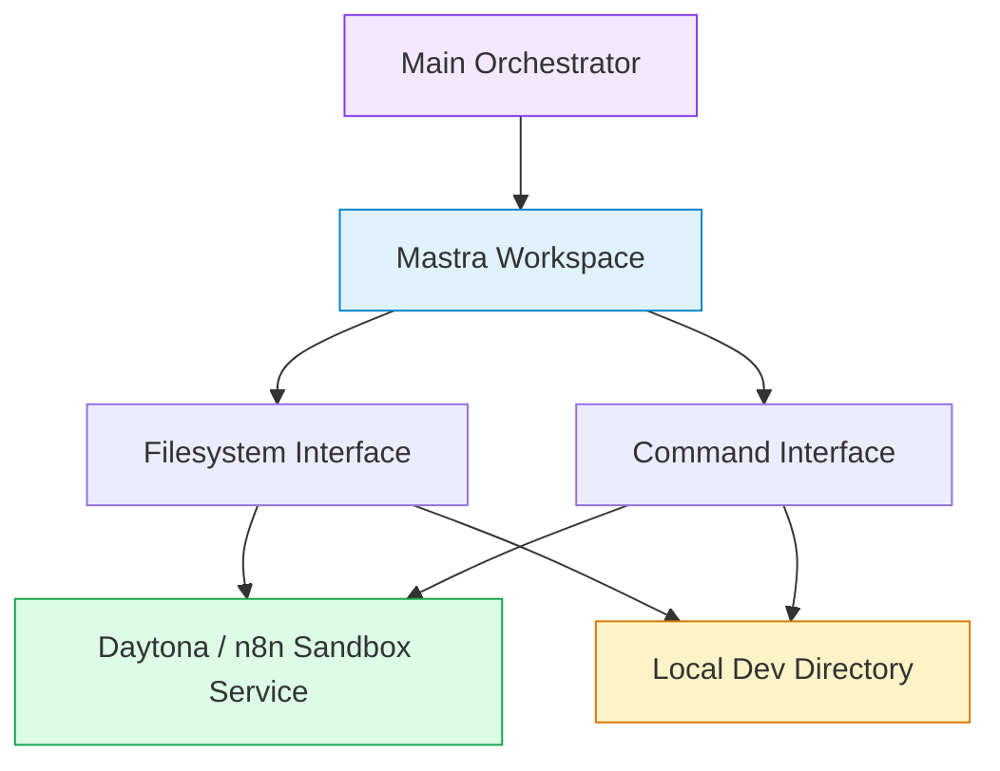

# Runtime Workspaces in Instance AI

Instance AI can optionally attach a Mastra workspace to the main orchestrator.
That workspace gives the agent a private filesystem plus command execution
through a configured provider: Daytona, the n8n sandbox service, or a local
development directory.

Workflow building does not use a separate sandbox builder anymore. Workflow
creation and edits load the `workflow-builder` skill and call
`workflows(action="create"|"update")` directly from the orchestrator. The
runtime workspace remains useful for workspace-backed skills and local
command/file capabilities when the instance administrator enables it.

## How the Pieces Fit Together

The agent never talks to Daytona, the n8n sandbox service, or host filesystem
APIs directly. It sees only the workspace abstraction. The provider is an
infrastructure detail.

## Providers

**Daytona** creates isolated containers through the Daytona SDK. Files and shell
commands run in the remote container, not on the n8n host.

**n8n sandbox service** exposes compatible filesystem and command APIs through a
remote service.

**Local** runs commands and writes files under a host directory for development.
It has no isolation and is blocked in production builds.

## Boundaries

**Runtime workspaces are not the filesystem gateway.** The workspace is a
private agent scratch area. The filesystem gateway gives the agent explicit
access to user machine files and has a separate security model.

**Runtime workspaces are not workflow-builder execution.** The workflow-builder
skill produces SDK code and saves through `workflows(action="create"|"update")`;
it does not use a submit step.

**Runtime workspaces do not replace product safety controls.** Workflow
permissions, human-in-the-loop confirmations, and domain access gating remain
separate authorization layers.

## Configuration

| Variable | Default | What it does |
| --- | --- | --- |
| `N8N_INSTANCE_AI_SANDBOX_ENABLED` | `false` | Master switch for runtime workspaces |
| `N8N_INSTANCE_AI_SANDBOX_PROVIDER` | `daytona` | Which provider to use: `daytona`, `n8n-sandbox`, or `local` |
| `DAYTONA_API_URL` | unset | Daytona API endpoint (required for Daytona) |
| `DAYTONA_API_KEY` | unset | Daytona API key (required for Daytona) |
| `N8N_SANDBOX_SERVICE_URL` | unset | n8n sandbox service URL (required for `n8n-sandbox`) |
| `N8N_SANDBOX_SERVICE_API_KEY` | unset | n8n sandbox service API key |
| `N8N_INSTANCE_AI_SANDBOX_IMAGE` | `daytonaio/sandbox:0.5.0` | Base container image for Daytona |
| `N8N_INSTANCE_AI_SANDBOX_TIMEOUT` | `300000` | Command timeout in milliseconds |
| `N8N_INSTANCE_AI_SANDBOX_NAME_PREFIX` | unset | Prefix for Daytona sandbox names and labels |
