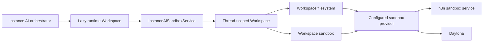

# Sandboxing in Instance AI

Instance AI uses a remote sandbox workspace to build workflows from
`@n8n/workflow-sdk` source. The sandbox keeps file writes and command execution
off the n8n host. Workflow building is unavailable when sandboxing is disabled.

Agent building is separate. `build-agent` delegates to
`AgentsBuilderService` in the agents module and does not use the Instance AI
sandbox.

## Architecture


```mermaid
graph LR
    Agent[Instance AI orchestrator] --> Lazy[Lazy runtime Workspace]
    Lazy --> Service[InstanceAiSandboxService]
    Service --> Shared[Thread-scoped Workspace]
    Shared --> FS[Workspace filesystem]
    Shared --> Cmd[Workspace sandbox]
    FS --> Provider[Configured sandbox provider]
    Cmd --> Provider
    Provider --> N8n[n8n sandbox service]
    Provider --> Daytona[Daytona]
```

`@n8n/agents` supplies the `Workspace`, filesystem, and sandbox abstractions.
`@n8n/instance-ai` supplies setup and workflow compilation. The CLI module
selects credentials, creates the provider configuration, and owns the
thread-scoped lifecycle.

The runtime attaches a lazy workspace to the orchestrator. The remote sandbox
is created only when the agent first uses a workspace capability. Instance AI
exposes this core workspace tool set:

- `workspace_read_file`
- `workspace_read_tool_result`
- `workspace_write_file`
- `workspace_str_replace_file`
- `workspace_execute_command`

The underlying `Workspace` supports more filesystem operations. The lazy
runtime filters the model-facing set to `CORE_WORKSPACE_TOOL_NAMES`.

## Providers

### n8n sandbox service

`n8n-sandbox` is the default provider. The service manages remote sandbox
containers through its HTTP API. Instance AI assigns each thread a stable
UUIDv5 sandbox ID. A process can derive the same ID after a restart or on
another main.

The provider supports file operations and command execution. It does not need
an interactive process API for the workflow build path.

`N8N_INSTANCE_AI_SANDBOX_EPHEMERAL=true` asks the service to delete a sandbox
once it goes idle instead of stopping it. Ephemeral mode is optional and is
disabled by default.

### Daytona

`daytona` is the explicit alternate provider. Instance AI assigns each thread
a deterministic name and labels. Direct mode resolves a Daytona API key from
admin settings or environment variables. Proxy mode gets short-lived provider
tokens from the managed AI service.

In direct mode, Instance AI builds from the configured image. The default image
is `daytonaio/sandbox:0.5.0`. In proxy mode, it uses an explicit snapshot or the
versioned snapshot `n8n/instance-ai:<n8nVersion>`. Proxy mode cannot upload an
image-build context. A missing or unusable snapshot therefore fails sandbox
creation.

Daytona lifecycle values control auto-stop, auto-archive, and auto-delete.
`N8N_INSTANCE_AI_SANDBOX_EPHEMERAL=true` asks Daytona to delete a sandbox when
it stops, which supersedes the auto-delete interval.

## Thread-Scoped Lifecycle

Each conversation thread has one shared remote sandbox and workspace.

1. A workspace tool or workflow build requests the lazy workspace.
2. `InstanceAiSandboxService` resolves the current provider configuration.
3. The service reuses a matching cached entry or creates the deterministic
   thread sandbox.
4. The service initializes the workspace once.
5. Runs and background tasks in the same thread reuse the entry.
6. Idle cache expiry removes only the in-process entry.
7. A later use can reattach to the same provider sandbox by its deterministic
   identity.

The cache TTL defaults to 15 minutes. Active runs, suspended runs, and running
background tasks keep the entry alive. A TTL of `0` disables this cache
eviction.

Cache eviction does not destroy the remote sandbox. Daytona reclaims remote
state through its configured lifecycle. Remote reclamation for the n8n sandbox
service is governed by that service's deployment policy, outside Instance AI.

Explicit thread cleanup destroys a cached workspace. If no cache entry exists,
the service can recompute and delete an n8n-sandbox ID. An uncached Daytona
sandbox is left to Daytona lifecycle management.

Service shutdown stops local expiry timers but deliberately leaves remote
sandboxes available for a restarted process to reuse.

Settings changes invalidate the in-process cache. In-flight users retain the
entry that they already resolved.

## Workspace Initialization

Initialization is lazy and idempotent. A marker file prevents repeated base
setup. Knowledge-base content is refreshed when an existing sandbox is
reattached. The setup creates or materializes:

| Path | Purpose |
|------|---------|
| `package.json` | Pinned `@n8n/workflow-sdk`, `tsx`, and Node type dependencies in normal mode |
| `tsconfig.json` | Strict TypeScript configuration |
| `build.mjs` | Workflow SDK execution and JSON conversion |
| `node-types/index.txt` | Searchable node-type catalog |
| `src/` | Workflow source files |
| `chunks/` | Reusable source modules |
| `knowledge-base/` | Best-practice, template, and SDK reference material |
| `.sandbox-initialized` | Setup marker |

The Daytona image or versioned snapshot includes the stable workspace files
and installed dependencies. The node-type catalog is written after sandbox
creation because it is instance-specific and too large for the Daytona image
request.

When `N8N_INSTANCE_AI_SANDBOX_LINK_SDK` is enabled for local development,
Instance AI packs and installs the local `@n8n/utils`, `n8n-workflow`, and
`@n8n/workflow-sdk` packages. Build those packages before starting a new
thread.

## Workflow Build Path

The `build-workflow` tool reads TypeScript (`.ts` or `.tsx`) or WorkflowJSON
(`.json`) from the runtime workspace. The conventional filenames are
`.workflow.ts` and `.workflow.json`.

For TypeScript source, `compileWorkflowSource()` copies or resolves the source
inside the workspace and runs:

```text
node --import tsx build.mjs <source-file>
```

`build.mjs` imports the default workflow, calls `validate()`, converts it with
`toJSON({ tidyUp: true })`, and returns declared pin-data fixtures when present.
The tool then performs server-side workflow validation, resolves credentials,
and saves the workflow through the backend service.

For WorkflowJSON source, the tool parses the JSON directly and then applies the
same server-side save controls. There is no host-side TypeScript build fallback
when the sandbox is unavailable.

## Boundaries

The runtime sandbox is not the local Computer Use gateway. The sandbox is a
private provider workspace for Instance AI. The local gateway exposes tools on
the user's machine under daemon permissions.

Sandbox isolation does not grant product authorization. Backend services still
apply RBAC, project scope, session grants, and HITL confirmation rules.

The workspace is for Instance AI build and runtime-skill work. It is not a
general user workload platform.

## Tracing

Sandbox operations use the active Instance AI trace. Each span inherits the
thread metadata. The sandbox does not retain a turn's trace handle. Skill
preparation runs inside the agent's lazy build and uses the same trace context.

| Operation | Trace data |
|-----------|------------|
| Acquire and start | Provider, sandbox ID, cached reuse, shared acquisition, duration, and errors |
| Initialize workspace | Marker check, node catalog, base files, dependency installation, and optional SDK linking |
| Sync skills and knowledge base | Bundle hash, file counts, byte counts, reuse or upload, and manifest check result |
| Read, write, and edit files | File operations under the existing tool span, paths, byte counts, and errors |
| Execute commands and compile workflows | Command size, exit code, timeout or cancellation, compile result, and bounded diagnostics |
| Retry and fallback | File path, failed attempt, retry delay, and command fallback |
| Evict cache and destroy | Reason, provider, sandbox ID, and cleanup errors |

Batch operations reject on the first failure. Their spans end at that point.
Transfers that already started can continue. Batch spans omit individual successful
file operations. Retry and fallback spans remain visible. Internal file spans
omit file contents. Command spans record byte counts instead of raw commands. Failed
commands include stdout and stderr after filtering, limited to 2,000 characters
each. The export filter also covers status messages and exception events.
Nonzero exit codes are command results and do not mark command spans as errors.
Timeouts, killed commands, and thrown execution errors still mark spans as errors.

Cache eviction keeps the remote sandbox. Its trace records the time of eviction.
Uncached cleanup checks the provider before creating a trace. Disabled sandboxing
and uncached Daytona sandboxes require no cleanup trace.
Cleanup between turns creates an internal operation trace with the same
`thread_id`. These sandbox lifecycle traces use the normal LangSmith settings.
They do not require `N8N_INSTANCE_AI_TRACE_INTERNAL`. Proxy deployments resolve
fresh trace configuration for cleanup. Cleanup requests carry the owner ID so
other processes can trace cleanup after the thread row is deleted. Timers create
detached traces even when they inherit an earlier turn context. Trace setup and
finalization each have a one-second deadline. Trace failures do not change
sandbox results or prevent cleanup. Operations still open when a turn closes
end with a cancelled status; their underlying work can finish independently.

Provider-side automatic stop and deletion are not reported. They require
provider notifications or polling.

## Configuration

| Variable | Default | Purpose |
|----------|---------|---------|
| `N8N_INSTANCE_AI_SANDBOX_ENABLED` | `false` | Enable the sandbox-backed workspace |
| `N8N_INSTANCE_AI_SANDBOX_PROVIDER` | `n8n-sandbox` | Select `n8n-sandbox` or `daytona` |
| `N8N_SANDBOX_SERVICE_URL` | empty | n8n sandbox service URL |
| `N8N_SANDBOX_SERVICE_API_KEY` | empty | n8n sandbox service API key |
| `DAYTONA_API_URL` | empty | Daytona API URL |
| `DAYTONA_API_KEY` | empty | Daytona API key for direct mode |
| `N8N_INSTANCE_AI_SANDBOX_IMAGE` | `daytonaio/sandbox:0.5.0` | Daytona base image |
| `N8N_INSTANCE_AI_SANDBOX_SNAPSHOT` | empty | Daytona proxy snapshot override |
| `N8N_INSTANCE_AI_SANDBOX_TIMEOUT` | `300000` | Default command timeout in milliseconds |
| `N8N_INSTANCE_AI_BUILDER_SANDBOX_TTL_MS` | `900000` | In-process idle cache TTL; `0` disables eviction |
| `N8N_INSTANCE_AI_SANDBOX_NAME_PREFIX` | empty | Prefix and label for Daytona names |
| `N8N_INSTANCE_AI_SANDBOX_EPHEMERAL` | `false` | Delete the sandbox once idle instead of stopping it |
| `N8N_INSTANCE_AI_SANDBOX_AUTO_STOP_MINUTES` | `15` | Daytona idle time before stop; `0` disables auto-stop |
| `N8N_INSTANCE_AI_SANDBOX_AUTO_ARCHIVE_MINUTES` | `60` | Daytona stopped time before archive; `0` uses its maximum |
| `N8N_INSTANCE_AI_SANDBOX_AUTO_DELETE_MINUTES` | `10080` | Daytona stopped time before delete; negative disables and `0` deletes on stop |
| `N8N_INSTANCE_AI_DAYTONA_TOKEN_REFRESH_SKEW_MS` | `300000` | Proxy-token refresh skew |
| `N8N_INSTANCE_AI_SANDBOX_LINK_SDK` | `false` | Install local workspace packages for development |

See [Configuration](configuration.md) for the complete environment reference.
