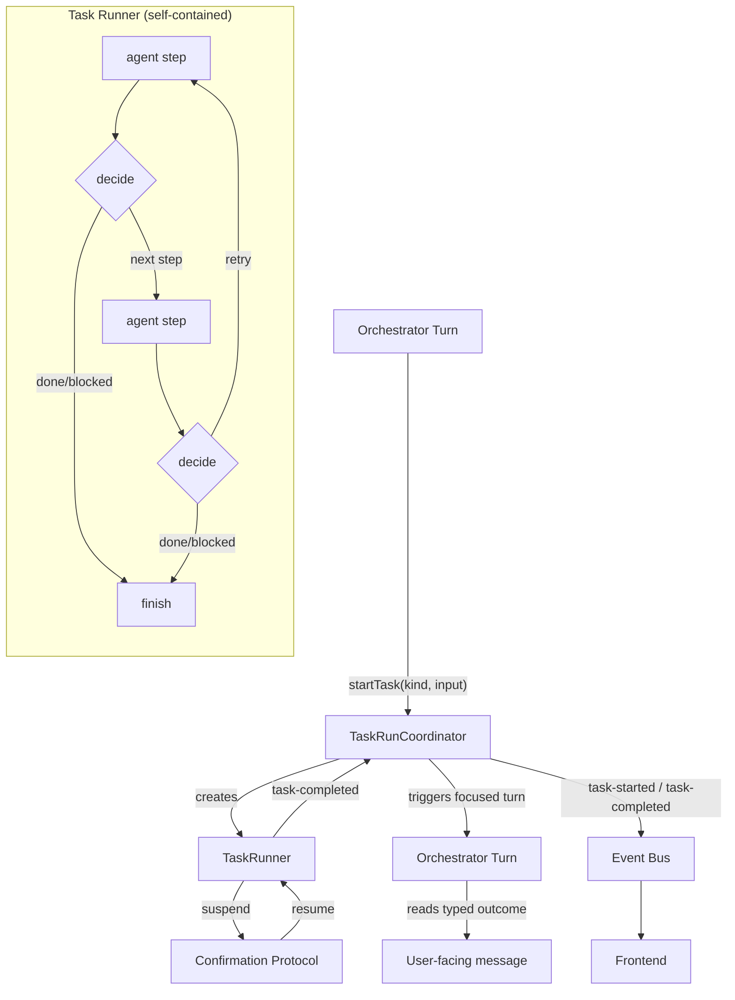

# Spec: Task Runner

## Problem

Background tasks (build, verify, repair, data-table management, research) are
driven by the orchestrator's chat turns. The deterministic workflow-loop
controller decides what should happen next, but it encodes that decision as
English guidance text injected into the next prompt and hopes the LLM follows
it. Each state transition requires a full orchestrator turn: memory load, agent
creation, LLM roundtrip, compaction. The auto-follow-up mechanism
(`AUTO_FOLLOW_UP_MESSAGE`, chain depth, message enrichment) exists solely to
bridge the gap between a state machine and an LLM chat loop.

This applies to all background task types, not just workflow building. Any task
that outlives an orchestrator turn currently relies on the same follow-up
machinery to deliver results.

## Goal

Replace `BackgroundTaskManager` with a `TaskRunCoordinator` that executes tasks
as self-contained runs. Each task kind defines its own step graph. Deterministic
transitions run directly; the LLM is only invoked for leaf work. When a task
completes, the coordinator triggers a focused orchestrator turn so the
orchestrator can synthesize a user-facing message from the typed outcome.

## Concepts

### Task Run

A long-running unit of work scoped to a thread. Has its own lifecycle
(running → suspended → completed | failed | cancelled) independent of
orchestrator turns. One thread can have multiple concurrent task runs (up to the
existing per-thread limit).

```typescript
interface TaskRun {
  taskId: string;
  threadId: string;
  runId: string;        // originating orchestrator runId
  kind: TaskKind;
  status: 'running' | 'suspended' | 'completed' | 'failed' | 'cancelled';
  agentId: string;
  workItemId?: string;  // workflow-loop tracking
  startedAt: number;
  outcome?: TaskOutcome;
}

type TaskKind = 'build-workflow' | 'manage-data-tables' | 'research';
```

### Task Outcome

Typed result from a completed task. Replaces the untyped `result: string` +
`outcome?: Record<string, unknown>` on `ManagedBackgroundTask`.

```typescript
type TaskOutcome =
  | WorkflowBuildTaskOutcome
  | DataTableTaskOutcome
  | ResearchTaskOutcome;

interface WorkflowBuildTaskOutcome {
  kind: 'build-workflow';
  workflowId?: string;
  status: 'ready' | 'needs_credentials' | 'blocked';
  mockedCredentialTypes?: string[];
  summary: string;
}

interface DataTableTaskOutcome {
  kind: 'manage-data-tables';
  summary: string;
}

interface ResearchTaskOutcome {
  kind: 'research';
  summary: string;
}
```

### Task Runner

Executes a task's internal step graph. Each task kind has its own runner with a
kind-specific step sequence.

**`build-workflow` steps:**

```
build → decide → verify → decide-repair → [rebuild|patch → decide → ...] → finish
```

**`manage-data-tables` steps:**

```
run-agent → finish
```

**`research` steps:**

```
run-agent → finish
```

The `decide` and `decide-repair` steps are the existing pure functions
(`handleBuildOutcome`, `handleVerificationVerdict`). They route to the next
step directly — no LLM, no guidance text, no orchestrator turn.

The `build`, `verify`, `rebuild`/`patch`, and `run-agent` steps invoke LLM
agents via `executeResumableStream`. When HITL is needed (credentials, domain
access), the task suspends and resumes via the existing confirmation protocol.

## Architecture



### Components

**`TaskRunCoordinator`** (replaces `BackgroundTaskManager`)

Responsibilities:
- Start / cancel / resume task runs
- Track live task handles per thread
- Enforce concurrency limits
- Publish task lifecycle events (`task-started`, `task-completed`,
  `task-failed`, `task-cancelled`)
- Expose task snapshots for `getThreadStatus()`
- **Trigger a focused orchestrator turn** when a task completes, so the
  orchestrator can read the typed outcome and generate a user-facing message

Does NOT do:
- Chain depth tracking (tasks loop internally, not via follow-ups)
- Message enrichment (outcomes are typed, not text injected into prompts)
- Guidance formatting (the runner routes directly, no English intermediary)

**`TaskRunner`** (interface, in `@n8n/instance-ai`)

```typescript
interface TaskRunner {
  run(signal: AbortSignal): Promise<TaskOutcome>;
}
```

Each task kind has its own implementation:
- `WorkflowBuildTaskRunner` — build/verify/repair step graph
- `DataTableTaskRunner` — single agent run
- `ResearchTaskRunner` — single agent run

**`WorkflowBuildTaskRunner`** (new, in `@n8n/instance-ai`)

Executes the build/verify/repair step graph for a single work item.

```typescript
interface WorkflowBuildTaskRunnerOptions {
  workItemId: string;
  threadId: string;
  briefing: string;
  workflowId?: string;        // modify existing
  modelId: ModelConfig;
  domainContext: InstanceAiContext;
  orchestrationContext: OrchestrationContext;
  eventBus: InstanceAiEventBus;
  storage: WorkflowLoopStorage;
  signal: AbortSignal;
}
```

Internally, the runner:

1. **Build step** — creates a builder sub-agent, streams via
   `executeResumableStream` (auto mode), extracts `WorkflowBuildOutcome`
2. **Decide step** — calls `handleBuildOutcome()` (pure function)
   - `verify` → go to step 3
   - `done` → go to step 6
   - `blocked` → go to step 6
3. **Verify step** — runs the workflow via `executionService.run()`, optionally
   invokes a debug agent if execution fails
4. **Decide-repair step** — calls `handleVerificationVerdict()` (pure function)
   - `done` → go to step 6
   - `rebuild` / `patch` → go to step 1 (bounded by existing retry policy:
     max 1 repair per unique failure signature)
   - `blocked` → go to step 6
5. **HITL suspend** — when credentials or domain access needed, suspends the
   task via `executeResumableStream`'s auto-resume control. The existing
   `confirmation-request` / `POST /confirm` protocol handles user input.
6. **Finish** — returns typed `WorkflowBuildTaskOutcome`

The runner reuses:
- `executeResumableStream` for streaming agent work
- `handleBuildOutcome` / `handleVerificationVerdict` for routing
- `WorkflowLoopStorage` for persisting state between steps
- `consumeStreamWithHitl` for sub-agent HITL (inside build/verify steps)
- The existing sub-agent factory and tool registry

### Event Protocol

New events (additions to existing `InstanceAiEvent` union):

```typescript
// Task started — frontend adds task to activity panel
{
  type: 'task-started',
  runId: string,
  agentId: string,
  payload: {
    taskId: string,
    kind: TaskKind,
    workItemId?: string,
  }
}

// Task completed — frontend shows result, orchestrator turn follows
{
  type: 'task-completed',
  runId: string,
  agentId: string,
  payload: {
    taskId: string,
    outcome: TaskOutcome,
  }
}

// Task failed
{
  type: 'task-failed',
  runId: string,
  agentId: string,
  payload: {
    taskId: string,
    error: string,
  }
}
```

Existing `agent-spawned` / `agent-completed` / `text-delta` / `tool-call` /
`tool-result` events continue to be published by the sub-agents running inside
task steps — the frontend renders them in the agent tree as today.

### Orchestrator Integration

The orchestrator tool changes from:

```typescript
// Today: build-workflow-with-agent spawns a background task
context.spawnBackgroundTask({
  run: async (signal, drainCorrections) => { /* run builder agent */ },
  ...
});
return { result: 'Task started, ID: build-XXXXXX' };
```

To:

```typescript
// After: tool starts a task via coordinator
context.startTask({
  kind: 'build-workflow',
  workItemId,
  briefing,
  workflowId,
});
return { result: 'Task started, ID: build-XXXXXX' };
```

The orchestrator turn ends immediately. The task runner picks up from there.

### Task Completion → UI Surfacing

Task completions surface as **structured events**, not assistant messages. The
coordinator publishes a `task-completed` (or `task-failed`) event with the typed
outcome. The frontend renders this directly — a completion card, status update,
or inline result — without an orchestrator turn.

The orchestrator only gets a new turn when the outcome **requires reasoning**:
- The task needs user input (credentials, configuration choice)
- The task is blocked with an ambiguous reason that needs explanation
- Multiple tasks completed and the orchestrator needs to coordinate next steps
- The user sends a follow-up message (natural conversational flow)

This is a deliberate decision: most task completions are self-explanatory
("workflow built and verified", "data table updated", "research complete").
Generating an assistant message for each one adds latency and cost without
value.

| Aspect | Today | After |
|---|---|---|
| **Trigger** | Any background task completion triggers auto-follow-up | Structured event published; orchestrator turn only when reasoning needed |
| **Simple completion** | Full orchestrator turn: memory load → LLM roundtrip → "Your workflow is ready!" | `task-completed` event → frontend renders completion card instantly |
| **Needs user input** | Same full turn, but LLM also calls setup-credentials tool | Coordinator triggers focused orchestrator turn with typed context |
| **Chaining** | Follow-up → new task → follow-up → chain depth limit | No chaining. Task events are terminal. New tasks require deliberate action |
| **Cost** | Every completion costs a full LLM roundtrip | Zero LLM cost for simple completions; minimal cost for complex ones |

**When the orchestrator does get a turn**, the prompt contains the typed
`TaskOutcome` — not `<background-tasks>` XML with English guidance. The
orchestrator reads structured data and responds, typically without tool calls.

```
A task requires your attention.

Task: build-workflow (task-id: build-XXXXXX)
Status: needs_credentials
Workflow ID: wf-123
Mocked credential types: slackOAuth2Api, openWeatherMapApi
Summary: Workflow built and verified with mock data.

Help the user set up real credentials.
```

### Frontend Rendering of Task Events

The frontend renders `task-completed` events as inline cards in the thread:

```
┌─────────────────────────────────────────────┐
│ ✓ Workflow built and verified               │
│   "Weather to Slack" — 4 nodes              │
│   [View workflow →]                         │
└─────────────────────────────────────────────┘
```

For `task-failed`:

```
┌─────────────────────────────────────────────┐
│ ✗ Workflow build failed                     │
│   Could not resolve credentials for Slack.  │
│   [Details ↓]                               │
└─────────────────────────────────────────────┘
```

These cards are rendered from the typed `TaskOutcome` payload, not from LLM
text. They appear in the thread timeline alongside assistant messages.

## What Gets Removed

Once all task types go through the runner:

| Current code | Status |
|---|---|
| `BackgroundTaskManager` | Replaced by `TaskRunCoordinator` |
| `AUTO_FOLLOW_UP_MESSAGE` sentinel | Removed — coordinator triggers focused turns directly |
| `enrichMessageWithBackgroundTasks()` | Removed — outcomes are typed, not text-injected |
| `formatWorkflowLoopGuidance()` | Removed — runner routes directly, no English intermediary |
| `chainDepth` / `maxAutoFollowUpDepth` | Removed — tasks loop internally, not via follow-up chains |
| `messageGroupId` stitching across follow-up runs | Removed — one task = one lifecycle |
| `buildMessageWithBackgroundTasks()` in service | Removed |
| `WorkflowTaskCoordinator.formatCompletedTaskMessage()` | Removed — replaced by typed outcome |

## What Stays

| Current code | Why |
|---|---|
| `WorkflowLoopController` (`handleBuildOutcome`, `handleVerificationVerdict`) | Used as-is inside runner steps — pure functions, no changes needed |
| `WorkflowLoopStorage` | Runner persists state between steps for crash recovery and UI projection |
| `executeResumableStream` | Used by runner steps for agent streaming + HITL |
| `RunStateRegistry` | Still manages the orchestrator's own run state (conversational turns) |
| Confirmation protocol | HITL suspend/resume inside task steps uses the same `confirmation-request` → `POST /confirm` flow |
| `consumeStreamWithHitl` | Used inside runner steps for sub-agent HITL |

## Migration Strategy

### Phase 1: TaskRunCoordinator + build-workflow runner

- Implement `TaskRunCoordinator` with start/cancel/resume/snapshot API
- Implement `WorkflowBuildTaskRunner` with the build/verify/repair step graph
- Add `task-started` / `task-completed` / `task-failed` events to the protocol
- Wire `build-workflow-with-agent` tool to use `context.startTask()` instead of
  `context.spawnBackgroundTask()`
- Coordinator triggers focused orchestrator turn on completion
- Keep `BackgroundTaskManager` alive — coordinator can wrap it internally or
  run alongside for transition safety
- Frontend treats `task-completed` events alongside existing `agent-completed`

### Phase 2: Migrate remaining task kinds

- Implement `DataTableTaskRunner` (single agent run → outcome)
- Implement `ResearchTaskRunner` (single agent run → outcome)
- Wire `manage-data-tables-with-agent` and `research-with-agent` tools to use
  `context.startTask()`
- All background work now goes through the coordinator

### Phase 3: Remove old machinery

- Remove `BackgroundTaskManager`
- Remove `AUTO_FOLLOW_UP_MESSAGE` code path
- Remove `enrichMessageWithBackgroundTasks`
- Remove `formatWorkflowLoopGuidance`
- Remove `chainDepth` / `maxAutoFollowUpDepth`
- Remove `messageGroupId` stitching logic
- Remove `WorkflowTaskCoordinator.formatCompletedTaskMessage()`

## Invariants

1. **Simple completions don't need the orchestrator** — `task-completed` events
   carry enough typed data for the frontend to render a result card directly.
   The orchestrator only gets a turn when the outcome requires reasoning
   (user input, ambiguous block, multi-task coordination).

2. **One repair per failure signature** — the runner enforces the same retry
   policy as the current controller. If a rebuild produces the same failure
   signature, the task transitions to `blocked`.

3. **Bounded step count** — the step graph has finite paths. Build → verify →
   repair → verify → done/blocked. No unbounded loops.

4. **HITL works the same** — the user sees the same confirmation cards and
   responds via the same `POST /confirm` endpoint. The task suspends and
   resumes transparently.

5. **Frontend backward-compatible** — existing `agent-spawned`, `tool-call`,
   etc. events continue to flow. The new `task-*` events are additive.

6. **Thread status stable** — `getThreadStatus()` returns task runs in the
   `backgroundTasks` array with the same shape.

7. **No chaining** — task completion is terminal. Simple outcomes render as
   frontend cards. Complex outcomes may trigger one orchestrator turn, but that
   turn does not automatically spawn follow-up tasks. New tasks require
   deliberate orchestrator or user action.

## Test Plan

### Unit: WorkflowBuildTaskRunner

- Build succeeds, no verify needed (trigger-only) → outcome `status: 'ready'`
- Build succeeds, verify passes → outcome `status: 'ready'`
- Build succeeds, verify fails, rebuild succeeds, verify passes → two build
  steps, one repair, final outcome `status: 'ready'`
- Build succeeds, verify fails, rebuild fails with same signature → outcome
  `status: 'blocked'`
- Build succeeds, verify passes, mocked credentials → outcome
  `status: 'needs_credentials'` with `mockedCredentialTypes`
- Build needs credentials → task suspends, resume with credential data →
  task continues
- Task cancelled mid-build → runner throws, sub-agent aborted
- Task cancelled during HITL wait → runner throws, confirmation resolved
  with `{ approved: false }`

### Unit: DataTableTaskRunner / ResearchTaskRunner

- Agent completes → outcome with summary
- Agent fails → runner throws with error
- Task cancelled → runner throws, agent aborted

### Unit: TaskRunCoordinator

- Start task, track, cancel → correct lifecycle events published
- Concurrency limit → reject with error event
- Multiple concurrent tasks on same thread → independent lifecycles
- Simple task completes → `task-completed` event published, no orchestrator turn
- Task completes with `needs_credentials` → orchestrator turn triggered
- Task fails → `task-failed` event published; orchestrator turn triggered if
  user context needed
- Thread shutdown → all tasks cancelled

### Integration

- User asks to build a workflow → task runs through build/verify/done →
  `task-completed` event rendered as card in thread. No
  `AUTO_FOLLOW_UP_MESSAGE`, no orchestrator turn.
- Workflow verified with mocked credentials → `task-completed` with
  `status: 'needs_credentials'` → orchestrator turn triggered → orchestrator
  helps user set up real credentials
- Workflow needs credentials mid-build → task suspends → user provides
  credentials → task resumes and completes
- User cancels during verify step → clean cancellation, consistent thread
  status
- Agent tree snapshot captures task's sub-agent hierarchy correctly across
  build and verify steps
- Session restore shows task status and sub-agent activity
- Two concurrent tasks on same thread complete independently, each triggers
  its own orchestrator turn
