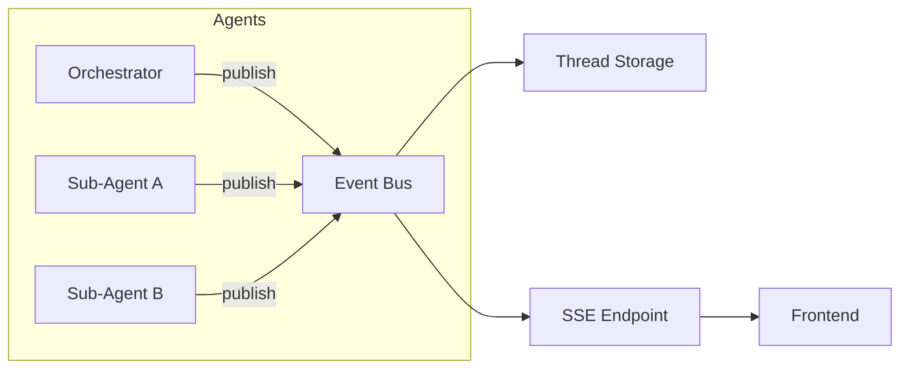

# Streaming Protocol

## Overview

Instance AI uses a pub/sub event bus to deliver agent events to the frontend
in real-time. All agents — the orchestrator and dynamically spawned sub-agents —
publish events to a per-thread channel. The frontend subscribes independently
via SSE.

The protocol is designed for minimal time-to-first-token, progressive rendering
of multi-agent activity, and resilient reconnection.

## Transport

### Sending Messages

- **Endpoint**: `POST /instance-ai/chat/:threadId`
- **Request body**: `{ "message": "user's message" }`
- **Response**: `{ "runId": "run_abc123" }`
- **Concurrency**: One active run per thread. A second POST for the same thread
  while a run is active is rejected (`409 Conflict`).

The POST kicks off the orchestrator. Events are delivered via the SSE endpoint,
not the POST response.

### Receiving Events

- **Endpoint**: `GET /instance-ai/events/:threadId`
- **Format**: Server-Sent Events (SSE)
- **Reconnect**: `Last-Event-ID` header (auto-reconnect) or `?lastEventId`
  query parameter (manual reconnect) replays missed events from storage

### SSE Headers

```
Content-Type: text/event-stream
Cache-Control: no-cache
Connection: keep-alive
X-Accel-Buffering: no
```

`X-Accel-Buffering: no` disables nginx/reverse proxy buffering so events are
delivered immediately.

### SSE Event IDs

Each SSE frame includes an `id:` field generated by the server:

```text
id: 42
data: {"type":"text-delta","runId":"run_abc","agentId":"agent-001","payload":{"text":"..."}}
```

Event IDs are monotonically increasing integers per thread channel and unique
within that thread.

## Event Schema

Every event follows this schema:

```typescript
{
  type: string;        // event type
  runId: string;       // correlates all events in a single message → response cycle
  agentId: string;     // agent this event is attributed to in the UI
  payload?: object;    // event-specific data
}
```

The `runId` correlates all events belonging to one user message → assistant
response cycle. It is returned by the POST endpoint and carried on every event.

The `agentId` identifies which agent branch (orchestrator or sub-agent) the
event belongs to. The frontend uses this to render an agent activity tree.

For the full TypeScript type definitions, see
`@n8n/api-types` — `instanceAiEventSchema` in `schemas/instance-ai.schema.ts`.

## Event Types

### `run-start`

The orchestrator has started processing a user message. Always the first
event in a run.

```json
{
  "type": "run-start",
  "runId": "run_abc123",
  "agentId": "agent-001",
  "payload": {
    "messageId": "msg_xyz"
  }
}
```

The `agentId` on this event identifies the orchestrator — the frontend uses
this as the root of the agent activity tree.

### `text-delta`

Incremental text from an agent's response.

```json
{"type":"text-delta","runId":"run_abc123","agentId":"agent-001","payload":{"text":"You have 3 active workflows."}}
```

The frontend appends `payload.text` to the agent's current message content.

### `reasoning-delta`

Incremental reasoning/thinking from an agent. Always streamed to the frontend
when the model produces it — this gives users visibility into the agent's
decision-making and supports faster iteration.

```json
{"type":"reasoning-delta","runId":"run_abc123","agentId":"agent-001","payload":{"text":"Let me check the workflow list..."}}
```

**Policy**: Reasoning is always shown to the user (ADR-012). Not all models emit
reasoning tokens; when a model doesn't support it, no `reasoning-delta` events
are sent. The frontend should handle the absence gracefully.

### `tool-call`

An agent is invoking a tool. Sent before the tool executes.

```json
{
  "type": "tool-call",
  "runId": "run_abc123",
  "agentId": "agent-001",
  "payload": {
    "toolCallId": "tc_abc123",
    "toolName": "list-workflows",
    "args": {"limit": 10}
  }
}
```

The frontend adds a new entry to the agent's `toolCalls` with `isLoading: true`.

### `tool-result`

A tool has completed successfully.

```json
{
  "type": "tool-result",
  "runId": "run_abc123",
  "agentId": "agent-001",
  "payload": {
    "toolCallId": "tc_abc123",
    "result": {"workflows": [{"id": "1", "name": "My Workflow", "active": true}]}
  }
}
```

The frontend updates the matching `toolCall` entry: sets `result` and
`isLoading: false`.

### `tool-error`

A tool has failed.

```json
{
  "type": "tool-error",
  "runId": "run_abc123",
  "agentId": "agent-001",
  "payload": {
    "toolCallId": "tc_abc123",
    "error": "Workflow not found"
  }
}
```

### `agent-spawned`

The orchestrator has created a new sub-agent via the `delegate` tool.

```json
{
  "type": "agent-spawned",
  "runId": "run_abc123",
  "agentId": "agent-002",
  "payload": {
    "parentId": "agent-001",
    "role": "workflow builder",
    "tools": ["create-workflow", "update-workflow", "list-nodes", "get-node-description"]
  }
}
```

The frontend adds a new node to the agent activity tree under the parent.
For this event type, `agentId` is the spawned sub-agent ID; `payload.parentId`
links it to the orchestrator.

### `agent-completed`

A sub-agent has finished its work.

```json
{
  "type": "agent-completed",
  "runId": "run_abc123",
  "agentId": "agent-002",
  "payload": {
    "role": "workflow builder",
    "result": "Created workflow wf-123 with 3 nodes"
  }
}
```

The frontend marks the sub-agent node as completed.

### `confirmation-request`

A tool requires user approval before execution (HITL confirmation protocol).
The tool's execution is paused until the user responds.

```json
{
  "type": "confirmation-request",
  "runId": "run_abc123",
  "agentId": "agent-001",
  "payload": {
    "requestId": "cr_xyz",
    "toolCallId": "tc_abc123",
    "toolName": "delete-workflow",
    "args": {"workflowId": "wf-123"},
    "severity": "warning",
    "message": "Archive workflow 'My Workflow'?"
  }
}
```

The frontend renders an approval card on the matching tool call (matched by
`toolCallId`). The user responds via `POST /instance-ai/confirm/:requestId`
with `{ approved: boolean }`. On approval, normal `tool-result` follows. On
denial, `tool-error` follows.

**Rich payload fields** (all optional, extend the base confirmation):

| Field | Type | When used |
|-------|------|-----------|
| `inputType` | `'approval'` \| `'text'` \| `'questions'` \| `'plan-review'` | Controls which UI component renders. Default: `approval` |
| `questions` | `[{id, question, type, options?}]` | Structured Q&A wizard (`inputType=questions`) |
| `tasks` | `TaskList` | Plan approval checklist (`inputType=plan-review`) |
| `introMessage` | string | Intro text shown above questions or plan review |
| `credentialRequests` | array | Credential setup requests |
| `credentialFlow` | `{stage: 'generic' \| 'finalize'}` | Controls credential picker UX |
| `setupRequests` | `WorkflowSetupNode[]` | Per-node setup cards for workflow credential/parameter config |
| `workflowId` | string | Workflow being set up (for `setup-workflow` tool) |
| `projectId` | string | Scopes actions to a project (e.g., credential creation) |
| `domainAccess` | `{url, host}` | Renders domain-access approval UI instead of generic confirm |

### `tasks-update`

A task checklist has been created or updated. The frontend renders a live
progress indicator from this data.

```json
{
  "type": "tasks-update",
  "runId": "run_abc123",
  "agentId": "agent-001",
  "payload": {
    "tasks": [
      {"id": "t1", "description": "Build weather workflow", "status": "completed"},
      {"id": "t2", "description": "Set up Slack credential", "status": "in_progress"},
      {"id": "t3", "description": "Test end-to-end", "status": "pending"}
    ]
  }
}
```

### `status`

A transient status message. Empty string clears the indicator.

```json
{"type":"status","runId":"run_abc123","agentId":"agent-001","payload":{"message":"Searching nodes..."}}
```

### `thread-title-updated`

The thread title has been updated (e.g., auto-generated from conversation).

```json
{"type":"thread-title-updated","runId":"run_abc123","agentId":"agent-001","payload":{"title":"Weather to Slack workflow"}}
```

### `error`

A system-level error occurred.

```json
{"type":"error","runId":"run_abc123","agentId":"agent-001","payload":{"content":"An error occurred"}}
```

### `run-finish`

The orchestrator has finished processing the user's message. Always the last
event in a run.

```json
{"type":"run-finish","runId":"run_abc123","agentId":"agent-001","payload":{"status":"completed"}}
```

The frontend sets `isStreaming: false` and re-enables input.

When a run is cancelled:

```json
{"type":"run-finish","runId":"run_abc123","agentId":"agent-001","payload":{"status":"cancelled","reason":"user_cancelled"}}
```

When a run errors:

```json
{"type":"run-finish","runId":"run_abc123","agentId":"agent-001","payload":{"status":"error","reason":"LLM provider unavailable"}}
```

## Typical Event Sequence

### Simple Query (No Sub-Agents)

```
← run-start       {runId: "r1", agentId: "a1", payload: {messageId: "m1"}}
← reasoning-delta {runId: "r1", agentId: "a1", payload: {text: "Let me look up..."}}
← tool-call       {runId: "r1", agentId: "a1", payload: {toolName: "list-workflows"}}
← tool-result     {runId: "r1", agentId: "a1", payload: {result: [...]}}
← text-delta      {runId: "r1", agentId: "a1", payload: {text: "You have 3 workflows:\n"}}
← run-finish      {runId: "r1", agentId: "a1", payload: {status: "completed"}}
```

### Autonomous Loop (With Sub-Agents)

```
← run-start       {runId: "r1", agentId: "a1", payload: {messageId: "m1"}}
← tool-call       {runId: "r1", agentId: "a1", payload: {toolName: "plan", ...}}
← tool-result     {runId: "r1", agentId: "a1", payload: {result: {goal: "Weather to Slack"}}}
← tool-call       {runId: "r1", agentId: "a1", payload: {toolName: "delegate", toolCallId: "tc2"}}
← agent-spawned   {runId: "r1", agentId: "a2", payload: {parentId: "a1", role: "workflow builder"}}
← tool-call       {runId: "r1", agentId: "a2", payload: {toolName: "create-workflow"}}
← tool-result     {runId: "r1", agentId: "a2", payload: {result: {id: "wf-123"}}}
← agent-completed {runId: "r1", agentId: "a2", payload: {result: "Created wf-123"}}
← tool-result     {runId: "r1", agentId: "a1", payload: {toolCallId: "tc2", result: "Created wf-123"}}
← tool-call       {runId: "r1", agentId: "a1", payload: {toolName: "run-workflow"}}
← tool-result     {runId: "r1", agentId: "a1", payload: {result: {executionId: "exec-456"}}}
← tool-call       {runId: "r1", agentId: "a1", payload: {toolName: "get-execution"}}
← tool-result     {runId: "r1", agentId: "a1", payload: {result: {status: "error"}}}
← tool-call       {runId: "r1", agentId: "a1", payload: {toolName: "delegate", toolCallId: "tc5"}}
← agent-spawned   {runId: "r1", agentId: "a3", payload: {parentId: "a1", role: "execution debugger"}}
← tool-call       {runId: "r1", agentId: "a3", payload: {toolName: "get-execution"}}
← reasoning-delta {runId: "r1", agentId: "a3", payload: {text: "The HTTP node returned 401..."}}
← agent-completed {runId: "r1", agentId: "a3", payload: {result: "Missing API key header"}}
← tool-result     {runId: "r1", agentId: "a1", payload: {toolCallId: "tc5", result: "Missing API key"}}
← tool-call       {runId: "r1", agentId: "a1", payload: {toolName: "plan", args: {action: "update"}}}
← ...loop continues...
← text-delta      {runId: "r1", agentId: "a1", payload: {text: "Done! I created a workflow..."}}
← run-finish      {runId: "r1", agentId: "a1", payload: {status: "completed"}}
```

## Event Bus

### Architecture



All events are published to a per-thread channel on the event bus. Events are
simultaneously persisted to thread storage and delivered to connected SSE clients.

### Implementations

| Deployment | Transport | Why |
|---|---|---|
| Single instance | In-process `EventEmitter` | Zero infrastructure |
| Queue mode | Redis Pub/Sub | n8n already uses Redis |

Event persistence uses thread storage regardless of transport — this provides
replay capability for reconnection.

### Reconnection & Replay (Canonical Rule)

The SSE endpoint supports replay via `event.id > cursor`. The cursor is
provided by the client through one of two mechanisms. The server behavior
is identical for both — only the source of the cursor differs.

Three scenarios:

| Scenario | Cursor source | Server behavior |
|---|---|---|
| **Auto-reconnect** (connection drop) | `Last-Event-ID` header, set by the browser automatically | Replay events after cursor, then switch to live |
| **Page reload** (same thread) | `?lastEventId=N` query parameter, from the frontend's per-thread stored cursor | Replay events after cursor, then switch to live |
| **Thread switch** (or first open) | No cursor (neither header nor query param) | Replay full event history from the beginning |

The backend must accept the cursor from both `Last-Event-ID` header and
`?lastEventId` query parameter. If neither is present, replay starts from
event ID 0 (full history).

IDs are monotonically increasing integers per thread. Replay does not
require dedup.

## Abort Support

The frontend can abort a running agent by sending:

- **Endpoint**: `POST /instance-ai/chat/:threadId/cancel`
- **Semantics**: Idempotent. Cancels the active run for the thread (if any).
- **Behavior**: Stops orchestrator and active sub-agents, then emits final
  `run-finish` with `payload.status = "cancelled"`.
- **Race behavior**: If the run already completed, cancel is a no-op.

## Frontend Rendering

### Agent Activity Tree

The frontend renders events as a collapsible tree grouped by `agentId`:

```
🤖 Orchestrator
├── 💭 "Let me check what credentials are available..."
├── 🔧 list-credentials → [slack-bot, weather-api]
├── 📋 plan: build → execute → inspect
│
├── 🤖 Sub-Agent A (workflow builder)
│   ├── 🔧 list-nodes → [scheduleTrigger, httpRequest, slack]
│   ├── 🔧 create-workflow → wf-123
│   └── ✅ "Created wf-123 with 3 nodes"
│
├── 🔧 run-workflow wf-123
├── 🔧 get-execution → error (401)
│
├── 🤖 Sub-Agent B (execution debugger)
│   ├── 🔧 get-execution → {error details}
│   ├── 💭 "HTTP node returned 401..."
│   └── ✅ "Missing API key in query params"
│
└── 💬 "Done! Your workflow runs daily at 8am..."
```

Sub-agent sections are collapsible — users can drill into details or just see
the summary.

## Session Restore

When the user refreshes the page or navigates back to a thread, the frontend
restores the full session state (messages, tool calls, agent trees) without
replaying all SSE events.

### Endpoints

- **`GET /instance-ai/threads/:threadId/messages`** — returns rich
  `InstanceAiMessage[]` with full agent trees, tool calls, and reasoning.
  Includes a `nextEventId` field indicating the SSE cursor position at the
  time of response.

- **`GET /instance-ai/threads/:threadId/status`** — returns the thread's
  current activity state:
  ```json
  {
    "hasActiveRun": false,
    "isSuspended": false,
    "backgroundTasks": [
      { "taskId": "t1", "role": "workflow builder", "agentId": "agent-002", "status": "running", "startedAt": 1709300000 }
    ]
  }
  ```

### How It Works

1. **Mastra V2 messages** — Mastra persists tool invocations, reasoning, and
   text in its V2 message format. The backend parses these into rich
   `InstanceAiMessage[]` objects with tool calls and flat agent trees.

2. **Agent tree snapshots** — after each `run-finish`, the backend replays
   events through `buildAgentTreeFromEvents()` and stores the resulting tree
   in thread metadata. This preserves the full sub-agent hierarchy (tool
   calls, text, reasoning) that the V2 message format alone cannot capture.

3. **SSE cursor** — the messages response includes `nextEventId`. The frontend
   sets its SSE cursor to `nextEventId - 1` so the SSE connection only receives
   events that arrived after the historical snapshot. This prevents duplicate
   messages on refresh.

### Frontend Flow

```
1. Load historical messages (GET /threads/:threadId/messages)
   └── Sets messages[], sets SSE cursor to nextEventId - 1
2. Load thread status (GET /threads/:threadId/status)
   └── Sets activeRunId if run is active, injects background tasks
3. Connect SSE (GET /events/:threadId?lastEventId=<cursor>)
   └── Only receives live events going forward
```

The order is sequential: historical messages load first, then SSE connects.
This eliminates the race condition where SSE and HTTP responses would compete,
creating duplicate messages.

## Complete Event Type Reference

| Event Type | Payload Key Fields | Purpose |
|------------|-------------------|---------|
| `run-start` | `messageId` | First event in a run |
| `run-finish` | `status`, `reason?` | Last event in a run |
| `text-delta` | `text` | Incremental agent text |
| `reasoning-delta` | `text` | Incremental agent reasoning |
| `tool-call` | `toolCallId`, `toolName`, `args` | Tool invocation (before execution) |
| `tool-result` | `toolCallId`, `result` | Successful tool completion |
| `tool-error` | `toolCallId`, `error` | Failed tool execution |
| `agent-spawned` | `parentId`, `role`, `tools` | Sub-agent created |
| `agent-completed` | `role`, `result` | Sub-agent finished |
| `confirmation-request` | `requestId`, `toolCallId`, `severity`, `message`, ... | HITL approval gate |
| `tasks-update` | `tasks` | Task checklist created/updated |
| `status` | `message` | Transient status indicator |
| `error` | `content`, `statusCode?`, `provider?` | System-level error |
| `thread-title-updated` | `title` | Thread title changed |
| `filesystem-request` | `requestId`, `operation`, `args` | Gateway filesystem operation (internal) |

All event types are defined as a Zod discriminated union in
`@n8n/api-types/src/schemas/instance-ai.schema.ts`.
