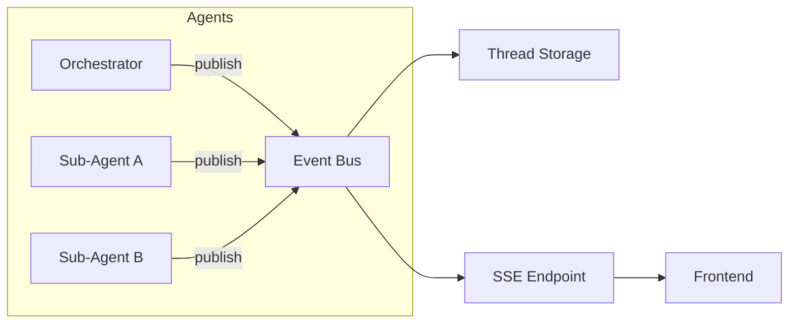

# Streaming Protocol

## Overview

Instance AI uses a pub/sub event bus to deliver agent events to the frontend
in real-time. All agents — the orchestrator and dynamically spawned sub-agents —
publish events to a per-thread channel. The frontend subscribes independently
via SSE.

The protocol is designed for minimal time-to-first-token, progressive rendering
of multi-agent activity, and resilient reconnection.

## Transport

### Sending Messages

- **Endpoint**: `POST /instance-ai/chat/:threadId`
- **Request body**: `{ "message": "user's message" }`
- **Response**: `{ "messageId": "msg_abc123" }`
- **Concurrency**: One active run per thread. A second POST for the same thread
  while a run is active is rejected (`409 Conflict`).

The POST kicks off the orchestrator. Events are delivered via the SSE endpoint,
not the POST response.

### Receiving Events

- **Endpoint**: `GET /instance-ai/events/:threadId`
- **Format**: Server-Sent Events (SSE)
- **Reconnect**: `Last-Event-ID` header replays missed events from storage

### SSE Headers

```
Content-Type: text/event-stream
Cache-Control: no-cache
Connection: keep-alive
X-Accel-Buffering: no
```

`X-Accel-Buffering: no` disables nginx/reverse proxy buffering so events are
delivered immediately.

### SSE Event IDs

Each SSE frame includes an `id:` field generated by the server:

```text
id: 42
data: {"type":"text-delta","agentId":"agent-001","payload":{"text":"..."}}
```

Event IDs are monotonically increasing integers per thread channel and unique
within that thread.

## Event Schema

Every event follows this schema:

```typescript
{
  type: string;        // event type
  agentId: string;     // agent this event is attributed to in the UI
  payload?: object;    // event-specific data
}
```

The `agentId` field identifies which agent branch (orchestrator or sub-agent)
the event belongs to. The frontend uses this to render an agent activity tree.

## Event Types

### `text-delta`

Incremental text from an agent's response.

```json
{"type":"text-delta","agentId":"agent-001","payload":{"text":"You have 3 active workflows."}}
```

The frontend appends `payload.text` to the agent's current message content.

### `reasoning-delta`

Incremental reasoning/thinking from an agent. Always streamed to the frontend
when the model produces it — this gives users visibility into the agent's
decision-making and supports faster iteration.

```json
{"type":"reasoning-delta","agentId":"agent-001","payload":{"text":"Let me check the workflow list..."}}
```

**Policy**: Reasoning is always shown to the user (ADR-012). Not all models emit
reasoning tokens; when a model doesn't support it, no `reasoning-delta` events
are sent. The frontend should handle the absence gracefully.

### `tool-call`

An agent is invoking a tool. Sent before the tool executes.

```json
{
  "type": "tool-call",
  "agentId": "agent-001",
  "payload": {
    "toolCallId": "tc_abc123",
    "toolName": "list-workflows",
    "args": {"limit": 10}
  }
}
```

The frontend adds a new entry to the agent's `toolCalls` with `isLoading: true`.

### `tool-result`

A tool has completed successfully.

```json
{
  "type": "tool-result",
  "agentId": "agent-001",
  "payload": {
    "toolCallId": "tc_abc123",
    "result": {"workflows": [{"id": "1", "name": "My Workflow", "active": true}]}
  }
}
```

The frontend updates the matching `toolCall` entry: sets `result` and
`isLoading: false`.

### `tool-error`

A tool has failed.

```json
{
  "type": "tool-error",
  "agentId": "agent-001",
  "payload": {
    "toolCallId": "tc_abc123",
    "error": "Workflow not found"
  }
}
```

### `agent-spawned`

The orchestrator has created a new sub-agent via the `delegate` tool.

```json
{
  "type": "agent-spawned",
  "agentId": "agent-002",
  "payload": {
    "parentId": "agent-001",
    "role": "workflow builder",
    "tools": ["create-workflow", "update-workflow", "list-nodes", "get-node-description"]
  }
}
```

The frontend adds a new node to the agent activity tree under the parent.
For this event type, `agentId` is the spawned sub-agent ID; `payload.parentId`
links it to the orchestrator.

### `agent-completed`

A sub-agent has finished its work.

```json
{
  "type": "agent-completed",
  "agentId": "agent-002",
  "payload": {
    "role": "workflow builder",
    "result": "Created workflow wf-123 with 3 nodes"
  }
}
```

The frontend marks the sub-agent node as completed.

### `error`

A system-level error occurred.

```json
{"type":"error","agentId":"agent-001","payload":{"content":"An error occurred"}}
```

### `done`

The orchestrator has finished processing the user's message. The stream is
complete.

```json
{"type":"done","agentId":"agent-001","payload":{"status":"completed"}}
```

The frontend sets `isStreaming: false`.

When a run is cancelled, the final event is:

```json
{"type":"done","agentId":"agent-001","payload":{"status":"cancelled","reason":"user_cancelled"}}
```

## Typical Event Sequence

### Simple Query (No Sub-Agents)

```
← agent-001: reasoning-delta "Let me look up your workflows..."
← agent-001: tool-call {toolName: "list-workflows"}
← agent-001: tool-result {result: {...}}
← agent-001: text-delta "You have 3 workflows:\n"
← agent-001: text-delta "1. **Email Digest** (active)\n"
← agent-001: done {status: "completed"}
```

### Autonomous Loop (With Sub-Agents)

```
← agent-001: reasoning-delta "I'll build a workflow for this..."
← agent-001: tool-call {toolName: "plan", args: {action: "create", ...}}
← agent-001: tool-result {result: {goal: "Weather to Slack", ...}}
← agent-001: tool-call {toolName: "list-credentials"}
← agent-001: tool-result {result: {credentials: [...]}}
← agent-001: tool-call {toolName: "delegate", args: {role: "workflow builder", ...}}
← agent-002: agent-spawned {parentId: "agent-001", role: "workflow builder", ...}
← agent-002: tool-call {toolName: "list-nodes", args: {query: "schedule"}}
← agent-002: tool-result {result: {...}}
← agent-002: tool-call {toolName: "create-workflow", args: {...}}
← agent-002: tool-result {result: {id: "wf-123"}}
← agent-002: agent-completed {result: "Created wf-123"}
← agent-001: tool-result {result: "Created wf-123 with 3 nodes"}  // delegate returns
← agent-001: tool-call {toolName: "run-workflow", args: {workflowId: "wf-123"}}
← agent-001: tool-result {result: {executionId: "exec-456"}}
← agent-001: tool-call {toolName: "get-execution", args: {executionId: "exec-456"}}
← agent-001: tool-result {result: {status: "error", ...}}
← agent-001: tool-call {toolName: "delegate", args: {role: "execution debugger", ...}}
← agent-003: agent-spawned {parentId: "agent-001", role: "execution debugger", ...}
← agent-003: tool-call {toolName: "get-execution", ...}
← agent-003: reasoning-delta "The HTTP node returned 401..."
← agent-003: agent-completed {result: "Missing API key header"}
← agent-001: tool-result {result: "Missing API key header"}
← agent-001: tool-call {toolName: "plan", args: {action: "update", ...}}
← ...loop continues...
← agent-001: text-delta "Done! I created a workflow that..."
← agent-001: done {status: "completed"}
```

## Event Bus

### Architecture



All events are published to a per-thread channel on the event bus. Events are
simultaneously persisted to thread storage and delivered to connected SSE clients.

### Implementations

| Deployment | Transport | Why |
|---|---|---|
| Single instance | In-process `EventEmitter` | Zero infrastructure |
| Queue mode | Redis Pub/Sub | n8n already uses Redis |

Event persistence uses thread storage regardless of transport — this provides
replay capability for reconnection.

### Reconnection

When the frontend reconnects (page reload, network interruption), it sends
`Last-Event-ID` in the SSE request. The server replays all events after that
ID from thread storage (`event.id > Last-Event-ID`) before switching to live
delivery. Because IDs are unique per thread, replay does not require dedup.

## Abort Support

The frontend can abort a running agent by sending:

- **Endpoint**: `POST /instance-ai/chat/:threadId/cancel`
- **Semantics**: Idempotent. Cancels the active run for the thread (if any).
- **Behavior**: Stops orchestrator and active sub-agents, then emits final
  `done` with `payload.status = "cancelled"`.
- **Race behavior**: If the run already completed, cancel is a no-op.

## Frontend Rendering

### Agent Activity Tree

The frontend renders events as a collapsible tree grouped by `agentId`:

```
🤖 Orchestrator
├── 💭 "Let me check what credentials are available..."
├── 🔧 list-credentials → [slack-bot, weather-api]
├── 📋 plan: build → execute → inspect
│
├── 🤖 Sub-Agent A (workflow builder)
│   ├── 🔧 list-nodes → [scheduleTrigger, httpRequest, slack]
│   ├── 🔧 create-workflow → wf-123
│   └── ✅ "Created wf-123 with 3 nodes"
│
├── 🔧 run-workflow wf-123
├── 🔧 get-execution → error (401)
│
├── 🤖 Sub-Agent B (execution debugger)
│   ├── 🔧 get-execution → {error details}
│   ├── 💭 "HTTP node returned 401..."
│   └── ✅ "Missing API key in query params"
│
└── 💬 "Done! Your workflow runs daily at 8am..."
```

Sub-agent sections are collapsible — users can drill into details or just see
the summary.

## Future: Rich Component Rendering

The planned rich component system will extend the protocol so tools can declare
a `renderType`, allowing the frontend to render domain-specific components
(execution views, workflow previews, etc.) instead of generic JSON. See
[vision.md](./vision.md) for details.
