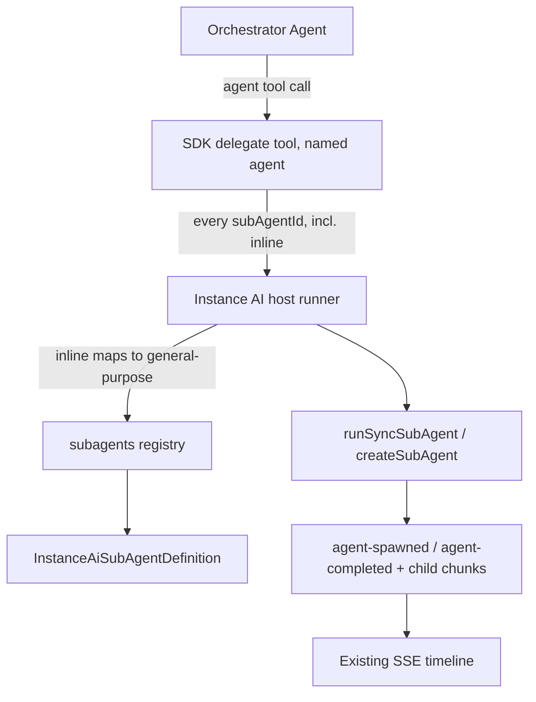

# Sub-agents

How Instance AI delegates bounded work to focused sub-agents via the `agent`
tool, and how to add a new built-in sub-agent definition.

## Overview

The orchestrator gets one delegation surface: the `agent` tool, which is the
`@n8n/agents` SDK's `delegate_subagent` tool registered under the model-facing
name `agent`. The SDK owns the delegation mechanics — the input/output schema,
the system instruction that teaches the model when and how to delegate, task
paths, and the fan-out (`maxChildren`) policy.

Instance AI owns **all execution**. The host `runSubAgent` callback
(`src/subagents/runner.ts`) receives every `subAgentId` the model passes —
**including `"inline"`**, the SDK's default — and runs it through the existing
[`runSyncSubAgent`](../src/tools/orchestration/sync-sub-agent.ts) machinery:
the same synchronous runner `discover-workflow-context` has always used.



### Why not the SDK's inline child runner

The SDK ships a built-in inline runner (`helpers.runInlineSubAgent`) that a
host can use for `subAgentId: "inline"` instead of routing it through its own
callback. Instance AI does not use it:

- **No UI timeline.** The inline runner calls `childRuntime.generate(...)`
  directly — its tool calls and text never reach the Instance AI event bus, so
  the UI would show a spinner with no child activity.
- **Can't express "no MCP".** It inherits the parent's local + deferred tools
  minus a static name blocklist computed at registration time. Instance AI
  loads MCP tools dynamically per run, so a static list can't guarantee a
  sub-agent never sees one — violating the package doctrine that sub-agents
  get native domain tools only, never MCP.
- **Loses everything `runSyncSubAgent` provides**: nested LangSmith tracing,
  the shared sub-agent output protocol, persistence, and HITL.

Routing every `subAgentId` through the host runner means one code path and no
stream/event bridge: `agent-spawned` / `agent-completed` events and child
chunk streaming already work exactly as they do for
`discover-workflow-context` today, and `mapAgentChunkToEvent` drops the SDK's
own `subagent-started` / `subagent-completed` lifecycle chunks by allowlist
design — nothing double-renders.

## Definition shape

Each built-in lives in `src/subagents/definitions/*.ts` as a typed
`InstanceAiSubAgentDefinition` (Zod schema in
[`src/subagents/types.ts`](../src/subagents/types.ts) is the source of truth):

```typescript
export const instanceExplorer: InstanceAiSubAgentDefinition = {
  id: 'instance-explorer',
  name: 'Instance Explorer',
  useWhen:
    'Proactively for broad "what exists on this instance" questions spanning many workflows... ' +
    'Never for a single known workflow or a one/two-call lookup...',
  maxSteps: 25,
  hitl: 'blocked',
  tools: [
    'nodes',
    'research',
    { id: 'workflows', actions: ['list', 'get'] },
  ],
  instructions: `...`,
};
```

| Field | Purpose |
|---|---|
| `id` | Stable identifier — the `subAgentId` the delegate tool routes on |
| `name` | Human-readable name shown in `availableSubAgents` and the UI timeline |
| `useWhen` | Free text rendered into the SDK's `availableSubAgents` listing. There is no separate "don't use when" field — put both when-to and when-not-to-use guidance here |
| `maxSteps` | Max LLM steps for the sub-agent's run (plumbed to `runSyncSubAgent` as `maxIterations`) |
| `hitl` | `'blocked'` or `'allowed'` — see below |
| `tools` | Native domain tools only — a plain string grants all actions, `{ id, actions }` scopes a multi-action tool |
| `instructions` | Task-specific system prompt, appended to the shared sub-agent protocol |

### Action-scoped tools

Multi-action domain tools (`workflows`, `executions`, ...) use a single Zod
discriminated union keyed by `action` (`workflows(action="list")`,
`workflows(action="delete")`, etc.). Listing `{ id: 'workflows', actions:
['list', 'get'] }` doesn't just describe intent — the registry wraps the
resolved tool's handler so calling an action outside the allowlist returns an
error to the model instead of executing. "Read-only" is enforced, not prose.

### `hitl: 'blocked' | 'allowed'`

- **`blocked`** — the registry strips `ask-user` from the sub-agent's resolved
  tools (even if a definition accidentally lists it — defense in depth, not
  just convention) and appends a fixed "you cannot ask the user" note to the
  effective instructions.
- **`allowed`** — the host runner would need to resolve any suspend
  internally via the same HITL flow `runSyncSubAgent` already uses for other
  callers, and must never return `status: 'suspended'` to the SDK delegate
  tool — it fails fast on child suspension
  (`DELEGATED_CHILD_SUSPEND_UNSUPPORTED_MESSAGE`). No v1 built-in sets this;
  it exists for a future definition that genuinely needs to ask the user.

## Registry

[`src/subagents/registry.ts`](../src/subagents/registry.ts) collects every
built-in definition into a `Record<string, InstanceAiSubAgentDefinition>`,
validated against the Zod schema at module load.

| Export | Purpose |
|---|---|
| `getSubAgentDefinition(id)` | Unrestricted lookup by id — used by `discover-workflow-context` to resolve `workflow-context-scout` directly |
| `getGeneralPurposeSubAgentDefinition()` | The definition `subAgentId: "inline"` maps to |
| `listAvailableSubAgents()` | `{ id, name, useWhen }[]` for the SDK's `availableSubAgents` option — excludes `general-purpose` and `workflow-context-scout` |
| `isSelectableSubAgentId(id)` | Whether `id` may be chosen directly as a delegate-tool `subAgentId` — false for hidden definitions |
| `resolveSubAgentTools(definition, context)` | Filters + action-wraps the orchestration context's domain tools per the definition's `tools` list |
| `buildSubAgentInstructions(definition)` | `instructions`, plus the no-HITL note when `hitl: 'blocked'` |

## v1 built-ins

| ID | Tools | Listed in `availableSubAgents` | Notes |
|---|---|---|---|
| `general-purpose` | nodes, credentials, research, workflows (list/get), executions (list/get) | No — reached via `subAgentId: "inline"` | Cursor `generalPurpose` equivalent |
| `workflow-context-scout` | nodes, credentials, research | No — reached via `discover-workflow-context` | Pre-build discovery specialist |
| `instance-explorer` | nodes, research, workflows (list/get) | Yes | Broad read-only survey across instance resources |
| `execution-debugger` | executions, workflows (list/get) | Yes | Isolated debugging investigation across many executions |

### Why `workflow-context-scout` has two names for one job

The system prompt hard-mandates `discover-workflow-context` in the build flow,
and its typed Zod input (`services`, `categories`, `conversationContext`) is
more structured than the generic delegate schema (`goal`, `context`,
`expectedOutput`). Listing the scout in `availableSubAgents` too would give
the model two routes to the same specialist with different input shapes and
regress the discovery evals. **v1 rule: `discover-workflow-context` is the
only route to the scout** — `isSelectableSubAgentId('workflow-context-scout')`
is `false`, so the host runner rejects it if a model somehow guesses the id
through `agent` directly.

### Host-side type-definition assembly

`discover-workflow-context` wraps the scout's `nodes` tool to capture every
`type-definition` result verbatim as it's fetched, keyed by node
type+discriminators. The scout's own final answer only contains its
**Nodes/Credentials/Knowledge base/Gaps** selection — the host mechanically
appends the captured definitions for exactly the nodes the scout fetched
after the scout's answer, instead of asking the model to re-paste ~20-30k
characters of type-definition content it already has verbatim in its own
tool-call history. This cuts the scout's completion tokens, removes a fidelity
risk (models drop fields when asked to copy large blocks verbatim), and relies
on the scout's existing invariant of "only fetch definitions for nodes you
recommend" to keep the captured set correct. See
`wrapNodesToolForTypeDefinitionCapture` in `discover-workflow-context.tool.ts`.

## Host runner

[`src/subagents/runner.ts`](../src/subagents/runner.ts) exports:

- `runSubAgentDefinition(definition, input, context)` — the shared executor:
  resolves tools and instructions, calls `runSyncSubAgent`. Used by both
  `runInstanceAiSubAgent` below and `discover-workflow-context` directly.
- `runInstanceAiSubAgent(request, context)` — the `runSubAgent` callback
  registered on the `agent` tool. Resolves `"inline"` to `general-purpose`,
  rejects hidden/unknown ids, maps the SDK's `goal`/`context`/`expectedOutput`
  into a sync sub-agent briefing, and maps the debrief (including token usage)
  back to the SDK's `DelegateSubAgentToolOutput` shape.

`difficulty` is part of the SDK's model-facing schema but is accepted and
ignored in v1 — every definition runs on the subagent model
(`N8N_INSTANCE_AI_SUB_AGENT_MODEL`). Per-definition model overrides are a
follow-up, not a v1 feature.

## Security boundaries

- **Native domain tools only, never MCP, never orchestration tools.**
  `resolveSubAgentTools` only ever pulls from `context.domainTools`.
- **No recursive delegation.** Sub-agents don't receive the `agent` tool
  themselves — the shared `SUB_AGENT_PROTOCOL` also tells them explicitly that
  they cannot delegate.
- **Bounded steps.** Every definition sets `maxSteps`, plumbed to
  `runSyncSubAgent`'s `maxIterations`.
- **HITL is explicit, not implicit.** A definition must opt in to `hitl:
  'allowed'`; the default (`'blocked'`) structurally removes `ask-user` rather
  than relying on the definition author to leave it out.
- **Fan-out is capped.** The `agent` tool's `policy.maxChildren` limits how
  many delegations can run concurrently (independent of the total number of
  delegations across a run).

## Adding a new built-in

1. Add `src/subagents/definitions/<id>.ts` exporting an
   `InstanceAiSubAgentDefinition`.
2. Register it in `BUILT_IN_DEFINITIONS` in `src/subagents/registry.ts`.
3. Decide whether it belongs in `availableSubAgents` (add to
   `HIDDEN_FROM_LISTING` if not — e.g. if it's reached through its own typed
   tool like the scout, or through `"inline"` like `general-purpose`).
4. If it needs a different model than the subagent default, or genuine HITL
   support, that's follow-up work — see the non-goals in the design plan
   before building it; the registry doesn't have a case documented and tested
   for either yet.
5. Add unit test coverage in `src/subagents/__tests__/` and a behaviour eval
   in `evaluations/data/discovery/` asserting the orchestrator routes to it
   (or doesn't) in the expected cases.

## Non-goals (v1)

- SDK inline child runner (`helpers.runInlineSubAgent`) — all execution stays
  in the host runner
- Per-definition model overrides / difficulty-based model selection
- A `verifier` built-in — would dual-route with the existing
  `verify-built-workflow` orchestration tool; migrate that tool onto a
  registry definition first
- Background / detached sub-agent delegation (`agent` is synchronous only)
- Resuming a prior delegation's thread (`DelegateSubAgentToolOutput.threadId`
  is available for a future `resumeThreadId` option on `runSyncSubAgent`)
