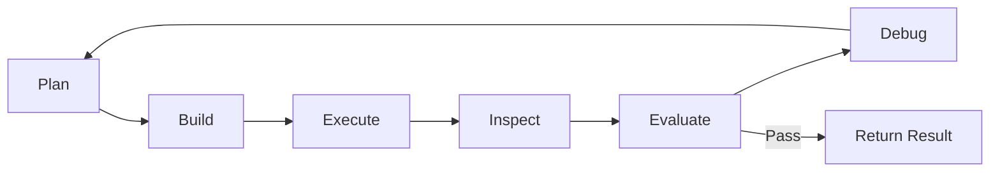
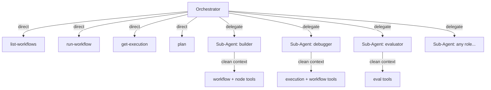
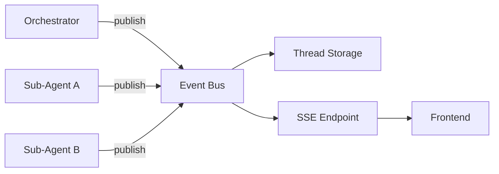
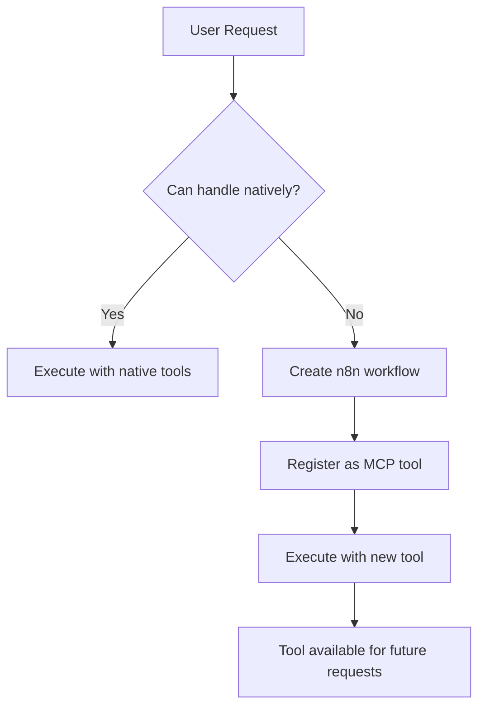

# Vision & Future Direction

This document describes the future direction of Instance AI. It serves as a
living spec that is updated as the project evolves. Since this project is built
entirely with AI tools, this document is critical for maintaining context across
development sessions.

## The Core Idea

Instance AI is the primary interface to n8n. Most users should never need to
see or build a workflow. They describe what they need, and the agent handles
everything — building, running, debugging, and iterating — until the task is
accomplished.

Workflows become implementation details, not user-facing artifacts.

## The Deep Agent Architecture

Instance AI follows the deep agent pattern — an architecture proven by systems
like Claude Code, Deep Research, and Manus. The four pillars:

1. **Explicit Planning** — the orchestrator maintains a documented execution plan,
   reviewing and updating it between phases to prevent goal drift
2. **Dynamic Sub-Agent Composition** — the orchestrator spawns focused sub-agents
   with clean context windows, specifying role, instructions, and tool subset
   on the fly (not from a fixed taxonomy)
3. **Observational Memory** — background compression of operational history
   prevents context degradation over long autonomous loops (5–40x compression
   for tool-heavy workloads)
4. **Structured System Prompt** — detailed orchestrator instructions covering
   delegation patterns, planning discipline, and loop behavior

## The Autonomous Execution Loop

The orchestrator operates in an LLM-controlled loop. The loop is not hardcoded —
it emerges from the system prompt and planning tool. The orchestrator can skip
steps, reorder, backtrack, or take unexpected paths.



1. **Plan** — Create or update the execution plan, set the current phase
2. **Build** — Create or modify a workflow (typically delegated to a sub-agent)
3. **Execute** — Run the workflow directly via `run-workflow`
4. **Inspect** — Read execution results via `get-execution`, check outputs
5. **Evaluate** — Run n8n's native workflow evaluations (eval triggers + metrics)
   to get structured, quantitative feedback (delegated to evaluator sub-agent)
6. **Debug** — Analyze errors and evaluation results (delegated to debugger
   sub-agent), propose fixes
7. **Repeat** — Loop until the task succeeds and evaluations pass

The user sees the full agent activity tree in real-time via streaming, but
doesn't need to intervene unless the agent asks for clarification or
confirmation on destructive operations.

### How Delegation Shapes the Loop

The orchestrator handles lightweight operations directly (reads, execution
triggers, plan updates) and delegates complex operations to sub-agents:



Sub-agents are composed dynamically — the orchestrator decides what role,
instructions, and tools each sub-agent needs based on the current task. This
keeps the orchestrator's context clean while giving sub-agents focused toolsets.

### Evaluation Integration

The Evaluate step leverages n8n's existing evaluation infrastructure. The
evaluator sub-agent handles the full lifecycle:

- Discover existing eval workflows for the target workflow
- Create eval workflows if none exist (eval triggers + metric definitions)
- Run evaluations
- Interpret metric results and return structured feedback

This gives the agent quantitative signals — not just "did it error" but "did
it produce the right result."

### Loop Limits

The maximum number of loop iterations is configurable
(`N8N_INSTANCE_AI_MAX_LOOP_ITERATIONS`). Set high initially to discover natural
limits. The system prompt instructs the orchestrator to ask the user for guidance
after exceeding the limit rather than stopping silently.

## Event-Driven Streaming

### Pub/Sub Architecture

All agents (orchestrator + sub-agents) publish events to a per-thread event bus.
The frontend subscribes via SSE and sees events from all agents in real-time.



Events carry `agentId` so the frontend can render an agent activity tree —
orchestrator actions at the top level, sub-agent actions nested underneath,
each section collapsible.

Each SSE event has a monotonically increasing integer `id` per thread. Replay
on reconnect returns events where `event.id > Last-Event-ID`.

### Lifecycle Events

- `agent-spawned` — orchestrator created a sub-agent (frontend shows new branch)
- `agent-completed` — sub-agent finished (frontend shows completion summary)

### Reconnection

Events are persisted to thread storage. On reconnect, the frontend sends
`Last-Event-ID` and the server replays missed events before switching to live
delivery. Users can navigate away and come back without losing context.

### Run Serialization and Cancellation

- One active run per thread (conversation). A second message on the same thread
  is rejected while a run is in progress.
- Cancellation is explicit via `POST /instance-ai/chat/:threadId/cancel`.
- Cancel is idempotent and ends the run with a `run-finish` event with
  `status: "cancelled"`.

### Open Questions

- What retention/compaction policy should apply to persisted event history,
  plans, and observations in production?

## MCP Self-Augmentation

### The Self-Extending Loop

When the agent encounters a task it can't handle with its native tools:



1. Agent recognizes it lacks a capability
2. Agent creates an n8n workflow that solves the problem
3. Agent registers that workflow as a custom MCP tool
4. Agent uses the new tool immediately
5. Tool persists for all future requests

### Capability Repository

Self-created tools are stored in a managed repository:

- **Discoverability** — agent can browse what custom tools exist
- **Quality tracking** — which tools work reliably, which need fixing
- **Versioning** — tools can be updated as requirements change
- **Cleanup** — stale or broken tools can be identified and removed

This prevents tool sprawl and ensures the agent's self-created capabilities
remain trustworthy over time. The repository is the governance layer over the
agent's growing toolset.

### Open Questions

- How does the repository persist? Dedicated table? Workflow tags/metadata?
- How does the agent decide when to create a new tool vs. modify an existing one?
- Should there be a limit on the number of self-created tools?
- How do we handle tool dependencies (tool A needs credential B)?
- Should users be able to curate the capability repository manually?

## Guardrails

Tools declare whether they require user confirmation via tool metadata (see
ADR-006). This is enforced structurally, not by the system prompt alone.

| Category | Confirmation | Examples |
|----------|-------------|----------|
| Read-only | No | list-workflows, get-execution, list-nodes |
| Safe mutations | No | run-workflow (non-production) |
| Destructive | Yes | delete-workflow, delete-credential |
| High-impact | Yes | activate-workflow, update production workflow |

The autonomous loop runs fast for safe operations while pausing for user approval
on irreversible actions. Implementation is pending.

### Sub-Agent Containment

Sub-agents have additional guardrails:

- Cannot spawn their own sub-agents (no recursive delegation)
- Low `maxSteps` (10–15) — bounded blast radius
- Tool access limited to what the orchestrator specifies
- No MCP tools — external MCP capabilities remain orchestrator-only
- No memory access — context only from the briefing

### Credential Security

The agent never handles raw credential secrets. Credential creation and secret
configuration goes through the n8n frontend UI (see ADR-010). In the future,
browser automation enables the agent to set up credentials programmatically by
filling in the UI form — keeping secrets out of the agent's tool call stream.

### Open Questions

- How is "production" determined? Active workflow = production?
- Should confirmation be configurable per-user or per-instance?
- Do MCP tools inherit a default confirmation requirement?

## Rich Chat Components

### Tool Render Types

Each tool declares a `renderType` that tells the frontend how to display its
results:

```typescript
// Conceptual — exact API TBD
{
  toolName: 'list-executions',
  renderType: 'execution-list',
  result: { executions: [...] }
}
```

The frontend maps `renderType` to a domain-specific Vue component:

| Render Type | Component | Description |
|-------------|-----------|-------------|
| `execution-list` | ExecutionListCard | Familiar execution list view |
| `execution-detail` | ExecutionDetailCard | Execution result with node outputs |
| `workflow-preview` | WorkflowPreviewCard | Embedded canvas preview |
| `credential-card` | CredentialCard | Credential with test status |
| `error-detail` | ErrorDetailCard | Structured error with suggested fixes |
| `node-list` | NodeListCard | Available nodes browser |
| `agent-tree` | AgentTreeCard | Collapsible agent activity tree |
| `text` | Default | Plain text (fallback) |

### Progressive Streaming

Rich components should support progressive rendering:

- **Skeleton states** — show component shell while tool is loading
- **Streaming data** — update component as data arrives
- **Transitions** — smooth animation from loading to loaded

### Open Questions

- Should render types be extensible (for MCP tools)?
- How do self-created MCP tools declare their render type?
- Should the agent be able to compose multiple render types in one response?

## Browser Automation

### MVP: DevTools MCP

The first iteration uses DevTools MCP to prove feasibility:

- Connect to browser via Chrome DevTools Protocol
- Navigate pages, interact with elements, read content
- Available as an MCP tool the agent can use in the autonomous loop

This validates the approach without building custom browser control infrastructure.

### Future

Based on MVP learnings, scope browser automation further:

- Headless browser management (spin up/down)
- Screenshot capture and visual analysis
- Form filling and data extraction workflows
- Authentication handling for protected sites

## Transparency

Everything the agent does is visible:

- All agent activity streams to the frontend via the event bus
- The agent activity tree shows orchestrator decisions and sub-agent work
- Users can expand sub-agent sections to see detailed tool calls
- Execution logs are standard n8n executions — visible in the execution list
- Event history is persisted and replayable via the SSE endpoint

## Development Approach

This project is built entirely with AI development tools. To support this:

- All architectural decisions must be documented (this file and `decisions.md`)
- Code must be well-structured with clear interfaces
- `CLAUDE.md` files should be maintained at package level
- Inline documentation should explain *why*, not just *what*
- Decision records should capture trade-offs and rejected alternatives
