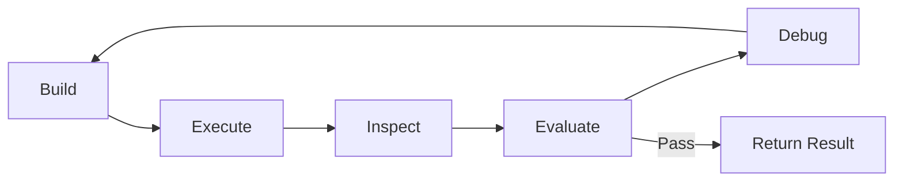
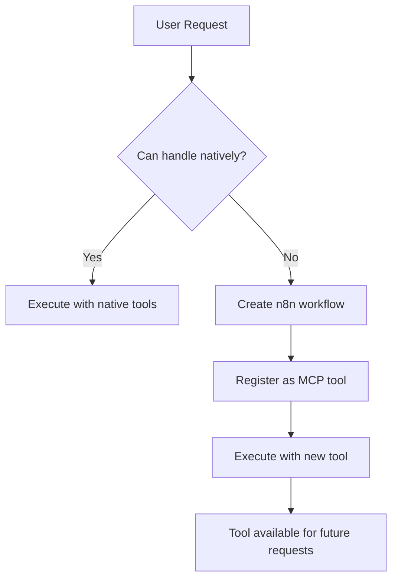

# Vision & Future Direction

This document describes the future direction of Instance AI. It serves as a
living spec that is updated as the project evolves. Since this project is built
entirely with AI tools, this document is critical for maintaining context across
development sessions.

## The Core Idea

Instance AI is the primary interface to n8n. Most users should never need to
see or build a workflow. They describe what they need, and the agent handles
everything — building, running, debugging, and iterating — until the task is
accomplished.

Workflows become implementation details, not user-facing artifacts.

## The Autonomous Execution Loop

The agent operates in a closed loop:



1. **Build** — Create or modify a workflow based on the user's intent
2. **Execute** — Run the workflow (directly or via MCP tools)
3. **Inspect** — Read execution logs, check outputs, identify failures
4. **Evaluate** — Run n8n's native workflow evaluations (eval triggers + metrics)
   to get structured, quantitative feedback on output quality — not just "did it
   error" but "did it produce the right result"
5. **Debug** — Analyze errors and evaluation results, adjust the workflow
6. **Repeat** — Loop until the task succeeds and evaluations pass

The user only sees the final result. The agent surfaces intermediate progress
via streaming, but the user doesn't need to intervene unless the agent asks
for clarification or confirmation.

### Evaluation Integration

The Evaluate step leverages n8n's existing evaluation infrastructure:

- **Eval triggers** — workflows that test other workflows
- **Metrics** — structured quality signals (accuracy, completeness, etc.)
- **Quantitative feedback** — the agent doesn't just check for errors, it
  checks whether the output is *correct*

This gives the agent a much tighter feedback loop than simple error checking.

## MCP Self-Augmentation

### The Self-Extending Loop

When the agent encounters a task it can't handle with its native tools:



1. Agent recognizes it lacks a capability
2. Agent creates an n8n workflow that solves the problem
3. Agent registers that workflow as a custom MCP tool
4. Agent uses the new tool immediately
5. Tool persists for all future requests

### Capability Repository

Self-created tools are stored in a managed repository:

- **Discoverability** — agent can browse what custom tools exist
- **Quality tracking** — which tools work reliably, which need fixing
- **Versioning** — tools can be updated as requirements change
- **Cleanup** — stale or broken tools can be identified and removed

This prevents tool sprawl and ensures the agent's self-created capabilities
remain trustworthy over time. The repository is the governance layer over the
agent's growing toolset.

### Open Questions

- How does the repository persist? Dedicated table? Workflow tags/metadata?
- How does the agent decide when to create a new tool vs. modify an existing one?
- Should there be a limit on the number of self-created tools?
- How do we handle tool dependencies (tool A needs credential B)?
- Should users be able to curate the capability repository manually?

## Guardrails

Tools declare whether they require user confirmation:

| Category | Confirmation | Examples |
|----------|-------------|----------|
| Read-only | No | list-workflows, get-execution, list-nodes |
| Safe mutations | No | run-workflow (non-production) |
| Destructive | Yes | delete-workflow, delete-credential |
| High-impact | Yes | activate-workflow, update production workflow |

The confirmation requirement is declared at the tool level, not enforced by the
system prompt alone. This ensures the autonomous loop runs fast for safe
operations while preventing irreversible mistakes.

### Open Questions

- How is "production" determined? Active workflow = production?
- Should confirmation be configurable per-user or per-instance?
- Do MCP tools inherit a default confirmation requirement?

## Rich Chat Components

### Tool Render Types

Each tool declares a `renderType` that tells the frontend how to display its
results:

```typescript
// Conceptual — exact API TBD
{
  toolName: 'list-executions',
  renderType: 'execution-list',
  result: { executions: [...] }
}
```

The frontend maps `renderType` to a domain-specific Vue component:

| Render Type | Component | Description |
|-------------|-----------|-------------|
| `execution-list` | ExecutionListCard | Familiar execution list view |
| `execution-detail` | ExecutionDetailCard | Execution result with node outputs |
| `workflow-preview` | WorkflowPreviewCard | Embedded canvas preview |
| `credential-card` | CredentialCard | Credential with test status |
| `error-detail` | ErrorDetailCard | Structured error with suggested fixes |
| `node-list` | NodeListCard | Available nodes browser |
| `text` | Default | Plain text (fallback) |

### Progressive Streaming

Rich components should support progressive rendering:

- **Skeleton states** — show component shell while tool is loading
- **Streaming data** — update component as data arrives
- **Transitions** — smooth animation from loading to loaded

### Open Questions

- Should render types be extensible (for MCP tools)?
- How do self-created MCP tools declare their render type?
- Should the agent be able to compose multiple render types in one response?

## Browser Automation

### MVP: DevTools MCP

The first iteration uses DevTools MCP to prove feasibility:

- Connect to browser via Chrome DevTools Protocol
- Navigate pages, interact with elements, read content
- Available as an MCP tool the agent can use in the autonomous loop

This validates the approach without building custom browser control infrastructure.

### Future

Based on MVP learnings, scope browser automation further:

- Headless browser management (spin up/down)
- Screenshot capture and visual analysis
- Form filling and data extraction workflows
- Authentication handling for protected sites

## Transparency

Everything the agent does is a workflow, and every workflow runs through n8n's
execution engine. This means:

- All agent activity is visible in the standard execution log
- Users can inspect what the agent did, how it debugged, what it changed
- Audit trail is automatic — no separate logging needed
- The same monitoring and alerting that works for user workflows works for
  agent workflows

## Development Approach

This project is built entirely with AI development tools. To support this:

- All architectural decisions must be documented (this file and `decisions.md`)
- Code must be well-structured with clear interfaces
- `CLAUDE.md` files should be maintained at package level
- Inline documentation should explain *why*, not just *what*
- Decision records should capture trade-offs and rejected alternatives
