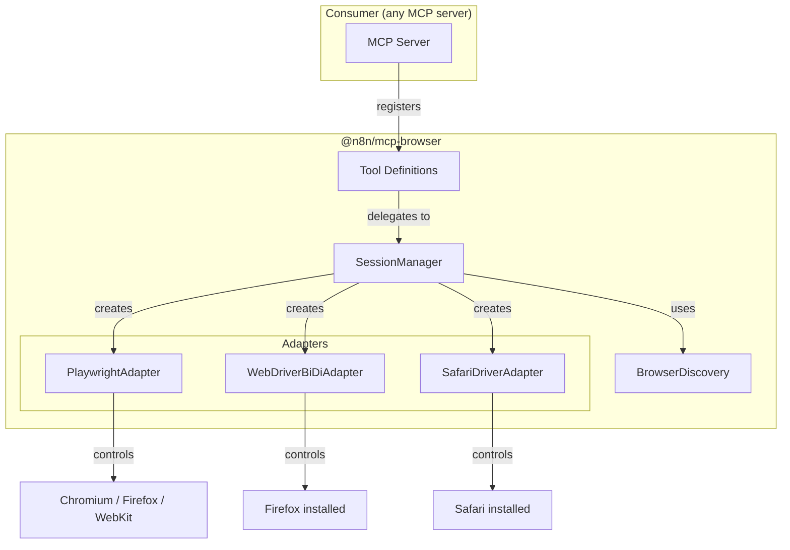
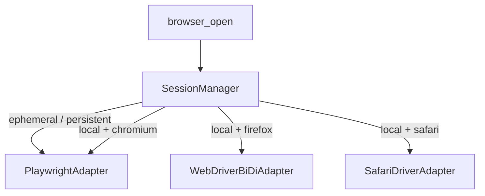

# Architecture

## Overview

`@n8n/mcp-browser` is a browser automation package with two faces:

1. **Library** — export tool definitions that any MCP server can register
2. **Standalone server** — thin wrapper that calls `createBrowserTools()` and
   serves tools over stdio

The package never assumes it owns the MCP server. Tools are plain objects
(name + schema + handler) that work with any `@modelcontextprotocol/sdk`
server, `@mastra/core` tool system, or custom integration.

## Layer diagram



## Package structure

```
packages/@n8n/mcp-browser/
├── src/
│   ├── index.ts                 # Public API: createBrowserTools, SessionManager
│   ├── server.ts                # Standalone MCP server entry point (stdio)
│   ├── session-manager.ts       # Session lifecycle, TTL, cleanup
│   ├── browser-discovery.ts     # Auto-detect installed browsers (cross-platform)
│   ├── adapters/
│   │   ├── adapter.ts           # BrowserAdapter interface
│   │   ├── playwright.ts        # Playwright adapter (Chromium, Firefox, WebKit)
│   │   ├── webdriver-bidi.ts    # WebDriver BiDi adapter (Firefox local)
│   │   ├── safaridriver.ts      # safaridriver adapter (Safari local)
│   │   ├── webdriver-types.d.ts # WebDriver protocol type declarations
│   │   ├── webdriver-base.ts    # Shared base class for WebDriver adapters
│   │   ├── selector-utils.ts    # Selector parsing and resolution utilities
│   │   └── snapshot-script.ts   # DOM snapshot injection script
│   ├── tools/
│   │   ├── index.ts             # createBrowserTools() — collects all tools
│   │   ├── helpers.ts           # Shared tool helper functions
│   │   ├── session.ts           # browser_open, browser_close
│   │   ├── tabs.ts              # browser_tab_open, browser_tab_list, etc.
│   │   ├── navigation.ts        # browser_navigate, browser_back, etc.
│   │   ├── interaction.ts       # browser_click, browser_type, etc.
│   │   ├── inspection.ts        # browser_screenshot, browser_snapshot, etc.
│   │   ├── wait.ts              # browser_wait
│   │   └── state.ts             # browser_cookies, browser_storage, etc.
│   ├── types.ts                 # Shared types, Zod schemas
│   ├── errors.ts                # Custom error classes
│   └── utils.ts                 # General utility functions
├── README.md
├── docs/
├── package.json
├── tsconfig.json
└── tsconfig.build.json
```

## Key components

### Tool definitions

Each tool is a plain object:

```typescript
interface ToolDefinition {
  name: string;
  config: {
    description: string;
    inputSchema: ZodRawShape;
    outputSchema?: ZodRawShape;
    annotations?: ToolAnnotations;
  };
  handler: (input: unknown) => Promise<ToolResponse>;
}
```

The `createBrowserTools(config?)` function creates a `SessionManager`
internally and returns `{ tools, sessionManager }`. Consumers register the
tools however they like:

```typescript
// @modelcontextprotocol/sdk
for (const tool of tools) {
  server.tool(tool.name, tool.config.description, tool.config.inputSchema, async (args) => {
    return await tool.handler(args);
  });
}

// @mastra/core — wrap as createTool()
for (const tool of tools) {
  mastraTools[tool.name] = createTool({
    id: tool.name,
    description: tool.config.description,
    inputSchema: z.object(tool.config.inputSchema),
    execute: tool.handler,
  });
}
```

### SessionManager

Internal orchestrator created by `createBrowserTools()`. Configured entirely
via the config object passed to `createBrowserTools()` — no config files.
The wrapping application owns its own configuration.

Responsibilities:

- **Create sessions** — pick the right adapter based on mode + browser
- **Track sessions** — `Map<string, BrowserSession>` with metadata
- **TTL enforcement** — interval-based reaper closes idle sessions
- **Graceful shutdown** — close all browsers on process exit
- **Concurrency limit** — reject new sessions beyond max

All tools receive the SessionManager via closure. Each tool call:

1. Looks up session by `sessionId`
2. Updates `lastAccessedAt` (resets TTL)
3. Resolves target page (by `pageId` or active page)
4. Resolves element target (by `ref` from snapshot, or `selector` fallback)
5. Delegates to the session's adapter
6. Returns structured response

Tool descriptions are written to steer agents toward the snapshot-then-act
workflow: `browser_snapshot` is described as the primary observation tool,
`browser_screenshot` explicitly defers to snapshot for most use cases, and
interaction tools list `ref` before `selector` in their schemas. The
`browser_screenshot` response includes a `hint` field nudging toward
snapshot.

### BrowserAdapter interface

Uniform API regardless of underlying protocol:

```typescript
// Element targeting — tools resolve ref or selector to an ElementTarget
// before calling adapter methods. Exactly one of ref or selector is provided.
type ElementTarget =
  | { ref: string; selector?: never }   // from snapshot — primary
  | { selector: string; ref?: never };  // CSS/text/role/XPath — fallback

interface BrowserAdapter {
  readonly name: string;

  // Lifecycle
  launch(config: SessionConfig): Promise<void>;
  close(): Promise<void>;

  // Pages
  newPage(url?: string): Promise<PageInfo>;
  closePage(pageId: string): Promise<void>;
  listPages(): Promise<PageInfo[]>;

  // Navigation
  navigate(pageId: string, url: string, waitUntil?: 'load' | 'domcontentloaded' | 'networkidle'): Promise<NavigateResult>;
  back(pageId: string): Promise<NavigateResult>;
  forward(pageId: string): Promise<NavigateResult>;
  reload(pageId: string, waitUntil?: 'load' | 'domcontentloaded' | 'networkidle'): Promise<NavigateResult>;

  // Interaction
  click(pageId: string, target: ElementTarget, options?: ClickOptions): Promise<void>;
  type(pageId: string, target: ElementTarget, text: string, options?: TypeOptions): Promise<void>;
  select(pageId: string, target: ElementTarget, values: string[]): Promise<string[]>;
  hover(pageId: string, target: ElementTarget): Promise<void>;
  press(pageId: string, keys: string): Promise<void>;
  drag(pageId: string, from: ElementTarget, to: ElementTarget): Promise<void>;
  scroll(pageId: string, target?: ElementTarget, options?: ScrollOptions): Promise<void>;
  upload(pageId: string, target: ElementTarget, files: string[]): Promise<void>;
  dialog(pageId: string, action: 'accept' | 'dismiss', text?: string): Promise<string>;

  // Inspection
  screenshot(pageId: string, target?: ElementTarget, options?: ScreenshotOptions): Promise<string>;
  snapshot(pageId: string, target?: ElementTarget): Promise<SnapshotResult>;
  getText(pageId: string, target?: ElementTarget): Promise<string>;
  evaluate(pageId: string, script: string): Promise<unknown>;
  getConsole(pageId: string, level?: string, clear?: boolean): Promise<ConsoleEntry[]>;
  getErrors(pageId: string, clear?: boolean): Promise<ErrorEntry[]>;
  pdf(pageId: string, options?: { format?: string; landscape?: boolean }): Promise<{ data: string; pages: number }>;
  getNetwork(pageId: string, filter?: string, clear?: boolean): Promise<NetworkEntry[]>;

  // Wait
  wait(pageId: string, options: WaitOptions): Promise<number>;

  // State
  getCookies(pageId: string, url?: string): Promise<Cookie[]>;
  setCookies(pageId: string, cookies: Cookie[]): Promise<void>;
  clearCookies(pageId: string): Promise<void>;
  getStorage(pageId: string, kind: 'local' | 'session'): Promise<Record<string, string>>;
  setStorage(pageId: string, kind: 'local' | 'session', data: Record<string, string>): Promise<void>;
  clearStorage(pageId: string, kind: 'local' | 'session'): Promise<void>;
  setOffline(pageId: string, offline: boolean): Promise<void>;
  setHeaders(pageId: string, headers: Record<string, string>): Promise<void>;
  setGeolocation(pageId: string, geo: { latitude: number; longitude: number; accuracy?: number } | null): Promise<void>;
  setTimezone(pageId: string, timezone: string): Promise<void>;
  setLocale(pageId: string, locale: string): Promise<void>;
  setDevice(pageId: string, device: DeviceDescriptor): Promise<void>;

  // Ref resolution
  resolveRef(pageId: string, ref: string): Promise<unknown>;
}

interface SnapshotResult {
  tree: string;         // ref-annotated accessibility tree
  refCount: number;     // total refs assigned
}
```

Playwright uses its `aria-ref=` selector engine to resolve refs from the last
`_snapshotForAI()` call. WebDriver adapters use `data-n8n-ref` DOM attributes
set by an injected snapshot script and resolve refs via CSS attribute selector.
When a tool receives `{ ref: "e42" }`, it calls `adapter.resolveRef(pageId, ref)`
to locate the element. If the ref is stale, `resolveRef` throws a `StaleRefError`
with a hint to take a fresh snapshot.

### Adapter implementations

| Adapter | Protocol | Browsers | Modes |
|---------|----------|----------|-------|
| `PlaywrightAdapter` | Playwright API | Chromium, Firefox, WebKit | ephemeral, persistent, local (Chromium only) |
| `WebDriverBiDiAdapter` | WebDriver BiDi via geckodriver | Firefox | local |
| `SafariDriverAdapter` | WebDriver via safaridriver | Safari | local |

The SessionManager selects the adapter:



### Feature capability matrix

Not all adapters support all features. Tools that call unsupported adapter
methods return a structured error indicating the limitation.

| Feature | Playwright | WebDriver BiDi | safaridriver |
|---------|-----------|----------------|--------------|
| navigate, click, type | Yes | Yes | Yes |
| screenshot | Yes | Yes | Yes |
| accessibility snapshot | Yes | Yes (DOM-based) | Yes (DOM-based) |
| evaluate JS | Yes | Yes | Yes |
| network interception | Yes | Yes | No |
| cookies get/set/clear | Yes | Yes | Yes |
| localStorage/sessionStorage | Yes | Via JS | Via JS |
| set headers | Yes | Yes | No |
| set geolocation | Yes | Limited | No |
| set timezone/locale | Yes | No | No |
| set device emulation | Yes | No | No |
| set offline | Yes | Yes (BiDi) | No |
| PDF generation | Yes | Yes (printPage) | Yes (printPage) |
| multi-page/tabs | Yes | Yes | Yes |
| file upload | Yes | Yes | Limited |
| dialog handling | Yes | Yes | Limited |

### Standalone server

`server.ts` is a thin entry point that supports both stdio and streamable HTTP
transports. Configuration is accepted via environment variables
(`N8N_MCP_BROWSER_*` prefix) and CLI flags (CLI flags take precedence).

```typescript
import { McpServer } from '@modelcontextprotocol/sdk/server/mcp.js';
import { StdioServerTransport } from '@modelcontextprotocol/sdk/server/stdio.js';
import { StreamableHTTPServerTransport } from '@modelcontextprotocol/sdk/server/streamableHttp.js';
import { createBrowserTools } from './tools/index';
import { parseServerOptions } from './server-config';

async function main() {
  const { config, transport: transportType, port } = parseServerOptions();
  const { tools, sessionManager } = createBrowserTools(config);
  const server = new McpServer({ name: 'n8n-browser', version: '1.0.0' });

  for (const tool of tools) {
    server.tool(tool.name, tool.config.description, tool.config.inputSchema, async (args) => {
      return await tool.handler(args as Record<string, unknown>);
    });
  }

  if (transportType === 'http') {
    // Streamable HTTP — stateless (session management via SessionManager)
    const transport = new StreamableHTTPServerTransport({ sessionIdGenerator: undefined });
    await server.connect(transport);
    const httpServer = createServer((req, res) => transport.handleRequest(req, res));
    httpServer.listen(port);
  } else {
    const transport = new StdioServerTransport();
    await server.connect(transport);
  }
}
```

Sessions are in-memory only — when the server stops, all sessions are closed
and all browser processes are killed. There is no persistence or reconnection.

BrowserDiscovery runs on initialization and auto-detects installed browsers
on macOS, Linux, and Windows. See [cross-platform.md](cross-platform.md) for
OS-specific details.
