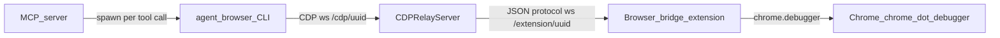

# Extension + CDP bridge — reference for integrating agent-browser tooling

This note summarizes how **`@n8n/mcp-browser`** ties **agent-browser**, a local **CDP relay**, and the **n8n AI Browser Bridge** Chrome extension together. Use it if you already have agent-browser-based tooling and want to align with the same extension connection model.

For full design detail, see [`spec/technical-spec.md`](../spec/technical-spec.md). Wire types live in [`src/cdp-relay-protocol.ts`](../src/cdp-relay-protocol.ts).

---

## What the current solution assumes

1. **Chrome (or Brave/Edge)** runs with the **Browser Bridge extension** (`@n8n/mcp-browser-extension`) installed.
2. **`agent-browser`** is on `PATH`, or **`AGENT_BROWSER_PATH`** points at the binary.
3. **`CDPRelayServer`** (Node, in [`src/cdp-relay.ts`](../src/cdp-relay.ts)) listens on **`127.0.0.1`** on a random port for **two** WebSocket namespaces on the **same HTTP server**.
4. The **extension** opens a persistent WebSocket to the relay (**extension protocol**).
5. Each **short-lived `agent-browser` process** connects to the relay over CDP (**automation CDP protocol**). The relay translates CDP messages to/from extension commands (`forwardCDPCommand`, etc.). When the subprocess exits, the relay **drops only the automation WebSocket**; the extension connection and tab metadata cache stay alive so the next `agent-browser` invocation can reconnect.

---

## End-to-end data flow

- **MCP tools** ultimately call **`AgentBrowserAdapter.run()`**, which **`execFile`s** `agent-browser` with global args **`--cdp <ws-url>`** and **`--session <id>`** (see [`src/adapters/agent-browser.ts`](../src/adapters/agent-browser.ts)).
- **Tab/page identity in MCP** is the extension’s CDP **`Target.targetId`** string (hex-style id).
- **`agent-browser`** uses its own **`t1`, `t2`, …** tab labels. The adapter builds a **`targetId → tN`** map by correlating **`CDPRelayServer.listTabs()`** (extension ids + url/title) with **`agent-browser tab list`** output.

---

## Boot sequence (minimal checklist)

Implementing parity with `AgentBrowserAdapter.launch()` boils down to:

| Step | What happens |
|------|----------------|
| 1 | Instantiate **`CDPRelayServer`**, call **`listen()`** → bind port + remember **`cdpPath`** / **`extensionPath`** (both include the same UUID). |
| 2 | Build an **extension onboarding URL**. Current constant in tree: **`chrome-extension://cegmdpndekdfpnafgacidejijecomlhh/connect.html?mcpRelayUrl=<ws-url>`**, where **`mcpRelayUrl`** is the **`extensionEndpoint(port)`** (e.g. `ws://127.0.0.1:12345/extension/<uuid>`). Open that URL or launch Chrome with it so the extension’s connect page runs. |
| 3 | **`waitForExtension()`** until the extension’s WebSocket hits **`/extension/{uuid}`** (timeout + error UX is in relay). |
| 4 | Set **`cdpUrl = cdpEndpoint(port)`** (e.g. `ws://127.0.0.1:12345/cdp/<uuid>`). |
| 5 | Choose a stable **session string** per MCP/browser session (`n8n-ab-*` pattern today) so concurrent agent-browser subprocesses targeting the **same relay** do not collide. |
| 6 | Optionally run **`tab list`** (or equivalent) once to **`syncTabMapping`**: align extension target ids with agent-browser **`tN`**. |

When **`browser_connect`** / **`BrowserConnection.connect()`** completes, it expects **`relay.listTabs()`** (via the extension **`listTabs`** command) to return non-empty **`{ id, title, url }[]`** whenever the bridge is attached.

---

## Two WebSockets on one relay port

From [`CDPRelayServer`](../src/cdp-relay.ts):

| Path | Client | Payload shape |
|------|--------|----------------|
| **`/cdp/<uuid>`** | **agent-browser** (CDP-speaking automation client) | Chrome DevTools-style JSON-RPC: `method`, `id`, optional `sessionId`, `params`. |
| **`/extension/<uuid>`** | **Browser Bridge extension** | Request/response with `method`/`params`; responses carry `id` + `result` or `error`. Events from extension can be unsolicited `method` + `params`. |

The relay maintains **`tabCache`**, **`activatedTabs`**, and forwards **`Target.attachedToTarget`** etc. toward the automation client when **`activateTab`** / **`createTab`** semantics require it.

---

## Extension protocol (what the relay expects)

Formal types: [`src/cdp-relay-protocol.ts`](../src/cdp-relay-protocol.ts), **`PROTOCOL_VERSION = 1`**.

### Commands — relay → extension

| Command | Role |
|---------|------|
| **`listRegisteredTabs`** | Hydrate/cache metadata for user-registered tabs (used on **`Target.setAutoAttach`**, reconnect resync). |
| **`listTabs`** | Enumerate tabs for MCP/UI; **`listTabs()`** merges results into **`tabCache`** so **`hasTab(targetId)`** matches listed ids. |
| **`forwardCDPCommand`** | `{ method, params?, id? }` — run CDP in the tab identified by **`id`** (`targetId`); omit **`id`** for primary tab. |
| **`attachTab`** | Ensure debugger attachment for lazy activation path. |
| **`createTab` / `closeTab`** | Tab lifecycle as invoked by intercepted CDP (`Target.createTarget`, `Target.closeTarget`). |

### Events — extension → relay

Examples: **`forwardCDPEvent`** (CDP notifications with optional tab **`id`**), **`tabOpened`**, **`tabClosed`**.

Implementing **only** **`forwardCDPCommand`** + **`listTabs`** gets you far; **`listRegisteredTabs`** and **`attachTab`** align with **`Target.setAutoAttach`** / lazy debugger attach behavior documented in **`spec/technical-spec.md`**.

---

## CDP interception vs passthrough

The relay handles a **small set** of CDP methods locally (`Browser.getVersion`, `Target.createTarget`, **`Target.setAutoAttach`** (+ extension **`listRegisteredTabs`**), …). Everything else goes **`forwardCDPCommand`** to the extension, which executes via **`chrome.debugger`**.

Important convention: **`sessionId` from the automation client equals the Chrome `targetId`** for that tab. The relay does not remap session ids differently from extension tab ids.

---

## Practical notes for parallel workstreams

1. **`agent-browser` is subprocess-per-invocation**, not one long-lived daemon inside `mcp-browser`, so relay behavior must tolerate **rapid connect/disconnect on `/cdp/...`** without treating that as **full teardown** (extension must remain connected; **`activatedTabs`** is cleared when the automation socket closes so the next process can receive **`Target.attachedToTarget`** again).
2. **Extension handshake URL** carries **`mcpRelayUrl`** explicitly so the bridge knows where to open the WebSocket.
3. **`syncTabMapping`** is required because **MCP `pageId` is `targetId`**, while **CLI commands** use **`tN`** — correlation is URL/title heuristic + order fallback when lengths match.

---

## Key source files

| Area | Location |
|------|----------|
| Adapter (launch URL, **`--cdp` / `--session`**, **`run()`, tab map) | [`src/adapters/agent-browser.ts`](../src/adapters/agent-browser.ts) |
| Relay, extension ↔ CDP bridging | [`src/cdp-relay.ts`](../src/cdp-relay.ts) |
| Extension JSON protocol types | [`src/cdp-relay-protocol.ts`](../src/cdp-relay-protocol.ts) |
| MCP connect lifecycle | [`src/connection.ts`](../src/connection.ts) |
| Packaged Chrome extension | `@n8n/mcp-browser-extension` ([`../../mcp-browser-extension/`](../../mcp-browser-extension/)) |

This should be enough context to plug a **standalone agent-browser toolchain** into the same **`extensionEndpoint` + `cdpEndpoint`** contract without reverse-engineering the whole package.
