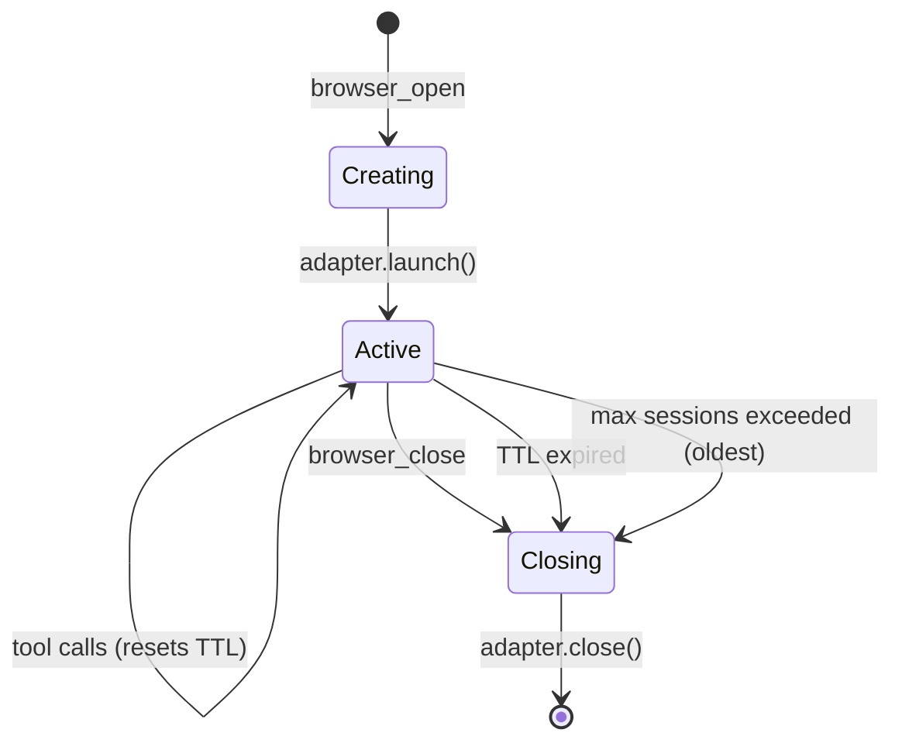

# Session Management

## Overview

The `SessionManager` is the internal orchestrator for browser sessions. It is
created automatically by `createBrowserTools()` and handles session creation,
adapter selection, TTL enforcement, multi-page tracking, and graceful shutdown.

**Sessions are in-memory only.** When the server shuts down, all sessions
are closed and all browser processes are killed. There is no session
persistence, serialization, or reconnection across restarts. The wrapping
application can re-create sessions as needed.

## Session lifecycle



## SessionManager

```typescript
class SessionManager {
  private sessions: Map<string, BrowserSession>;
  private config: ResolvedConfig;
  private discovery: BrowserDiscovery;
  private reaperInterval: NodeJS.Timeout;

  // All configuration is programmatic — no config files
  constructor(config?: Partial<Config>);

  // Session lifecycle
  open(options: OpenSessionOptions): Promise<string>;  // returns sessionId
  close(sessionId: string): Promise<void>;
  get(sessionId: string): BrowserSession;

  // Shutdown
  shutdown(): Promise<void>;  // close all sessions, stop reaper
}
```

## BrowserSession

Each session wraps an adapter instance and tracks metadata:

```typescript
interface BrowserSession {
  id: string;
  adapter: BrowserAdapter;
  config: SessionConfig;
  pages: Map<string, PageInfo>;
  activePageId: string;
  createdAt: Date;
  lastAccessedAt: Date;
}

interface SessionConfig {
  mode: 'ephemeral' | 'persistent' | 'local';
  browser: BrowserName;
  headless: boolean;
  viewport: { width: number; height: number };
  profileName?: string;   // for persistent mode
  ttlMs: number;
}

type BrowserName =
  | 'chromium' | 'chrome' | 'brave' | 'edge'  // Chromium-based
  | 'firefox'
  | 'safari' | 'webkit';
```

## Adapter selection

When `browser_open` is called, the SessionManager selects an adapter based on
mode and browser:

```typescript
// Adapters receive the resolved config
function selectAdapter(mode: string, browser: string): BrowserAdapter {
  // Ephemeral and persistent always use Playwright
  if (mode === 'ephemeral' || mode === 'persistent') {
    return new PlaywrightAdapter(config);
  }

  // Local mode — adapter depends on browser
  if (mode === 'local') {
    if (isChromiumBased(browser)) {
      return new PlaywrightAdapter(config);  // with channel + user profile
    }
    if (browser === 'firefox') {
      return new WebDriverBiDiAdapter(config);
    }
    if (browser === 'safari') {
      return new SafariDriverAdapter(config);
    }
  }
}
```

### Mode details

#### Ephemeral

- Fresh BrowserContext with no user data
- Playwright launches its bundled browser binary
- All data destroyed when session closes
- Fastest to create, lowest risk

```typescript
// Internally:
const browser = await playwright.chromium.launch({ headless });
const context = await browser.newContext({ viewport });
```

#### Persistent

- Named profile directory: `~/.n8n-browser/profiles/<profileName>/`
- Playwright `launchPersistentContext()` — data persists across sessions
- Profile name defaults to `"default"` if not specified
- Cookies, localStorage, history all survive session close and reopen

```typescript
// Internally:
const profileDir = path.join(profilesDir, profileName);
const context = await playwright.chromium.launchPersistentContext(profileDir, {
  headless,
  viewport,
});
```

#### Local

- User's actual installed browser with their real profile
- **Chromium-based** (Chrome, Brave, Edge): Playwright with `channel` option
  and user's default profile path
- **Firefox**: WebDriver BiDi via geckodriver — launches user's installed
  Firefox with their profile
- **Safari**: safaridriver — launches actual Safari with user's data

```typescript
// Chromium local — Playwright with channel
const context = await playwright.chromium.launchPersistentContext(
  userProfilePath,
  { channel: 'chrome', headless, viewport }
);

// Firefox local — WebDriver BiDi
const driver = await geckodriver.start();
const session = await driver.newSession({
  capabilities: { 'moz:firefoxOptions': { args: ['-profile', userProfilePath] } }
});

// Safari local — safaridriver
const driver = await safaridriver.start();
const session = await driver.newSession();
```

## Multi-page support

Each session tracks multiple pages/tabs:

```typescript
interface PageInfo {
  id: string;       // generated unique ID
  title: string;
  url: string;
}
```

### Page lifecycle

- `browser_open` creates the session with one default page (active)
- `browser_tab_open` creates a new page, optionally navigates to URL, returns
  `pageId`
- `browser_tab_focus` switches the active page
- `browser_tab_close` closes a page; if it was the last page, the session
  closes
- All other tools accept optional `pageId`; if omitted, they target the
  active page

### Active page tracking

The session maintains an `activePageId`. When:

- A new tab is opened → it becomes active
- The active tab is closed → the most recently used tab becomes active
- `browser_tab_focus` is called → the specified tab becomes active

## TTL and cleanup

### Idle TTL

Each session has a configurable TTL (default: 30 minutes). The
`lastAccessedAt` timestamp is updated on every tool call that targets the
session. If a session is idle longer than its TTL, it is closed automatically.

### Reaper

An interval timer runs every 60 seconds and checks all sessions:

```typescript
private startReaper() {
  this.reaperInterval = setInterval(() => {
    const now = Date.now();
    for (const [id, session] of this.sessions) {
      const idleMs = now - session.lastAccessedAt.getTime();
      if (idleMs > session.config.ttlMs) {
        this.close(id);
      }
    }
  }, 60_000);
}
```

### Max concurrent sessions

If `maxConcurrentSessions` is configured and reached, `browser_open` returns
an error. The consumer must close an existing session first.

### Graceful shutdown

On `SessionManager.shutdown()` or process signals (`SIGTERM`, `SIGINT`):

1. Stop the reaper interval
2. Close all sessions in parallel (each adapter's `close()` method)
3. Wait for all browsers to terminate
4. Resolve

```typescript
async shutdown(): Promise<void> {
  clearInterval(this.reaperInterval);
  await Promise.all(
    Array.from(this.sessions.keys()).map(id => this.close(id))
  );
}
```

## Error handling

### Session not found

If a tool receives an invalid or expired `sessionId`, it returns:

```json
{
  "error": "Session not found",
  "sessionId": "abc123",
  "hint": "The session may have expired or been closed. Create a new session with browser_open."
}
```

### Page not found

If a tool receives an invalid `pageId`, it returns:

```json
{
  "error": "Page not found",
  "pageId": "xyz789",
  "sessionId": "abc123",
  "hint": "The page may have been closed. List open pages with browser_tab_list."
}
```

### Browser crash

If the browser process crashes:

1. The adapter detects the disconnection
2. The session is marked as closed
3. Subsequent tool calls return a clear error
4. The session is removed from the map

### Profile lock (Firefox local)

If Firefox is already running and the profile is locked:

```json
{
  "error": "Firefox profile is locked",
  "hint": "Close Firefox before opening a local Firefox session. The profile can only be used by one Firefox instance at a time."
}
```

### Unsupported operation

If a tool calls an adapter method that isn't supported (e.g., `setTimezone`
on Safari):

```json
{
  "error": "Operation not supported",
  "operation": "setTimezone",
  "adapter": "safaridriver",
  "hint": "This operation is not available for Safari sessions. Use a Chromium or Firefox session instead."
}
```
