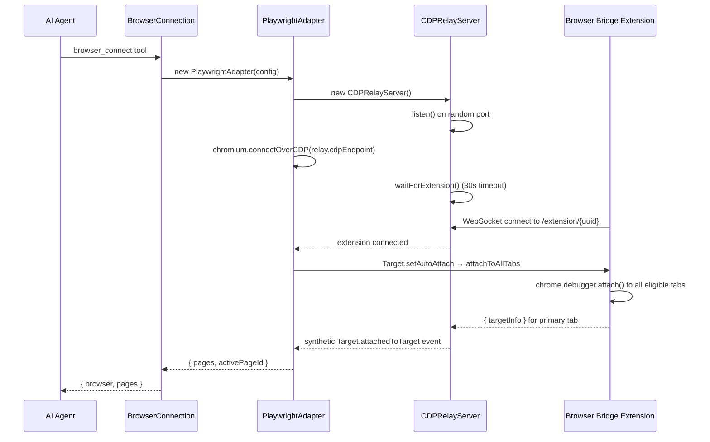

# Browser MCP — Technical Specification

> Feature behaviour is defined in [browser-mcp.md](./browser-mcp.md).
> This document covers the implementation in `packages/@n8n/mcp-browser`.

---

## Table of Contents

1. [Component Overview](#1-component-overview)
2. [Package Structure](#2-package-structure)
3. [Connection Flow](#3-connection-flow)
4. [CDP Relay Architecture](#4-cdp-relay-architecture)
5. [Extension Protocol](#5-extension-protocol)
6. [Tool System](#6-tool-system)
7. [Tab Lifecycle](#7-tab-lifecycle)
8. [Error Model](#8-error-model)

---

## 1. Component Overview

The system involves three runtime components:

- **MCP Server** (`@n8n/mcp-browser`) — hosts MCP tools, manages the
  Playwright connection, and runs the CDP relay.
- **CDP Relay** — WebSocket server bridging Playwright's CDP traffic to the
  Chrome extension.
- **Browser Bridge Extension** (`@n8n/mcp-browser-extension`) — Chrome
  extension that uses `chrome.debugger` to execute CDP commands in the
  user's real browser.

```mermaid
graph LR
    AI[AI Agent / MCP Client]
    MCP[MCP Server]
    PW[Playwright]
    RELAY[CDP Relay Server]
    EXT[Browser Bridge Extension]
    CHROME[Chrome / chrome.debugger]

    AI -- "MCP tool calls" --> MCP
    MCP -- "High-level API\n(page.goto, page.click, ...)" --> PW
    PW -- "CDP over WebSocket\n(/cdp/{uuid})" --> RELAY
    RELAY -- "Extension protocol\n(/extension/{uuid})" --> EXT
    EXT -- "chrome.debugger.*" --> CHROME
```



### Key Classes

| Class | File | Responsibility |
|---|---|---|
| `BrowserConnection` | `connection.ts` | Single-connection lifecycle: connect, disconnect, expose state |
| `PlaywrightAdapter` | `adapters/playwright.ts` | All browser operations via Playwright's high-level API |
| `CDPRelayServer` | `cdp-relay.ts` | WebSocket bridge: translates CDP ↔ extension protocol |
| `ExtensionConnection` | `cdp-relay.ts` (private) | Manages the WebSocket to the extension with request/response tracking |

---

## 2. Package Structure

```
src/
├── adapters/
│   └── playwright.ts        # PlaywrightAdapter — all browser operations
├── tools/
│   ├── index.ts             # createBrowserTools() — tool factory
│   ├── schemas.ts           # Composable Zod schemas and output envelope builders
│   ├── response-envelope.ts # Response enrichment (snapshot, modals, console) and error formatting
│   ├── helpers.ts           # createConnectedTool() — tool factory with auto-enrichment
│   ├── session.ts           # browser_connect, browser_disconnect
│   ├── tabs.ts              # browser_tab_open, browser_tab_list, browser_tab_focus, browser_tab_close
│   ├── navigation.ts        # browser_navigate, browser_back, browser_forward, browser_reload
│   ├── interaction.ts       # browser_click, browser_type, browser_select, browser_drag, ...
│   ├── inspection.ts        # browser_snapshot, browser_screenshot, browser_content, browser_evaluate, ...
│   ├── wait.ts              # browser_wait
│   └── state.ts             # browser_cookies, browser_storage, browser_set_*, ...
├── __tests__/               # Unit tests
├── browser-discovery.ts     # Auto-detect Chrome/Brave/Edge executables
├── cdp-relay-protocol.ts    # TypeScript types for the relay ↔ extension wire format
├── cdp-relay.ts             # CDPRelayServer + ExtensionConnection
├── connection.ts            # BrowserConnection — single-connection manager
├── errors.ts                # Custom error classes
├── index.ts                 # Public API exports
├── server-config.ts         # CLI flag + env var parsing
├── server.ts                # MCP server setup (http/stdio transport)
├── vendor.d.ts              # Type declarations for untyped dependencies
├── types.ts                 # Shared TypeScript types
└── utils.ts                 # Utilities (ID generation, error formatting)
```

---

## 3. Connection Flow

### connect()



### disconnect()

1. `BrowserConnection.disconnect()` calls `adapter.close()`
2. `PlaywrightAdapter.close()` closes the Playwright browser context
3. `CDPRelayServer.stop()` closes all WebSocket connections and the HTTP server
4. Extension detects WebSocket close and detaches from all tabs

---

## 4. CDP Relay Architecture

The relay server runs on `127.0.0.1` on a random port with two WebSocket
endpoints:

- `/cdp/{uuid}` — Playwright connects here (speaks CDP)
- `/extension/{uuid}` — Browser Bridge extension connects here (speaks the
  extension protocol)

### Intercepted CDP Commands

These commands are handled locally by the relay and **not** forwarded to the
extension:

| CDP Command | Relay Behaviour |
|---|---|
| `Browser.getVersion` | Returns synthetic version info |
| `Browser.setDownloadBehavior` | Acknowledged, no-op |
| `Target.setAutoAttach` | On root session: sends `attachToAllTabs` to extension, emits synthetic `Target.attachedToTarget`. On child session: acknowledged, no-op |
| `Target.createTarget` | Sends `createTab` to extension, registers new tab, emits `Target.attachedToTarget` |
| `Target.closeTarget` | Sends `closeTab` to extension, deregisters tab, emits `Target.detachedFromTarget` |
| `Target.getTargetInfo` | Returns cached targetInfo from connectedTabs map |

### Forwarded Commands

All other CDP commands (e.g. `Runtime.evaluate`, `Page.navigate`,
`DOM.getDocument`) are forwarded to the extension via `forwardCDPCommand`.
The relay resolves the Playwright session ID to a Chrome tab ID for routing.

### Session ID Mapping

Playwright uses session IDs (e.g. `pw-tab-1`) to address individual pages.
The relay maintains bidirectional maps:

- `connectedTabs: Map<sessionId, ConnectedTab>` — sessionId → tab info
- `tabIdToSessionId: Map<tabId, sessionId>` — Chrome tab ID → session ID

When forwarding commands, the relay strips the Playwright session ID and adds
the Chrome `tabId` so the extension knows which tab to target.

---

## 5. Extension Protocol

Defined in `cdp-relay-protocol.ts`. Current version: `PROTOCOL_VERSION = 3`.

### Commands (relay → extension)

| Command | Params | Description |
|---|---|---|
| `attachToAllTabs` | `{}` | Attach `chrome.debugger` to all eligible tabs |
| `forwardCDPCommand` | `{ method, params?, sessionId?, tabId? }` | Forward a CDP command to a tab |
| `createTab` | `{ url? }` | Create and attach to a new tab |
| `closeTab` | `{ tabId }` | Close a controlled tab |
| `listTabs` | `{}` | List all controlled tabs |

### Events (extension → relay)

| Event | Params | Description |
|---|---|---|
| `forwardCDPEvent` | `{ method, params?, sessionId?, tabId? }` | CDP event from a tab |
| `tabOpened` | `{ tabId, title, url }` | New tab auto-attached |
| `tabClosed` | `{ tabId }` | Tab was closed |

### Wire Format

Request (relay → extension):
```json
{ "id": 1, "method": "forwardCDPCommand", "params": { "method": "Runtime.evaluate", "params": { "expression": "1+1" }, "tabId": 42 } }
```

Response (extension → relay):
```json
{ "id": 1, "result": { "result": { "type": "number", "value": 2 } } }
```

Event (extension → relay, no `id`):
```json
{ "method": "tabOpened", "params": { "tabId": 99, "title": "New Tab", "url": "https://example.com" } }
```

---

## 6. Tool System

### Tool Factory Pattern

All connected tools are created via `createConnectedTool()` in
`tools/helpers.ts`:

```typescript
createConnectedTool(connection, name, description, inputSchema, async (state, input, pageId) => {
  // state.adapter.* — Playwright operations
  // pageId — resolved from input.pageId or state.activePageId
  return formatCallToolResult({ clicked: true });
}, outputSchema, { autoSnapshot: true, waitForCompletion: true });
```

The factory accepts `ConnectedToolOptions`:
- `autoSnapshot` — append accessibility snapshot, modal state, and console
  summary to the response after the action
- `waitForCompletion` — wrap the action in a network/navigation settle wait

### Schema Composition

Output schemas use `withSnapshotEnvelope()` from `tools/schemas.ts` to
merge tool-specific fields with the auto-injected envelope:

```typescript
import { withSnapshotEnvelope } from './schemas';

const outputSchema = withSnapshotEnvelope({
  clicked: z.boolean(),
  ref: z.string().optional(),
});
// → z.object({ clicked, ref, snapshot?, modalStates?, consoleSummary? })
```

### Response Enrichment Pipeline

The `createConnectedTool` wrapper delegates enrichment to
`tools/response-envelope.ts`:

```
resolvePageContext(connection, args) → { state, pageId }
         ↓
fn(state, args, pageId) — optionally wrapped in waitForCompletion
         ↓
enrichResponse(result, state, pageId, options)
  → inject snapshot (if autoSnapshot)
  → inject modalStates (if any pending)
  → inject consoleSummary (if errors/warnings)
         ↓
return result

On error:
buildErrorResponse(error, connection, args, options)
  → structured { error, hint? } with best-effort snapshot + modals
  → isError: true
```

This wrapper handles:
1. Getting the active `ConnectionState` from `BrowserConnection`
2. Resolving `pageId` (explicit or default to `state.activePageId`)
3. Post-action response enrichment (snapshot, modals, console summary)
4. Non-exclusive error handling — errors still include page context

### Tool → Playwright → CDP → Extension flow

Tools call `PlaywrightAdapter` methods, which use Playwright's high-level API
(e.g. `page.goto()`, `page.click()`, `locator.fill()`). Playwright
internally translates these to CDP commands, which flow through the relay to
the extension, which executes them via `chrome.debugger.sendCommand()`.

Tools never speak CDP directly. The abstraction layers are:

```
Tool code → PlaywrightAdapter → Playwright API → CDP → CDPRelayServer → Extension → chrome.debugger
```

---

## 7. Tab Lifecycle

### Discovery (on connect)

When the extension connects, the relay sends `attachToAllTabs`. The extension:
1. Queries `chrome.tabs.query({})` for all tabs
2. Filters to eligible tabs (http/https URLs only, excludes `chrome://`,
   `chrome-extension://`, `about:`)
3. Calls `chrome.debugger.attach()` on each eligible tab
4. Returns the primary tab's `targetInfo`

### Dynamic Tracking

The extension's service worker listens to Chrome tab events:
- `chrome.tabs.onCreated` — registers new tab, sends `tabOpened`
- `chrome.tabs.onUpdated` (status: 'complete') — updates tab info
- `chrome.tabs.onRemoved` — deregisters tab, sends `tabClosed`

The relay maps these events to Playwright's `Target.attachedToTarget` and
`Target.detachedFromTarget` CDP events.

### Tab Eligibility

A tab is eligible for control if its URL starts with `http://` or `https://`.
Tabs with `chrome://`, `chrome-extension://`, `about:`, or empty URLs are
excluded.

---

## 8. Error Model

Defined in `errors.ts`. All errors extend `McpBrowserError`.

| Error | When |
|---|---|
| `NotConnectedError` | Tool called without an active connection |
| `AlreadyConnectedError` | `browser_connect` called while already connected |
| `PageNotFoundError` | Tool targets a `pageId` that doesn't exist |
| `StaleRefError` | Element ref from a previous snapshot is no longer valid |
| `UnsupportedOperationError` | Operation not supported in the current mode |
| `BrowserNotAvailableError` | Requested browser not found on the system |

### Non-Exclusive Errors

Errors are non-exclusive: when a tool action fails, `buildErrorResponse()`
in `tools/response-envelope.ts` still attempts to include the accessibility
snapshot and modal state in the error response. This gives the AI page
context to understand and recover from failures.

Error responses include structured JSON with an `error` field, optional
`hint` (actionable guidance from `McpBrowserError`), and best-effort
`snapshot` and `modalStates` fields. The `isError: true` flag is set for
MCP SDK compatibility.

Session tools (`browser_connect`, `browser_disconnect`) use a separate
error path via `formatErrorResponse()` in `utils.ts`, since they don't
go through `createConnectedTool`.
