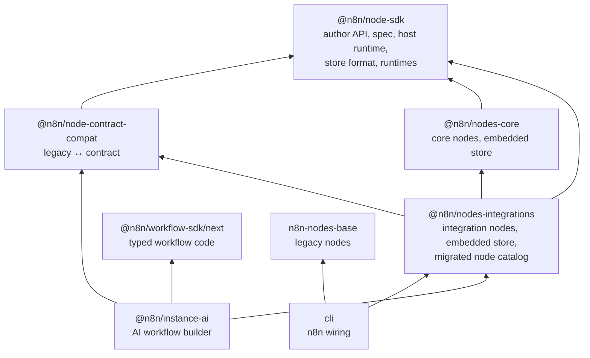
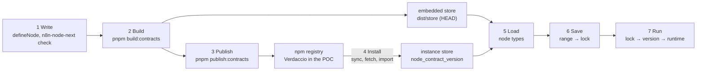
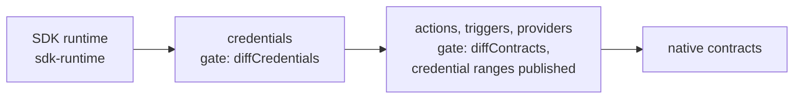
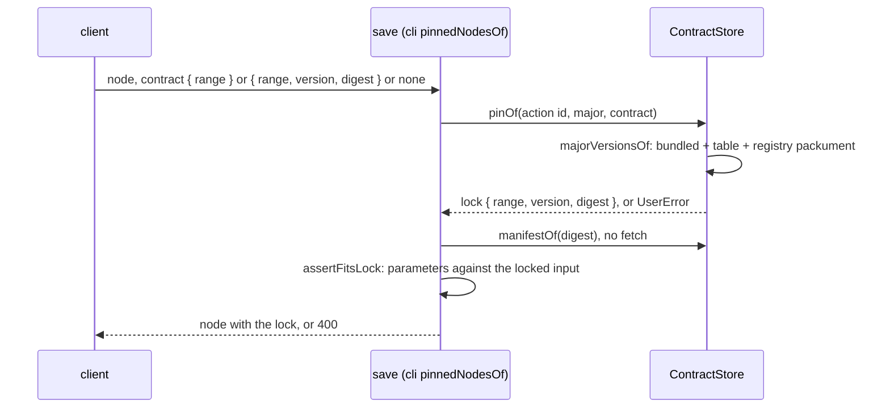
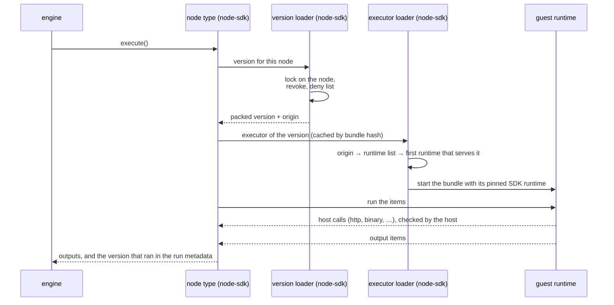

# Architecture of node contracts

Start here. This page tells how the parts fit together and links to the page that has the
details. It does not repeat the rules of those pages.

A **node contract** is one operation of a service, for example `notion.databasePage.getAll`. It
has a manifest (data: inputs, outputs, permissions) and, for most kinds, a bundle (code). n8n
reads the manifest before it loads code, keeps old versions next to new ones, and picks the
isolation of the code from who signed it. The legacy nodes of `n8n-nodes-base` keep running next
to the contract nodes.

The code calls these "node contracts". The product name is "next nodes"
(`N8N_NODES_NEXT_*`). `N8N_INSTANCE_AI_NODE_CONTRACTS_ENABLED` switches the contract nodes on.

## Where to read next

| Question | Page |
|---|---|
| How do I write a node? | [README](../README.md) |
| What is in a manifest, which interface does a bundle get, and when does a version change? | [node-contract.md](node-contract.md) |
| How do credentials, triggers and declarative bindings work? | [credentials-triggers.md](credentials-triggers.md) |
| How do providers (chat models, tools, memory) work? | [providers.md](providers.md) |
| Where does a bundle run, and how is it isolated? | [sandboxed-execution.md](sandboxed-execution.md) |
| What does the host and guest wire protocol look like? | [spec/json-rpc.md](../spec/json-rpc.md) |

## Packages

| Package | Has | Read first |
|---|---|---|
| `@n8n/node-sdk` | `defineNode` and `t` for authors; the spec (`spec/`); the host side that makes n8n node types from packed versions (`toVersionedNodeType`); pack, publish, npm and the store format; the instance store (origin, admission, range locks, import, export) and the version loader; the guest runtimes and the sandbox | `src/runtime.ts`, `src/contract-registry.ts`, `src/npm.ts`, `src/sandbox.ts`, `src/runtime-policy.ts` |
| `@n8n/nodes-integrations` | Integration nodes, one vendor each (`src/nodes/<service>/actions/*.ts`), and the migrated legacy nodes (`MIGRATED_NODES`) | `src/catalog.ts` |
| `@n8n/nodes-core` | Core nodes: flow control, item transforms, host features (wait, webhook, form, schedule, data tables, code), HTTP Request and the AI roots. The engine and the flow SDK may name them by type | `src/index.ts` |
| `@n8n/node-contract-compat` | Derives manifests and typed modules from legacy node descriptions; composes a legacy node version where contract actions run some operations | `src/derive/`, `src/migrate/` |
| `@n8n/workflow-sdk` (`/next`) | The typed workflow code that the AI builder writes, and get-as-code (`decompile.ts`). `@n8n/node-sdk/codegen` makes the module text of each node for it | `src/next/flow.ts`, `src/next/decompile.ts` |
| `@n8n/instance-ai` | Offers the typed node modules to the agent, also at a range, and builds the workflow | `src/tools/next-modules.ts`, `src/tools/workflows/next-workflow-build.ts` |
| `cli` | Loads the node types, locks the range of each contract node at save, keeps the store in the database, makes the runtimes, syncs from the registry, and has the `contracts:*` commands and the versions endpoint of the editor | `src/load-nodes-and-credentials.ts`, `src/node-contracts-*.ts`, `src/commands/contracts/` |
| `@n8n/config`, `@n8n/db` | The settings (`instance-ai.config.ts`, `nodes.config.ts`) and the tables `node_contract_version` and `node_contract_status` | — |

The node packages hold node code and plain catalog data only (`src/catalog.ts`). The host code is
generic and lives in `@n8n/node-sdk`: the store, the version loader and the catalog of the
embedded stores (`src/contract-registry.ts`, `src/catalog.ts`). `cli` gives it the database rows,
the keys, the runtimes and the logger in one `HostRuntime` (`hostRuntime`, `src/runtime.ts`). So
the same logic runs in tests and scripts without n8n.

## Contract nodes and legacy nodes

| | Legacy node | Contract node |
|---|---|---|
| Unit | One class with all resources and operations | One action per operation |
| Description | Written by hand in the class | Made from the contract (`nodeDescriptionOf`) |
| n8n type | `n8n-nodes-base.notion`, `typeVersion` set in the class | `<source package>.<nodeNameOf(id)>`, e.g. `@n8n/nodes-core.httpRequestGet`; `typeVersion` = action major |
| Old versions | Kept in the class code | Separate packed versions in a store. A node sets a semver range, and a save locks one version |
| Comes from | The release only | The release (HEAD), the registry, or an import |
| Permissions | None declared | Declared in the manifest, checked by the host |
| Runs | In the n8n process | In the runtime that its origin allows |

The engine sees both as `INodeType` in one registry (`LoadNodesAndCredentials`). Bridges:

- **Composed versions.** `MIGRATED_NODES` (`nodes-integrations/src/catalog.ts`) adds a new
  version of a legacy node, for example Notion v4. A contract action runs some operations, and
  the legacy version runs the rest (`migrateVersion` of compat). A user sees one Notion node.
- **Hidden single types.** The nodes panel hides the type of each single action
  (`composeContractNodes`). The AI builder and saved workflows still use them.
- **Credentials.** A contract credential type replaces the legacy type of the same name, for
  example `notionApi`. So legacy and contract nodes use one credential
  (`preferContractCredentials`).
- **Native contracts.** A legacy trigger or core node can have a manifest and no bundle. The
  legacy node runs it; the manifest gives the AI builder and the store its contract.
- **Derived modules.** For a legacy node without a contract, the AI builder derives a typed
  module from its description (`deriveModuleVersion` of compat).
- **Tools.** n8n generates the agent tool variant of each action, as it does for legacy nodes.

## Lifecycle

### 1. Write

An author writes `defineNode` and one `node.action(...)` per operation, with the full version in
source (`version: '3.2.0'`), then runs `n8n-node-next check` and `test`. A credential type has
its own version (`defineCredential({ version })`). See the [README](../README.md).

### 2. Build

`pnpm build:contracts` in each first-party package (part of `build`) calls `packPackage`.
It finds the contracts in the exports of `src/nodes/<node>/actions/*.ts`, with no list. It bundles
each action and writes its manifest, bundle and fixtures into `dist/store`, with the SDK runtime.
Pack takes the version from the source, sets the lowest Node Contract version that the bundle
needs, and gives the same bytes for the same source. A bundle imports `@n8n/node-sdk` and
`@n8n/node-sdk/credentials` from the host, and its manifest pins the exact SDK runtime,
`sdk: { version, digest }` (a store version of kind `sdk`). With
`N8N_NODE_CONTRACTS_NPM_REGISTRY`, the build ships the published bytes of each HEAD that the
registry has. It logs a HEAD with unpublished changes that keep the contract and bundle hash,
and fails on any other change under a published version (`assertPublishedMatches`).
The release ships this store, so its versions are first-party with no key check. Details:
[node-contract.md, Versions](node-contract.md#versions) and
[Store layout](node-contract.md#store-layout).

### 3. Publish

`pnpm publish:contracts` publishes the HEAD of each kind in this order, one npm package for each
version, with `npm publish`. The `package.json` holds the index line with the manifest signature, and lists the SDK
runtime and each credential range in `dependencies`. Publish adds only the versions that the
registry does not have. The gate of each kind refuses a bump that is smaller than the change,
and an action whose credential range has no published version. A publisher never changes a
published version: `npm deprecate` yanks or revokes it. During the POC the registry is a local
Verdaccio ([README](../README.md#local-npm-registry)), and publish refuses `registry.npmjs.*`.
Details: [npm packages](node-contract.md#npm-packages),
[Version of an action change](node-contract.md#version-of-an-action-change) and
[Status lines](node-contract.md#status-lines).

### 4. Install

An instance has two sources: the embedded store of its release, and its own store, the
`node_contract_version` table that all mains and workers read. Versions go into the table in
four ways:

| How | When | Code |
|---|---|---|
| Sync of locked versions | At start and at leader takeover, on the leader main, in the background | `NodeContractsSync` |
| Fetch when needed | A run needs a locked version that the table does not have | `contractStore` (`locked`) |
| `n8n contracts:sync` | On demand, from the configured npm registry or `--registry=<url>` | `commands/contracts/sync.ts` |
| `n8n contracts:import --input=<dir>` | A host without network, after `contracts:export` on another host | `commands/contracts/import.ts` |

- Only the leader main and the `contracts:*` commands fetch from the npm registry of
  `N8N_NODE_CONTRACTS_NPM_REGISTRY`. Workers and follower mains only read the table, so they
  need no registry egress.
- The store lists versions from the packument of `npmNameOf(id)` and downloads a tarball only
  for the blobs of a version. An npm deprecation is a yank or, with `revoked:`, a revoke.
- Before the table takes a version, the store checks each blob digest, checks the manifest
  against the lock, and records the **origin** from the key that signed it: `first-party`,
  `community` (vetting key) or `private` (no trusted key). See
  [sandboxed-execution.md, n8n configuration](sandboxed-execution.md#n8n-configuration).
- A version comes with its SDK runtime and the credential versions that its ranges need. n8n
  keeps one version of each credential id, which must take the range of every stored version.
  Else the install fails and names both sides. See
  [Store layout](node-contract.md#store-layout).
- A version that brings a new major logs the permissions that it adds and emits
  `node-contract-installed`.
- After an add, the main tells the other mains to reload their node types (pubsub).

### 5. Load

`ContractNodeLoader` (`cli/src/node-contracts-registry.ts`) makes one versioned node type for
each action id from manifests only. It lists the bundled HEAD of each major, and the stored
versions of the majors that the release does not have. It skips an id that `NODES_EXCLUDE` or
`NODES_INCLUDE` leaves out, a version that `N8N_NODE_PERMISSIONS_DENY` denies, and a stored
version whose Node Contract version this n8n does not run. No bundle loads yet. Then `composeContractNodes` adds
the composed legacy versions and the tool types.

Before `new Workflow`, `prepareNodeContractsRun` adds the stored majors that the workflow needs,
so a node of a major that arrived after start does not fail with `NodeVersionNotFoundError`.

### 6. Save

Each saved contract node has a lock, `contract: { range, version, digest }` next to `typeVersion`
(`INode.contract`). The user sets the range inside the major of the node, e.g. `~3.1.0` or
`>=3.1.0 <3.3.0`. Each save (editor, public API, `import:workflow`, source control pull, AI
builder) writes `version` and `digest`, as `npm install` writes a lockfile (`pinNodeContracts`,
`ContractStore.pinOf`). The digest is the `sha256:` of the manifest bytes.

- A lock without a range reads as `^<version>`. A node without a lock gets `^<newest>`. A range
  outside the major fails the save.
- The save keeps the lock when the range has its version and a source has it. A lock that no
  source has stays only when the save brings it, so that `contracts:sync` can fetch it. Else the
  save locks the newest version in the range that is not yanked or revoked, or fails.
- Only a main that fetches reads the registry packument. The save checks a lock that only the
  registry has at the run.
- A node without `contract` keeps the lock of the stored node with its id. A client with no lock
  yet sends `{ range }`. A trigger has no lock.

The editor shows a Version field in the node settings of a node with `contract`
(`NodeContractVersion.vue`): the lock, the range, and a list of the versions of the major from
`GET /rest/next-nodes/instance/node-versions` (scope `nodeDefinition:list`). After a save, the
editor takes the lock from the response. The AI builder imports a node at a range,
`import { notion } from '@n8n/nodes/notion@~3.1.0'`. `tsc` checks the code against the version
that the range locks (`contractVersionOf`), and the built node gets `contract: { range }`.
Get-as-code writes the range back, but not the default `^<version>` and not a range with a space.

### 7. Run

- **Which version.** A locked node runs exactly the locked version (`contractVersionLoader`). A
  node without a lock of its major runs the HEAD of its major. A newer version gets to a node
  only through a save. The lock travels with the node: a history version, a copy and an export
  keep it. When no source has the locked version, the run fails and names the version.
- **Where it runs.** The origin picks a runtime list (`N8N_NODES_NEXT_RUNTIMES_*`). The first
  runtime in the list that serves the version and is available runs it: `in-process`,
  `worker`, `wasm` or `container`. Each runtime gives the bundle a fresh evaluation of the SDK
  runtime that its manifest pins. See
  [Runtimes and the runtime policy](sandboxed-execution.md#runtimes-and-the-runtime-policy).
- **What it may do.** Every runtime uses the same host checks: egress hosts, credential
  application, response size, binary data. The manifest is the source of the permissions on
  every path. See [node-contract.md, Rules](node-contract.md#rules).

The seams are two fields of the `HostRuntime` (`@n8n/node-sdk/src/runtime.ts`): `versionLoader` and
`executorLoader`. `nodeContractsRuntime` (`cli`) makes one runtime with the n8n settings at start,
and `contractNodeLoadersOf` gives it to the loader of each first-party package.

## Versions in one view

| Level | Example | Who sets it | What it decides |
|---|---|---|---|
| Node Contract | `2.12.0` | The spec. Pack writes the lowest that a bundle needs | Whether this n8n can run the bundle |
| Action major | `notion.databasePage.getAll@1` | The author; a new permission forces a new major | The n8n `typeVersion`. A saved node keeps its major |
| Action minor and patch | `1.2.3` | The author, in the source | Which bundle a node runs inside its major |
| Range | `~1.2.0` in `INode.contract` | The user, in the editor or in AI builder code | The versions that a save may lock |
| Lock | `version` and `digest` in `INode.contract` | The host, at each save | The exact version that a saved node runs |
| SDK runtime | `sdk: { version, digest }` | Pack | The SDK code that the host gives the bundle |
| Credential | `defineCredential({ version: '1.2.0' })`; range `^1.2.0` in the action manifest | The author; `.range()` overrides the default `^<version>` | The one credential version that an instance keeps |

A new permission always needs a new major, and a range stays inside its major, so a new lock
never widens what a node may do. Full rules: [node-contract.md, Versions](node-contract.md#versions).

## Settings that are not in another page

The runtime and key settings are in
[sandboxed-execution.md, n8n configuration](sandboxed-execution.md#n8n-configuration).

| Variable | Default | Meaning |
|---|---|---|
| `N8N_INSTANCE_AI_NODE_CONTRACTS_ENABLED` | `true` (spike) | Loads the contract nodes |
| `N8N_NODE_CONTRACTS_NPM_REGISTRY` | — | The npm registry. Empty: only bundled and stored versions run. Scope and token: [npm packages](node-contract.md#npm-packages) |
| `N8N_NODE_CONTRACTS_REVOKED_ALLOW` | — | `<id>@<version>` list of revoked versions that may still run |
| `N8N_NODE_CONTRACT_RANGE` | `>=2.0.0 <3.0.0` | The Node Contract versions that this n8n runs |
| `N8N_NODE_PERMISSIONS_DENY` | — | Permission classes that no node may have, for example `egress-input` or `code` |
