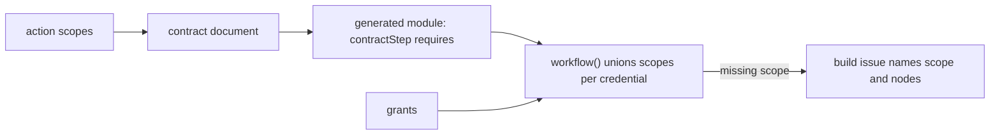
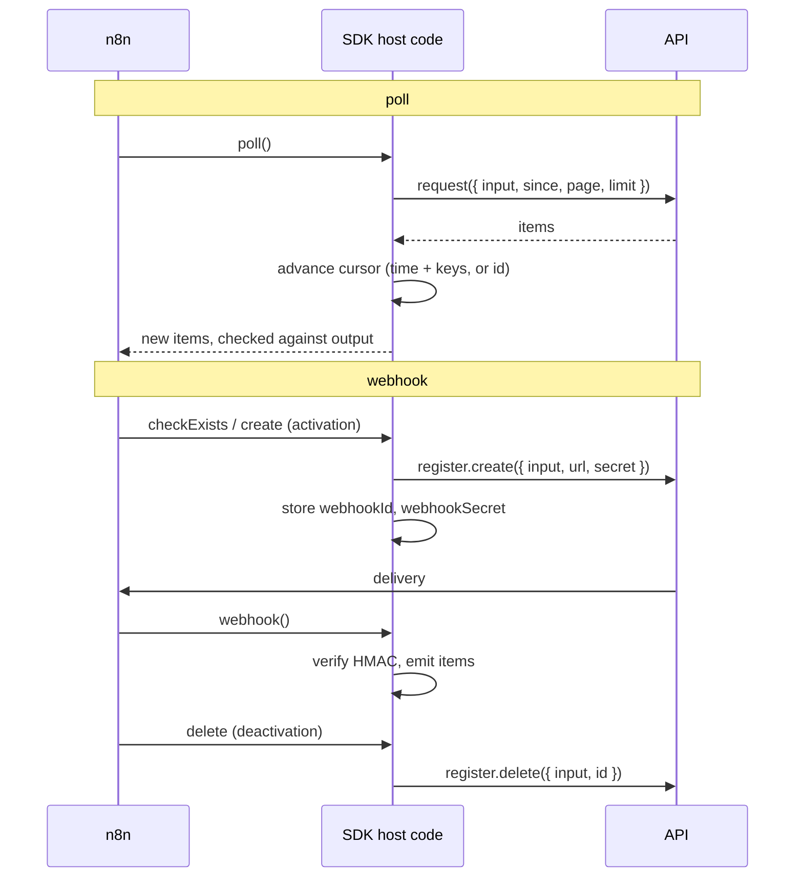

# Credentials, triggers and bindings

For how this part fits in n8n, see [architecture.md](architecture.md).

This document describes how a node contract declares its credential, its triggers, and how
each contract runs. It is the design of the NODE-6071 spike, lane C2.

## Decisions

| Topic | Decision | Why |
|---|---|---|
| Credential | A node has one `credential`: the credential types a user may pick, and a scope vocabulary. | One place to read for the AI builder and for setup. An action cannot list other credentials. |
| Credential types | `defineCredential({ id, legacyName, fields, baseUrl, auth, test })`. `auth` is data first: `a.bearer`, `a.header`, `a.query`, `a.basic`, `a.apply`, `a.when`, `a.oauth2.*`. `a.custom` is the last resort. | n8n owns the secrets and the mechanics. `tsc` rejects a typo in a field, a template or an id. |
| Ids | `service.scheme`, e.g. `notion.token`, `notion.oauth2`. `legacyName` is the n8n type name. | One spelling per concept. Stored credentials and workflows refer to `legacyName`, so they resolve unchanged. |
| Compat | `compat('githubApi', { id, fields, baseUrl })` reuses a legacy class by name. | Saved credentials keep working. `defineCredential` is the primary form. |
| Versions | `defineCredential({ version, minor })`, 1.0 when omitted. Freeze computes the patch: the same manifest bytes keep the last version, other bytes take the next patch. Freeze writes a credential manifest (`spec/manifest.schema.json`), and each action manifest pins `<id>@<major>`. | A new required field, a new host or a new scheme is a major. A compat type has no manifest and no pin. See [node-contract.md](node-contract.md). |
| Scopes | Each action and trigger lists `scopes`. `tsc` rejects a scope that the node's credential does not declare. | The scope need is per contract, so a workflow can compute its union. |
| Scope check | The flow build unions the scopes of all nodes. With `grants`, a missing scope fails the build and names the scope and the nodes. | A missing scope is found before the workflow runs. |
| Triggers | `resource.trigger(event, spec)` next to `resource.action(...)`. Kinds: `poll`, `webhook`. | Same id, version, freeze, and contract hash path as an action. |
| Bindings | `run` (code), `request` (data the host sends), `mcp` (a lifted MCP tool). | A simple action needs no code. An MCP server gives partial contracts at no cost. |
| Node keys | `defineNode` rejects a key that `NodeDefinition` does not have. | The old `credentials` key now fails to compile instead of being ignored. |

## Credential

```ts
export const notionToken = defineCredential({
	id: 'notion.token',
	legacyName: 'notionApi',
	displayName: 'Notion API',
	docs: 'notion',
	fields: { apiKey: field.secret('Internal Integration Secret') },
	baseUrl: 'https://api.notion.com/v1',
	auth: (a) => a.bearer('apiKey', { defaults: { 'Notion-Version': '2022-02-22' } }),
	test: { get: '/users/me' },
});

export const notion = defineNode({
	id: 'notion',
	displayName: 'Notion',
	credential: credential({
		types: [notionToken, notionOAuth2],
		scopes: { 'content:read': 'Read pages, databases and data sources', 'users:read': 'Read users' },
	}),
	baseUrl: 'https://api.notion.com/v1',
});
```

Use the first `auth` that fits:

| Builder | Puts the credential | Example |
|---|---|---|
| `a.bearer(field, { defaults })` | `Authorization: Bearer <field>` | Notion |
| `a.header(name, template)` | one header | `a.header('Authorization', 'token {accessToken}')` |
| `a.query(name, template)` | one query parameter | `a.query('key', '{apiKey}')` |
| `a.basic(username, password)` | HTTP basic | `a.basic('{email}/token', '{apiToken}')` (Zendesk) |
| `a.apply({ headers, query, defaults })` | several places | Datadog, Trello |
| `a.apply({ headers, userHeader: true })` | also one header that the user names (fields `header`, `headerName`, `headerValue`) | OpenAI, Anthropic |
| `a.when(field, cases)` | one placement per value of an options field | an auth-type switch |
| `a.oauth2.authorizationCode(...)` | RFC 6749 §4.1. PKCE S256 is on; a port of a legacy type without PKCE sets `pkce: false` | Notion OAuth2 |
| `a.oauth2.clientCredentials(...)` | RFC 6749 §4.4 | |
| `a.oauth2.deviceCode`, `jwtBearer`, `tokenExchange`, `a.oidc({ issuer })` | RFC 8628, RFC 7523, RFC 8693, OIDC. Data only: n8n core does not run them yet, so `toCredentialType` refuses them | |
| `a.exchange({ post, json, token, headers })` | a token request first, e.g. a login for a session token. `{$token}` is the token | Metabase (parity file) |
| `a.none()` | nothing. The legacy node that uses the type reads its fields | WhatsApp and Facebook trigger apps |
| `a.custom({ reason, sign })` | code signs each request and sees every secret. `reason` is required | the last resort |

- Fields: `field.secret(title)` (masked, only n8n and `custom` read it), `field.text(title)`, `field.url(title)`,
  `field.options(title, { eu: { name: 'Europe' } })` (an options field with labels), or any schema,
  e.g. `t.oneOf('eu', 'us')` for `a.when` or a base URL map.
- Hidden fields: `field.hidden(title, value)` is a value that n8n sets, e.g. the ID of a managed Slack
  app. `field.baseUrl()` holds the `baseUrl` of the type, filled from the other fields, for legacy
  nodes that read the URL from the credential data (xAI, MiniMax). Both are JSON Schema `readOnly`.
- `notice: { text, when: { signatureSecret: '' }, deployment: 'hosted' }` shows a text after the
  fields, optionally only while a field has a value, or only on one kind of deployment.
- OAuth2 endpoints are https URLs or templates over fields (`{server}/login/oauth/authorize`).
  `editableScopes: true` adds the legacy custom-scopes fields. `legacyParent: 'googleOAuth2Api'`
  projects `extends` to that type, so its sign-in button and instance overwrites apply.
- `exchange`: n8n stores the token in a hidden field (`token.field`, a password field) and sends
  the token request again when the field is empty, when `n8n_expires_at` (from
  `token.expiresIn`) has passed, or after a 401. Concurrent requests of one credential share one
  token request. The token request must go to a credential host.
- `renamed: { old: 'new' }` reads a stored value under an old field name when the SDK signs a
  request, runs the token request, or gives `run()` its fields. n8n core reads `baseUrl`, `test`
  and the URL templates by the new name, so a field in them cannot be renamed.
- `run()` gets `credential`: the type name and its fields without secrets, typed per credential
  type. The runtime removes the secrets and derived tokens (raw, base64, URL-encoded, and the
  secret patterns of `@n8n/utils`) from errors, error items and log lines. The OAuth2 client
  secret is a secret. A secret shorter than 4 characters is not removed.
- A template `{field}` must name a field. A secret never goes into `baseUrl` or `test`.
- An empty optional field drops its header or query parameter. `defaults` are set only when the
  request has no header of that name. A placement merges into a new request; it never replaces
  the node's other headers.
- `baseUrl` is a template (`https://{subdomain}.zendesk.com/api/v2`, `{server}`) or a map
  (`{ on: 'region', values: { eu: 'https://…', us: 'https://…' } }`). A value at the start is a
  URL, a value in the host must be one host label, a value in the path is URL-encoded. The base
  URL replaces the node's, and its host is a credential host. `hosts` adds more hosts.
- `test: { get: '/users/me' }` is a GET after `baseUrl` with the credential applied.
  `{ post: '/oauth/access_token', body: { client_id: '{clientId}' } }` is a POST with a body; the
  body may hold secrets, the path never does. `headers` are literal headers the API needs.
- `failWhen: [{ body: { error: 'invalid_auth' }, message }]` fails the test when the response
  body has that value, for an API that answers 2xx to a bad key. Each body names one value, as a
  nested object (`{ error: { type: 'OAuthException' } }`), not a dot path.
  `ignoreHttpStatusErrors: true` lets only `failWhen` decide. Both project to the legacy `rules`
  and request options.

`toCredentialType` projects a type to the legacy `ICredentialType` that n8n core runs. A placement
becomes a generic `authenticate` block. What that block cannot express (`defaults`, optional
fields, `when`) becomes a function that the SDK generates, never author code. OAuth2 becomes an
`oAuth2Api` child. The parity suite (`nodes-base-next/src/__tests__/parity/credentials.parity.ts`)
compares each type with its legacy class and lists each difference.

Stored credential data is not migrated in the database. Each read fills the declared defaults
before it validates, so a field that a newer version adds gets its default. In n8n, core first
fills the projected default of each field, as for a legacy credential: the first option, `false`,
`0` or `''`. So a required field without a declared default does not fail there. The editor saves
only the values that differ from these defaults, so a strict check would break saved credentials.

The freeze step writes a credential manifest for each type that is not `compat` into the
embedded store (`dist/store/index/notion.token.ndjson` and its blob). The n8n loader reads the manifest and
projects the type with `credentialTypeOfManifest`, so no class file and no `package.json` list
exist. With node contracts on, the loader of the contract package goes last, so the projected
type replaces the legacy class of the same name, also for legacy nodes. The replacement keeps
the supported nodes of both packages and the icon of the legacy class.

`publishCredential` adds a credential manifest to the registry with the same store path as
`publishAction`: a signature, and the gate `checkCredentialPublish`. The gate rates the change
with `credentialChangeOf` and refuses a smaller bump:

| Change | Kind |
|---|---|
| Text only: `displayName`, `documentationUrl`, `notice`, the prose of a field | patch |
| A new optional field, another test request, another field type | minor |
| Another name, scheme or base URL, a new host, a removed field, a new required field | major |

The hosts and the base URL of a credential type come from its credential manifest, never from a
bundle: `setCredentialManifests` gives the host lookup, and `loadExecutor`, the trigger loader
and the sandbox read it. n8n registers one type for each name, so the lookup gives the bundled
manifest first, and then the newest one in the instance store. A compat type has no manifest:
it keeps the hosts of the bundle that runs.

When the instance store takes a version from the registry, it also takes each credential
manifest that the version pins, unless n8n bundles that id and major or the store has them. A
version whose pin has no credential manifest of that id and major does not go into the store.
The loader registers a stored credential type of a name that n8n does not bundle.

## Scope check



- The contract document has `scopes` only when the contract lists some. A contract without
  scopes keeps its hash.
- `diffContracts`: the first declaration of scopes is minor (it names a need that existed).
  A new scope on a contract that declared scopes is major (a saved credential may lack it).
  A removed scope is minor.
- `workflow({ name, grants: { notion: ['content:read'] } }, flow)` fails the build with
  `Credential "notion" does not grant scope "content:insert", which "Create" needs`.
  `workflow(...).scopes()` returns the union. A credential that `grants` does not list is not
  checked.
- The contract hash sorts `scopes`, so a new order is no contract change.

## Trigger lifecycle



- Poll state lives in static data: `cursor` and `seen`. A time cursor keeps the keys of the
  items at the latest time, so an API with a coarse clock gives no duplicates. A manual run
  sends one request with `limit: 1`, shows the newest item, and keeps the cursor.
- Webhook state uses the static data keys of the legacy triggers (`webhookId`,
  `webhookSecret`), so a ported trigger reads what the legacy trigger stored. The legacy GitHub
  trigger also stores `webhookEvents`. It never reads it, so the port does not store it.
- A trigger has the same versioning as an action. A major that breaks old input needs
  `migrate` and a migration fixture pair. Publish replays the pair. Trigger execution
  fixtures do not replay.
- A frozen trigger bundle loads on its first call, with the executor loader of the host: in this
  process or in the sandbox, by origin (see `sandboxed-execution.md`). `toVersionedTriggerType`
  builds the n8n node type from the frozen versions, as `toVersionedNodeType` does for actions.
- Each trigger request goes through the executor of an action run, so the egress, the response
  limit and the refusal report of actions apply. A trigger reaches the hosts of its base URLs.
- The trigger contract has `trigger: 'poll' | 'webhook'` and the flow `read, 1:N`. Its `egress`
  holds the node base URL host, and `verify` holds the webhook signature. The host checks the
  signature of the manifest, not the one of the bundle.

## Native triggers

n8n treats some trigger node types in a special way: test URLs, form pages, schedules, manual
runs, verification pin data, and the eval harness read them by type. A native trigger types such a
legacy node. n8n runs the legacy node; the SDK runs nothing.

```ts
export const webhookTrigger = webhook.trigger('trigger', {
	trigger: 'On webhook call',
	summary: 'Starts the workflow when an HTTP request reaches the webhook path.',
	input: { httpMethod: t.oneOf('GET', 'POST'), path: t.str(), responseMode: t.oneOf('onReceived', 'responseNode') },
	output: t.obj({ headers: t.record(t.str()), body: t.declared() }),
	native: { type: 'n8n-nodes-base.webhook', version: 2.2, on: 'webhook' },
	reply: {
		operation: 'respond',
		action: 'Respond to webhook',
		summary: 'Sends the HTTP reply to the webhook caller and passes the items on.',
		native: { type: 'n8n-nodes-base.respondToWebhook', version: 1.5 },
		awaits: { field: 'responseMode', value: 'responseNode' },
		input: { respondWith: t.oneOf('json', 'text') },
	},
});
```

| Part | Meaning |
|---|---|
| `input` | The parameters of the legacy node at `native.version`, as strict as the node allows. The flow emits them as they are. |
| `native.on` | What starts it: `manual`, `schedule`, `webhook`, `form`, or `poll`. The contract document has it in `trigger`. |
| `t.declared()` | An output field whose JSON Schema the workflow declares in `schema`, e.g. `schema: { body: { … } }`. It types the field, and without a `sample` it makes the trigger sample. It is not a node parameter, and n8n does not check the value at run time. Without a schema, the field is open JSON. |
| `x-n8n-entry-fields` | One output field per entry of an input list, e.g. one per form field. The module types it from the config with `EntryFields`, and `Exact` names a misspelt key. |
| `reply` | The step that answers the caller. The module has it beside the trigger (`webhook.respond`). The flow build fails when the trigger waits (`awaits`) and no reply follows, or when a reply follows a trigger that does not wait and no node between them waits (`awaits.field` is `awaits.value`, e.g. a Wait node). |

- `generatedTriggersOf(trigger, nodeType)` gives the factories of a trigger. A native trigger
  emits its legacy node type and version, and its reply.
- A native trigger has no bundle and no node class. `triggerRunOf` throws for it. Freeze
  writes its manifest (`freezeNative`, `NativeManifest`): the contract, the legacy node in
  `native`, and the reply step in `reply`. `publishNative` publishes it with a signature. Its gate
  (`checkNativePublish`) rates the contract as for an action, and a patch must keep the legacy
  node. It has no fixtures: the legacy node runs it.
- An action can be native too: `native: { type, version }` instead of `run` or `request`, e.g.
  `loop.batches` for Loop Over Items. It has the same rules: no bundle, no node class
  (`toNodeType` and `executorOf` throw), and the flow emits the legacy node.

## Bindings

| Binding | Author writes | Who runs it |
|---|---|---|
| `run` | `run({ input, http })` | The bundle's code, through the host executor. |
| `request` | `request: { method, path: '/users/{user}', query, body }` | The host executor sends one request per item. |
| `list` | `list: { path, query, response, items(page), pages }` | The host executor pages through the list. |
| `mcp` | Nothing: `liftMcpTool(node, tool, client)` | The host's MCP client calls the tool. |
| `native` | `native: { type: 'n8n-nodes-base.splitInBatches', version: 3 }` | n8n runs the legacy node. |

- `request.path` is type checked: `{field}` must name a required input field. An optional field
  could leave the segment empty and send the request to another URL. At run time, an empty
  value fails before the request. `query` and `body` values are literals or `{ input: 'field' }`;
  `query` and `headers` can also be a function of the input.
- `request` is for a `per-item` action. A `1:N` action lists with `list`: a `response` schema,
  `items(page, input)`, and optional `pages` (`cursor`, `link` or `offset`). The host checks each
  page, follows the pages, and applies the `paging` input that `pages` adds. `run()` uses `pages()`.
- `liftMcpTool` maps `readOnlyHint` to `read` (idempotent), any other tool to `write`. The input
  is the tool's JSON Schema. The output is typed only with `outputSchema`. Each field gets the
  definitions that its `$ref`s name (`#/$defs/<name>`, `#/definitions/<name>`). A recursive,
  remote or missing ref becomes an open schema, and `issues` reports it.

## Known differences from the legacy GitHub trigger

The port does not have these legacy behaviours (`GithubTrigger.node.ts`):

- It does not refuse a webhook URL on `localhost`.
- On a 422 ("hook exists"), it does not adopt the stored hook with a `PATCH`. The create fails.
- It does not log a warning for a stranded webhook ID that a new create replaces.
- When the create response has no ID or the hook is not active, the create fails. It does not
  delete the remote hook that the request may have made. The legacy trigger does not delete it
  either.
- It does not store `webhookEvents`.

## Open questions

- Grants at build time: the AI builder does not know which stored credential a node binds, nor
  what it grants. The host could read the OAuth `scope` of a stored credential. There is no
  re-consent UI.
- Typed credential fields in `run()`: actions do not read credential fields. Only `baseUrl`
  reads them. A `credential` in `RunContext` needs an ABI bump.
- n8n core does not run the device code, JWT bearer, token exchange and OIDC grants. They need a
  host implementation before a type can use them. Token placement quirks come next.
- Trigger execution fixtures do not replay at publish. A poll fixture could replay pages and
  states. A trigger without a fixtures file publishes without fixtures.
- A declarative request runs from the bundle today. The manifest could carry the request, so a
  host runs it without a bundle.
- MCP tools are not frozen: a lifted tool has no bundle and no semver beyond `1.0.0`.
- The version loader (`setContractVersionLoader`) does not apply to triggers. They run HEAD.
- Projected credential types are not registered in `package.json`. The legacy classes stay the
  definitions until nodes-base drops them.
