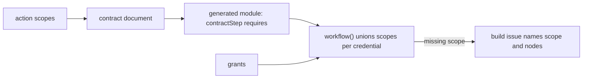
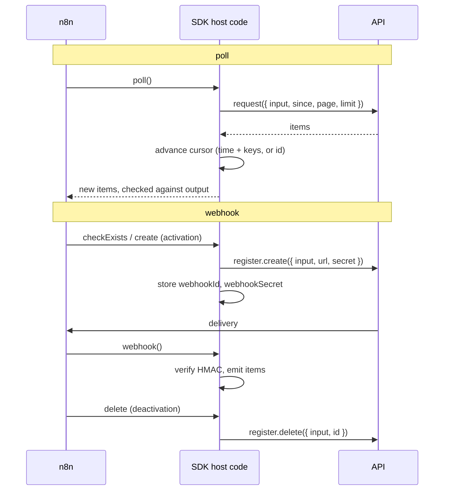

# Credentials, triggers and bindings

This document describes how a node contract declares its credential, its triggers, and how
each contract runs. It is the design of the NODE-6071 spike, lane C2.

## Decisions

| Topic | Decision | Why |
|---|---|---|
| Credential | A node has one `credential`: the credential types a user may pick, and a scope vocabulary. | One place to read for the AI builder and for setup. An action cannot list other credentials. |
| Credential types | Values: `apiKey`, `bearer`, `oauth2`, `custom`, `compat`. | `tsc` rejects a typo or a missing import. `toCredentialType` projects a value to an n8n `ICredentialType`. |
| Compat | `compat('notionApi')` reuses a legacy class by name. | Saved credentials keep working. The typed value is the primary form. |
| Scopes | Each action and trigger lists `scopes`. `tsc` rejects a scope that the node's credential does not declare. | The scope need is per contract, so a workflow can compute its union. |
| Scope check | The flow build unions the scopes of all nodes. With `grants`, a missing scope fails the build and names the scope and the nodes. | A missing scope is found before the workflow runs. |
| Triggers | `resource.trigger(event, spec)` next to `resource.action(...)`. Kinds: `poll`, `webhook`. | Same id, version, freeze, and contract hash path as an action. |
| Bindings | `run` (code), `request` (data the host sends), `mcp` (a lifted MCP tool). | A simple action needs no code. An MCP server gives partial contracts at no cost. |
| Node keys | `defineNode` rejects a key that `NodeDefinition` does not have. | The old `credentials` key now fails to compile instead of being ignored. |

## Credential

```ts
export const notion = defineNode({
	id: 'notion',
	displayName: 'Notion',
	credential: credential({
		types: [notionApi, notionOAuth2Api],
		scopes: { 'content:read': 'Read pages, databases and data sources', 'users:read': 'Read users' },
	}),
	baseUrl: 'https://api.notion.com/v1',
});
```

- `custom` signs a request in code. Notion needs it: its legacy type sets `Notion-Version` only
  when the request has none.
- `oauth2` is configuration only. The projection extends `oAuth2Api`, so n8n core runs the flow.
- A type may have `fields` (settings code may read) and `secrets` (only n8n reads them). A type
  with `baseUrl(fields)` replaces the node's base URL, e.g. a GitHub Enterprise server.
- A type declares `hosts`, the hosts n8n may send it to. The host of `baseUrl(fields)` is
  added. See "Egress and credential hosts" in `sandboxed-execution.md`.
- `credential({ ..., optional: true })` lets the node run without a credential (HTTP Request).

The parity suite proves that `toCredentialType(notionApi)` and `toCredentialType(notionOAuth2Api)`
equal the legacy classes and sign requests byte for byte.

## Scope check



- The contract document has `scopes` only when the contract lists some. A contract without
  scopes keeps its hash.
- `diffContracts`: the first declaration of scopes is minor (it names a need that existed).
  A new scope on a contract that declared scopes is major (a saved credential may lack it).
  A removed scope is minor.
- `workflow({ name, grants: { notion: ['content:read'] } }, flow)` fails the build with
  `Credential "notion" does not grant scope "content:insert", which "Create" needs`.
  `workflow(...).scopes()` returns the union. A credential that `grants` does not list is not
  checked.
- The contract hash sorts `scopes`, so a new order is no contract change.

## Trigger lifecycle



- Poll state lives in static data: `cursor` and `seen`. A time cursor keeps the keys of the
  items at the latest time, so an API with a coarse clock gives no duplicates. A manual run
  sends one request with `limit: 1`, shows the newest item, and keeps the cursor.
- Webhook state uses the static data keys of the legacy triggers (`webhookId`,
  `webhookSecret`), so a ported trigger reads what the legacy trigger stored. The legacy GitHub
  trigger also stores `webhookEvents`. It never reads it, so the port does not store it.
- A trigger has the same versioning as an action. A major that breaks old input needs
  `migrate` and a migration fixture pair. Publish replays the pair. Trigger execution
  fixtures do not replay.
- A frozen trigger bundle loads on its first call. `toVersionedTriggerType` builds the n8n node
  type from the frozen versions, as `toVersionedNodeType` does for actions.
- The trigger contract has `trigger: 'poll' | 'webhook'` and the flow `read, 1:N`.

## Native triggers

n8n treats some trigger node types in a special way: test URLs, form pages, schedules, manual
runs, verification pin data, and the eval harness read them by type. A native trigger types such a
built-in node. n8n runs the built-in node; the SDK runs nothing.

```ts
export const webhookTrigger = webhook.trigger('trigger', {
	trigger: 'On webhook call',
	summary: 'Starts the workflow when an HTTP request reaches the webhook path.',
	input: { httpMethod: oneOf('GET', 'POST'), path: str(), responseMode: oneOf('onReceived', 'responseNode') },
	output: obj({ headers: record(str()), body: declared() }),
	native: { type: 'n8n-nodes-base.webhook', version: 2.2, on: 'webhook' },
	reply: {
		operation: 'respond',
		action: 'Respond to webhook',
		summary: 'Sends the HTTP reply to the webhook caller and passes the items on.',
		native: { type: 'n8n-nodes-base.respondToWebhook', version: 1.5 },
		awaits: { field: 'responseMode', value: 'responseNode' },
		input: { respondWith: oneOf('json', 'text') },
	},
});
```

| Part | Meaning |
|---|---|
| `input` | The parameters of the built-in node at `native.version`, as strict as the node allows. The flow emits them as they are. |
| `native.on` | What starts it: `manual`, `schedule`, `webhook`, or `form`. The contract document has it in `trigger`. |
| `declared()` | An output field whose JSON Schema the workflow declares in `schema`, e.g. `schema: { body: { … } }`. It types the field, and without a `sample` it makes the trigger sample. It is not a node parameter, and n8n does not check the value at run time. Without a schema, the field is open JSON. |
| `x-n8n-entry-fields` | One output field per entry of an input list, e.g. one per form field. The module types it from the config with `EntryFields`, and `Exact` names a misspelt key. |
| `reply` | The step that answers the caller. The module has it beside the trigger (`webhook.respond`). The flow build fails when the trigger waits (`awaits`) and no reply follows, or when a reply follows a trigger that does not wait and no node between them waits (`awaits.field` is `awaits.value`, e.g. a Wait node). |

- `generatedTriggersOf(trigger, nodeType)` gives the factories of a trigger. A native trigger
  emits its built-in node type and version, and its reply.
- A native trigger is not frozen and has no node class. `triggerMethodsOf` throws for it.

## Bindings

| Binding | Author writes | Who runs it |
|---|---|---|
| `run` | `run({ input, http })` | The bundle's code, through the host executor. |
| `request` | `request: { method, path: '/users/{user}', query, body, items }` | The host executor. No author code runs. |
| `mcp` | Nothing: `liftMcpTool(node, tool, client)` | The host's MCP client calls the tool. |

- `request.path` is type checked: `{field}` must name a required input field. An optional field
  could leave the segment empty and send the request to another URL. At run time, an empty
  value fails before the request. `query` and `body` values are literals or `{ input: 'field' }`.
- A `1:N` request must name `items`, the response field with the items. A `per-item` request
  cannot name it. A declarative request reads one page: it has no `next`. A paged endpoint
  needs `run` with `paginate`.
- `liftMcpTool` maps `readOnlyHint` to `read` (idempotent), any other tool to `write`. The input
  is the tool's JSON Schema. The output is typed only with `outputSchema`. It reports schema
  keywords that the validator does not check, e.g. `$ref`.

## Known differences from the legacy GitHub trigger

The port does not have these legacy behaviours (`GithubTrigger.node.ts`):

- It does not refuse a webhook URL on `localhost`.
- On a 422 ("hook exists"), it does not adopt the stored hook with a `PATCH`. The create fails.
- It does not log a warning for a stranded webhook ID that a new create replaces.
- When the create response has no ID or the hook is not active, the create fails. It does not
  delete the remote hook that the request may have made. The legacy trigger does not delete it
  either.
- It does not store `webhookEvents`.

## Open questions

- Grants at build time: the AI builder does not know which stored credential a node binds, nor
  what it grants. The host could read the OAuth `scope` of a stored credential. There is no
  re-consent UI.
- Typed credential fields in `run()`: actions do not read credential fields. Only `baseUrl`
  reads them. A `credential` in `RunContext` needs an ABI bump.
- Trigger execution fixtures do not replay at publish. A poll fixture could replay pages and
  states.
- A declarative request runs from the bundle today. The manifest could carry the request, so a
  host runs it without a bundle.
- MCP tools are not frozen: a lifted tool has no bundle and no semver beyond `1.0.0`.
- The version loader (`setContractVersionLoader`) does not apply to triggers. They run HEAD.
- Projected credential types are not registered in `package.json`. The legacy classes stay the
  definitions until nodes-base drops them.
