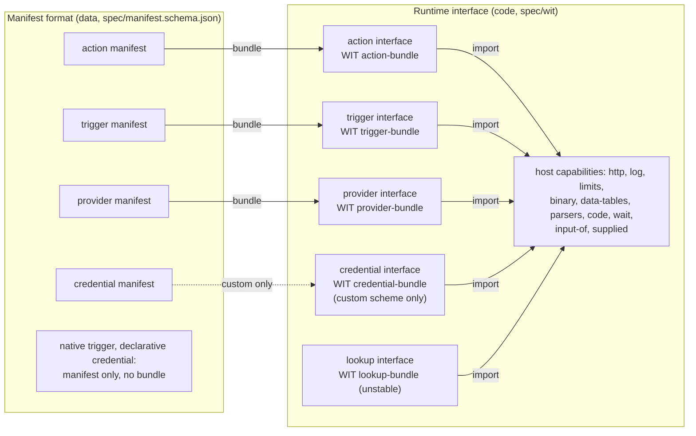

# The Node Contract

For how this part fits in n8n, see [architecture.md](architecture.md).

The Node Contract is the spec between nodes and the n8n engine. It has one version,
`n8n:node-contract@x.y.z` (now 2.12.0), and two parts:

- The **manifest format** tells what a thing is, as data. The host reads a manifest before it
  loads code. Source: `src/manifest.ts`. Spec: `spec/manifest.schema.json` (JSON Schema
  2020-12).
- The **runtime interface** tells how a bundle runs. Spec: the WIT package in `spec/wit/`, and
  the JSON-RPC form in `spec/json-rpc.md` and `spec/<kind>.openrpc.json`.



## Terms

| Term | Meaning |
|---|---|
| kind | The manifest field `kind`: `action`, `trigger`, `provider` or `credential`. `lookup` has an interface, but no manifest yet. |
| `<kind>` interface | The imports and exports of one kind, for example "the action interface". Only the `.wit` files call it a world (`action-bundle`). |
| host, guest | The n8n side that runs and enforces; the code of a bundle in the sandbox. |
| manifest | The data of one version of an action, trigger, provider or credential. |
| bundle | The code of one version, if it has code. It targets the interface of its kind. |
| capability | What the host gives a guest: a WIT import (`http`, `binary`, `data-tables`, `parsers`, `code`, `wait`, …). |
| permission | A capability or a limit that a manifest declares and the host grants: imports, egress hosts, scopes, effect. |
| provider | A node that supplies a capability (chat model, memory, tool, embeddings) to a root node. The UI calls it a sub-node. |

## Versions

| Version | Of what | Where | At run time |
|---|---|---|---|
| Node Contract version | the spec | `nodeContract` in each manifest; the WIT package version | Yes: the host range `N8N_NODE_CONTRACT_RANGE` (default `>=2.0.0 <3.0.0`) and the newest minor that the host implements |
| action, trigger, provider version | the content | `semver` (the major is the n8n `typeVersion`). The source sets all of it: `version: '3.2.0'`, `1.0.0` when omitted. Pack writes it. With `N8N_NODE_CONTRACTS_NPM_REGISTRY` it ships the published bytes of a published version with the same contract and bundle hash. Publish skips such a version and refuses any other change | Yes: a node sets a range in its major, and a save locks one version in it ([architecture.md, Save](architecture.md#6-save)) |
| credential version | the content | `semver` of the credential manifest, from `defineCredential({ version })`; an action pins a range in `credentials`, e.g. `{ "notion.token": "^1.2.0" }`: `^<version>`, or the range of `type.range('>=1.1 <3')` | Yes: an instance keeps one version of each credential id, in every range that pins it |
| SDK version | `@n8n/node-sdk` | `sdk: { version, digest }` in each bundled manifest | Yes: the host gives the bundle the SDK runtime of that digest |
| n8n version | the product | — | Only through the Node Contract range it supports |

What each minor added (`@since` in the WIT, `x-n8n-since` in the schema):

| Version | Adds |
|---|---|
| 2.0.0 | `http`, `log`, `limits`; the `run` resource |
| 2.1.0 | `item-run`: the current item, the `batch` cardinality, named outputs |
| 2.2.0 | `binary` |
| 2.3.0 | `data-tables`, `code`, `wait`, `input-of`; `join-run` (named inputs); `capabilities`, `supplied`, the provider interface |
| 2.4.0 | the `list` binding and `t.pageValue()` inputs (JS runtime only, no WIT form) |
| 2.5.0 | the manifest fields `kind`, `nodeContract`, `sdk`, `credentials`; credential manifests; the trigger and credential interfaces; the `run-credential` import (the plain credential fields of `run()`); `provider.describe` |
| 2.6.0 | counted inputs (`inputs: { count }` in the contract): a parameter sets the number of inputs, and `join-run` takes one list per input; output key patterns that hold binaries (`t.indexedBinaries()`, `t.openBinaries()`) |
| 2.7.0 | the contract field `runtime`: a container image pinned by digest; the `chunk` import (`chunk.item`) |
| 2.8.0 | the `parsers` import (`parsers.extract`): the host reads a CSV, XLSX, JSON, text or PDF file with the parsers of n8n |
| 2.9.0 | the host module `@n8n/node-sdk/validator` and the `schema` import (`schema.validate`): the host validates against JSON Schema 2020-12 with ajv, so no bundle and no guest carries a validator. The host refuses a guest schema of more than 256 KiB, of more than 64 levels, or with a pattern that can take more than linear time. The same limits apply to the `input` and `output` schemas of a sandboxed version that is not first-party: the host does not load it |
| 2.10.0 | the `guest` of a version (`http`: the bundle is the JSON config of the generic HTTP guest, which runs in this process) and `errorOf`: the n8n expression that the host checks each response with |
| 2.11.0 | the SDK runtime: a bundle imports `@n8n/node-sdk` and `@n8n/node-sdk/credentials` from the host, and its manifest pins the runtime with `sdk: { version, digest }`. The runtime is a store version of kind `sdk` (id `sdkRuntime`). Credential and native manifests have no `sdk` |
| 2.12.0 | credential pins by semver range: `credentials: { "notion.token": "^1.2.0" }`. A host reads an older pin `<id>@<major>` as `^<major>` |
| unstable | `credential.exchange`, `credential.refresh` (`credential-exchange`); the lookup interface (`lookup`) |

The host reads only manifests with `nodeContract`. It refuses a manifest without it, such as
one packed before 2.5.0, and a bundle of Node Contract 1.x. Pack such a version again. The
index line of a version in a store also states `nodeContract`.

## Store layout

The embedded store of a release and an instance export use one layout (`src/store.ts`). The
registry is an npm registry, see [npm packages](#npm-packages). An
instance keeps its versions of all kinds, also credential and native manifests, in the
`node_contract_version` table: one row for each manifest digest, with the origin of the version
from its signing key (see sandboxed-execution.md). `n8n contracts:import --input=<dir>` adds the verified versions of a folder to the
table, and `n8n contracts:export --output=<dir> [--pinned]` writes the table in this layout.
The table never takes other bytes for a stored `id@version` of any kind. It refuses a version
whose credential pin has no credential manifest of that id and range in the same admission, in
the table, or in the embedded store. n8n does not list a stored version whose pin does not
resolve, and registers no node type for it.

n8n stores credential data by name, so it keeps one version of each credential id. The ranges are
the pins of every stored and added version. The choice is the bundled version (checked against the added ranges only), else the installed
(newest stored) version when every range takes it, else the newest higher version that every
range takes. When no version fits, the admission fails and names both sides. A download fetches
a credential only when no bundled or stored version fits.

| File | Content |
|---|---|
| `catalog.json` | `{ "versions": [...] }`: the index line of the newest version of each id that is not yanked or revoked. `withdrawn` lists each id whose every version is yanked or revoked, so an import still finds it |
| `index/<id>.ndjson` | One line for each version and one line for each status. A writer only appends. A reader skips a line that it does not know |
| `blobs/sha256/<hex>` | The manifest, bundle and fixtures bytes. The name is the SHA-256 of the bytes |

The digest of a version is `sha256:` of its manifest bytes. The manifest holds `bundleHash` and
`contractHash`, so the digest covers the code and the contract. A credential manifest and a
native manifest have no bundle. The line of a credential has its n8n type `name`, and the line
of a native version has its legacy node type in `native`, so a reader finds them from the index. A reader checks each blob
against its digest, and the fields of each index line against the manifest. A line can also
have `fixtures`, `signatures` (ed25519 over the manifest bytes, `key` is `sha256:` of the public
key) and `published`. Pack adds none of them, so it writes the same bytes for the same source.
When the build ships the published bytes of a version, it writes the published `fixtures` too.

### Status lines

A publisher never changes a version line. To withdraw or deprecate a version, it appends a
status line (`addStatusToStore`):

```json
{"id":"gmail.message.get","yank":"1.0.4","reason":"sends Bcc as Cc","at":"2026-10-02T12:00:00.000Z"}
{"id":"gmail.message.get","revoke":"1.0.4","reason":"leaks the token","at":"…"}
{"id":"gmail.message.get","deprecate":"1","message":"Use major 2","use":"gmail.message.get@2","at":"…"}
```

- **Yank**: a save locks no new node to the version. A node that has a lock of it keeps it and
  still runs it. For a major that only the store has, the node type lists the newest version that
  is not withdrawn. The embedded HEAD stays the projected version of its major: when a major has
  no other version, a save leaves the node without a lock, and the node runs the yanked HEAD.
- **Revoke**: a yank, and the host also refuses to run the version. An admin can allow it with
  `N8N_NODE_CONTRACTS_REVOKED_ALLOW=<id>@<version>,…`.
- **Deprecate**: `major`, `major.minor` or `major.minor.patch`. The reader gives the line
  (`StoreReader.index`). The host does not act on it yet.

A status line has no signature. It applies to every version of its id, whatever the origin of
the version. The source of the line gives the trust: the npm registry auth, the admin who runs
`n8n contracts:import`, or the instance. A line only reduces what runs. The instance keeps the
lines in the `node_contract_status` table. `n8n contracts:import` takes every line of the folder,
also when a key is set. It ignores a `signatures` field of a line from an older folder.
The lines arrive with `n8n contracts:import`, with `contracts:export`, and from the npm
registry for each id that the leader main reads (a sync of the locked ids, a download, the
version list of a save). `contracts:export` writes only the yank and revoke lines of the versions
that it writes. An embedded HEAD is not a stored version, so the export drops its lines.

In an npm registry, `pnpm publish:contracts yank|revoke <id>@<version> <reason>` in a source
package runs `npm deprecate <name>@<version> <message>`. A host reads every npm deprecation as a
yank. The message of a yank is the reason, and the message of a revoke is `revoked: <reason>`.
The POC has no deprecation that is not a yank. The host reads the `deprecated` field of each
version in the packument and makes a yank or revoke line with `registry: <url>`. Its `at` is
the publish date of the version: npm keeps no date of a deprecation.

### npm packages

`pnpm publish:contracts` publishes each version as one npm package with `npm publish`
(`src/npm.ts`). The package name is the scope and the id in lower case, with a hyphen for each
camelCase step: `httpRequest.get` gives `@n8n-nodes/http-request.get`. `@n8n-nodes` is a
placeholder of the POC. Two ids can give one name, so publish refuses a package that holds
another id.

| File | Content |
|---|---|
| `package.json` | Generated: `name`, `version` (the manifest `semver`), `description` (the summary), `license`, `repository` and `author` of the source package, `dependencies` (`<scope>/sdk-runtime` at the exact `sdk.version`, and each credential package at its range), and `n8n`: the index line of the version without `version` and `manifest`, with the `fixtures` digest and the ed25519 `signatures` of the manifest bytes, and `digest` (`sha256:` of the manifest bytes) |
| `manifest.json` | The exact manifest bytes, so the digest is the store digest |
| `bundle.cjs` | The bundle, when the version has one |
| `fixtures.json` | The fixtures that publish replayed, when the version has them |
| `signatures.json` | Only in a package from before the index fields of `n8n`: the ed25519 signatures of the manifest bytes |

Publish runs in this order: the SDK runtime, the credentials, the actions, triggers and
providers, then the native contracts. It reads the packument and adds only the versions that the
registry does not have. It skips a published version with the same `n8n.digest` or the same
contract and bundle hash (`assertPublishedMatches`), and refuses any other change ("bump the
version in source"). The gate of each kind (`diffContracts`, `diffCredentials`) compares the new
version with the newest published version below it, read from its tarball. Publish refuses a
version whose credential range has no published version that is not deprecated. A version below
the newest one gets the npm tag `latest-<major>`. During the POC the registry is a local
Verdaccio ([README](../README.md#local-npm-registry)): publish refuses `registry.npmjs.*`.

n8n reads the same packages (`npmStoreReader`). For an id, it makes the index lines from the
`n8n` fields of the packument, so a list of versions (e.g. the candidates of a save) downloads
no tarball. It downloads the tarball of a version once, when it reads a blob of that version, and
checks each blob against its digest: the manifest against `n8n.digest`, the bundle against
`bundleHash`. For a package from before the index fields, it downloads the tarball to make the
index line from `manifest.json` and `signatures.json`. It sends the token to the registry host
only.

| Variable | What |
|---|---|
| `N8N_NODE_CONTRACTS_NPM_REGISTRY` | The npm registry, e.g. `http://localhost:4873` |
| `N8N_NODE_CONTRACTS_NPM_SCOPE` | The npm scope. Default: `@n8n-nodes` |
| `NPM_TOKEN` | The registry token. Publish writes `${NPM_TOKEN}` into a temporary `.npmrc`, so the token is never on the command line |
| `N8N_NODE_CONTRACTS_NPM_TOKEN` | The bearer token that n8n sends to read the registry. n8n does not log it |
| `N8N_NODE_CONTRACTS_SIGNING_KEY_FILE` | The PEM file of the ed25519 publisher key. A yank, revoke or deprecation does not need it |

## Rules

- Pack writes the lowest version that has what a bundle uses
  (`requiredNodeContractOf`): 2.12.0 for a credential pin, 2.11.0 for a bundle that imports the SDK runtime, 2.10.0 for an `errorOf` expression, 2.9.0 for a bundle that imports the validator module, 2.8.0 for the `parsers` import, 2.7.0 for a `runtime` image, 2.6.0 for counted inputs or a binary key pattern, 2.4.0 for a
  `list` binding or a `t.pageValue()` input, 2.3.0 for host imports, named inputs or a provider
  capability, 2.2.0 for a binary field, else 2.1.0. So an older host still runs it. A JS trigger bundle follows the same rule: hosts before 2.5.0 run
  triggers in JS. The trigger interface of 2.5.0 is its WIT form, for a sandbox runner.
- The host runs a bundle when its version is in the configured range and the host implements
  that minor. Raise the lowest major of the range only in an n8n major release.
- A reader ignores a top-level manifest field that it does not know. A field that changes what
  the host must do comes with a higher `nodeContract`, so an older host refuses the bundle.
  Exception: the spike added `nodeDisplayName`, `credentialOptional`, `endpoint` and `verify` to
  the contract at 2.6.0 with no version bump, and the trigger `egress`. It also added `describe`,
  `check` and the poll time `at` to the trigger interface, and `migrate` to the action
  interface at 2.7.0. Pack all spike versions again.
- A new item in the host interfaces raises the one Node Contract minor. A bundle that does not
  use the new item keeps its lower `nodeContract`.
- The contract hash covers only `contract`. The manifest fields `kind`, `nodeContract`, `sdk`
  and `credentials` are outside it.
- A manifest has no node description. The host makes the description of each version from
  `contract` and the optional `ui` block (`nodeDescriptionOf`), so the editor shows only what
  the contract types. The contract gives the labels (`nodeDisplayName`, `action`, `summary`,
  field `title` and `x-n8n-hint`), `credentialOptional` (the user can pick no credential) and,
  for a webhook trigger, `endpoint` (default `POST` on `webhook`; the contract keeps only
  values that differ from the default). All versions have the same projection.
- The form: the label of a field is its `title` (`.title()`). An options field shows the
  labels of `x-n8n-options` (`.options()`). The first of `examples` is the placeholder.
  `minimum` and `maximum` limit a number. A variant is a collection with a tag dropdown (the
  branch `title` is the label, `t.variant(tag, branches, labels)`) and the fields of each
  branch, which show only for their tag. The collection holds the contract value as it is.
  `fields.<variant>.widget: 'json'` keeps one JSON field for a variant instead.
- The limit of a variant collection: n8n stores it as a node-parameter collection. n8n core
  turns a string under a collection into `{}`. So JSON text or one whole-field expression
  (`={{ … }}`) for a variant is not kept. An expression inside a branch field works. The form
  of an agent tool keeps a variant as JSON.
- The `ui` block (`ui` of an action, a trigger or a provider, `manifest.ui`) is for the n8n form only: `order`,
  `advanced` and `fields` (a placeholder and a widget per field, `field.branchField` in a
  variant). Agents and MCP do not read it, and it is outside the contract hash. An `advanced`
  field goes into one "Options" collection, so its n8n parameter is `options.<field>`
  (`nodeParametersOf` writes a contract value so, and the typed flow build does the same with
  `advancedFieldsOf`). n8n stores the parameters in the form of the
  newest version of a major. So a change that moves where or how a field is stored (into or out
  of `advanced`, a variant to or from the `json` widget, also of a nested branch field) is a major. A widget is an entry of
  the `Widgets` interface: the value type it edits and its config. The host shows an unknown
  widget as the default field. The form of an agent tool keeps each field at the top and a variant as JSON,
  because the model fills a whole field with one `$fromAI()` expression.
- Codec widgets store another form than the contract value. `filter` (a `where` field, the
  standard `where` schema) stores the n8n filter value. `assignments` (a record) stores n8n
  field assignments. `list` (a list of objects) stores rows of a fixed collection; an item
  field takes its widget at `field.itemField`, e.g. `'cases.where': { widget: 'filter' }`.
  The host owns the stored form: the runtime, `contractInputOf` and `contractParametersOf`
  read it back with the widget of the newest version, and also read the contract value and
  JSON text. `storedParametersOf` and `nodeParametersOf` write it. The typed flow build
  writes contract values; the host stores them before it saves the workflow.
- The limit of a `list`: n8n drops an array or a string under a fixed collection when it
  loads a node. So a list stored as an array or as one whole-field expression is lost before
  a run. The typed flow never writes either; read and rebuild a saved workflow to move it.
- The JSON editor of a `json` field keeps the value as text after an edit. The runtime reads
  the text as its value, and so does the typed source of a saved workflow (`jsonFieldPathsOf`).
- A node with a credential selector stores the picked type in the `authentication` parameter.
  The generated module of the node type takes `authentication`, so typed source keeps it.
- Every input field needs a `title`, at every depth: object fields, variant and union
  branches, and list items. The form shows no field name as a label. `missingTitlesOf` lists
  the fields without one, and `checkAction` and the publish gates refuse them, also in the
  reply step of a native trigger. A variant tag and a sub-node input need none.
- A credential major changes when stored data or a saved workflow can break: a new required
  field, a new host, a new scheme (`diffCredentials`). A compat credential type has no manifest
  and no pin.
- An action major changes when it adds a permission: a scope, an egress host, an import, a
  provider call, binary data access or a credential type. A range stays inside its major, so a
  new lock never widens what an action may do. `diffContracts` reads the permissions from
  `permissionsOf`.
- The manifest is the permission source on both run paths. Pack writes every static host
  into `contract.egress.hosts`, also the host of the node `baseUrl`, so that host is in the
  contract hash. `loadExecutor` (in this process) refuses a bundle whose export grants other
  permissions than its manifest, and it takes `egress` from the manifest. The
  sandbox reads only the manifest, and refuses a bundle whose `baseUrl` host is not in it.
- WIT describes only code that runs. A native trigger and a declarative credential scheme have
  a manifest and no bundle. Publish adds actions, triggers, providers, credential types and
  native contracts to the same store, each with the gate of its kind.
- Binary key patterns (`t.indexedBinaries()`, `t.openBinaries()`, an output `patternProperties`
  entry with `x-n8n-binary`) use the `binary` import of 2.2.0, but a host before 2.6.0 keeps
  such a binary in the JSON. So pack writes 2.6.0.
- Counted inputs: the contract `inputs: { count: '<field>' }` names an integer input field with
  `minimum` and `maximum` (`lintContract`). The host makes one n8n input per count from the
  parameter, as the legacy Merge node does with `numberInputs`, and `run()` gets one item list
  per input. A host before 2.6.0 cannot make the inputs, so pack writes 2.6.0.
- An output keyword that a host ignores does not raise the Node Contract minor:
  `x-n8n-claim` and `x-n8n-resource` are for builders, and a host runs a bundle that has them
  as before.

## Version of an action change

`diffContracts` (`src/version.ts`) gives the kind of a change between two contract documents.
The publish gate (`checkPublish`) refuses a smaller bump. A patch must keep the contract hash.

| Change | Kind |
|---|---|
| Prose only (`title`, `description`, `x-n8n-hint`, `examples`, `x-n8n-options`, summary, `nodeDisplayName`), the `ui` block (`order`, placeholders, a widget that keeps the stored form), or a resource lookup (`x-n8n-lookup`, `x-n8n-fields`, `x-n8n-extract`, `baseUrl`, `resourceInput`) | patch |
| An added `x-n8n-ref`: the field takes the same values | minor |
| An optional input, or a required input with a default | minor |
| A required output field becomes typical (`x-n8n-claim: 'typical'`, not in `required`) | minor |
| An optional or typical output field becomes typical or required | minor |
| A removed scope, egress host, host import, provider call or binary data access; a first scope declaration | minor |
| An added key pattern (`patternProperties`, e.g. `t.indexedBinaries()`); its first binary is binary data access, a major | minor |
| A new required input, or a narrower input | major |
| A `ui` change that moves a stored parameter: a field into or out of `advanced`, a variant to or from the `json` widget, a field to or from the `list` widget | major |
| A removed output field, a removed key pattern, or an output field that becomes optional (from required or typical) | major |
| Another way to list the fields of `x-n8n-resource` with the same `input` | minor |
| An added or removed `x-n8n-resource`, or another `input` in it | major |
| A removed or other `x-n8n-ref`: the runtime reads a stored resource locator only for a ref field | major |
| A credential that becomes optional (`credentialOptional`) | minor |
| A changed flow, output list, input list, trigger kind, webhook `endpoint` or webhook signature (`verify`); a new scope, egress host, host import, provider call, binary data access or credential type; a removed credential type; a credential that becomes required | major |

Output claims:

- **required**: the field is in `required`. Code can read it without a check.
- **typical**: the service sends the field as a rule, but a plan, a permission or an API
  version can leave it out. `t.loose` makes each required field typical, or write
  `.with({ 'x-n8n-claim': 'typical' }).optional()`. A required field cannot be typical
  (`lintContract`). The generated workflow types show a typical field as `T`, without `?` and
  without the `null` branch beside the value. So write a `null` that the service
  sends as a rule as `t.nullable`: `t.loose` keeps such a field optional and nullable. The run accepts an absent typical value, and the `null` of
  `t.loose`, with no warning.
- **optional**: absence is normal.

Resource pointer: `resourceOutput` writes `output['x-n8n-resource']`. It names the input field
that holds the resource ID. That field, or a field in it, is a `ref` to a resource with a field
lookup (`defineResource({ fields })`). A build runs the field lookup with the node's credential
and gives the fields to the `toOutput` hatch. `resourceInput` writes the same pointer as the
contract key `resourceInput`, outside the contract hash. A build gives the fields to its
`toInput` hatch, and the workflow types of the step take the input schemas that it gives, e.g.
the keys of a sheet row from the header cells. The ID in a value is the first group of the
resource `extract` pattern (`x-n8n-extract`), else the first match of the field `pattern`, for
example in a URL.

Field lookups: `fields` is data as a `list` lookup: `requests` in order (the host sends the next
one when a request gets a 400 or 404 response), `{id}` for the resource ID, the `response`
fields it reads, the path of the field list or record (`items`), and templates for each field
(`item: { name, value }`).
`ref()` writes it into the field as `x-n8n-fields`, outside the contract hash. The host gives
each field lookup as a `loadOptions` method named by the resource id, and a migrated node
version keeps the methods of its slot actions. A resource with `extract` also gets a URL mode in
the resource locator; the field stores the URL, so the ID `shape` must take it.

Resource lookups: `defineResource({ list })` declares a lookup as data: a request (`path` or
an absolute `url`, `query`, `headers`, a JSON `body`), the `response` fields it reads, the path
of the entry list (`items`), templates for each entry (`item: { id: '{id}', label: '#{name}' }`),
optional `pages` (the `list` styles, with the cursor as a path), `search` (`service`: the
request sends the `search` input; `label`: the host filters the labels) and `error` (the path of
an error text in a page, for a service that answers an error with status 200, e.g. Slack
`ok: false`; the lookup fails with that text). A dependent resource
names the action input fields that its request reads in `input`, e.g. the spreadsheet of a
sheet. `ref()` writes the lookup into the field as `x-n8n-lookup`, and pack writes the node
`baseUrl` into the contract. The host runs a lookup from the manifest without the bundle, as an
action with the node's credential, the action egress, the retries and the limits. The n8n form
shows each `ref` field as a resource locator with a list (the generated `listSearch` method,
named by the resource id) and an ID. One resource id has one lookup in a contract (lint). A
dependent list stays empty until each parent field has a value. The host keeps an entry URL only
if it starts with `http://` or `https://`. Agents list a resource with
`nodes explore-resources` and the resource id as the method name.

## Files and commands

| Path | What |
|---|---|
| `spec/wit/*.wit` | Package `n8n:node-contract@2.12.0`: `host.wit` (capabilities and shared types), one file per kind |
| `spec/manifest.schema.json` | Generated from `src/manifest.ts` |
| `spec/<kind>.openrpc.json` | Generated from `spec/wit` |
| `spec/json-rpc.md` | The JSON-RPC mapping |

- `pnpm spec:generate` writes the generated files.
- `pnpm spec:check` fails when a generated file is not current, when `wasm-tools component wit`
  refuses a WIT file, or when `wasm-tools` reads other functions than `scripts/spec.ts`. It needs
  `wasm-tools` 1.261.0 or newer (`cargo install --locked wasm-tools`). CI runs it in
  `.github/workflows/ci-node-contract-spec.yml`.
- `src/__tests__/spec.test.ts` checks that the generated files are current, and that the WIT
  matches the TS types and host method tables in both directions.
