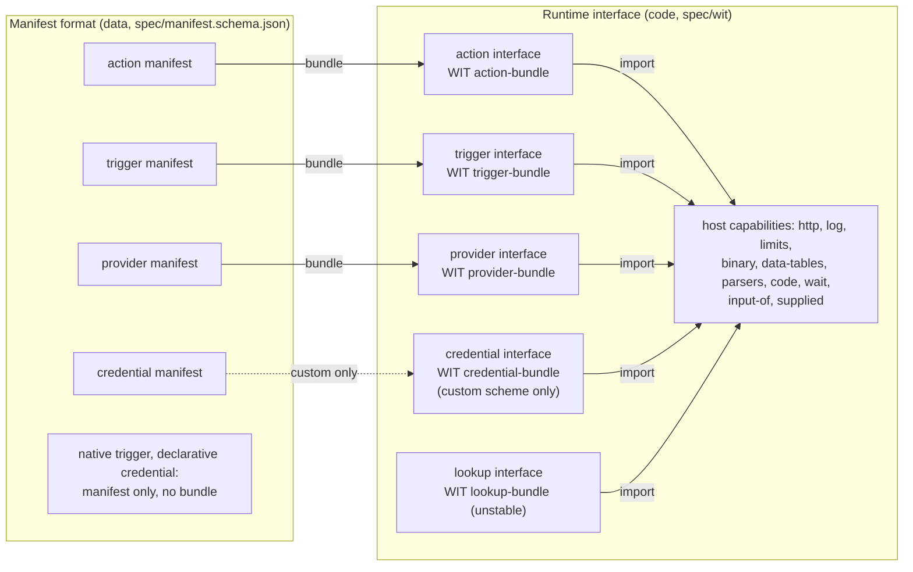

# The Node Contract

For how this part fits in n8n, see [architecture.md](architecture.md).

The Node Contract is the spec between nodes and the n8n engine. It has one version,
`n8n:node-contract@x.y.z` (now 2.8.0), and two parts:

- The **manifest format** tells what a thing is, as data. The host reads a manifest before it
  loads code. Source: `src/manifest.ts`. Spec: `spec/manifest.schema.json` (JSON Schema
  2020-12).
- The **runtime interface** tells how a bundle runs. Spec: the WIT package in `spec/wit/`, and
  the JSON-RPC form in `spec/json-rpc.md` and `spec/<kind>.openrpc.json`.



## Terms

| Term | Meaning |
|---|---|
| kind | The manifest field `kind`: `action`, `trigger`, `provider` or `credential`. `lookup` has an interface, but no manifest yet. |
| `<kind>` interface | The imports and exports of one kind, for example "the action interface". Only the `.wit` files call it a world (`action-bundle`). |
| host, guest | The n8n side that runs and enforces; the code of a bundle in the sandbox. |
| manifest | The data of one version of an action, trigger, provider or credential. |
| bundle | The code of one version, if it has code. It targets the interface of its kind. |
| capability | What the host gives a guest: a WIT import (`http`, `binary`, `data-tables`, `parsers`, `code`, `wait`, …). |
| permission | A capability or a limit that a manifest declares and the host grants: imports, egress hosts, scopes, effect. |
| provider | A node that supplies a capability (chat model, memory, tool, embeddings) to a root node. The UI calls it a sub-node. |

## Versions

| Version | Of what | Where | At run time |
|---|---|---|---|
| Node Contract version | the spec | `nodeContract` in each manifest; the WIT package version | Yes: the host range `N8N_NODE_CONTRACT_RANGE` (default `>=2.0.0 <3.0.0`) and the newest minor that the host implements |
| action, trigger, provider version | the content | `semver` (the major is the n8n `typeVersion`). The source sets the major and the minor. Freeze sets the patch: the newest published patch of that minor, plus one when the bundle changed. A build without `N8N_NODE_CONTRACTS_REGISTRY_URL` sets patch 0, so `tolerant` does not take that HEAD for a lock of an older bundle of the same minor | Yes: a workflow pins it |
| credential version | the content | `semver` of the credential manifest; an action pins `<name>@<major>` in `credentials` | Yes: the pin |
| SDK version | `@n8n/node-sdk` | `sdk` in each manifest | No: for traceability only |
| n8n version | the product | — | Only through the Node Contract range it supports |

What each minor added (`@since` in the WIT, `x-n8n-since` in the schema):

| Version | Adds |
|---|---|
| 2.0.0 | `http`, `log`, `limits`; the `run` resource |
| 2.1.0 | `item-run`: the current item, the `batch` cardinality, named outputs |
| 2.2.0 | `binary` |
| 2.3.0 | `data-tables`, `code`, `wait`, `input-of`; `join-run` (named inputs); `capabilities`, `supplied`, the provider interface |
| 2.4.0 | the `list` binding and `t.pageValue()` inputs (JS runtime only, no WIT form) |
| 2.5.0 | the manifest fields `kind`, `nodeContract`, `sdk`, `credentials`; credential manifests; the trigger and credential interfaces; the `run-credential` import (the plain credential fields of `run()`); `provider.describe` |
| 2.6.0 | counted inputs (`inputs: { count }` in the contract): a parameter sets the number of inputs, and `join-run` takes one list per input; output key patterns that hold binaries (`t.indexedBinaries()`, `t.openBinaries()`) |
| 2.7.0 | the contract field `runtime`: a container image pinned by digest; the `chunk` import (`chunk.item`) |
| 2.8.0 | the `parsers` import (`parsers.extract`): the host reads a CSV, XLSX, JSON, text or PDF file with the parsers of n8n |
| unstable | `credential.exchange`, `credential.refresh` (`credential-exchange`); the lookup interface (`lookup`) |

The host reads only manifests with `nodeContract`. It refuses a manifest without it, such as
one frozen before 2.5.0, and a bundle of Node Contract 1.x. Freeze such a version again. The
index line of a version in a store also states `nodeContract`.

## Store layout

The embedded store of a release, an instance export and a registry use one layout
(`src/store.ts`). A registry is the same files, served at `https://…` or `file://…`. An
instance keeps its versions of all kinds, also credential and native manifests, in the
`node_contract_version` table: one row for each manifest digest, with the origin of the version
from its signing key (see sandboxed-execution.md). `n8n contracts:import --input=<dir>` adds the verified versions of a folder to the
table, and `n8n contracts:export --output=<dir> [--pinned]` writes the table in this layout.

| File | Content |
|---|---|
| `catalog.json` | `{ "versions": [...] }`: the index line of the newest version of each id that is not yanked or revoked. `withdrawn` lists each id whose every version is yanked or revoked, so an import still finds it |
| `index/<id>.ndjson` | One line for each version and one line for each status. A writer only appends. A reader skips a line that it does not know |
| `blobs/sha256/<hex>` | The manifest, bundle and fixtures bytes. The name is the SHA-256 of the bytes |

The digest of a version is `sha256:` of its manifest bytes. The manifest holds `bundleHash` and
`contractHash`, so the digest covers the code and the contract. A credential manifest and a
native manifest have no bundle. The line of a credential has its n8n type `name`, and the line
of a native version has its legacy node type in `native`, so a reader finds them from the index. A reader checks each blob
against its digest, and the fields of each index line against the manifest. Publish adds
`fixtures`, `signatures` (ed25519 over the manifest bytes, `key` is `sha256:` of the public key)
and `published`. Freeze adds none of them, so it writes the same bytes for the same source.

### Status lines

A publisher never changes a version line. To withdraw or deprecate a version, it appends a
status line (`addStatusToStore`, or `pnpm publish:contracts yank|revoke|deprecate …` in
nodes-base-next):

```json
{"id":"gmail.message.get","yank":"1.0.4","reason":"sends Bcc as Cc","at":"2026-10-02T12:00:00.000Z","signatures":[…]}
{"id":"gmail.message.get","revoke":"1.0.4","reason":"leaks the token","at":"…","signatures":[…]}
{"id":"gmail.message.get","deprecate":"1","message":"Use major 2","use":"gmail.message.get@2","at":"…","signatures":[…]}
```

- **Yank**: the host runs the version as no newer patch. A node that has a pin of it still runs
  it. For a major that only the store has, the node type lists the newest version that is not
  withdrawn, so a new node does not get the version. The embedded HEAD stays the version of its
  major: a node without a pin and the AI builder still use a yanked HEAD.
- **Revoke**: a yank, and the host also refuses to run the version. An admin can allow it with
  `N8N_NODE_CONTRACTS_REVOKED_ALLOW=<id>@<version>,…`.
- **Deprecate**: `major`, `major.minor` or `major.minor.patch`. The reader gives the line
  (`StoreReader.index`). The host does not act on it yet.

The signatures of a status line cover its canonical JSON without `signatures`
(`storeStatusTextOf`), with the same key id and ed25519 form as a version. The instance keeps
the lines in the `node_contract_status` table. It takes a line only when a configured key signs
it, or every line when no key is set. A line applies to a version only when its key proves at
least the origin of the version: only the first-party key withdraws a first-party version, and
an unsigned line applies only to a private version. The lines arrive with
`n8n contracts:import`, with `contracts:export`, and from the registry index of each id that
the leader main reads (a sync of the locked ids, a download, a newer-patch check).
`contracts:export` writes only the yank and revoke lines of the versions that it writes. An
embedded HEAD is not a stored version, so the export drops its lines. To move such a line to a
host without a registry, import a copy of the registry folder.

## Rules

- Freeze writes the lowest version that has what a bundle uses
  (`requiredNodeContractOf`): 2.8.0 for the `parsers` import, 2.7.0 for a `runtime` image, 2.6.0 for counted inputs or a binary key pattern, 2.4.0 for a
  `list` binding or a `t.pageValue()` input, 2.3.0 for host imports, named inputs or a provider
  capability, 2.2.0 for a binary field, else 2.1.0. So an older host still runs it. A JS trigger bundle follows the same rule: hosts before 2.5.0 run
  triggers in JS. The trigger interface of 2.5.0 is its WIT form, for a sandbox runner.
- The host runs a bundle when its version is in the configured range and the host implements
  that minor. Raise the lowest major of the range only in an n8n major release.
- A reader ignores a top-level manifest field that it does not know. A field that changes what
  the host must do comes with a higher `nodeContract`, so an older host refuses the bundle.
  Exception: the spike added `nodeDisplayName`, `credentialOptional`, `endpoint` and `verify` to
  the contract at 2.6.0 with no version bump, and the trigger `egress`. It also added `describe`,
  `check` and the poll time `at` to the trigger interface, and `migrate` to the action
  interface at 2.7.0. Freeze all spike versions again.
- A new item in the host interfaces raises the one Node Contract minor. A bundle that does not
  use the new item keeps its lower `nodeContract`.
- The contract hash covers only `contract`. The manifest fields `kind`, `nodeContract`, `sdk`
  and `credentials` are outside it.
- A manifest has no node description. The host makes the description of each version from
  `contract` and the optional `ui` block (`nodeDescriptionOf`), so the editor shows only what
  the contract types. The contract gives the labels (`nodeDisplayName`, `action`, `summary`,
  field `title` and `x-n8n-hint`), `credentialOptional` (the user can pick no credential) and,
  for a webhook trigger, `endpoint` (default `POST` on `webhook`; the contract keeps only
  values that differ from the default). All versions have the same projection.
- The form: the label of a field is its `title` (`.title()`). An options field shows the
  labels of `x-n8n-options` (`.options()`). The first of `examples` is the placeholder.
  `minimum` and `maximum` limit a number. A variant is a collection with a tag dropdown (the
  branch `title` is the label, `t.variant(tag, branches, labels)`) and the fields of each
  branch, which show only for their tag. The collection holds the contract value as it is.
  `fields.<variant>.widget: 'json'` keeps one JSON field for a variant instead.
- The limit of a variant collection: n8n stores it as a node-parameter collection. n8n core
  turns a string under a collection into `{}`. So JSON text or one whole-field expression
  (`={{ … }}`) for a variant is not kept. An expression inside a branch field works. The form
  of an agent tool keeps a variant as JSON.
- The `ui` block (`ui` of an action, `manifest.ui`) is for the n8n form only: `order`,
  `advanced` and `fields` (a placeholder and a widget per field, `field.branchField` in a
  variant). Agents and MCP do not read it, and it is outside the contract hash. An `advanced`
  field goes into one "Options" collection, so its n8n parameter is `options.<field>`
  (`nodeParametersOf` writes a contract value so). n8n stores the parameters in the form of the
  newest version of a major. So a change that moves where or how a field is stored (into or out
  of `advanced`, a variant to or from the `json` widget) is a major. A widget is an entry of
  the `Widgets` interface: the value type it edits and its config. The host shows an unknown
  widget as the default field. The form of an agent tool keeps each field at the top and a variant as JSON,
  because the model fills a whole field with one `$fromAI()` expression.
- `missingTitlesOf` lists the form fields without a `title`. `checkAction` and the publish
  gate refuse them only when `REQUIRE_FIELD_TITLES` is true.
- A credential major changes when stored data or a saved workflow can break: a new required
  field, a new host, a new scheme. A compat credential type has no manifest and no pin.
- An action major changes when it adds a permission: a scope, an egress host, an import, a
  provider call, binary data access or a credential type. An auto-update then never widens what an action may do. `diffContracts`
  reads the permissions from `permissionsOf`.
- The manifest is the permission source on both run paths. Freeze writes every static host
  into `contract.egress.hosts`, also the host of the node `baseUrl`, so that host is in the
  contract hash. `loadExecutor` (in this process) refuses a bundle whose export grants other
  permissions than its manifest, and it takes `egress` from the manifest. The
  sandbox reads only the manifest, and refuses a bundle whose `baseUrl` host is not in it.
- WIT describes only code that runs. A native trigger and a declarative credential scheme have
  a manifest and no bundle. Publish adds actions, triggers, providers, credential types and
  native contracts to the same store, each with the gate of its kind.
- Binary key patterns (`t.indexedBinaries()`, `t.openBinaries()`, an output `patternProperties`
  entry with `x-n8n-binary`) use the `binary` import of 2.2.0, but a host before 2.6.0 keeps
  such a binary in the JSON. So freeze writes 2.6.0.
- Counted inputs: the contract `inputs: { count: '<field>' }` names an integer input field with
  `minimum` and `maximum` (`lintContract`). The host makes one n8n input per count from the
  parameter, as the legacy Merge node does with `numberInputs`, and `run()` gets one item list
  per input. A host before 2.6.0 cannot make the inputs, so freeze writes 2.6.0.
- An output keyword that a host ignores does not raise the Node Contract minor:
  `x-n8n-claim` and `x-n8n-resource` are for builders, and a host runs a bundle that has them
  as before.

## Version of an action change

`diffContracts` (`src/version.ts`) gives the kind of a change between two contract documents.
The publish gate (`checkPublish`) refuses a smaller bump. A patch must keep the contract hash.

| Change | Kind |
|---|---|
| Prose only (`title`, `description`, `x-n8n-hint`, `examples`, `x-n8n-options`, summary, `nodeDisplayName`), or the `ui` block (`order`, placeholders, a widget that keeps the stored form) | patch |
| An optional input, or a required input with a default | minor |
| A required output field becomes typical (`x-n8n-claim: 'typical'`, not in `required`) | minor |
| An optional or typical output field becomes typical or required | minor |
| A removed scope, egress host, host import, provider call or binary data access; a first scope declaration | minor |
| Other `loadOptions` calls in `x-n8n-resource`, with the same `method` and `input` | minor |
| An added key pattern (`patternProperties`, e.g. `t.indexedBinaries()`); its first binary is binary data access, a major | minor |
| A new required input, or a narrower input | major |
| A `ui` change that moves a stored parameter: a field into or out of `advanced`, a variant to or from the `json` widget | major |
| A removed output field, a removed key pattern, or an output field that becomes optional (from required or typical) | major |
| An added or removed `x-n8n-resource`, or another `method` or `input` in it | major |
| A credential that becomes optional (`credentialOptional`) | minor |
| A changed flow, output list, input list, trigger kind, webhook `endpoint` or webhook signature (`verify`); a new scope, egress host, host import, provider call, binary data access or credential type; a removed credential type; a credential that becomes required | major |

Output claims:

- **required**: the field is in `required`. Code can read it without a check.
- **typical**: the service sends the field as a rule, but a plan, a permission or an API
  version can leave it out. Write `.with({ 'x-n8n-claim': 'typical' }).optional()`. A required
  field cannot be typical (`lintContract`).
- **optional**: absence is normal.

Resource pointer: `resourceOutput` writes `output['x-n8n-resource']`. It names the input field
that holds the resource ID, and the legacy load-options calls that list the fields of the
resource. A builder runs the calls with `resourceLookupsOf` and the node's credential, and
gives the fields to the `toOutput` hatch. When the input field has a `pattern`, the ID is the
first match in the value, for example in a URL.

## Files and commands

| Path | What |
|---|---|
| `spec/wit/*.wit` | Package `n8n:node-contract@2.8.0`: `host.wit` (capabilities and shared types), one file per kind |
| `spec/manifest.schema.json` | Generated from `src/manifest.ts` |
| `spec/<kind>.openrpc.json` | Generated from `spec/wit` |
| `spec/json-rpc.md` | The JSON-RPC mapping |

- `pnpm spec:generate` writes the generated files.
- `pnpm spec:check` fails when a generated file is not current, when `wasm-tools component wit`
  refuses a WIT file, or when `wasm-tools` reads other functions than `scripts/spec.ts`. It needs
  `wasm-tools` 1.261.0 or newer (`cargo install --locked wasm-tools`). CI runs it in
  `.github/workflows/ci-node-contract-spec.yml`.
- `src/__tests__/spec.test.ts` checks that the generated files are current, and that the WIT
  matches the TS types and host method tables in both directions.
