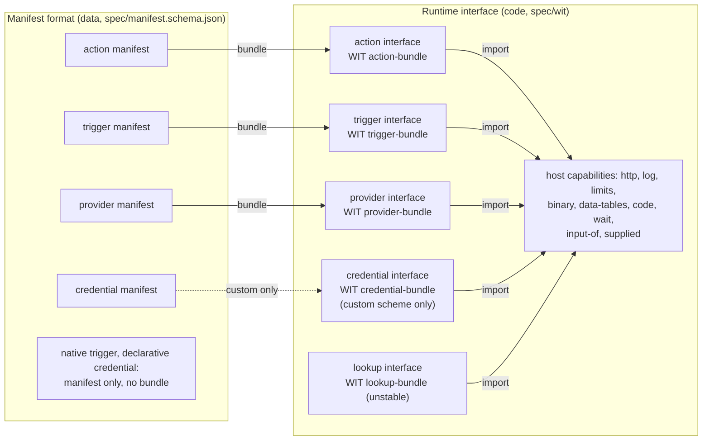

# The Node Contract

The Node Contract is the spec between nodes and the n8n engine. It has one version,
`n8n:node-contract@x.y.z` (now 2.5.0), and two parts:

- The **manifest format** tells what a thing is, as data. The host reads a manifest before it
  loads code. Source: `src/manifest.ts`. Spec: `spec/manifest.schema.json` (JSON Schema
  2020-12).
- The **runtime interface** tells how a bundle runs. Spec: the WIT package in `spec/wit/`, and
  the JSON-RPC form in `spec/json-rpc.md` and `spec/<kind>.openrpc.json`.

## Terms

| Term | Meaning |
|---|---|
| kind | The manifest field `kind`: `action`, `trigger`, `provider` or `credential`. `lookup` has an interface, but no manifest yet. |
| `<kind>` interface | The imports and exports of one kind, for example "the action interface". Only the `.wit` files call it a world (`action-bundle`). |
| host, guest | The n8n side that runs and enforces; the code of a bundle in the sandbox. |
| manifest | The data of one version of an action, trigger, provider or credential. |
| bundle | The code of one version, if it has code. It targets the interface of its kind. |
| capability | What the host gives a guest: a WIT import (`http`, `binary`, `data-tables`, `code`, `wait`, …). |
| permission | A capability or a limit that a manifest declares and the host grants: imports, egress hosts, scopes, effect. |
| provider | A node that supplies a capability (chat model, memory, tool, embeddings) to a root node. The UI calls it a sub-node. |

## Versions

| Version | Of what | Where | At run time |
|---|---|---|---|
| Node Contract version | the spec | `nodeContract` in each manifest; the WIT package version | Yes: the host range `N8N_NODE_CONTRACT_RANGE` (default `>=1.0.0 <3.0.0`) and the newest minor that the host implements |
| action, trigger, provider version | the content | `semver` (the major is the n8n `typeVersion`) | Yes: a workflow pins it |
| credential version | the content | `semver` of the credential manifest; an action pins `<name>@<major>` in `credentials` | Yes: the pin |
| SDK version | `@n8n/node-sdk` | `sdk` in each manifest | No: for traceability only |
| n8n version | the product | — | Only through the Node Contract range it supports |

What each minor added (`@since` in the WIT, `x-n8n-since` in the schema):

| Version | Adds |
|---|---|
| 1.0.0 | `n8n-action@1.wit`: `run` emits items. The host runs it through `src/action-api-v1.ts`. |
| 2.0.0 | `http`, `log`, `limits`; the `run` resource |
| 2.1.0 | `item-run`: the current item, the `batch` cardinality, named outputs |
| 2.2.0 | `binary` |
| 2.3.0 | `data-tables`, `code`, `wait`, `input-of`; `join-run` (named inputs); `capabilities`, `supplied`, the provider interface |
| 2.4.0 | the `list` binding and `pageValue()` inputs (JS runtime only, no WIT form) |
| 2.5.0 | the manifest fields `kind`, `nodeContract`, `sdk`, `credentials`; credential manifests; the trigger and credential interfaces |
| unstable | `credential.exchange`, `credential.refresh` (`credential-exchange`); the lookup interface (`lookup`) |

A manifest frozen before 2.5.0 has `apiVersion: "n8n:action@x.y.z"` or `abi: 1 | 2` instead of
`nodeContract`. The host still reads it: `n8n:action@x.y.z` is Node Contract `x.y.z`, and
`abi: n` is `n.0.0`. The same applies to the packument field `n8nContract` of a published
version.

## Rules

- Freeze writes the lowest version that has what a bundle uses
  (`requiredNodeContractOf`): 2.4.0 for a `list` binding or a `pageValue()` input, 2.3.0 for
  host imports, named inputs or a provider capability, 2.2.0 for a binary field, else 2.1.0. So
  an older host still runs it. A JS trigger bundle follows the same rule: hosts before 2.5.0 run
  triggers in JS. The trigger interface of 2.5.0 is its WIT form, for a sandbox runner.
- The host runs a bundle when its version is in the configured range and the host implements
  that minor. Raise the lowest major of the range only in an n8n major release.
- A reader ignores a top-level manifest field that it does not know. A field that changes what
  the host must do comes with a higher `nodeContract`, so an older host refuses the bundle.
- A new item in the host interfaces raises the one Node Contract minor. A bundle that does not
  use the new item keeps its lower `nodeContract`.
- The contract hash covers only `contract`. The manifest fields `kind`, `nodeContract`, `sdk`
  and `credentials` are outside it.
- A credential major changes when stored data or a saved workflow can break: a new required
  field, a new host, a new scheme. A compat credential type has no manifest and no pin.
- WIT describes only code that runs. A native trigger and a declarative credential scheme have
  a manifest and no bundle.

## Files and commands

| Path | What |
|---|---|
| `spec/wit/*.wit` | Package `n8n:node-contract@2.5.0`: `host.wit` (capabilities and shared types), one file per kind |
| `spec/n8n-action@1.wit` | The 1.x major, for the @1 adapter |
| `spec/manifest.schema.json` | Generated from `src/manifest.ts` |
| `spec/<kind>.openrpc.json` | Generated from `spec/wit` |
| `spec/json-rpc.md` | The JSON-RPC mapping |

- `pnpm spec:generate` writes the generated files.
- `pnpm spec:check` fails when a generated file is not current, when `wasm-tools component wit`
  refuses a WIT file, or when `wasm-tools` reads other functions than `scripts/spec.ts`. It needs
  `wasm-tools` 1.261.0 or newer (`cargo install --locked wasm-tools`). CI runs it in
  `.github/workflows/ci-node-contract-spec.yml`.
- `src/__tests__/spec.test.ts` checks that the generated files are current, and that the WIT
  matches the TS types and host method tables in both directions.
