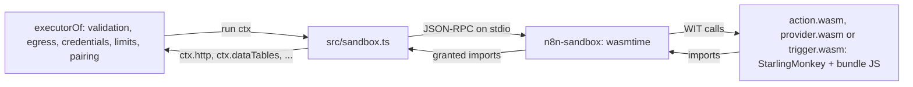

# Sandboxed execution of contract actions

For how this part fits in n8n, see [architecture.md](architecture.md).

Status: built for action, provider and trigger bundles, binary data included. A version runs in one of
four runtimes: `in-process`, `worker`, `wasm` and `container`. A runtime policy picks the runtime
from the trust class and the needs of the version (see "Runtimes and the runtime policy"). Only
the WASM component in a wasmtime sidecar stopped every escape with a clear error and enforced CPU,
memory and wall-clock limits itself.

## Goal

A node can bring any dependency, and later another language, and still run safely. It is bound
only by its permissions: the imports of its world and its manifest. First-party bundles can run
in-process or in a worker. Community and AI-generated bundles run in the WASM sandbox or in a
container.

## Model: the world is the permission set

- The bundle has no ambient authority. It reaches only the imports of its world
  (`spec/wit/action.wit`, `world action-bundle`; `spec/wit/provider.wit`, `world
  provider-bundle`). There is no network, file system, timer, process or environment, except
  through an import. The guest reads the real time (`Date.now()`, `performance.now()`) in
  steps of 1 ms.
- Every bundle gets `http`, `log`, `limits` and `run-credential`. The manifest of an action
  grants the optional imports: `imports` (data tables, code, wait, the input of an item),
  `t.binary()` fields (`binary`), `provider.input()` fields (`supplied` and `capabilities`). A provider
  gets no optional import. A call to an import that is not granted stops the run with `The
  bundle called <method>, which its manifest does not grant`. The host never sees the call.
- `run-credential.get` gives the credential type and its declared fields that are not secret,
  as `credential` of `run()` in this process. The host reads them when the guest asks, so stored
  data that does not match the fields fails only a bundle that reads them. The guest then gets a
  fixed error text, because the host error can quote stored values. A secret, a token and an
  undeclared field never cross.
- All network I/O goes through the host `http` import: egress hosts, credential hosts, SSRF
  policy, redirects, retries and `maxRequests` (see "Egress and credential hosts").
- A sandboxed bundle reads only the allowed response headers, in a response and in an HTTP
  failure (`GUEST_RESPONSE_HEADERS` in `src/sandbox.ts`): `content-type`, `content-length`,
  `content-disposition`, `etag`, `last-modified`, `location`, `link`, `retry-after`, `ratelimit`,
  `ratelimit-*`, `x-ratelimit-*`, `request-id` and `x-request-id`. The host keeps all other
  headers, for example `set-cookie` and `www-authenticate`, because they can carry session or
  account data. A manifest cannot add a header: the bundle author writes the manifest, so the
  bundle could give itself the header. An in-process bundle and the legacy HTTP Request node read
  all headers.
- The host checks every output item against the manifest output, and every index and route.
- The runtime enforces CPU time, memory, wall clock and message size. The executor enforces
  requests and items.
- The same contract and the same host checks apply to first-party and community bundles. An
  in-process bundle gets the same `RunContext`, so its host checks are the same. Only the
  isolation is weaker.

## Runtime

- `sandbox/sidecar` (Rust, wasmtime 47): one process for each node execution, so two executions
  share no state. It speaks `spec/json-rpc.md`. It reads `spec/wit` with wit-parser and links
  each import of the world with a dynamic host function, so one sidecar serves every world and
  version. The command line holds the component, the world, the grants and the limits; the
  JSON-RPC stream holds only the protocol. `wasi:random` is linked to the OS random source.
  `wasi:clocks/wall-clock` and `wasi:clocks/monotonic-clock` are linked to the host clocks,
  coarsened to 1 ms, so a guest cannot measure host work more precisely. The clocks give no
  timer: `subscribe-instant` and `subscribe-duration` stop the run. The other `wasi:io` and
  `wasi:cli` functions that a guest imports also stop the run: streams, the environment, the exit.
  The JS guest and Rust std on `wasm32-wasip2` import them. These WASI imports are not in the
  Node Contract WIT, so they do not change the Node Contract version.
- `sandbox/action.ts`, `sandbox/provider.ts` and `sandbox/trigger.ts`, on the core
  `sandbox/guest.ts`: one generic guest component for each kind interface, `action.wasm`,
  `provider.wasm` and `trigger.wasm`, for every JS bundle of that kind. A WIT world cannot import and export `capabilities`, so one component cannot serve
  both. n8n builds and signs them. A guest evaluates the bundle, maps `RunContext` to the imports,
  and runs the `request` and `list` bindings with the SDK code. It gets its bundle code from the
  sidecar through `n8n:js-guest/bundle` (`sandbox/wit/guest.wit`). That interface is not a
  capability and the host never answers it. The bundle runs in the same JS realm as the guest, so
  the guest is not a trust boundary: the sidecar and the host are.
- `src/sandbox.ts`: `policyExecutorLoader(policy, options)` gives the `executorLoader` of a
  `HostRuntime` (`src/runtime.ts`). It runs each version in the runtime that
  `runtimeNameOf` (`src/runtime-policy.ts`) gives: `in-process` through `loadExecutor`, every
  other runtime through `sandboxedVersionOf` with that `GuestRuntime`. `policy.log` gets one
  line for each version it loads, e.g. `items.set@1.0.0 (first-party) runs in worker`, for a
  debug log. The sandboxed action takes
  its contract from the signed manifest; the host runs no bundle code. `replayFixtures` takes the same action, executor and `migrate`, so
  publish can replay the fixtures and the migration pairs in the sandbox.
- The credential types of a sandboxed action come from the host (`options.credentialType`) by
  the names in the manifest. Their hosts and base URLs never come from the bundle. The bundle
  gives only the node name, the scopes text and the node `baseUrl`. Pack writes the `baseUrl`
  host into the manifest `egress`, so the host refuses a bundle whose `baseUrl` host is not an
  `egress` host of its manifest. An action without `egress` reaches only the hosts of its
  credential base URL; with no base URL, it reaches no host.
- In this process, `loadExecutor` reads the same manifest. It refuses a bundle whose export
  grants other permissions than its manifest (`permissionsOf` of both: egress, credential
  types, scopes, imports, binary data, provider capabilities), and it takes `egress` from the
  manifest.
- The host verifies the bundle hash and writes the bundle to the cache, named by its hash. The
  sidecar checks the hash again when it reads it. The compiled guest (`.cwasm`) is cached by the
  guest digest and the engine config.

### Binary data

- The executor keeps the handle table of the node execution, as in this process. The host gives
  the guest `{ "$binary": id }` at each `t.binary()` field of the run input, and puts the handle of
  the id back at each binary output field and at each key of a `t.indexedBinaries()` pattern.
- `binary.binary-reader.read` gives at most 4 MiB and the guest asks for 1 MiB, so one chunk is a
  small JSON-RPC message. A writer streams each chunk to the store when it arrives, with back
  pressure. `binary.send` and `binary.fetch` keep the bytes in the host: the guest never sees
  them. Measured: 3 MiB through the guest in about 40 ms (read) and 80 ms (write); a 16 MiB
  download costs the same 14 ms as 1 MiB.
- A handle that the guest drops stays valid for the node execution, so it can still be an output.
- At the end of a run, the host ends each reader and writer that the guest did not drop. The store
  write of an unfinished writer fails, so it makes no binary.

### Providers and AI roots

- A root action gets `{ "$capability": id }` at each `provider.input()` field. `supplied.open` gives a
  host resource, and each `capabilities` method goes to the capability that the executor read
  from the provider. The host checks the chat messages, requests and arguments of the guest.
- A provider bundle runs in `provider.wasm`. `provider.supply` gives a guest resource. The root
  calls the capability after the node execution of the provider ended, so each method call
  starts a new instance, runs `supply()` and then the method (about 16 ms per call). The guest
  keeps no state between two calls: a memory provider must keep its history through the host.
  The requests of a call use the context of the provider, so its credential, egress and request
  limit apply. The host checks each value that the provider gives (chat reply, messages, tool,
  vectors).

### Triggers

- A trigger entry point (`poll`, the webhook methods `checkExists`, `create` and `delete`, and
  `webhook`) is one executor run of the action that `triggerRunOf` (in-process) or
  `sandboxedVersionOf` (sandbox) makes. The call (`TriggerCall`) is its one item, and the call
  result is its one output item. So a trigger request takes the egress, the input hosts, the
  response limit, the refusal report, the retries and the redaction of an action request.
- `toVersionedTriggerType` gets the executor from the executor loader of the host, as an action
  does. `policyExecutorLoader` runs a trigger in `in-process` (`loadTriggerExecutor`) or in
  `wasm` (`trigger.wasm`), by the list of its origin.
- The guest runs `runTriggerCall`, the same code as in this process. The host keeps the state in
  the static data of the node, generates the webhook secret, and checks the webhook signature
  of the manifest (`contract.verify`) before the guest gets the request. The trigger world has
  no `run-credential` import: the host applies the credential to each request.
- `poll` gets the poll time `at` from the host clock.
- The host refuses a webhook bundle whose signature is not the signature of its manifest, in this
  process and in the sandbox (from `describe()`).

## Runtimes and the runtime policy

All runtimes use the same host imports, so the egress, credential, output and binary checks are
the same. Only the isolation and the cost change. Each runtime other than `in-process` speaks
`spec/json-rpc.md` with the same JS guest.

| Runtime | What runs the bundle | Isolation | In n8n |
|---|---|---|---|
| `in-process` | the n8n process (`loadExecutor`) | none | always available |
| `worker` | a `worker_threads` worker (`src/runtimes/worker.ts`), one per node execution | a crash or an out-of-memory error stops only the worker. Not a security boundary: the worker shares the process, its permissions and the network. | always available. A pool keeps 1 started worker per session key. |
| `wasm` | the generic guest component in an `n8n-sandbox` sidecar (`src/runtimes/wasm-reuse.ts`). A sidecar serves the next session of the same bundle after `[reset]`, with a fresh instance. | the only runtime that passes every escape check | when the sidecar and the guests exist |
| `container` | `docker run` of the Node guest (`src/runtimes/container.ts`): `--network none`, read-only root, `--cap-drop ALL`, no new privileges, user 10001, memory, CPU and pids limits | the container. `runsc` (gVisor) when `docker info` lists it, else `runc`. | only when `N8N_NODES_NEXT_CONTAINER_ENABLED=true` and docker answers. A pool keeps 1 started container per session key. |

The policy (`src/runtime-policy.ts`):

- **Needs** come from the contract. `web` (no `runtime` field): web APIs and host imports only.
  `image`: the action spec declares `runtime: { image: '<ref>@sha256:<digest>', childProcess?,
  addons? }`. Pack refuses an image without a digest. The image is part of the contract hash,
  and the version needs Node Contract 2.7.0. Such a version runs only in `container`, in its own
  image, with `--allow-child-process` and `--allow-addons` from the contract. Without a loaded
  action, `replayFixtures` replays it in `containerRuntime`, so publish fails when docker or the
  image is missing. The first-party example is `browser.screenshot` in `@n8n/nodes-core`: it
  renders HTML to a PNG with the headless Chromium of the Playwright image. `component`: the
  bundle is a WASM component (`guest: 'component'`, see "Languages"). It runs only in `wasm`, and
  `replayFixtures` replays it there. `http-guest`: the bundle is an HTTP guest config. It runs
  only in `in-process`.
- **Trust class**: the origin that the store recorded for the version (see the notes under "n8n configuration"):
  `first-party` (in the release, or signed by the first-party key), `community` (signed by the
  vetting key) or `private` (signed by no trusted key: local, unsigned or AI-made). Each class has
  its own list.
- **Resolution**: the first runtime of the trust class's list that serves the needs and is
  available. A community or private version runs in a container only with `runsc`.
- **Triggers** run only in `in-process` or `wasm`: the Node guest of `worker` and `container`
  has no trigger world. So a first-party trigger runs in the n8n process by default, and a
  community or private trigger in `wasm`.
- When no runtime fits, the version does not load. The error names the need, the trust class and
  what is missing, for example `slack.message.send@1.2.0 (community) needs one of wasm,
  container; wasm is not available: the sandbox sidecar is not installed; container is not
  enabled`.
- Credentials are declarative manifests: they need no runtime.

### n8n configuration

| Variable | Default | Meaning |
|---|---|---|
| `N8N_NODES_NEXT_RUNTIMES_FIRST_PARTY` | `worker,in-process,wasm,container` | The runtimes of first-party versions, the preferred one first. |
| `N8N_NODES_NEXT_RUNTIMES_COMMUNITY` | `wasm,container` | The runtimes of community versions (signed by the vetting key), the preferred one first. An admin can add `in-process` or `worker`. n8n then logs a warning at start: community code runs without a security boundary. |
| `N8N_NODES_NEXT_RUNTIMES_PRIVATE` | `wasm,container` | The runtimes of private versions (signed by no trusted key), the preferred one first. The same warning as for the community list applies. |
| `N8N_NODES_NEXT_CONTAINER_ENABLED` | `false` | Lets versions run in Docker containers. Needs `docker` on the PATH and the pinned images pulled. |
| `N8N_NODE_CONTRACT_SANDBOX_SIDECAR` | — | The `n8n-sandbox` binary of the `wasm` runtime. |
| `N8N_NODE_CONTRACT_SANDBOX_GUESTS` | — | The directory with `action.wasm`, `provider.wasm` and `trigger.wasm`. |
| `N8N_NODE_CONTRACT_SANDBOX_CACHE_DIR` | `<n8n folder>/node-contracts/sandbox` | Compiled guests and verified bundles. Only n8n may write it. |
| `N8N_NODE_CONTRACTS_FIRST_PARTY_KEY_FILE` | — | PEM of the first-party key. A version that it signs is first-party. |
| `N8N_NODE_CONTRACTS_VETTING_KEY_FILE` | — | PEM of the vetting key. A version that it signs, and the first-party key does not, is community. |

- The origin of a version (`PackedVersion.origin`) is `first-party`, `community` or `private`.
  The store records it once, when it takes the version: from the npm registry, from
  `n8n contracts:import`, or as a credential manifest that a version pins. The key that signs the
  manifest bytes gives it. A version of the embedded store is first-party without a key check,
  because it ships in the release. With no key file, the store takes unsigned versions as
  `private`. With a key file, it refuses a version that no configured key signs.
- A key change never raises a stored origin. When the first-party key no longer signs a stored
  first-party version, n8n serves it with the origin that the keys give now.
- An id has no namespace part, so only the first-party key puts a version in the `n8n` namespace.
  An id such as `n8n.echo` from another key stays community.
- The origin picks the runtime list. It decides only the isolation: the permissions and the host
  checks are the same for all origins.
- An unknown runtime name, a name twice, or an empty list stops n8n at start.
- n8n logs one warning at start when a listed runtime cannot start: the sandbox files are
  missing, or docker does not answer. n8n starts. Only the versions that need that runtime fail.
- With the defaults and no sidecar, community and private versions do not run: n8n does not ship
  the sidecar yet.
- `nodeContractsRuntime` (`packages/cli/src/node-contracts-registry.ts`) makes each runtime
  at its first use and closes the pools and the parked sidecars at shutdown.
- The credential types come from the credential manifests, else from the embedded bundle that
  lists a compat type (`embeddedCompatTypeOf`), else a `compat` type for a name that n8n has.

### Measured costs

macOS arm64 (M2 Pro), Node 24, colima with `runc`, a loaded machine: the ratios hold, the
absolute numbers are noisy. Source: `.scratch/runtime-poc/RESULTS.md` of the runtime PoC.

| | in-process | worker + pool | wasm (reuse) | container + pool |
|---|---|---|---|---|
| session start and close | — | 1.3 ms | 0.25 ms | 16 ms (150 to 450 ms without a pool) |
| `slack.message.send`, executions per second at 1 / 10 / 50 in parallel | 1310 / 804 / 580 | 124 / 179 / 71 | 190 / 187 / 271 | 16 / fails / fails |
| `notion.databasePage.getAll`, per execution, 100 in a row | 3.1 ms | 14 ms | 64 ms | 74 ms |
| `core.set` with 10k items, ratio to in-process | 1× | 11× | 55× | 212× |
| `core.sort` with 10k items (one batch), ratio to in-process | 1× | 3.7× | 38× | 10× |
| memory per guest | — | ~25 MB in the n8n process | ~26 MB | ~26 MB |

- A `per-item` action pays one `[new]` and `[take]` round trip per item: about 0.1 ms in a worker,
  0.4 to 1.8 ms in WASM, 1.4 ms in a container through colima. Chunked runs (`chunkItems`) cut
  this 3.5× in a worker and 1.2 to 1.6× in WASM. n8n does not turn them on yet.
- WASM spends most of a short run on the evaluation of the bundle in each fresh instance. A
  per-bundle snapshot (`wasm-snapshot`, not wired in n8n) brings the Notion case to 14.5 ms.
- A 50 MB item passes only in-process. The other runtimes stop at their 256 MB memory limit.
- Native tools in a container: an ffmpeg thumbnail takes 214 ms with a pool, a Chromium
  screenshot 1.5 s, a sharp resize 62 ms.

### Escape matrix by runtime

`scripts/runtime-matrix.ts` runs the fixture replay and the escape probes of
`src/__tests__/sandbox.test.ts` in each runtime.

| Check | in-process | worker | wasm | container |
|---|---|---|---|---|
| fixture replay (84 actions) | pass | pass | pass | pass |
| global `fetch` | FAIL | pass (stub) | pass | pass (stub) |
| `process.env` | FAIL | pass (empty) | pass | pass (empty) |
| `import('node:fs')` | pass | FAIL | pass | FAIL (the root file system is read-only) |
| network through `node:http` | FAIL | FAIL | pass | pass (`--network none`) |
| late `setTimeout` | FAIL | pass (stub) | pass | pass (stub) |
| endless loop | n/a | pass (wall clock) | pass (CPU limit) | pass (wall clock) |
| memory blow-up | n/a | pass | pass | pass (exit 137) |
| ungranted import, egress, credential secret | pass | pass | pass | pass |
| prototype pollution | FAIL | pass | pass | pass |

### Known issues

- Two pack gaps. A package without `exports` packs only with `mainFields`, which
  `platform: 'neutral'` does not set. The `typeof` guard check counts one guard for the whole
  bundle, so luxon packs and then fails in WASM with `Intl is not defined`.
- Chunked runs read ahead: a side-effect action can run items that the host does not take yet,
  and a chunk has a count limit (1000), not a byte limit.
- The snapshot cache has no cap: 79 bundles took 3.6 GB.
- The pools and the reused sidecars have no cap per key, no total cap and no maximum age.
- A container gets 256 pids by default. Chromium starts about 110 and hangs at 64. An image
  manifest cannot set pids yet.
- The container runtime needs Docker. It is tested with colima and `runc` only. `runsc` (gVisor)
  is not tested here.
- The n8n image does not ship the sidecar and the guests yet, so `wasm` is not available by
  default.

## Limits

| Limit | Default | Enforced by | Error |
|---|---|---|---|
| CPU time of the guest per node execution, host calls not counted | 30 s | sidecar (epoch) | `The bundle used its CPU time of … ms and was stopped` |
| Memory | 256 MB | sidecar (`ResourceLimiter`) | `The bundle reached its memory limit of … MB and was stopped` |
| Wall clock per node execution | 10 min | host (kills the sidecar) | `… ran longer than … ms and was stopped` |
| One message from the sidecar | 64 MB | host | `… gave a message larger than … bytes` |
| Requests, items | `maxRequests`, `maxItems` | executor | as in-process |

A trap stops the component: every later call of the execution gets the same error.

## Escape tests (`src/__tests__/sandbox.test.ts`)

| Bundle tries | Result |
|---|---|
| global `fetch` to a local server | `fetch is not available in the sandbox. Use http.request.`; the server gets nothing |
| `process.env`, with the name built at run time | `… is undefined` |
| `import()` of `node:fs`, with the name built at run time | the JS engine stops (trap) |
| a global of `GUEST_LACKS` (`src/pack.ts`) | absent in the guest |
| `setTimeout` with a late request | `setTimeout is not available in the sandbox`; the host gets no request |
| endless loop | stopped at the CPU limit |
| memory blow-up | stopped at the memory limit |
| a data table without `imports: ['dataTables']` | `The bundle called data-tables.open, which its manifest does not grant` |
| a request outside `egress` | the host refuses it (`Host not allowed: …`); no request is sent |
| `fullResponse` with `set-cookie` and `www-authenticate` | the bundle gets `content-type`, `link` and `x-ratelimit-*`; the same action in-process gets all headers |
| a request with no `egress` and no base URL | the host refuses it (`… may send requests to no host …`); no request is sent |
| a credential type that claims other hosts | the host uses its own credential type and refuses the request; no request is sent |
| a node `baseUrl` outside the manifest `egress` | the host refuses the bundle at load |
| `Object.prototype` pollution | stays in the guest realm |
| `Math.random`, `crypto` | different values in each run |
| `Date.now()` and `performance.now()` before and after a host call | the real time in whole milliseconds; it moves during the call |
| reading `credential` | the plain fields only; the secret field is absent |
| reading `credential` when the stored data does not match its fields | a fixed error text; no stored value |
| a reader and a writer left open | the host ends both at the end of the run |
| a 3 MiB binary in, a copy out, a send and a fetch | the bytes cross in 1 MiB chunks; the output binaries equal the input |

## Coverage and cost

`versions.test.ts` of nodes-core and of nodes-integrations replays the fixtures of every packed action in the sandbox.
84 of 84 pass, the 6 binary-data actions, the 3 AI roots and the 5 providers included. The 2
triggers have no fixtures; `sandbox.test.ts` runs a poll and a webhook trigger in the sandbox. The CI job `ci-node-contract-sandbox.yml` builds the sandbox
and runs these tests, so they do not skip there.

A bundle must use web APIs only. `packAction` refuses a bundle that uses what the guest does not
have:

- a module other than `n8n-workflow` and `@n8n/node-sdk/validator` (from the esbuild metafile).
  Pack keeps the SDK validator out of each bundle as `@n8n/node-sdk/validator`: the host gives
  it, and a guest calls the host through the `schema` import;
- ajv, which the host already has;
- a global of `GUEST_LACKS` (`Buffer`, `process`, `setImmediate`, `Intl`, `__dirname`, …) or
  `fetch` that no scope binds and that the bundle does not test with `typeof`. The guest has
  `fetch` only as a stub that throws. In the n8n process, `fetch` would send a request past the
  egress check;
- a Unicode property escape (`\p{…}`) in a regex or a string.

The check is static. A name built at run time passes it, and the sandbox then stops the bundle.
`notion.databasePage.getAll` keeps the change-case v5 keys with a Unicode 17.0 table of code point
ranges in place of `\p{…}`.

Measured on macOS arm64 (load 9 to 12), medians, for `slack.message.send`,
`gmail.message.getAll`, `notion.user.get` and `items.set`:

| | in-process | sandbox |
|---|---|---|
| first load ever (compile the guest) | — | 2.0 to 2.2 s once per guest and cache directory, at n8n start (see below) |
| load of a bundle (`describe`) | 1 to 4 ms | 13 to 17 ms once per bundle |
| node execution with 1 item | 0.1 to 0.2 ms | 12 to 15 ms (a new sidecar and instance) |
| each more item | 10 to 100 µs | 0.2 ms (no request) to 1.1 ms (4 requests) |

A real API call takes 50 to 500 ms, so the sandbox adds little to an HTTP-bound action.

`nodeContractsRuntime` of the cli calls `warmSandbox(options)` when the sandbox is on. It
compiles `action.wasm`, `provider.wasm` and `trigger.wasm` into the cache directory, one after the other, and n8n
does not wait for it. A sidecar without `--bundle` compiles the guest at `[initialize]`. A run
that starts before the compile ends, or after a failed warm-up, compiles the guest itself. Two
compiles at the same time are safe: the sidecar writes the `.cwasm` atomically.

## Not built yet

- Credentials (the credential world) and lookups in the sandbox. The sidecar is generic: each
  needs host answers in `src/sandbox.ts` and a guest entry.
- The trigger and provider interfaces have no `migrate`, so a sandboxed replay of either fails
  its migration pairs.
- The node `baseUrl` of a sandboxed bundle comes from its `describe()`, because the request
  path goes after its path. Its host must be an `egress` host of the manifest (backlog E7).
- `effect: read` does not limit the HTTP methods (E4): some reads send `POST`, for example a
  Notion query.
- Release: build `n8n-sandbox` per platform in CI and sign it with the guest components. Precompile the
  guest at install. `pnpm sandbox:build` is the dev step; nothing downloads at run time.

## Languages

A Python or Rust action implements the same WIT world against the same JSON Schemas. The sidecar
runs any component of the world. The same fixtures prove parity across languages.

Rust is built:

- `rust/` is the Rust SDK, the crate `n8n-node-sdk`: the `wit-bindgen` bindings of the
  `action-bundle` world of `spec/wit`, `export_action!`, and helpers for JSON and `run-error`.
- An action is a `cdylib` crate in `src/nodes/<node>/actions/<action>/Cargo.toml`. Its
  `describe()` gives the contract document of the manifest format. The crate version is the
  version of the action, so its major is the contract version. Example:
  `image.resize` of `@n8n/nodes-core`. It resizes and converts images with the pure-Rust
  `image` crate, so it needs no native library and no container.
- `packPackage` builds each crate with `cargo build --release --target wasm32-wasip2` and runs
  `describe()` in the sidecar, so the manifest contract comes from the component. The manifest
  has `guest: 'component'`, and the bundle is the component as base64 text, so the stores keep
  it as text. Without cargo, the `wasm32-wasip2` target or the sidecar, the build logs one line
  and skips the Rust actions.
- The host gives the component to the sidecar as `--component`, with no bundle and no SDK
  runtime. At load, the component must describe the contract of its manifest.
- `replayFixtures` runs a component in the sidecar of `defaultSandbox()`, also when the caller
  gives no runtime. The runtime policy runs it only in `wasm`.
- Publish does not take Rust actions yet.

## Risks

- StarlingMonkey has no `Intl`, no `\p{…}` and no `String.prototype.normalize`, and its
  `toLowerCase` has no final sigma rule (`ΟΝΟΜΑΣ` gives `ονομασ`, Node gives `ονομας`). The pack
  check finds `Intl` and `\p{…}`, but not a missing method or another result. The fixture replay
  in the sandbox at publish finds such a bundle when a fixture covers the case.
- The interpreter is 20 to 45 times slower than V8 JIT for CPU-heavy code (S14).
- ComponentizeJS builds are not reproducible. Trust rests on the signed digest of each guest component.
- An allowed API can still reflect a secret back. The credential hosts limit this to the hosts
  of the credential. In the sandbox, these hosts come from the credential type of the host, not
  from the bundle.
- The sidecar is Rust code in the trust path. A wasmtime CVE needs an n8n release.

## Egress and credential hosts

Built. One check, in the host `http` import: `httpFor().request` in `src/runtime.ts`. Trigger
requests and the binary transfers go through the same `request`. The logic is in
`src/egress.ts`.

- A credential type declares `hosts` (`api.notion.com`, or `*.example.com` for subdomains only).
  The host of its `baseUrl(fields)` is added. The user's "Allowed HTTP Request Domains" list
  (mode `domains`) adds hosts. `all` and `none` do not remove the own hosts.
- A credential type with no `hosts` and no `baseUrl` keeps the legacy meaning of that setting,
  as the legacy HTTP Request node does: `all` is no limit, `domains` is the list, `none` refuses.
- An action declares `egress`: static hosts, host templates over enum input fields
  (`{region}.api.example.com`), or `fromInput` for a URL field. Without it, the action reaches
  the hosts of the node and credential base URLs only. An action with no base URL and no
  `egress` reaches no host, in-process and in the sandbox. A trigger reaches the hosts of its
  base URLs only: pack writes the node base URL host into the trigger manifest `egress`. The
  credential hosts apply.
- The host refuses a request outside the action hosts or the credential hosts before it sends it.
  A refused request is not retried. Every page is a new request, so every page is checked.
- The host sets `allowedDomains` on the request options, so the request layer checks every
  redirect hop. The list is the action hosts narrowed by the credential hosts. A host from
  `fromInput` does not bind redirect hops; the credential hosts still do.
- A `url` must be an absolute http or https URL. A `path` must start with one `/`. The host adds
  it to the base URL path and refuses a result with another origin.
- `egress` is in the contract document and in the contract hash, with the host of the node
  `baseUrl` that pack adds. A new host is a major change.
  A removed host is a minor change. The publish gate refuses `*` and a value that is not a host.
- `permissionsOf(contract, credentialTypes, limits)` (`@n8n/node-sdk/host`) is the one view of
  the permissions of a contract: egress hosts, host templates, `fromInput`, credential types
  whose host the user enters, credential types, scopes, imports, binary data, provider
  capabilities and run limits. `diffContracts`, the generated node modules and the sandbox
  grants read it.
- The AI builder runs the same rules when it builds a workflow (node contracts on): a static
  host outside the hosts of the bound credential is a build error that names the host and the
  credential. An expression is a warning, because the host checks it at run time.

## Binary data

A file is an opaque host handle (`binary` in `spec/wit/host.wit`, Node Contract 2.2.0). The
bytes stay in the n8n binary data store (filesystem, S3, or database mode). Only an action with
a `t.binary()` field targets 2.2.0. Every other bundle targets 2.1.0.

- Contract: `t.binary()` in `input` names a binary of the input item. In `output`, a top-level
  `t.binary()` field becomes `item.binary.<field>`. When the run decides how many files there
  are (mail attachments), `t.indexedBinaries(object, 'attachment_')` adds binaries under the keys
  `attachment_0`, `attachment_1`, … (`patternProperties`). When the caller names the files
  (the form fields of an upload), `t.openBinaries(object)` adds binaries under any key that is
  not a field of the object. Only an output takes a pattern, and a fixed binary keeps its exact
  key. The executor refuses a binary under any other key, also when it
  only warns about drift. The flow SDK types it as `Binary`, and a
  lambda `(item) => item.binary.data` compiles to the key `data`, as n8n stores it. The input
  check rejects an expression in a binary field, at build and at run time.
- Inline JS (now): the executor keeps a handle table for each execution. `run()` gets frozen
  `{ meta, read() }` objects, never the n8n entry. A handle as `http.request` body streams from
  the store. `response: 'binary'` streams the response into the store. `binary.create` stores
  chunks as the action yields them. A request with a streamed body does not follow redirects,
  because the HTTP client then keeps the whole body in memory.
- WASM (built, see "Binary data" above): `binary`, `binary-reader` and `binary-writer` are
  component resources. A read or a write moves one chunk (`list<u8>`) across the boundary. `send` and `fetch` take a borrowed
  handle, so the host streams the bytes and the guest never sees them. In the JSON of the run
  input and of each item, a binary is `{ "$binary": <id> }`; `open` and `binary.id` map ids to
  handles.
- Process or container: the same calls over JSON-RPC, with integer handle ids. Chunks as base64
  fit small files only. For large files the host gives a short-lived presigned URL of the store
  (S3), or a side channel (a second socket or a mounted file), and keeps the JSON-RPC message
  small. `send` and `fetch` need no bytes in the guest at all.
