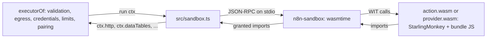

# Sandboxed execution of contract actions

Status: built for action and provider bundles, binary data included. The runtime choice comes from a benchmark of node:vm,
isolated-vm, WASM components and a task-runner process on real bundles, with the escape tests
below. Only the WASM component in a wasmtime sidecar stopped every escape with a clear error and
enforced CPU, memory and wall-clock limits itself.

## Goal

A node can bring any dependency, and later another language, and still run safely. It is bound
only by its permissions: the imports of its world and its manifest. First-party bundles can run
in-process. Community and AI-generated bundles run in the sandbox.

## Model: the world is the permission set

- The bundle has no ambient authority. It reaches only the imports of its world
  (`spec/wit/action.wit`, `world action-bundle`; `spec/wit/provider.wit`, `world
  provider-bundle`). There is no network, file system, clock, process or environment, except
  through an import.
- Every bundle gets `http`, `log`, `limits` and `run-credential`. The manifest of an action
  grants the optional imports: `imports` (data tables, code, wait, the input of an item),
  `binary()` fields (`binary`), `supplied()` fields (`supplied` and `capabilities`). A provider
  gets no optional import. A call to an import that is not granted stops the run with `The
  bundle called <method>, which its manifest does not grant`. The host never sees the call.
- `run-credential.get` gives the credential type and its declared fields that are not secret,
  as `credential` of `run()` in this process. The host reads them when the guest asks, so stored
  data that does not match the fields fails only a bundle that reads them. The guest then gets a
  fixed error text, because the host error can quote stored values. A secret, a token and an
  undeclared field never cross.
- All network I/O goes through the host `http` import: egress hosts, credential hosts, SSRF
  policy, redirects, retries and `maxRequests` (see "Egress and credential hosts").
- The host checks every output item against the manifest output, and every index and route.
- The runtime enforces CPU time, memory, wall clock and message size. The executor enforces
  requests and items.
- The same contract and the same host checks apply to first-party and community bundles. An
  in-process bundle gets the same `RunContext`, so its host checks are the same; only the
  isolation is weaker.

## Runtime

- `sandbox/sidecar` (Rust, wasmtime 47): one process for each node execution, so two executions
  share no state. It speaks `spec/json-rpc.md`. It reads `spec/wit` with wit-parser and links
  each import of the world with a dynamic host function, so one sidecar serves every world and
  version. The command line holds the component, the world, the grants and the limits; the
  JSON-RPC stream holds only the protocol. `wasi:random` is linked to the OS random source.
- `sandbox/action.ts` and `sandbox/provider.ts`, on the core `sandbox/guest.ts`: one generic guest
  component for each kind interface, `action.wasm` and `provider.wasm`, for every JS bundle of
  that kind. A WIT world cannot import and export `capabilities`, so one component cannot serve
  both. n8n builds and signs them. A guest evaluates the bundle, maps `RunContext` to the imports,
  and runs the `request` and `list` bindings with the SDK code. It gets its bundle code from the
  sidecar through `n8n:js-guest/bundle` (`sandbox/wit/guest.wit`). That interface is not a
  capability and the host never answers it. The bundle runs in the same JS realm as the guest, so
  the guest is not a trust boundary: the sidecar and the host are.
- `src/sandbox.ts`: `sandboxExecutorLoader(options, inProcess)` gives the `ExecutorLoader` of
  `setExecutorLoader` (`src/runtime.ts`). A bundle that `inProcess` accepts (for example one
  signed with the first-party key) runs through `loadExecutor` in this process. Every other bundle
  runs in the sandbox. The sandboxed action takes its contract from the signed manifest; the
  host runs no bundle code. `replayFixtures` takes the same action and executor, so publish can
  replay the fixtures in the sandbox.
- The credential types of a sandboxed action come from the host (`options.credentialType`) by
  the names in the manifest. Their hosts and base URLs never come from the bundle. The bundle
  gives only the node name, the scopes text and the node `baseUrl`. The host refuses a bundle
  whose `baseUrl` host is not an `egress` host or a credential host. An action without `egress`
  reaches only the hosts of its base URLs; with no base URL, it reaches no host.
- The host verifies the bundle hash and writes the bundle to the cache, named by its hash. The
  sidecar checks the hash again when it reads it. The compiled guest (`.cwasm`) is cached by the
  guest digest and the engine config.

### Binary data

- The executor keeps the handle table of the node execution, as in this process. The host gives
  the guest `{ "$binary": id }` at each `binary()` field of the run input, and puts the handle of
  the id back at each binary output field.
- `binary.binary-reader.read` gives at most 4 MiB and the guest asks for 1 MiB, so one chunk is a
  small JSON-RPC message. A writer streams each chunk to the store when it arrives, with back
  pressure. `binary.send` and `binary.fetch` keep the bytes in the host: the guest never sees
  them. Measured: 3 MiB through the guest in about 40 ms (read) and 80 ms (write); a 16 MiB
  download costs the same 14 ms as 1 MiB.
- A handle that the guest drops stays valid for the node execution, so it can still be an output.
- At the end of a run, the host ends each reader and writer that the guest did not drop. The store
  write of an unfinished writer fails, so it makes no binary.

### Providers and AI roots

- A root action gets `{ "$capability": id }` at each `supplied()` field. `supplied.open` gives a
  host resource, and each `capabilities` method goes to the capability that the executor read
  from the provider. The host checks the chat messages, requests and arguments of the guest.
- A provider bundle runs in `provider.wasm`. `provider.supply` gives a guest resource. The root
  calls the capability after the node execution of the provider ended, so each method call
  starts a new instance, runs `supply()` and then the method (about 16 ms per call). The guest
  keeps no state between two calls: a memory provider must keep its history through the host.
  The requests of a call use the context of the provider, so its credential, egress and request
  limit apply. The host checks each value that the provider gives (chat reply, messages, tool,
  vectors).

### n8n configuration

| Variable | Default | Meaning |
|---|---|---|
| `N8N_NODE_CONTRACT_SANDBOX` | `off` | `off`: every bundle runs in the n8n process. `stored`: a version that n8n does not bundle runs in the sandbox. `all`: every version runs in the sandbox. n8n logs a warning for another value and uses `off`, as for each n8n setting. |
| `N8N_NODE_CONTRACT_SANDBOX_SIDECAR` | — | The `n8n-sandbox` binary. |
| `N8N_NODE_CONTRACT_SANDBOX_GUESTS` | — | The directory with `action.wasm` and `provider.wasm`. |
| `N8N_NODE_CONTRACT_SANDBOX_CACHE_DIR` | `<n8n folder>/node-contracts/sandbox` | Compiled guests and verified bundles. Only n8n may write it. |

- A version is first-party when its bundle hash is the hash of a version that `@n8n/nodes-base-next`
  bundles. With `stored`, only first-party versions run in the n8n process.
- n8n stops at start when the sandbox is on and a file is missing, so no bundle runs outside it.
- The credential types come from the shipped nodes, else a `compat` type for a name that n8n has.

## Limits

| Limit | Default | Enforced by | Error |
|---|---|---|---|
| CPU time of the guest per node execution, host calls not counted | 30 s | sidecar (epoch) | `The bundle used its CPU time of … ms and was stopped` |
| Memory | 256 MB | sidecar (`ResourceLimiter`) | `The bundle reached its memory limit of … MB and was stopped` |
| Wall clock per node execution | 10 min | host (kills the sidecar) | `… ran longer than … ms and was stopped` |
| One message from the sidecar | 64 MB | host | `… gave a message larger than … bytes` |
| Requests, items | `maxRequests`, `maxItems` | executor | as in-process |

A trap stops the component: every later call of the execution gets the same error.

## Escape tests (`src/__tests__/sandbox.test.ts`)

| Bundle tries | Result |
|---|---|
| global `fetch` to a local server | `fetch is not available in the sandbox. Use http.request.`; the server gets nothing |
| `process.env` | `globalThis.process is undefined` |
| `import('node:fs')` | the JS engine stops (trap) |
| `setTimeout` with a late request | `setTimeout is not available in the sandbox`; the host gets no request |
| endless loop | stopped at the CPU limit |
| memory blow-up | stopped at the memory limit |
| a data table without `imports: ['dataTables']` | `The bundle called data-tables.open, which its manifest does not grant` |
| a request outside `egress` | the host refuses it (`Host not allowed: …`); no request is sent |
| a request with no `egress` and no base URL | the host refuses it (`… may send requests to no host …`); no request is sent |
| a credential type that claims other hosts | the host uses its own credential type and refuses the request; no request is sent |
| a node `baseUrl` outside `egress` and the credential hosts | the host refuses the bundle at load |
| `Object.prototype` pollution | stays in the guest realm |
| `Math.random`, `crypto` | different values in each run |
| reading `credential` | the plain fields only; the secret field is absent |
| reading `credential` when the stored data does not match its fields | a fixed error text; no stored value |
| a reader and a writer left open | the host ends both at the end of the run |
| a 3 MiB binary in, a copy out, a send and a fetch | the bytes cross in 1 MiB chunks; the output binaries equal the input |

## Coverage and cost

`versions.test.ts` of nodes-base-next replays the fixtures of every frozen action in the sandbox.
83 of 84 pass, the 6 binary-data actions, the 3 AI roots and the 5 providers included. The
sandbox refuses `notion.databasePage.getAll`: its `\p{…}` regex stops the JS engine
(StarlingMonkey has no Unicode data). The 2 triggers have no sandbox world yet. A bundle must use
web APIs only: Node globals such as `Buffer` do not exist in the guest (gmail.message.send uses
`TextEncoder` and `btoa`).

Measured on macOS arm64 (load 9 to 12), medians, for `slack.message.send`,
`gmail.message.getAll`, `notion.user.get` and `core.set`:

| | in-process | sandbox |
|---|---|---|
| first load ever (compile the guest) | — | 2.0 to 2.2 s once per guest and machine |
| load of a bundle (`describe`) | 1 to 4 ms | 13 to 17 ms once per bundle |
| node execution with 1 item | 0.1 to 0.2 ms | 12 to 15 ms (a new sidecar and instance) |
| each more item | 10 to 100 µs | 0.2 ms (no request) to 1.1 ms (4 requests) |

A real API call takes 50 to 500 ms, so the sandbox adds little to an HTTP-bound action.

## Not built yet

- Triggers (the trigger world), credentials (the credential world) and lookups in the sandbox.
  The sidecar is generic: each needs host answers in `src/sandbox.ts` and a guest entry.
- Node Contract 1.x bundles do not run in the sandbox.
- `migrate` has no export in the action world, so a sandboxed replay replays executions only.
- The node `baseUrl` of a sandboxed bundle comes from its `describe()`. Its host must be an
  `egress` host or a credential host (backlog E7).
- `effect: read` does not limit the HTTP methods (E4): some reads send `POST`, for example a
  Notion query. All response headers reach the bundle (E5).
- Release: build `n8n-sandbox` per platform in CI and sign it with the guest components. Precompile the
  guest at install. `pnpm sandbox:build` is the dev step; nothing downloads at run time.
- A pool of started sidecars would remove most of the 12 to 15 ms per node execution.

## Languages

A Python or Rust action implements the same WIT world against the same JSON Schemas. The sidecar
runs any component of the world. The same fixtures prove parity across languages.

## Risks

- StarlingMonkey has no `Intl` and no `\p{…}`. A locale call can give another result than in
  Node. The fixture replay in the sandbox at publish finds such a bundle.
- The interpreter is 20 to 45 times slower than V8 JIT for CPU-heavy code (S14).
- ComponentizeJS builds are not reproducible. Trust rests on the signed digest of each guest component.
- An allowed API can still reflect a secret back. The credential hosts limit this to the hosts
  of the credential. In the sandbox, these hosts come from the credential type of the host, not
  from the bundle.
- The sidecar is Rust code in the trust path. A wasmtime CVE needs an n8n release.

## Egress and credential hosts

Built. One check, in the host `http` import: `httpFor().request` in `src/runtime.ts`, the trigger
`http` in `src/triggers.ts`, and the binary transfers, which go through the same `request`. The
logic is in `src/egress.ts`.

- A credential type declares `hosts` (`api.notion.com`, or `*.example.com` for subdomains only).
  The host of its `baseUrl(fields)` is added. The user's "Allowed HTTP Request Domains" list
  (mode `domains`) adds hosts. `all` and `none` do not remove the own hosts.
- A credential type with no `hosts` and no `baseUrl` keeps the legacy meaning of that setting,
  as the legacy HTTP Request node does: `all` is no limit, `domains` is the list, `none` refuses.
- An action declares `egress`: static hosts, host templates over enum input fields
  (`{region}.api.example.com`), or `fromInput` for a URL field. Without it, the action reaches
  the hosts of the node and credential base URLs. In-process, an action with no base URL and no
  `egress` has no action limit, so a version frozen before `egress` still runs. The credential
  hosts apply. In the sandbox, such an action reaches no host.
- The host refuses a request outside the action hosts or the credential hosts before it sends it.
  A refused request is not retried. Every page is a new request, so every page is checked.
- The host sets `allowedDomains` on the request options, so the request layer checks every
  redirect hop. The list is the action hosts narrowed by the credential hosts. A host from
  `fromInput` does not bind redirect hops; the credential hosts still do.
- A `url` must be an absolute http or https URL. A `path` must start with one `/`. The host adds
  it to the base URL path and refuses a result with another origin.
- `egress` is in the contract document and in the contract hash. A new host is a major change.
  A removed host is a minor change. The publish gate refuses `*` and a value that is not a host.
- The AI builder runs the same rules when it builds a workflow (node contracts on): a static
  host outside the hosts of the bound credential is a build error that names the host and the
  credential. An expression is a warning, because the host checks it at run time.

## Binary data

A file is an opaque host handle (`binary` in `spec/wit/host.wit`, Node Contract 2.2.0). The
bytes stay in the n8n binary data store (filesystem, S3, or database mode). Only an action with
a `binary()` field targets 2.2.0. Every other bundle targets 2.1.0.

- Contract: `binary()` in `input` names a binary of the input item. In `output`, a top-level
  `binary()` field becomes `item.binary.<field>`. The flow SDK types it as `Binary`, and a
  lambda `(item) => item.binary.data` compiles to `{{ $binary.data }}`.
- Inline JS (now): the executor keeps a handle table for each execution. `run()` gets frozen
  `{ meta, read() }` objects, never the n8n entry. A handle as `http.request` body streams from
  the store. `response: 'binary'` streams the response into the store. `binary.create` stores
  chunks as the action yields them. A request with a streamed body does not follow redirects,
  because the HTTP client then keeps the whole body in memory.
- WASM (built, see "Binary data" above): `binary`, `binary-reader` and `binary-writer` are
  component resources. A read or a write moves one chunk (`list<u8>`) across the boundary. `send` and `fetch` take a borrowed
  handle, so the host streams the bytes and the guest never sees them. In the JSON of the run
  input and of each item, a binary is `{ "$binary": <id> }`; `open` and `binary.id` map ids to
  handles.
- Process or container: the same calls over JSON-RPC, with integer handle ids. Chunks as base64
  fit small files only. For large files the host gives a short-lived presigned URL of the store
  (S3), or a side channel (a second socket or a mounted file), and keeps the JSON-RPC message
  small. `send` and `fetch` need no bytes in the guest at all.
