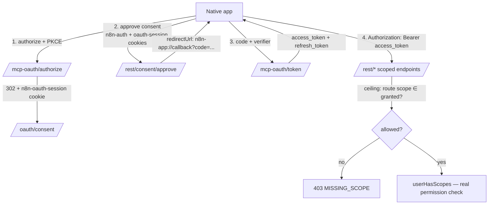

# Personal Automation — OAuth2 E2E Spec

End-to-end technical spec for authenticating a native/public client to an n8n instance via
OAuth2 (authorization code + PKCE) and calling scoped REST endpoints with the issued Bearer
token. n8n acts as the **authorization server**; the native app is a **public client**.

This reuses n8n's existing MCP OAuth 2.1 server (`/mcp-oauth/*`), extended so that:
- the access token carries a `scope` claim,
- the main REST auth middleware accepts `Authorization: Bearer <token>`,
- a **scope ceiling** is enforced centrally: effective access = `granted scopes ∩ the user's real permission`,
- a stable first-party client (`n8n-app`) is seeded from config (no dynamic registration needed).

---

## 1. Architecture (request path)



---

## 2. Scopes covered

| Scope | Endpoint it gates | Decorator | OAuth-reachable |
|---|---|---|---|
| `instanceAi:message` | `POST /rest/instance-ai/chat/:threadId`, `GET /rest/instance-ai/events/:threadId` | `@GlobalScope` | ✅ |
| `instanceAi:gateway` | instance-ai local gateway endpoints | `@GlobalScope` | ✅ |
| `workflow:read` | `GET /rest/workflows/:workflowId` | `@ProjectScope` | ✅ |
| `workflow:execute` | `POST /rest/workflows/:workflowId/run` | `@ProjectScope` | ✅ |
| `execution:read` | `GET /rest/executions/:id` | _none — internal check_ | ⚠️ see §8 |
| `execution:list` | `GET /rest/executions` | _none — internal check_ | ⚠️ see §8 |
| `tool:listWorkflows`, `tool:getWorkflowDetails` | MCP server (Claude Desktop etc.) | MCP server | ✅ (existing MCP flow) |

The ceiling only applies to routes decorated with `@GlobalScope`/`@ProjectScope`. Authenticated
routes **without** a scope decorator are denied for OAuth tokens by deny-by-default (§8).

---

## 3. Prerequisites

1. n8n running locally (default `http://localhost:5678`).
2. **MCP access enabled** (the OAuth endpoints are gated by the same flag) and the `feat:mcp`
   license present. Enable via Settings → MCP, or env if your build supports it.
3. The first-party client is **seeded automatically** on startup from `McpOAuthConfig` (default
   `client_id=n8n-app`, redirect `n8n-app://callback`). Override with
   `N8N_MCP_OAUTH_CLIENTS` (JSON) if needed — see §9.
4. `curl`, `jq`, `openssl` available.
5. A user account (owner recommended, so its global role already grants the workflow scopes).

```bash
export BASE=http://localhost:5678
export EMAIL='you@example.com'
export PASSWORD='your-password'
export CLIENT_ID='n8n-app'
export REDIRECT_URI='n8n-app://callback'
export COOKIES=/tmp/n8n-cookies.txt
```

---

## 4. Get an access token (authorization code + PKCE)

### 4.1 Generate the PKCE verifier and challenge (S256)

```bash
export VERIFIER=$(openssl rand -base64 96 | tr -d '\n=+/' | cut -c1-64)
export CHALLENGE=$(printf '%s' "$VERIFIER" \
  | openssl dgst -sha256 -binary \
  | openssl base64 | tr '+/' '-_' | tr -d '=')
export STATE=$(openssl rand -hex 8)
echo "verifier=$VERIFIER"
echo "challenge=$CHALLENGE"
```

### 4.2 (Optional) Discover the authorization server

```bash
curl -s "$BASE/.well-known/oauth-authorization-server" | jq
# -> authorization_endpoint, token_endpoint, scopes_supported, code_challenge_methods_supported: ["S256"], ...
```

### 4.3 Log in (obtain the `n8n-auth` session cookie)

The consent approval is a normal authenticated action, so we need a logged-in session in the
cookie jar.

```bash
curl -s -c "$COOKIES" -X POST "$BASE/rest/login" \
  -H 'content-type: application/json' \
  -d "{\"emailOrLdapLoginId\":\"$EMAIL\",\"password\":\"$PASSWORD\"}" | jq '.data.email'
```

### 4.4 Authorize (creates the OAuth session, returns the consent redirect)

Request the scopes you want — space-separated, URL-encoded as `%20`. This stores an
`n8n-oauth-session` cookie and 302-redirects to `/oauth/consent`. We don't follow the redirect;
we just capture the cookie.

```bash
# scopes requested for this token
export SCOPES='instanceAi:message workflow:read workflow:execute'
export SCOPES_ENC=$(printf '%s' "$SCOPES" | jq -sRr @uri)

curl -s -c "$COOKIES" -b "$COOKIES" -o /dev/null -D - \
  "$BASE/mcp-oauth/authorize?response_type=code&client_id=$CLIENT_ID&redirect_uri=$(printf '%s' "$REDIRECT_URI" | jq -sRr @uri)&code_challenge=$CHALLENGE&code_challenge_method=S256&scope=$SCOPES_ENC&state=$STATE" \
  | grep -i '^location:'
# Expect: Location: /oauth/consent   (and Set-Cookie: n8n-oauth-session=...)
```

### 4.5 Approve consent (returns the authorization code)

```bash
export REDIRECT=$(curl -s -b "$COOKIES" -c "$COOKIES" -X POST "$BASE/rest/consent/approve" \
  -H 'content-type: application/json' \
  -d '{"approved":true}' | jq -r '.data.redirectUrl')
echo "$REDIRECT"
# -> n8n-app://callback?code=<CODE>&state=<STATE>

# extract the code
export CODE=$(printf '%s' "$REDIRECT" | sed -E 's/.*[?&]code=([^&]+).*/\1/')
echo "code=$CODE"
```

> Inspect what the user actually consents to: `curl -s -b "$COOKIES" "$BASE/rest/consent/details" | jq` returns `{ clientName, clientId, scopes }`.

### 4.6 Exchange the code for tokens

Public client → no client secret, PKCE verifier proves possession.

```bash
export TOKENS=$(curl -s -X POST "$BASE/mcp-oauth/token" \
  -H 'content-type: application/x-www-form-urlencoded' \
  --data-urlencode "grant_type=authorization_code" \
  --data-urlencode "code=$CODE" \
  --data-urlencode "code_verifier=$VERIFIER" \
  --data-urlencode "client_id=$CLIENT_ID" \
  --data-urlencode "redirect_uri=$REDIRECT_URI")
echo "$TOKENS" | jq

export ACCESS_TOKEN=$(echo "$TOKENS" | jq -r '.access_token')
export REFRESH_TOKEN=$(echo "$TOKENS" | jq -r '.refresh_token')
```

Decode the access token to confirm the granted scopes (intersection of requested ∩ your real permissions):

```bash
echo "$ACCESS_TOKEN" | cut -d. -f2 | tr '_-' '/+' | base64 -d 2>/dev/null | jq '{sub, aud, client_id, scope, exp}'
```

---

## 4b. Browser-driven authorize (alternative to §4.3–4.5)

Easier for manual testing: open the authorization URL in a browser where you're logged into
n8n, click **Allow**, then read the `code` straight out of the redirect URL. Only the token
exchange (§4b.3) uses `curl`. No cookie jar needed.

### 4b.1 Generate PKCE + print the authorization URL

The verifier must survive until the exchange, so persist it to a file (the browser step happens
out-of-band, possibly in another terminal).

```bash
# PKCE — persist the verifier for the later exchange
export VERIFIER=$(openssl rand -base64 96 | tr -d '\n=+/' | cut -c1-64)
printf '%s' "$VERIFIER" > /tmp/n8n-pkce-verifier
export CHALLENGE=$(printf '%s' "$VERIFIER" | openssl dgst -sha256 -binary | openssl base64 | tr '+/' '-_' | tr -d '=')
export STATE=$(openssl rand -hex 8)

# scopes for this token
export SCOPES='instanceAi:message workflow:read workflow:execute'
export SCOPES_ENC=$(printf '%s' "$SCOPES" | jq -sRr @uri)
export REDIRECT_ENC=$(printf '%s' "$REDIRECT_URI" | jq -sRr @uri)

export AUTH_URL="$BASE/mcp-oauth/authorize?response_type=code&client_id=$CLIENT_ID&redirect_uri=$REDIRECT_ENC&code_challenge=$CHALLENGE&code_challenge_method=S256&scope=$SCOPES_ENC&state=$STATE"

echo
echo "1) Make sure you are logged into n8n in your browser ($BASE)."
echo "2) Open this URL:"
echo
echo "$AUTH_URL"
echo
# macOS: open it directly →  open "$AUTH_URL"
```

### 4b.2 Approve in the browser and copy the `code`

Opening the URL shows the consent screen (the scopes you requested). Click **Allow**. The browser
is then redirected to:

```
n8n-app://callback?code=<CODE>&state=<STATE>
```

The browser can't open the `n8n-app://` scheme, so it shows an error page — but the **address bar
still contains the full redirect URL**. Copy the `code` value from it.

> Tip: to land on a clickable, copyable page instead of a dead custom scheme, register a loopback
> redirect for manual testing and use it as `REDIRECT_URI` in §4b.1:
> ```bash
> export N8N_MCP_OAUTH_CLIENTS='[{"id":"n8n-app-dev","name":"n8n App (dev)","redirectUris":["http://localhost:9999/callback"],"grantTypes":["authorization_code","refresh_token"],"tokenEndpointAuthMethod":"none","clientSecret":null}]'
> # restart n8n so the client is re-seeded, then set:  export CLIENT_ID=n8n-app-dev REDIRECT_URI=http://localhost:9999/callback
> ```
> The browser lands on `http://localhost:9999/callback?code=...` (a harmless connection-refused / 404), with the code plainly in the address bar.

### 4b.3 Exchange the pasted code for tokens

```bash
export CODE='<paste the code from the redirect URL>'
export VERIFIER=$(cat /tmp/n8n-pkce-verifier)

export TOKENS=$(curl -s -X POST "$BASE/mcp-oauth/token" \
  -H 'content-type: application/x-www-form-urlencoded' \
  --data-urlencode "grant_type=authorization_code" \
  --data-urlencode "code=$CODE" \
  --data-urlencode "code_verifier=$VERIFIER" \
  --data-urlencode "client_id=$CLIENT_ID" \
  --data-urlencode "redirect_uri=$REDIRECT_URI")
echo "$TOKENS" | jq

export ACCESS_TOKEN=$(echo "$TOKENS" | jq -r '.access_token')
export REFRESH_TOKEN=$(echo "$TOKENS" | jq -r '.refresh_token')
```

The authorization code is single-use and expires in 10 minutes, so exchange it promptly. From
here, §5–§8 are identical.

---

## 5. Refresh the token

OAuth 2.1 rotates the refresh token; the new access token preserves the original grant's scopes.

```bash
export REFRESHED=$(curl -s -X POST "$BASE/mcp-oauth/token" \
  -H 'content-type: application/x-www-form-urlencoded' \
  --data-urlencode "grant_type=refresh_token" \
  --data-urlencode "refresh_token=$REFRESH_TOKEN" \
  --data-urlencode "client_id=$CLIENT_ID")
echo "$REFRESHED" | jq

export ACCESS_TOKEN=$(echo "$REFRESHED" | jq -r '.access_token')
export REFRESH_TOKEN=$(echo "$REFRESHED" | jq -r '.refresh_token')   # old refresh token is now invalid
```

---

## 6. Send a message to instance-ai (`instanceAi:message`)

```bash
export THREAD_ID=$(uuidgen)

# Start a run (thread is created on first use)
curl -s -X POST "$BASE/rest/instance-ai/chat/$THREAD_ID" \
  -H "authorization: Bearer $ACCESS_TOKEN" \
  -H 'content-type: application/json' \
  -d '{"message":"List my workflows and tell me what they do."}' | jq
# -> { "runId": "..." }

# Stream the run's events (native HTTP client sends the header; browser EventSource cannot)
curl -N -s "$BASE/rest/instance-ai/events/$THREAD_ID" \
  -H "authorization: Bearer $ACCESS_TOKEN"
# -> Server-Sent Events: run-start, text-delta, tool-call, ..., run-finish
```

---

## 7. Read and execute a workflow (`workflow:read`, `workflow:execute`)

```bash
export WF_ID='<your-workflow-id>'

# 7.1 Read the workflow (workflow:read)
curl -s "$BASE/rest/workflows/$WF_ID" \
  -H "authorization: Bearer $ACCESS_TOKEN" | jq '.data | {id, name, active}'

# 7.2 Execute it manually (workflow:execute).
# The run payload mirrors what the editor sends: { workflowData: <the workflow> }.
export WF_JSON=$(curl -s "$BASE/rest/workflows/$WF_ID" -H "authorization: Bearer $ACCESS_TOKEN" | jq '.data')

curl -s -X POST "$BASE/rest/workflows/$WF_ID/run" \
  -H "authorization: Bearer $ACCESS_TOKEN" \
  -H 'content-type: application/json' \
  -d "$(jq -nc --argjson wf "$WF_JSON" '{workflowData: $wf}')" | jq
# -> { "data": { "executionId": "...", ... } }
```

> Note: the run handler reads the n8n session cookie for sub-execution auth; with a Bearer token
> there is no cookie, which is fine for self-contained workflows. Sub-workflow/webhook auth that
> depends on the caller's cookie is out of scope for this flow.

---

## 8. Negative tests (prove the ceiling)

```bash
# A token NOT granted instanceAi:message must be 403 on chat.
# (Re-run §4 with scope='workflow:read' to mint such a token, then:)
curl -s -o /dev/null -w '%{http_code}\n' -X POST "$BASE/rest/instance-ai/chat/$(uuidgen)" \
  -H "authorization: Bearer $TOKEN_WITHOUT_MESSAGE" -H 'content-type: application/json' -d '{"message":"hi"}'
# -> 403

# A token granted only instanceAi:message must be 403 on workflow execute.
curl -s -o /dev/null -w '%{http_code}\n' -X POST "$BASE/rest/workflows/$WF_ID/run" \
  -H "authorization: Bearer $TOKEN_MESSAGE_ONLY" -H 'content-type: application/json' -d '{}'
# -> 403  (route scope workflow:execute ∉ granted ceiling)

# Deny-by-default: an OAuth token on an authenticated UNSCOPED endpoint is 403.
curl -s -o /dev/null -w '%{http_code}\n' "$BASE/rest/login" -H "authorization: Bearer $ACCESS_TOKEN"
# -> 403
```

---

## 9. Client configuration

The seeded client(s) come from `McpOAuthConfig` (env `N8N_MCP_OAUTH_CLIENTS`, JSON array). Default:

```json
[
  {
    "id": "n8n-app",
    "name": "n8n App",
    "redirectUris": ["n8n-app://callback"],
    "grantTypes": ["authorization_code", "refresh_token"],
    "tokenEndpointAuthMethod": "none",
    "clientSecret": null
  }
]
```

Add more clients (e.g. a dev build with a loopback redirect) by setting the env var to a JSON
array. Redirect URIs are matched **exactly** — no dynamic loopback ports.

---

## 10. Known limitations & notes

- **Executions endpoints aren't OAuth-reachable yet.** `GET /rest/executions` and
  `GET /rest/executions/:id` have no `@GlobalScope`/`@ProjectScope` decorator (they gate access
  internally via workflow sharing), so deny-by-default blocks OAuth tokens there. The
  `execution:read` / `execution:list` scopes are advertised but won't grant access until those
  routes are scope-decorated. Use instance-ai to summarize executions in the meantime.
- **Consent requires a logged-in browser session.** The curl flow logs in first to drive the
  consent approval. The native app drives consent in a webview/system browser where the user is
  already (or gets) logged in.
- **Custom-scheme redirect & curl.** `n8n-app://callback` can't be *followed* by curl; we read
  the `code` from the consent `redirectUrl` field instead. The native app receives it via the OS
  deeplink.
- **Token audience.** Tokens are minted with `aud = <baseUrl>/mcp-server/http` (reused from MCP).
  The REST Bearer path accepts that audience. Capability is constrained by the scope ceiling, not
  the audience.
- **MCP-enabled gating.** All of `/mcp-oauth/*` and Bearer acceptance require MCP access enabled
  + `feat:mcp`; disabling MCP disables this flow.
- **Access token lifetime** is 1h; refresh token 30d (rotating, single-use).
```
