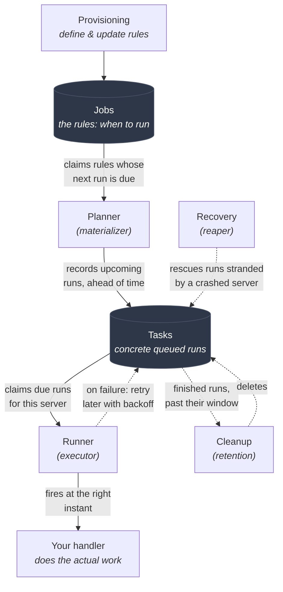
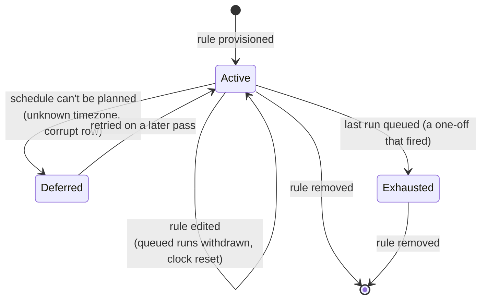
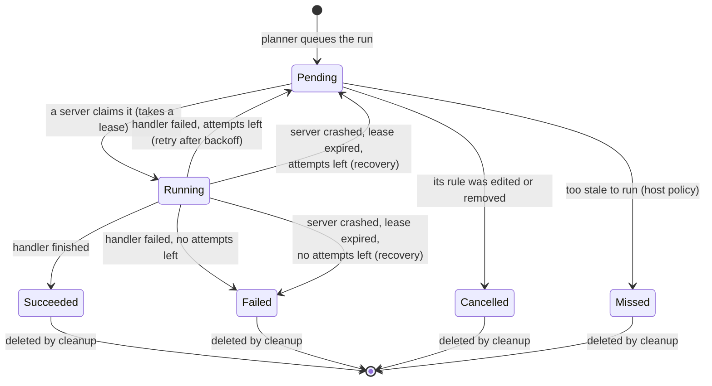

# @n8n/scheduler

A durable, cluster-safe scheduler. You give it rules like "run this every Monday
at 09:00" or "run this once at midnight on New Year's Eve", and it makes sure the
work actually runs, at the right time, and (as close as a distributed system can
get) exactly once, even when n8n is running on several servers at once and even
across restarts and crashes.

## TL;DR

**The principle.** Most schedulers keep their timers in memory: the process holds
a `setTimeout` for each upcoming run. That is simple but fragile. If the process
restarts, the timers are gone. If you run several copies of the server for high
availability, every copy fires the same timer and the work runs many times.

This package takes a different approach: **write the work down before running it.**
Every upcoming run is recorded in the database first, then picked up and fired from
there. Because the source of truth lives in storage and not in one process's memory:

- a restart or crash loses nothing (the run is still recorded and gets picked up
  again),
- any server in the cluster can pick up any run, and
- coordination in the database drives each run toward firing on **exactly one**
  server, with safety mechanisms (claims, leases, recovery) to fall back on when a
  server crashes mid-run.

**Two things you work with.**

- A **job** is a *rule*: it says *when* something should happen (the cron
  expression, the interval, the one-off instant). Think of it as a recurring
  calendar event.
- A **task** is *one concrete run* produced from that rule, scheduled for one
  specific instant. Think of it as a single occurrence of that calendar event on a
  specific date. Tasks are the unit that actually gets claimed, run, retried and
  cleaned up.

**The functionality surface.** You register a *handler* (a function that does the
actual work) for a given task type, hand the scheduler your rules, and start it.
From then on it:

- turns each rule into concrete upcoming runs, ahead of time,
- claims each due run on one server and calls your handler at the right moment,
- retries a run that fails, with a growing backoff between attempts,
- recovers runs that were stranded by a crashed server,
- cleans up finished runs after a retention window.

**How it is built.** The package is **pure logic**. It talks to no database and
uses no dependency injection directly. Instead the host (in n8n, the `cli`
package) hands it a small set of storage functions and configuration, and the
scheduler composes its algorithms over them. This keeps every algorithm easy to
test in isolation with a fake store. The work is split into a few focused
submodules, described below.

Everything sits behind the `N8N_SCHEDULER_ENABLED` flag (off by default). Turning
it off reverts n8n to its previous in-memory scheduling, which is the rollback
path during rollout.

## The moving parts

The scheduler runs four small background routines, each on its own repeating
timer. Each one is a separate submodule with a single responsibility. Their code
names are in parentheses; the rest of this document uses the plain names.



### Planner (materializer)

Turns rules into concrete runs. On each pass it claims the jobs whose next run is
due, computes their upcoming occurrences a little way into the future, records
those as tasks, and advances each job's clock to its next run. Recording runs
*ahead of time* means a frequent schedule doesn't need one planning pass per fire.

Failures are isolated: if one rule cannot be planned (for example a timezone this
server's runtime doesn't know about), that single job is set aside and retried
later, while every other job in the batch still gets planned. One broken rule
never wedges scheduling for everyone.

### Runner (executor)

Runs the concrete tasks. On each pass it claims the tasks that are due for this
server and arms a precise in-memory timer for each, so it fires at its exact
instant. When the timer fires it calls your registered handler for that task type.
If the handler succeeds the task is marked done; if it throws and attempts remain,
the task is rescheduled a bit later (backoff); if it throws with no attempts left,
the task fails for good (a "dead letter").

### Recovery (reaper)

Rescues stranded runs. When a server claims a task it takes a time-limited *lease*
on it. If that server crashes or stalls, the lease eventually expires and the task
is left stuck in the "running" state. The recovery pass finds those expired-lease
tasks and puts them back in line for another attempt (or fails them for good if
they are out of attempts). This is what makes a mid-run crash safe.

### Cleanup (retention)

Deletes finished tasks once they are older than a retention window, oldest first,
in small bounded batches so it never holds long locks or monopolises a pass.
Successful and failed runs can be kept for different lengths of time.

### Supporting submodules

- **Provisioning** keeps the stored set of rules in sync with what a scope
  (for example a workflow) currently wants: it inserts new rules, rewrites changed
  ones, and removes rules that are gone. Unchanged rules keep their identity, so
  re-publishing a workflow never double-fires runs that were already queued.
- **Recurrence** is the pure date math: given a rule and a starting instant, what
  is the next run? It handles cron expressions, intervals, one-offs, and the
  "every N periods" variant described below, including timezone and daylight-saving
  behaviour.
- **Lifecycle** is the set of repeating loops that drive the four passes above,
  each on its own interval with a little randomness ("jitter") so multiple servers
  don't all fire their passes in lockstep.

## Schedule kinds

A job says *when* to run. There are four kinds:

| Kind | Meaning | Example |
|---|---|---|
| `cron` | Fires at fixed clock times, written as a cron expression. | `0 0 9 * * 1` = every Monday at 09:00 |
| `interval` | Fires every N seconds of elapsed time. | every 3600s = once an hour |
| `one_off` | Fires once, at a single instant, then never again. | fire at 2026-01-01 00:00 |
| `recurring_cron` | A cron pattern thinned by an "every N periods" filter, for cadences plain cron cannot express. | every 5 hours; every 3 weeks on Monday |

A `cron` schedule is evaluated as *wall-clock* time in a timezone, so it follows
daylight-saving shifts (09:00 stays 09:00). An `interval` schedule counts *elapsed*
time, so daylight saving never moves it.

### Why `recurring_cron`?

A cron expression can only pick times *within* a repeating calendar (which minute,
hour, day-of-week, and so on). It cannot count across those cycles. So it can say
"every Monday", but not "every *third* Monday", and it can say "at minute 0 of some
hours", but not "every 5 hours" starting from a fixed point (the day has 24 hours,
which 5 does not divide evenly, so no fixed set of hour values repeats cleanly).

`recurring_cron` covers exactly those cases by combining two parts:

- an **anchor**: a normal cron pattern that lists candidate times (often too many),
- a **filter**: keeps a candidate only once at least N periods (hours, days, weeks
  or months) have passed since the last kept run.

The most common case is a plain "every N hours". "Every 5 hours" = anchor "every
hour" + filter "1 per 5 hours":

```
Anchor (every hour):    H  H  H  H  H  H  H  H  H  H  H
Filter (1 per 5 hours): ✓  ✗  ✗  ✗  ✗  ✓  ✗  ✗  ✗  ✗  ✓
Fires:                  H              H              H
```

The same shape expresses calendar cadences too. "Every 3 weeks on Monday" = anchor
"every Monday" + filter "1 per 3 weeks":

```
Anchor (every Monday):  M   M   M   M   M   M   M
Filter (1 per 3 weeks): ✓   ✗   ✗   ✓   ✗   ✗   ✓
Fires:                  M           M           M
```

The filter looks only at the *previous* run, with no stored counter. So any server
in the cluster can compute the next run on its own, and a restart never loses the
cadence.

## Durable and distributed

Two properties describe the whole design, and everything else follows from them.

**Durable** means nothing important lives only in memory. The rules, every upcoming
run, and each run's current state all live in the database. A process can restart
or crash at any moment and the scheduler simply picks up where the stored state left
off. Compare an in-memory scheduler, where a restart forgets every pending timer.

**Distributed and leaderless** means there is no elected "scheduler node" that the
others depend on. Every server runs the same passes over the same shared state, and
they coordinate purely through the database. There is no leader to elect, fail over,
or lose. Adding or removing a server changes throughput, not correctness: any server
can plan any rule and run any due task.

## Aiming for exactly-once across a cluster

In a distributed system, servers crash mid-run, clocks drift, and network calls
time out. A scheduler cannot make those failures impossible, so this one is built to
**target exactly-once and, when something does go wrong, to prefer not losing work
over never repeating it.** In rare recovery situations that can mean a run executes
more than once, so handlers should tolerate being called again for the same run.
The design leans on a few ideas working together.

- **Claim.** A run is only ever picked up through an atomic database claim: a
  single statement that flips exactly one waiting row to "running" and stamps it
  with the server that claimed it. Because the database resolves the race, only one
  server can win a given run, no matter how many try at once.
- **Lease.** A claim comes with an expiry (a *lease*). While the lease is valid the
  run belongs to that server. If the server dies, the lease lapses and the recovery
  pass can safely take the run back. Without leases a crashed server would strand
  its runs forever.
- **Fencing.** Each claim carries a version number (an *epoch*) that increases every
  time a run is claimed. Every final write ("mark succeeded", "mark failed") is
  guarded by that number. So if a slow server comes back from the dead after its
  run was already recovered and re-run elsewhere, its late write matches nothing and
  is harmlessly ignored. It cannot overwrite the newer result.

The claim, the lease and the recovery pass are the safety net: a crash at any point
is recoverable rather than silently lost. A few supporting choices reinforce it:

- **Identity and idempotency.** Each concrete run is unique on its
  `(job, instant)` pair, so the same instant can never be queued twice, even if two
  planning passes race.
- **Recomputable recurrence.** The next run is derived from the last one, never from
  a counter held in memory, so any server can compute it and a restart never drifts.
- **Shared backoff.** A retry after a handler failure and a retry after a crash use
  the same backoff curve, so recovery behaves consistently however a run failed.

## Lifecycle of a job (a rule)

A job carries a "clock" (its next-run time). The planner keeps advancing that clock
as it queues runs.



- **Active**: has a next-run time; the planner keeps materialising it.
- **Deferred**: planning failed for now; the clock is pushed out and retried later,
  so a transient cause (a fixed timezone, updated timezone data) heals on its own.
- **Exhausted**: no future runs left (a one-off that has fired); the clock is empty.
- Editing or removing a rule is handled by provisioning, which withdraws any runs
  that were queued under the old definition.

## Lifecycle of a task (a concrete run)

A task is created by the planner and moves through claim, run, and a final outcome.



- **Pending**: queued and waiting for its instant.
- **Running**: claimed and owned by one server for the duration of its lease.
- **Succeeded / Failed**: the two normal final outcomes. "Failed" means all attempts
  were used up, whether from repeated handler errors or repeated crashes.
- **Cancelled**: the run's rule changed or was removed before it fired, so the
  queued run is withdrawn.
- **Missed**: a run so old it is no longer worth firing; whether a stale run still
  runs or is marked missed is the host's policy, not the scheduler's.
- Finished runs (the four final states) are eventually deleted by the cleanup pass.

## What this package is (and is not)

It is a **library of scheduling logic**, not a running service on its own. It owns
the algorithms and the schedule math; it does not own a database connection, a DI
container, or a configuration source. A **host** provides those and drives it.

The public surface is small:

- **`createScheduler(deps)`** composes the submodules into a scheduler. `deps` is
  the host's contribution: a task store and a transaction runner (the `@n8n/db`
  repositories fit these shapes directly, so no adapter layer is needed), an
  instance identity, optional per-pass tuning, and optional sinks for events,
  tracing and metrics.
- The resulting **`Scheduler`** exposes `registerTaskHandler` (bind a handler to a
  task type), `start` (begin the repeating passes) and `stop` (drain them
  gracefully). Individual passes can also be triggered one at a time, which is used
  mainly for tests and manual driving.
- A few pure helpers are exported too: schedule validation, next-run computation,
  and the provisioning entry points.

In n8n, that host is the `cli` package's durable-scheduler module, which wires up
DI, configuration and instance identity, and routes the scheduler's events to the
logger. While `N8N_SCHEDULER_ENABLED` is off, the previous in-memory engine stays
in place; turning the flag off again is the rollback.

The boundary this section describes is enforced, not just documented.
`src/__tests__/dependency-purity.test.ts` fails if the package ever gains a
forbidden dependency, whether a new `package.json` entry outside the allowlist or
an `import` of something effectful (`@n8n/db`, TypeORM, `n8n-core`, the DI
container, the `cli` package, or a Node I/O built-in). Its opening doc comment is
the living explanation of the approach: why scheduling is split from execution and
storage, why each excluded dependency is excluded, and how far the idea could be
taken. Read it first if you want the reasoning behind the split above.

## Good to know

A few things that are not obvious from the code but save a lot of confusion.

- **"Processing a task" is *scheduling* it, not doing the work.** From the
  scheduler's point of view, handling a due task means claiming it and arming a
  precise timer so it fires at its exact instant. The actual work is whatever your
  registered handler does; the scheduler only hands the task to it at the right
  moment and records the outcome. So a fast scheduler pass does not mean the work is
  fast, and a slow handler does not block the passes that queue and claim other
  tasks.

- **A plain cron expression cannot count across cycles.** It selects times within a
  repeating calendar (minutes, hours, days-of-week), so cadences like "every third
  Monday" or "every 5 hours" are simply not expressible in cron. That is the whole
  reason `recurring_cron` exists: it wraps a cron anchor with an "every N periods"
  filter to cover those cases. If a schedule fits plain cron, use `cron`; reach for
  `recurring_cron` only when the cadence spans cycles.

- **The package never logs, traces or measures on its own.** Instead it reports
  through optional hooks the host supplies, so observability is entirely the host's
  choice:
  - an **event sink** (`onEvent`) receives already-handled milestones and incidents
    as plain, described messages, which the host typically routes to its logger;
  - a **tracer** wraps each pass and each handler run in a span;
  - a **metrics** sink records counts and timings (dispatches, retries, dead
    letters, and so on).

  All three default to no-ops, and a throwing hook is swallowed so a broken logger
  or exporter can never break the scheduling it was only meant to observe.

- **Two warnings tell an operator their timing is off.** Both arrive through the
  event sink at `warn` level, so they land in the host's logs:
  - a **clock-skew warning** at start-up. Due-ness and leases are judged on the
    clock the scheduler coordinates on (the host supplies it via `now`, e.g. the
    database clock), but fire timers are armed on this instance's own clock. When
    `start` samples the two and they differ by more than the threshold (default
    `1s`, `CLOCK_SKEW_WARN_THRESHOLD_MS`), it warns: tasks may fire early or late,
    and the instance clock should be synchronised (e.g. via NTP). The sample runs
    detached, so it never delays the loops, and a slow read cannot trip it on its
    own (the offset must also exceed half the round-trip). Skipped entirely when no
    `now` is supplied.
  - a **dispatch-lag warning** when a task fires at least
    `DEFAULT_DISPATCH_LAG_WARN_THRESHOLD_SECONDS` (default `30s`) past its scheduled
    time, once per late fire. This flags a genuinely late dispatch (a blocked event
    loop, a skewed clock), not routine sub-second jitter.

- **Runs are recorded ahead of time, within a window.** Because upcoming runs are
  queued in advance, a frequent schedule does not need one planning pass per fire.
  The flip side: disabling or editing a rule may take until the end of that window
  to stop already-queued runs, unless the rule-writing path withdraws them (which
  provisioning does).

- **Each background pass runs on its own timer, with jitter.** The four passes are
  independent and slightly randomised, so several servers do not all run their
  passes in lockstep, and one slow pass does not stall the others.

## Future ideas

- **A dedicated host module.** Today the wiring that turns this pure library into a
  running scheduler (DI, configuration, instance identity, event routing) lives
  inside the large `cli` package. Extracting it into its own module, for example
  `@n8n/scheduler-cli` or `@n8n/scheduler-features`, would keep the integration
  concerns together and out of `cli`, and mirror the clean split this package
  already draws between algorithm and host.
- **Lease renewal for long handlers.** A claim's lease is fixed for now, so a
  handler that runs longer than its lease risks being recovered and re-run. A
  heartbeat that extends the lease while a handler is genuinely still working would
  lift that constraint.

### Exploring the idea: a standalone `@n8n/scheduler-worker`

Pushed all the way, that host module becomes its own deployable worker. On a due
task it does not run the workflow, it creates an execution and enqueues a job (Bull
and Redis) for the regular workers, so the real work is decomposing `cli`. The
result is far leaner than `cli`, which bundles every node's dependencies (1Password,
S3, and more). The worker only needs:

| Needs | Package | Pulls in |
| --- | --- | --- |
| Core logic | `@n8n/scheduler` | luxon, cron-parser |
| Task store + transactions | `@n8n/db` | `@n8n/typeorm` + a database driver |
| Enqueue executions (a new, extracted publisher) | `@n8n/…-publisher` | Bull + ioredis, execution writes, trigger-context |
| Logging + lifecycle | `@n8n/backend-common` | winston |
| Wiring + types | `@n8n/config`, `@n8n/di`, `@n8n/decorators`, `n8n-workflow` | reflect-metadata |
| Instance identity (today) | `n8n-core` | the execution engine, unless extracted |

Full reasoning in the doc comment of `src/__tests__/dependency-purity.test.ts`.
