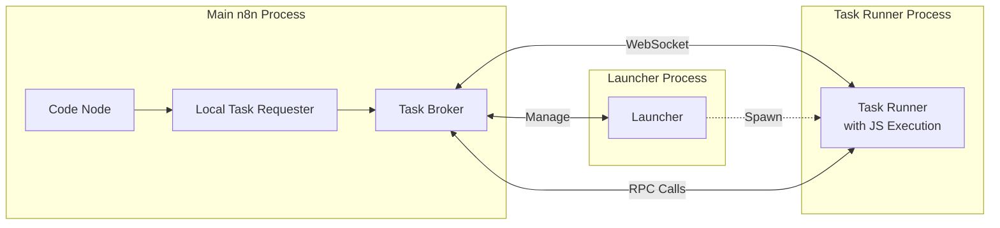
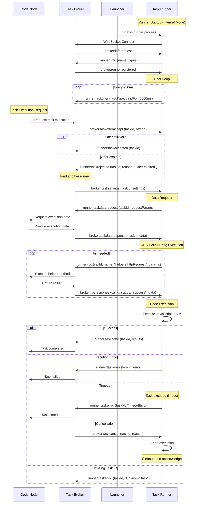

# @n8n/task-runner

The Task Runner package provides a secure, isolated environment for executing user-provided JavaScript code in n8n workflows. It implements a distributed task execution system that runs code in separate processes, protecting the main n8n instance from potentially unsafe operations.

## Overview

When users add Code nodes to their workflows, the JavaScript code needs to be executed in a controlled environment. The task-runner package provides this isolation by:

- Running JavaScript code in separate processes (task runners)
- Managing communication between the main n8n process and task runners
- Providing controlled access to n8n helper functions via RPC
- Supporting both internal (child process) and external (separate process) runners

## Relationship with Code Nodes

The task-runner executes JavaScript code from Code nodes in n8n workflows:

1. User creates Code node in workflow
2. When workflow executes, Code node sends task to runner
3. Runner executes JavaScript in isolated environment
4. Results return to workflow for next nodes

This separation ensures user code cannot affect n8n's stability or security.

## Architecture



### Key Components

1. **Task Broker** (`/src/task-broker/`)
   - Central coordinator for task distribution
   - Manages runner registration and lifecycle
   - Routes tasks to available runners
   - Handles authentication and authorization

2. **Task Runner** (`/src/task-runner.ts`)
   - Abstract base class for task execution
   - Manages task lifecycle (offer → accept → execute → result)
   - Handles WebSocket communication with broker
   - Implements timeout and cancellation logic

3. **JS Task Runner** (`/src/js-task-runner/`)
   - Concrete implementation for JavaScript execution
   - Creates isolated VM contexts for code execution
   - Manages module access and security restrictions
   - Handles data serialization/deserialization

4. **Message Protocol** (`/src/message-types.ts`)
   - Defines communication protocol between components
   - Three message namespaces: BrokerMessage, RunnerMessage, RequesterMessage
   - Supports task offers, data requests, RPC calls, and results

## How It Works

### Task Execution Flow

1. **Code Node Execution**: When workflow reaches a Code node, it creates a task request
2. **Task Offer**: Available runners continuously send offers to the broker (every 250ms)
3. **Task Assignment**: Broker matches request with valid offer and assigns task to runner
4. **Data Exchange**: Runner requests execution data, makes RPC calls for helpers
5. **JavaScript Execution**: Runner executes code in isolated VM context
6. **Result Return**: Execution results sent back through broker to Code node

### Task Lifecycle Sequence



### Communication Protocol Messages

```typescript
// Runner announces availability
Runner → Broker: { type: 'runner:taskoffer', taskType: 'javascript', validFor: 5000 } // 5000ms

// Broker accepts offer and assigns task
Broker → Runner: { type: 'broker:taskofferaccept', taskId: 'abc123' }

// Runner requests data needed for execution
Runner → Broker: { type: 'runner:taskdatarequest', taskId: 'abc123', requestParams: {...} }

// Broker provides execution data
Broker → Runner: { type: 'broker:taskdataresponse', taskId: 'abc123', data: {...} }

// Runner returns results
Runner → Broker: { type: 'runner:taskdone', taskId: 'abc123', data: {...} }
```

## Configuration

### Runner Modes

1. **Internal Mode** (default)
   - Task runner runs as a child process of n8n
   - Automatically managed by n8n
   - Suitable for single-instance deployments

2. **External Mode**
   - Task runner runs as a separate process
   - Can be deployed on different machines
   - Enables horizontal scaling
   - Requires authentication token configuration

### Environment Variables

Configure the task runner using these environment variables:

```bash
# Enable task runners (required)
N8N_RUNNERS_ENABLED=true

# Runner mode: 'internal' (default) or 'external'
N8N_RUNNERS_MODE=internal

# For external runners
N8N_RUNNERS_BROKER_URI=ws://localhost:5679
N8N_RUNNERS_AUTH_TOKEN=your-secure-token

# Performance settings
N8N_RUNNERS_MAX_CONCURRENCY=10
N8N_RUNNERS_TASK_TIMEOUT=300

# JavaScript runner settings
N8N_RUNNERS_ALLOWED_BUILTIN_MODULES=crypto,util,url
N8N_RUNNERS_ALLOWED_EXTERNAL_MODULES=lodash,moment
N8N_RUNNERS_ALLOW_PROTOTYPE_MUTATION=false
```

## Security Features

### Code Isolation
- JavaScript code runs in isolated VM contexts
- No direct access to the file system or network
- Limited access to Node.js built-in modules
- Controlled memory and execution time limits

### Module Access Control
- Whitelist approach for built-in modules (e.g., 'crypto', 'util')
- External modules must be explicitly allowed
- Built-in parser validates and restricts module usage

### RPC Method Restrictions
Only specific helper methods are exposed via RPC:
- `helpers.assertBinaryData()`
- `helpers.getBinaryDataBuffer()`
- `helpers.prepareBinaryData()`
- `helpers.setBinaryDataBuffer()`
- `helpers.binaryToString()`
- `helpers.httpRequest()`

### Prototype Mutation Control
- Can be disabled to prevent prototype pollution attacks
- Required for some testing frameworks (e.g., Jest)

### Security Best Practices

1. **Auth Token Management**
   - Use strong, random tokens (min 32 characters)
   - Rotate tokens periodically
   - Never commit tokens to version control

2. **Network Security**
   - Run task runners in isolated network segment
   - Use TLS for external runner connections
   - Limit runner access to only required services

3. **Resource Limits**
   - Set appropriate task timeouts
   - Monitor and limit memory usage
   - Use cgroups for process isolation

## Usage Examples

### Complete Example: External Runner Setup

1. **Configure n8n main instance:**
```bash
N8N_RUNNERS_ENABLED=true
N8N_RUNNERS_MODE=external
N8N_RUNNERS_AUTH_TOKEN=secret-token-123
```

2. **Start external runner:**
```bash
N8N_RUNNERS_BROKER_URI=ws://n8n-main:5679 \
N8N_RUNNERS_AUTH_TOKEN=secret-token-123 \
N8N_RUNNERS_MAX_CONCURRENCY=5 \
node packages/@n8n/task-runner/dist/start.js
```

3. **Verify connection:**
Check n8n logs for "Task runner connected" message.

### Programmatic Usage

```typescript
import { JsTaskRunner } from '@n8n/task-runner';

const runner = new JsTaskRunner({
  taskType: 'javascript',
  taskBrokerUri: 'ws://localhost:5679',
  grantToken: 'your-auth-token',
  maxConcurrency: 10,
  taskTimeout: 300, // 5 minutes
});

// The runner will automatically connect and start processing tasks
```

### Task Execution Lifecycle

```typescript
// 1. Runner sends periodic offers
runner.sendOffers(); // { type: 'runner:taskoffer', validFor: 5000 }

// 2. Runner accepts assigned tasks
runner.offerAccepted(offerId, taskId);

// 3. Runner executes JavaScript code
const result = await runner.executeTask({
  taskId: 'task-123',
  settings: {
    code: 'return items.map(item => ({ ...item.json, processed: true }));',
    nodeMode: 'runOnceForEachItem',
  }
});

// 4. Runner returns results
runner.send({ type: 'runner:taskdone', taskId, data: result });
```

## Error Handling

The task runner implements comprehensive error handling:

- **Timeout Errors**: Tasks that exceed the configured timeout
- **Validation Errors**: Invalid code or return values
- **Execution Errors**: Runtime errors in user code
- **Communication Errors**: WebSocket disconnections
- **Cancellation**: Tasks can be cancelled by the broker

All errors are properly serialized and returned to the workflow executor for appropriate handling.

## Performance Tuning

### Concurrency Settings
- Set `maxConcurrency` based on CPU cores
- Monitor memory usage per task (typically 50-100MB)
- For CPU-intensive tasks, use concurrency = cores - 1

### Memory Management
- Runner process memory limit: ~1GB recommended
- Individual task memory is limited by V8 heap
- Use streaming for large data processing

### Scaling Guidelines
- 1 runner per 2-4 CPU cores
- Distribute runners across multiple machines
- Use monitoring to identify bottlenecks

## Monitoring

### Health Checks
Task runners expose health endpoints:
- `GET /healthz` - Basic health check
- `GET /metrics` - Prometheus metrics (if enabled)

### Key Metrics
- `task_runner_active_tasks` - Currently executing tasks
- `task_runner_completed_tasks` - Total completed
- `task_runner_failed_tasks` - Total failures
- `task_runner_task_duration` - Execution time histogram

## Debugging

### Common Issues

**Runner not connecting:**
- Check firewall rules for WebSocket port (5679)
- Verify auth token matches between n8n and runner
- Check n8n logs for connection attempts

**Tasks timing out:**
- Increase `N8N_RUNNERS_TASK_TIMEOUT`
- Check runner process resources (CPU/memory)
- Look for infinite loops in user code

**Enable debug logging:**
```bash
DEBUG=n8n:task-runner* node packages/@n8n/task-runner/dist/start.js
```

### Useful Commands

```bash
# Check if task runner is enabled
n8n info | grep -i runner

# View task runner logs
journalctl -u n8n -f | grep -i task

# Test WebSocket connectivity
wscat -c ws://localhost:5679 -H "Authorization: Bearer YOUR_TOKEN"
```

## Development

### Running Tests

```bash
pnpm test
```

### Building

```bash
pnpm build
```

### Development Mode

```bash
pnpm dev
```

## API Reference

### Main Exports

- `TaskRunner`: Abstract base class for implementing task runners
- `JsTaskRunner`: JavaScript task runner implementation
- Message type definitions for broker communication
- Error classes for different failure scenarios

### Message Types

See `/src/message-types.ts` for the complete protocol definition.

### Runner Types

See `/src/runner-types.ts` for data structure definitions.
