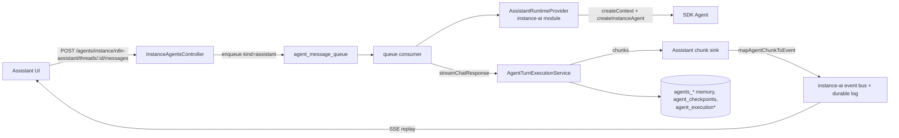

# PoC: n8n Assistant on the Agents runtime (ASS-1573)

Status: plan. Branch `ass-1573-aia-agents-framework-agent`.

## Ground rules (decided with Jaakko, 2026-10-06)

- This is a hackathon PoC. The goal is to prove the approach and to find out
  how much instance-ai code can go. It does not have to be shippable.
- Replace the old run path. Do not keep a toggle.
- Think big on the Agents side: add an instance-level agent concept. Large
  changes to the Agents module are allowed.
- Old Assistant threads can disappear. Port the data with a migration if it
  is cheap. Skip it if it is not.
- Evals can break.
- Keep multi-main working (see "Multi-main"). Cover it with unit tests. A
  live two-main test is not necessary.
- Work locally. Commit on this branch. Do not push.
- Use a fresh user folder: `N8N_USER_FOLDER=~/.n8n-ass1573`. Do not touch
  `~/.n8n`.
- Live testing is allowed with the shell `ANTHROPIC_API_KEY` and the Daytona
  sandbox. Keep it modest: a few end-to-end checks for each milestone. Always
  set `N8N_INSTANCE_AI_SANDBOX_EPHEMERAL=true`. Never run the daytona-audit
  script.
- Live-run env: load `.env.eval` at the repo root (gitignored). It has
  working Anthropic and Daytona keys, `N8N_ENABLED_MODULES`, ephemeral
  sandboxes, and a prebuilt `N8N_INSTANCE_AI_SANDBOX_SNAPSHOT` that skips the
  11-minute cold image build. Also export `ANTHROPIC_API_KEY` from
  `N8N_AI_ANTHROPIC_KEY` and unset `LANGSMITH_API_KEY` (it returns 403 locally).
  Never print the key values.
- Ephemeral sandboxes are mandatory: export
  `N8N_INSTANCE_AI_SANDBOX_EPHEMERAL=true` explicitly in every live-run
  command, even when `.env.eval` sets it. After the refactor, check that the
  flag still reaches sandbox creation (it is read in
  `sandbox/instance-ai-sandbox.service.ts`) before the first live build. The
  fresh user folder also avoids the `instanceAi.settings` DB key, which can
  override the sandbox env vars.
- If a feature is costly to port, cut it and list it in the report. Possible
  cuts: computer use and the browser gateway, the onboarding opening card,
  background task corrections, preference card undo. Keep core chat,
  workflow build, the HITL cards, planned tasks and the agent builder.
- Write a morning report in `AGENTS_RUNTIME_POC_REPORT.md`: what works, what
  was cut, line counts removed, known bugs, how to try it.

## Goal

Run the n8n Assistant as an agent on the Agents runtime
(`packages/cli/src/modules/agents`). The Agents runtime owns the turn loop,
the queue, steering, checkpoints, HITL resume, memory and the crash sweeper.
The `instance-ai` module keeps only the parts that make the Assistant special:
the code-defined agent, its user-scoped service layer (`createContext`), its
tools, its model and credits, its sandbox, and its UI contract.

A new Agents feature (queueing, steering, session grants) then reaches the
Assistant without a second implementation.

## Research summary

- Both stacks already use the same SDK, `@n8n/agents`. There is no Mastra code
  left. `createInstanceAgent` builds a plain `new Agent('n8n-instance-agent')`.
  The duplication is in the host layer, not in the SDK.
- The duplicate pairs in the host layer:

  | Concern | Agents module | instance-ai module |
  |---|---|---|
  | Chunk to client event | `agent-sse-stream.ts` `emitChunkEvents` | `@n8n/instance-ai` `stream/map-chunk.ts` |
  | `BuiltMemory` | `integrations/n8n-memory.ts` | `storage/typeorm-agent-memory.ts` |
  | Checkpoint store | `integrations/n8n-checkpoint-storage.ts` | `storage/typeorm-agent-checkpoint-store.ts` |
  | Checkpoint pruning | `agent-checkpoint-pruning.task.ts` | `instance-ai-checkpoint-pruning.task.ts` |
  | Crash sweeper | `agent-interrupted-execution-sweeper.ts` | `event-bus/interrupted-run-sweeper.ts`, `liveness/` |
  | Turn driver | `agent-turn-execution.service.ts` | `resumable-stream-executor.ts`, `stream-runner.ts`, `run-state-registry.ts` |
  | Suspend and resume | `/chat/resume`, `agent-tool-approval.service.ts` | `suspended-run-restorer`, `suspended-thread-persistence`, pending confirmations |
  | Session grants | `agent_thread_grants` | `instance_ai_thread_grants` |
  | Queue and steering | `agent_message_queue`, steering service | none (409 on a second message) |

- The seam: `AgentExecutionOrchestratorService.streamChatResponse(config)` and
  `AgentTurnExecutionService.execute` take a ready `agentInstance` and a
  `toolRegistry`. Admission, recording, approvals, grants, steering,
  checkpoint ownership and finalization below this point do not need a JSON
  config. `StreamChatResponseConfig` already has `modelMessage` (the model
  input differs from the stored message) and `hideUserMessageFromTranscript`
  (hidden machine turns).
- The layers above the seam assume a JSON agent row in a project: enqueue
  (`findByIdAndProjectId`), the queue payload union (`preview | n8n_chat |
  integration`), the consumer dispatch, `prepareDraftRun`
  (`validateAgentIsRunnable`), the runtime cache, the `agent:execute` project
  checks, and `AgentsSettingsService.assertEnabled`. Steering is preview-only.
- Hard schema constraints: `agent_execution_threads.agentId` (FK, NOT NULL),
  `agent_execution_threads.projectId` (FK, NOT NULL), and `agentId` in the
  observation tables (part of the PK). A real `agents` row is necessary.
- Frontend: the Assistant UI consumes `InstanceAiEvent` over
  `GET /instance-ai/events/:threadId` with replay from the durable event log.
  History is derived from that log. A backend translation keeps the whole UI,
  the evals and the E2E tests unchanged.

## Target architecture

### Agents module: new seams

1. `SystemAgentRegistry` (new). It holds `SystemAgentProvider` entries keyed
   by a fixed agent id. A provider exposes:
   - `buildRuntime(turn)`: returns `{ agent, toolRegistry,
     mcpServerAttributions }`. It builds a fresh agent for each turn and for
     each resume. It is not cached.
   - `prepareTurn(turn)`: returns the model message, the hidden flag and the
     host metadata.
   - `authorize(user, thread)`: replaces the `agent:execute` project check.
   - `onChunk(turn, chunk)`, `onSettled(turn, result)`: for event publishing,
     credits and post-turn scheduling.
2. Queue payload kind `system` (`types/agent-queued-message.ts`). The consumer
   dispatches it to `orchestrator.executeForSystemAgent`. `enqueue` skips the
   project row lookup for a registered system agent id.
3. `orchestrator.executeForSystemAgent` and `resumeForSystemAgent`. Both call
   `streamChatResponse` with the provider runtime. They skip
   `assertEnabled`, `prepareDraftRun` and the runtime cache.
4. Steering: allow `system` items. Remove the preview-only checks in
   `agent-message-steering.service.ts` and `listPending`. Take the memory
   resource id from the queued item.
5. List and MCP filters: hide the system agent row from agent lists, MCP
   exposure and the dependency index.

### instance-ai module: what stays

- `instance-ai.adapter.service.ts` (`createContext`): the service access layer
  with user and project scope. This is the main reason to keep the module.
- `AssistantRuntimeProvider` (new, about 500 lines). It replaces
  `executeRun`, `createExecutionEnvironment` and `createAgentFromEnvironment`
  in `instance-ai.service.ts`. It calls `createContext` and
  `createInstanceAgent` with these values:
  - memory: `N8nMemory.getImplementation(ASSISTANT_AGENT_ID)`
  - checkpoints: `N8NCheckpointStorage.getStorage(ASSISTANT_AGENT_ID)`
  - model: `InstanceAiModelService.resolveAgentModelConfig` (proxy and
    credits unchanged)
  - workspace and skills: the current lazy sandbox workspace
- Per-turn context: keep `buildThreadContextBlock` and the handoff blocks. Pass
  them as `modelMessage`, so the stored user message stays clean.
- The chunk sink: it uses the existing `mapAgentChunkToEvent`. It publishes
  `run-start` and `run-finish` around the turn and keeps the durable event
  log, so SSE replay, history, evals and E2E keep working.
- Credits: `claimRunUsage` runs in `onSettled`.
- Domain helpers stay: step-run, pin data, verification, node-definition
  resolver, web research, MCP registry, browser, sandbox, settings, model,
  onboarding and templates.

### instance-ai module: what goes away

- The run lifecycle in `instance-ai.service.ts`: run-state registry use,
  suspend bookkeeping, manual suspension control, resume rebuild, shutdown
  drain, the internal "skip if a run is live" rules.
- `suspended-run-restorer.service.ts`, `suspended-thread-persistence.service.ts`,
  `instance-ai-pending-agent.service.ts` (if unused), and the pending
  confirmations repository.
- `storage/typeorm-agent-memory.ts` message and observation parts,
  `storage/typeorm-observation-log-store.ts`,
  `storage/typeorm-agent-checkpoint-store.ts`,
  `instance-ai-checkpoint-pruning.task.ts`.
- `event-bus/interrupted-run-sweeper.ts` and the run parts of `liveness/`.
- In `@n8n/instance-ai`: `runtime/resumable-stream-executor.ts`,
  `runtime/stream-runner.ts`, most of `runtime/run-state-registry.ts`.

## Data model decisions

- Instance-level agents (new concept). A migration makes `agents.projectId`
  nullable and adds `agents.scope` (`'project' | 'instance'`) and
  `agents.runtimeSource` (`'json' | 'code'`). An instance agent belongs to no
  project. A `code` agent has no JSON schema; a registered
  `SystemAgentProvider` builds its runtime. The Assistant is the first
  instance agent, with a fixed id (`n8n-assistant`), seeded by the migration
  or at module init. Project agent lists, MCP exposure and the dependency
  index skip instance agents. Access to an instance agent comes from the
  provider (`instanceAi:message` for the Assistant), not from `agent:execute`
  on a project.
- Each Assistant conversation gets one `agent_execution_threads` row
  (`accessScope = 'user'`, `ownerId = user.id`) and the matching
  `agents_threads` row. The thread id is the same in both tables.
- Working project. An instance agent has no project of its own, but each of
  its threads has one. `agent_execution_threads.projectId` is the working
  project and the single source of truth for it. For a project agent it
  stays equal to `agents.projectId`. For an instance agent the user picks it
  when the thread is created (today: `POST /instance-ai/threads` with
  `projectId`). The provider passes `thread.projectId` to `createContext`,
  so every tool works in that project with the user's permissions there.
  - Thread access checks (`utils/agent-thread-access.ts`, the consumer
    re-check, the resume checks) compare against `thread.projectId` for
    instance agents and do not use `agents.projectId`.
  - Changing the working project (new, optional): a `PATCH` on the thread
    checks the user's scopes in the new project and updates
    `agent_execution_threads.projectId`. The agent is rebuilt for each turn,
    so the next turn uses the new project. The provider adds a short
    `<project-context>` change note to the next model message, because the
    history can refer to resources in the old project. Reject the change
    while a turn is running or suspended.
- Thread metadata moves to `agents_threads.metadata`. Add an atomic
  `patchThread` to `N8nMemoryImpl` (a per-thread mutation queue plus a
  read-merge-write in one transaction, as in `TypeORMAgentMemory.patchThread`).
  The planned-task, workflow-loop, terminal-outcome and skill-state storages
  then work unchanged through the memory interface. The title goes to
  `agent_execution_threads.title`.

### Fate of each instance_ai_* table

| Table | Fate | Replacement |
|---|---|---|
| `instance_ai_threads` | Drop | `agent_execution_threads` (owner, working project, title) + `agents_threads.metadata` (patched metadata) |
| `instance_ai_messages` | Drop | `agents_messages` |
| `instance_ai_resources` | Drop | Working memory has no callers. `agents_resources` covers the rest |
| `instance_ai_observations`, `_cursors`, `_locks` | Drop | `agents_observations*` (agentId `n8n-assistant`) |
| `instance_ai_checkpoints` | Drop | `agent_checkpoints` |
| `instance_ai_pending_confirmations` | Drop | Suspended checkpoint + `agent_execution.hitlStatus`. The request id is the tool call id |
| `instance_ai_thread_grants` | Drop | `agent_thread_grants`. An Assistant thread has one owner, so the userId column is not necessary. Domain-access grant keys go into the same table |
| `instance_ai_thread_tabs` | Drop | A `tabs` key in `agents_threads.metadata` (one owner per thread) |
| `instance_ai_iteration_logs` | Keep (or fold into metadata if small) | Assistant-specific build retry history. Repoint the FK to `agent_execution_threads` |
| `instance_ai_events` | Keep in milestone 1, drop in milestone 2 | The durable event log feeds the UI SSE replay and history. Repoint the FK to `agent_execution_threads`. Milestone 2 moves the UI to the Agents stream format and drops it |
| `instance_ai_mcp_registry_connections` | Keep | Per-user MCP connections for the Assistant. This is user settings, not runtime duplication. Later: a generic "per-user MCP connections for an instance agent" in the Agents module |

Result: 3 of 14 tables stay after milestone 1, and 2 after milestone 2.

- Old Assistant threads: port them if it is cheap. Both stacks store SDK
  messages through `BuiltMemory`. A migration can insert `agents_threads` and
  `agent_execution_threads` rows (agentId `n8n-assistant`, ownerId =
  `instance_ai_threads.resourceId`, accessScope `user`) and copy the messages
  and observations with the agentId added. The thread metadata moves to
  `agents_threads.metadata`. The event log stays, so the UI history keeps
  working. If this is expensive, drop
  the old threads.
- Drop the replaced tables in a migration (see the table above).

## HITL

- Every Assistant tool suspension is an SDK `ctx.suspend`. The turn executor
  checkpoints it in `agent_checkpoints` and sets `hitlStatus`.
- `mapAgentChunkToEvent` still turns `tool-call-suspended` into
  `confirmation-request`. The `requestId` is the `toolCallId`.
- `POST /instance-ai/confirm/:requestId` finds the suspended checkpoint with
  `findSuspendedForThread`. It turns the DTO into resume data with the
  existing `buildResumeData` and calls `resumeForSystemAgent`. A resume always
  rebuilds the agent, so the MCP-connect and credential-auto-setup rebuild
  special cases go away.
- Inline (in-memory promise) confirmations and the onboarding opening card:
  out of scope for the first pass. Fall back to a normal first turn.

## Backend-initiated turns

- `startInternalFollowUpRun` enqueues a hidden `system` queue item
  (`hideUserMessageFromTranscript`). The queue serializes the turns, so the
  "skip if a run is live" check goes away.
- Planned-task, workflow-verification and setup follow-ups keep their message
  builders and permission overrides. The overrides travel in the queued
  payload and reach `buildRuntime`.

## Multi-main

The Agents runtime is at least as good as the current Assistant here:

- Queue claims use DB row locks, and every main runs a consumer. A turn can run
  on a different main from the one that got `POST /chat`.
- The chunk sink publishes into the existing `InProcessEventBus`. Its
  `relay-instance-ai-event` relay and the shared Redis sequence deliver the
  events to the main that holds the SSE.
- A resume always rebuilds from `agent_checkpoints`, so it works on any main.
- Cancel uses the `cancel-agent-chat-execution` broadcast.
- Crash recovery uses the execution heartbeat and the shared sweeper.
- The SSE `run-sync` bootstrap must read the active state from
  `agent_execution.status`, not from the local run-state registry. This also
  closes the cross-main reconnect gap (INS-736).

Rule: nothing may pass from the request to the turn through an in-memory map.
Today `instance-ai.service.ts` keeps the time zone, push ref, build mode,
prompt version and computer-use channels in memory for each thread, and also
`domainAccessTrackersByThread`, `pendingBrowserCredentialSetups` and
`failedInternalFollowUpStreaks`. Move these into the queued payload, the
checkpoint host metadata or the DB.

Check: the sandbox handle cache is in memory on each main. The sandbox name is
deterministic (`instance-ai-thread-<threadId>`), so a different main must
reattach to it and must not create a second one.

## HTTP surface

Decision: split the controller. Conversation endpoints become generic Agents
endpoints for instance agents. The Assistant controller keeps only what is
special to the Assistant.

New `InstanceAgentsController` in the Agents module,
`/agents/instance/:agentId`. The Chat project can reuse it for future
instance agents. Access goes through the `SystemAgentProvider.authorize`
hook.

| Endpoint | Replaces |
|---|---|
| `GET /threads`, `GET /threads/:threadId` | `/instance-ai/threads`, `/threads/history`, `/threads/:threadId` |
| `POST /threads` (with `projectId`) | `POST /instance-ai/threads` |
| `PATCH /threads/:threadId` (title, working project) | `PATCH /instance-ai/threads/:threadId` |
| `DELETE /threads/:threadId` | `DELETE /instance-ai/threads/:threadId` |
| `POST /threads/:threadId/messages` (enqueue, or steer when a turn runs) | `POST /instance-ai/chat/:threadId` |
| `GET /threads/:threadId/queue`, `/queue/:id/steer`, reorder, delete | none (new) |
| `POST /threads/:threadId/cancel` | `POST /instance-ai/chat/:threadId/cancel` |
| `POST /threads/:threadId/resume` (`runId`, `toolCallId`, `resumeData`) | used by `/confirm` below |
| `GET /threads/:threadId/status` (from `agent_execution`) | `/instance-ai/threads/:threadId/status` |

Stays in `InstanceAiController` (`/instance-ai`):

- `GET /events/:threadId` and `GET /threads/:threadId/messages`: the
  `InstanceAiEvent` protocol and history from the durable event log. They go
  when the UI moves to the Agents stream format.
- `POST /confirm/:requestId`: a thin adapter. It turns the 12-kind confirm DTO
  into `resumeData` with `buildResumeData` and calls the Agents resume
  service. Later the UI can build `resumeData` itself and call the generic
  resume.
- Assistant features: settings and verify, credits, preferences, preference
  card undo and edit, feedback, tabs (now stored in thread metadata),
  `threads/:threadId/agent` (agent preview binding), gateway and browser
  pairing, MCP connections.
- Delete: `/debug/*`, `/chat/:threadId/tasks/*` (background task control;
  use the Agents background job endpoints if necessary). The `/eval/*`
  endpoints can break; delete the ones that read the dropped tables.

The UI changes in `instanceAi.api.ts` and `instanceAi.memory.api.ts` only:
the paths change for the moved endpoints.

## Frontend

### Milestone 1: keep the Assistant UI

- Keep the Assistant UI, the `InstanceAiEvent` SSE and the durable event log.
- Allow a send while a run is active: the backend queues or steers the
  message. Show queued messages with the existing queue list pattern, if time
  allows.

### Milestone 2: one protocol and one chat core

Goal: the UI supports one agent protocol. The Assistant uses the same stream,
message model and chat components as the Agents preview chat.

- Transport and protocol: Assistant turns stream `AgentSseEvent` (from
  `@n8n/api-types/src/agent-sse.ts`) through the same path as preview chat:
  the queued-stream relay (`relay-agent-queued-chat`) for multi-main, push
  `agentExecutionUpdated` plus a history refetch for recovery.
  - Decided: losing the replay cursor is acceptable. Do not build a generic
    durable event log.
- History: the Agents messages endpoint plus `convertDbMessages`.
- Assistant-only events become generic:
  - `tasks-update`, `setup-items`, `preference-card`, `preferences-applied`,
    `thread-title-updated`, `instance-context`: send them as typed custom
    `message` chunks that are persisted with the turn. The Agents stream
    already has a `message` event; `useAgentChatStream` ignores it today.
    Or derive them from tool results where possible.
  - Sub-agent tree (`agent-spawned`, `agent-completed`, build-agent
    progress): use the SDK `subagent-started`, `subagent-chunk` and
    `subagent-completed` chunks keyed by `parentToolCallId`. The Agents UI
    renders them as `childProgress`.
- HITL: the suspend payloads stay as they are (questions, credentials and
  channel already share schemas through `agent-interaction.schema.ts`).
  Register one `interactionRegistry` renderer for each Assistant card:
  questions, credential setup, workflow setup, plan review, domain access and
  web search, gateway resource decision, MCP connect, text and continue. Give
  each card a submit callback that builds `resumeData` and calls the generic
  resume, instead of `useThread().confirmAction`. The `/confirm` adapter then
  goes away.
- Page structure: keep the Assistant shell (routes, thread list, empty state,
  onboarding, artifacts panel, preview tabs, hand-off). Replace the
  conversation area with the shared chat core: `useAgentChatStream`, the
  message list, the tool steps and the interaction renderer. Move these into
  `features/ai/shared/agentsChat` if they are not there already.
- Artifacts, tabs and canvas preview: rewrite `useResourceRegistry` and
  `useCanvasPreview` to read the flat `toolCalls` and not `agentTree`.
- Delete after the move:
  - Frontend: `instanceAi.threadRuntime.ts`, `instanceAi.reducer.ts`,
    `InstanceAiConversation.vue`, `AgentTimeline.vue` and the timeline
    utilities, `InstanceAiConfirmationPanel.vue`.
  - Shared: `agent-run-reducer.ts` and the event union in
    `instance-ai.schema.ts`.
  - Backend: `stream/map-chunk.ts`, the event bus and durable event log,
    `instance_ai_events`, the `GET /events` and `GET /threads/:id/messages`
    endpoints, and `/confirm`.

## Implementation order

Commit after each step. Run focused tests and `npx tsc --noEmit` for each
touched package.

1. Agents seams: registry, `system` queue kind, consumer dispatch,
   orchestrator entry points, steering for `system`, filters. Unit tests.
2. Migration for instance-level agents. Seed the Assistant agent. Create the
   execution thread on `POST /instance-ai/threads`. Add `patchThread` to
   `N8nMemoryImpl`.
3. `AssistantRuntimeProvider`: extract environment and agent construction out
   of `instance-ai.service.ts`. Wire the Agents memory and checkpoint store.
4. Chunk sink to the event bus. Emit `run-start` and `run-finish`. Claim
   credits.
5. HTTP surface: add `InstanceAgentsController`, slim down
   `InstanceAiController`, and change the paths in the UI API files.
6. Internal follow-ups through the queue.
7. Delete the replaced code and tables. Keep this in separate commits, so
   the diff shows the reduction. Optional: port the old threads.
8. Frontend: send while running.
9. Manual check in the running app: a chat, a workflow build with a sandbox,
   one approval, one questions card, a steer while a run is active, and a
   reload during a run. This completes milestone 1.
10. Milestone 2 (see "Frontend"): backend stream as `AgentSseEvent` with
    custom `message` chunks, then the shared chat core in the Assistant page,
    then the card renderers, then artifacts and previews, then the deletion.
    Repeat the manual check.

## Known gaps after the PoC

- After milestone 1 only: the durable event log and the `InstanceAiEvent`
  protocol still exist. Milestone 2 removes them.
- Evals are allowed to break. In-process evals (`evaluations/discovery`),
  `eval/restore-thread`, `/debug/runs` and the E2E test controller hooks need
  a rewrite later.
- The Assistant depends on the Agents module being active.
- Computer use, background tasks and the build-agent builder cascade are not
  checked in the first pass.

## Progress log

- Step 1 done (commit "Add instance-level code-defined agents"): `agents.scope`,
  nullable `agents.projectId`, `SystemAgentRegistry`,
  `SystemAgentExecutionService`. Instance agents reuse the `preview` queue
  kind, so steering, cancel and resume use the preview paths unchanged. The
  memory resource id is `draft-chat:<userId>`.
- Step 3/4 done: `InstanceAiService.prepareAssistantTurn` builds each turn.
  `AgentChunkPublisher` (in `@n8n/instance-ai`) maps chunks to
  `InstanceAiEvent`s. Settle logic runs in `settleAssistantTurn`.
- Deviation: the HTTP surface stays on `/instance-ai/*` in milestone 1. The
  generic `InstanceAgentsController` comes with milestone 2, when the UI moves
  to the Agents stream anyway.
- Deviation: `instance_ai_threads` is dropped already in milestone 1
  (migration `MoveInstanceAiThreadsToAgents`); thread metadata lives in
  `agents_threads.metadata` via the new `N8nMemoryImpl.patchThread`. The live
  run (run id, message group) is in thread metadata `assistantLiveRun`.
- `agents.projectId` keeps the TypeScript type `string` (PoC shortcut).
