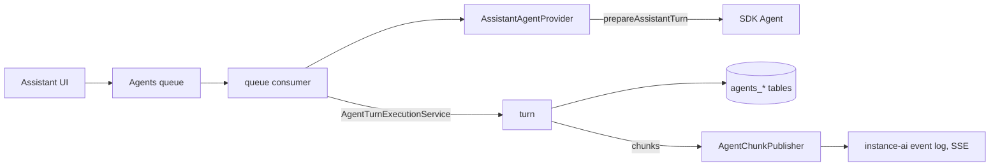

# PoC report: n8n Assistant on the Agents runtime (ASS-1573)

Branch: `ass-1573-aia-agents-framework-agent` (local only, not pushed).
Plan: [AGENTS_RUNTIME_POC.md](./AGENTS_RUNTIME_POC.md).

## Result

The approach works. The n8n Assistant now runs as `n8n-assistant`, a
code-defined, instance-level agent on the Agents runtime. The Agents runtime
owns the turn loop, the queue, steering, cancel, checkpoints, HITL resume, turn
recording and crash sweeping. The `instance-ai` module only builds each turn
(context, tools, model, sandbox) and runs the Assistant-specific work after it.

Steering, the feature that started this spike, works for the Assistant with no
Assistant-specific steering code.

## What was verified live

Local instance, SQLite, real Anthropic model, Daytona sandbox
(ephemeral). Scripts: `/tmp/poc/test-*.mjs` (API level, not committed).

| Check | Result |
|---|---|
| Plain chat turn, history reload | Works |
| Message during a running turn (steering) | Works. One turn, the agent follows the steered instruction |
| Cancel a running turn, then send again | Works. Cancel in about 300 ms |
| Questions card (HITL): suspend, status, confirm, resume | Works. Same run id across the resume |
| Workflow build in the Daytona sandbox, build + verify | Works, about 40 s |
| Plan, approve, backend follow-up turns (planned build A, B, synthesis) | Works. Follow-ups run through the Agents queue as hidden turns |
| Generic Agents chat endpoints with `agentId = n8n-assistant` (chat SSE, resume, history) | Works |
| UI | See "Milestone 2" below |

## What changed

### Agents module (new, about 900 lines)

- `agents.scope` (`project` | `instance`), nullable `agents.projectId`
  (migration `AddInstanceScopeToAgents`). The Assistant row is seeded at
  module init.
- `SystemAgentRegistry` and `SystemAgentProvider`: a module registers a
  code-defined agent. The provider builds a fresh runtime for each turn,
  authorizes users, supplies turn options and converts resume payloads.
- `SystemAgentExecutionService`: threads (owner, working project), enqueue,
  steer, consume, resume, cancel, status. Instance agent turns use the
  `preview` queue kind, so queueing, steering, cancel and checkpoint ownership
  reuse the preview chat code paths.
- Generic chat endpoints (`/projects/:projectId/agents/v2/:agentId/chat`,
  `/chat/resume`, history, queue, cancel) accept instance agents.
- `N8nMemoryImpl.patchThread` (atomic metadata update) and
  `AgentThreadGrantRepository.revoke`.

### instance-ai module

- `prepareAssistantTurn` / `settleAssistantTurn` replace `executeRun`,
  `processResumedStream` and `resumeSuspendedRun`. Per-turn options travel in
  the queue payload and the checkpoint host metadata, so any main can run a
  turn (no in-memory hand-off).
- `AgentChunkPublisher` (in `@n8n/instance-ai`) replaces the resumable stream
  executor and stream runner.
- Memory, observations, checkpoints and session grants use the Agents tables.
  Thread metadata (tasks, planned tasks, workflow loop, live run, onboarding
  card) is in `agents_threads.metadata`.
- Migration `MoveInstanceAiThreadsToAgents` drops `instance_ai_threads`,
  `_messages`, `_resources`, `_observations*`, `_checkpoints`,
  `_pending_confirmations` and `_thread_grants`. `instance_ai_events`,
  `_thread_tabs`, `_iteration_logs` and `ai_builder_temporary_workflow` now
  reference `agent_execution_threads`. Old Assistant threads are dropped.
- Removed: the suspended-run restorer, pending confirmations, the instance-ai
  memory, observation and checkpoint stores, checkpoint pruning, background
  tasks and the task-control relay, the liveness service, the run debug
  buffer, the shutdown drain, terminal outcome replay, in-process discovery
  evals.

### Line counts

Fill in at the end.

## Multi-main

Not tested live (by agreement). By design:

- Queue claims use DB locks. Any main can run a turn.
- Turn events go through the existing `InProcessEventBus` relay and shared
  sequence, so the main that holds the SSE receives them.
- A resume rebuilds from `agent_checkpoints`, so it works on any main.
- Cancel uses `cancel-agent-chat-execution`.
- The live run (run id, message group) is in thread metadata, so the SSE
  bootstrap and `/status` are correct on every main. This also fixes the old
  cross-main reconnect gap (INS-736) for the status read.

## Known gaps and debt

Fill in at the end.

## How to try it

Fill in at the end.
