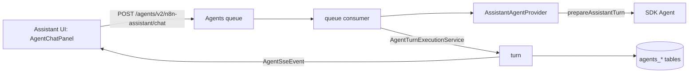

# PoC report: n8n Assistant on the Agents runtime (ASS-1573)

Branch: `ass-1573-aia-agents-framework-agent` (local only, not pushed).
Plan: [AGENTS_RUNTIME_POC.md](./AGENTS_RUNTIME_POC.md).

## Result

The conversion is complete for the PoC. The n8n Assistant is `n8n-assistant`,
a code-defined, instance-level agent on the Agents runtime, and the UI uses the
same protocol and chat core as the Agents preview chat. There is one agent
protocol and one chat UI. The legacy Assistant stream, event log and UI are
deleted.

- The Agents runtime owns the turn loop, the queue, steering, cancel,
  checkpoints, HITL resume, turn recording, crash sweeping and the chat
  stream.
- The `instance-ai` module builds each turn (user-scoped services, tools,
  model and credits, sandbox, per-turn context) and runs the Assistant work
  after it (credits, planned tasks, verification follow-ups, title).
- The UI renders the Assistant with `AgentChatPanel`. Assistant cards render
  through an `assistant_confirmation` interactive in the shared Agents chat
  code. Side panels (artifacts, previews, setup panel, to-do list) read the
  Agents chat messages and the thread metadata.

## What was verified live

Local instance, SQLite, real Anthropic model, Daytona sandbox (ephemeral),
browser checks with Playwright. Scripts: `/tmp/poc/` (not committed).

| Check | Result |
|---|---|
| First message from the empty view streams through the Agents chat | Works |
| Message while a turn runs: queued item with Steer / edit / delete; Steer joins the running turn | Works |
| Cancel a running turn, then send again | Works |
| Questions card: suspend, answer, resume, reload | Works |
| Approval card with "Always allow during this session"; the next matching call skips the card | Works |
| Plan review: approve; backend follow-up turns (planned builds, synthesis) appear without reload | Works |
| Workflow build in the Daytona sandbox, canvas preview; data table preview | Works |
| File attachment (stored in binary data, messages keep references) | Works |
| Canvas hand-off ("open in assistant") with workflow context | Works |
| Setup panel above the composer | Works with the PostHog override (see gaps) |
| Plan checklist from thread metadata | Works |

Tests: `pnpm test src/modules/instance-ai src/modules/agents` in `packages/cli`
(about 6.3k tests), `pnpm test` in `@n8n/instance-ai` (about 5.3k tests), the
instance-ai integration tests (run with `env -u ANTHROPIC_API_KEY`), and the
editor tests for `features/ai/instanceAi`, `features/ai/shared/agentsChat` and
`features/agents` (about 4.4k tests) pass.

## What changed



### Agents module (new, about 1.5k lines with tests)

- `agents.scope` (`project` | `instance`) and a nullable `agents.projectId`
  (migration `AddInstanceScopeToAgents`). The Assistant row is seeded at
  module init.
- `SystemAgentRegistry` and `SystemAgentProvider`: a module registers a
  code-defined agent. The provider builds a fresh runtime for each turn,
  authorizes users, maps client `hostContext` to turn options and converts
  resume payloads.
- `SystemAgentExecutionService`: threads (owner, working project), enqueue,
  steer, consume, resume, cancel, status, attachments (file references and
  the Agents attachment file store). Instance agent turns use the `preview`
  queue kind, so the preview chat code paths serve them. Hidden machine turns
  stay out of the transcript and the queue list.
- The generic chat endpoints (`/projects/:projectId/agents/v2/:agentId/chat`,
  `/chat/resume`, history, queue, cancel) accept instance agents.
  `AgentChatMessageDto` gets an optional `hostContext`.
- `N8nMemoryImpl.patchThread` (one locked transaction) and
  `AgentThreadGrantRepository.revoke`.

### instance-ai backend

- Kept: `createContext` (the user-scoped service layer), tools, prompts,
  skills, sandbox, model and credits, planned tasks, verification, title
  refinement, MCP registry, gateway and browser, settings.
- Turn pipeline: `prepareAssistantTurn` / `settleAssistantTurn`. Per-turn
  options travel in the queue payload and the checkpoint; thread defaults are
  in thread metadata. Nothing passes through process memory.
- Removed: the run lifecycle (`executeRun`, resume, restorer, pending
  confirmations), the memory, observation and checkpoint stores, background
  tasks and task-control relay, liveness, run debug buffer, shutdown drain,
  the durable event log, in-process event bus and cross-main relay, the
  interrupted-run sweeper, the terminal outcome guard, the message parser,
  the run-state registry, the seeded onboarding card, the feedback and
  preference-card endpoints, the legacy `/chat`, `/events`, `/confirm`,
  `/chat/:id/cancel`, `/threads/:id/messages` endpoints, and the related
  metrics.
- Tools still publish through a small `AssistantEventSink`, which keeps setup
  panel items in thread metadata and drops the rest. `build-agent` forwards
  the builder's progress as SDK sub-agent chunks.
- Tables: migrations drop `instance_ai_threads`, `_messages`, `_resources`,
  `_observations*`, `_checkpoints`, `_pending_confirmations`,
  `_thread_grants`, `_events` and `_thread_tabs`. Remaining Assistant tables:
  `instance_ai_iteration_logs`, `instance_ai_mcp_registry_connections` (and
  `ai_builder_temporary_workflow`, now keyed by Agents sessions). Old
  Assistant threads are dropped.

### Editor

- The Assistant thread view renders `InstanceAiAgentsConversation` →
  `AgentChatPanel`. Every send (empty view, hand-offs, setup panel,
  fix-with-AI, suggestions) goes through the Agents chat with `hostContext`.
- Removed: the legacy conversation, timeline, confirmation panel, reducer,
  SSE runtime, debug panel and their tests. The thread runtime went from
  2.0k to 0.7k lines and holds only side-panel state.

### Line counts

Against the base commit `0280644e775`: **+9.5k / −65.6k lines** in 353 files.

| Area | Added | Removed |
|---|---|---|
| `cli/src/modules/instance-ai` | 3.5k | 26.3k |
| `@n8n/instance-ai` | 0.8k | 11.3k |
| `cli/src/modules/agents` | 1.6k | 0.0k |
| `editor-ui/src` | 3.6k | 27.3k |
| `@n8n/db` (4 migrations) | 0.2k | 0.0k |

Non-test source: `cli/src/modules/instance-ai` 45.4k → 36.0k lines
(`instance-ai.service.ts` 7.4k → 4.5k), `@n8n/instance-ai/src` 54.5k → 51.6k,
`editor-ui/.../features/ai/instanceAi` 45.0k → 34.3k.

## Multi-main

Not tested live (by agreement). By design: queue claims use DB locks, turns
stream through the Agents queued-stream relay, resumes rebuild from
`agent_checkpoints`, cancel uses `cancel-agent-chat-execution`, crash recovery
uses the execution heartbeat and sweeper, and turn options and thread state
live in the DB. The only per-main memory left is the setup panel flag of the
turn running on that main.

## Known gaps and debt

- Cut: preference cards (edit/undo), the debug panel and thread inspector,
  @-mentions in the thread composer, the seeded onboarding greeting and card,
  LangSmith feedback from the UI, response-latency and stall telemetry,
  archived-artifact dimming, user-facing error rewording (the Agents chat
  shows the raw error).
- The setup panel needs the backend experiment gate
  (`118_instance_ai_setup_overhaul`) on; locally PostHog is unreachable, so the
  backend does not emit setup items unless the gate is forced.
- Resource references sent with a message stay in the artifacts list only for
  the current session; Agents user messages do not store `hostContext`.
- The per-thread Assistant sandbox service duplicates part of the Agents
  sandbox runtime; porting needs a sandbox setup hook in the Agents runtime.
- `agents.projectId` keeps the TypeScript type `string` although instance
  agents store null.
- The instance-ai module requires the agents module (it fails fast).
- Evals that drove the in-process runtime or the removed endpoints are
  broken or deleted (discovery evals were deleted). Playwright E2E for the
  Assistant was not run.
- Commit hygiene: the editor legacy-UI deletion landed in commit
  `0e60c5106da` together with a backend change.

## How to try it

Use a fresh user folder, because the migrations drop the old Assistant tables.
Open `/assistant` after setup.


```bash
git switch ass-1573-aia-agents-framework-agent
pnpm build > build.log 2>&1
export N8N_USER_FOLDER=~/.n8n-ass1573   # a fresh folder: migrations drop old tables
# load .env.eval (model + Daytona keys), and set
export N8N_INSTANCE_AI_SANDBOX_EPHEMERAL=true
unset LANGSMITH_API_KEY
cd packages/cli && node bin/n8n start
cd packages/frontend/editor-ui && N8N_PORT=5678 pnpm dev
```

Things to try: send a message while a build runs and click Steer, answer a
questions card, approve a plan, use "Always allow", attach a file, stop a run.
