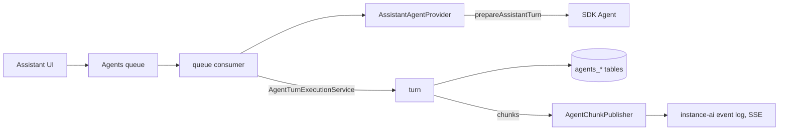

# PoC report: n8n Assistant on the Agents runtime (ASS-1573)

Branch: `ass-1573-aia-agents-framework-agent` (local only, not pushed).
Plan: [AGENTS_RUNTIME_POC.md](./AGENTS_RUNTIME_POC.md).

## Result

The approach works. The n8n Assistant now runs as `n8n-assistant`, a
code-defined, instance-level agent on the Agents runtime. The Agents runtime
owns the turn loop, the queue, steering, cancel, checkpoints, HITL resume, turn
recording and crash sweeping. The `instance-ai` module only builds each turn
(context, tools, model, sandbox) and runs the Assistant-specific work after it.

Steering, the feature that started this spike, works for the Assistant with no
Assistant-specific steering code.

## What was verified live

Local instance, SQLite, real Anthropic model, Daytona sandbox
(ephemeral). Scripts: `/tmp/poc/test-*.mjs` (API level, not committed).

| Check | Result |
|---|---|
| Plain chat turn, history reload | Works |
| Message during a running turn (steering) | Works. One turn, the agent follows the steered instruction |
| Cancel a running turn, then send again | Works. Cancel in about 300 ms |
| Questions card (HITL): suspend, status, confirm, resume | Works. Same run id across the resume |
| Workflow build in the Daytona sandbox, build + verify | Works, about 40 s |
| Plan, approve, backend follow-up turns (planned build A, B, synthesis) | Works. Follow-ups run through the Agents queue as hidden turns |
| Generic Agents chat endpoints with `agentId = n8n-assistant` (chat SSE, resume, history) | Works |
| UI (browser, Agents chat core): questions card, approval card, plan review, workflow build with canvas preview, data table preview, follow-up turns after reload | Works |

## What changed



### Agents module (new, about 900 lines)

- `agents.scope` (`project` | `instance`), nullable `agents.projectId`
  (migration `AddInstanceScopeToAgents`). The Assistant row is seeded at
  module init.
- `SystemAgentRegistry` and `SystemAgentProvider`: a module registers a
  code-defined agent. The provider builds a fresh runtime for each turn,
  authorizes users, supplies turn options and converts resume payloads.
- `SystemAgentExecutionService`: threads (owner, working project), enqueue,
  steer, consume, resume, cancel, status. Instance agent turns use the
  `preview` queue kind, so queueing, steering, cancel and checkpoint ownership
  reuse the preview chat code paths.
- Generic chat endpoints (`/projects/:projectId/agents/v2/:agentId/chat`,
  `/chat/resume`, history, queue, cancel) accept instance agents.
- `N8nMemoryImpl.patchThread` (atomic metadata update) and
  `AgentThreadGrantRepository.revoke`.

### instance-ai module

- `prepareAssistantTurn` / `settleAssistantTurn` replace `executeRun`,
  `processResumedStream` and `resumeSuspendedRun`. Per-turn options travel in
  the queue payload and the checkpoint host metadata, so any main can run a
  turn (no in-memory hand-off).
- `AgentChunkPublisher` (in `@n8n/instance-ai`) replaces the resumable stream
  executor and stream runner.
- Memory, observations, checkpoints and session grants use the Agents tables.
  Thread metadata (tasks, planned tasks, workflow loop, live run, onboarding
  card) is in `agents_threads.metadata`.
- Migration `MoveInstanceAiThreadsToAgents` drops `instance_ai_threads`,
  `_messages`, `_resources`, `_observations*`, `_checkpoints`,
  `_pending_confirmations` and `_thread_grants`. `instance_ai_events`,
  `_thread_tabs`, `_iteration_logs` and `ai_builder_temporary_workflow` now
  reference `agent_execution_threads`. Old Assistant threads are dropped.
- Removed: the suspended-run restorer, pending confirmations, the instance-ai
  memory, observation and checkpoint stores, checkpoint pruning, background
  tasks and the task-control relay, the liveness service, the run debug
  buffer, the shutdown drain, terminal outcome replay, in-process discovery
  evals.

### Milestone 2: one chat core in the UI

- The Assistant thread view renders the conversation with the Agents
  `AgentChatPanel` (agent `n8n-assistant`, the thread's project, the thread
  as the session). Streaming, the message queue with steer, stop, history and
  the push-plus-refetch recovery are the Agents implementations.
- Assistant HITL cards render through a new `assistant_confirmation`
  interactive in the shared Agents chat code: questions, plain approval, plan
  review, domain access and web search, text, continue. Other card types use
  an approve/deny fallback card.
- The artifacts panel, preview tabs, canvas preview, to-do list, title and
  working state read the Agents chat messages through a small adapter
  (`agentsChatThreadAdapter.ts`). In this mode the UI never opens
  `/instance-ai/events` and never loads the legacy history.
- The legacy conversation stays at `?chat=legacy` for comparison. The backend
  still publishes `InstanceAiEvent`s for it.

### Line counts

Against the base commit `0280644e775`:

| Area | Added | Removed |
|---|---|---|
| `cli/src/modules/instance-ai` (incl. tests) | 3.4k | 15.5k |
| `@n8n/instance-ai` (incl. tests, evals) | 0.7k | 10.1k |
| `cli/src/modules/agents` (new seams + tests) | 1.5k | 0.0k |
| `@n8n/db` (2 migrations) | 0.2k | 0.0k |
| `editor-ui` (milestone 1 + 2) | 1.5k | 0.0k |
| Total, whole repo | 7.3k | 26.0k |

Non-test source only: `cli/src/modules/instance-ai` went from 45.4k to 40.0k
lines, and `instance-ai.service.ts` from 7.4k to 4.8k. `@n8n/instance-ai/src`
went from 54.5k to 52.2k.

What can go next, once the legacy UI is dropped (about 8k more lines): the
legacy thread runtime, reducer, conversation, timeline and confirmation panel
in the UI (about 5.4k), the shared `agent-run-reducer` (0.7k), `map-chunk`
(0.5k), and the durable event log, event bus and interrupted-run sweeper
(about 1.3k), plus the `instance_ai_events` table and the `/events`,
`/threads/:id/messages` and `/confirm` endpoints.

## Multi-main

Not tested live (by agreement). By design:

- Queue claims use DB locks. Any main can run a turn.
- Turn events go through the existing `InProcessEventBus` relay and shared
  sequence, so the main that holds the SSE receives them.
- A resume rebuilds from `agent_checkpoints`, so it works on any main.
- Cancel uses `cancel-agent-chat-execution`.
- The live run (run id, message group) is in thread metadata, so the SSE
  bootstrap and `/status` are correct on every main. This also fixes the old
  cross-main reconnect gap (INS-736) for the status read.

## Known gaps and debt

Runtime:

- The UI still sends the first message of a new thread and messages with
  attachments or hand-off context through `POST /instance-ai/chat`, which
  enqueues on the same Agents queue. File attachments travel as base64 in the
  queue payload JSON (the Agents attachment store is not used yet).
- A process crash mid-turn: the Agents sweeper marks the execution
  interrupted, but no `run-finish` reaches the legacy event log, so the legacy
  UI can show a spinning run until reload. The Agents UI is not affected.
- Planned-task progress (`tasks-update`) is published only on the legacy
  event stream. In Agents-chat mode the plan checklist hides once a
  `create-tasks` plan exists.
- `hasLiveRun` in the planner gate is always false and sandbox eviction does
  not check for a running turn (both matched the old effective behavior).
  Wire them to the Agents turn status.
- `agents.projectId` keeps the TypeScript type `string` although instance
  agents store null.
- Thread title: the refined title is written to the memory thread; the
  Agents session title gets only the first heuristic title.
- The instance-ai module now requires the agents module (fails fast).

UI (Agents-chat mode):

- Not ported, fallback card only: credential setup, workflow setup, gateway
  resource decision, MCP connect, channel setup, test listener, credential
  destination options.
- Dropped: setup panel above the input, fix-with-AI and test-agent offers,
  agent-preview hand-off into the composer, attachments, the agent-builder
  sub-agent progress tree, preference cards, archived-artifact dimming.

Not done by design: old Assistant threads are dropped by the migration (no
data port). Evals that drive the in-process runtime or the removed endpoints
are broken (discovery evals were deleted). Playwright E2E for the Assistant
was not run and will need new expectations. Multi-main was not tested live.

Tests: `pnpm test src/modules/instance-ai src/modules/agents` (308 files,
6.5k tests) and the related integration tests pass (run integration tests with
`env -u ANTHROPIC_API_KEY`). Frontend: 147 files, 2.5k tests in the touched
areas pass.

## How to try it

```bash
git switch ass-1573-aia-agents-framework-agent
pnpm build > build.log 2>&1   # or build the changed packages:
                              # @n8n/db, @n8n/decorators, @n8n/instance-ai, cli
```

Use a fresh user folder: the migration drops the old Assistant tables.

```bash
export N8N_USER_FOLDER=~/.n8n-ass1573   # the PoC instance used this folder
# load .env.eval (model + Daytona keys), and set
export N8N_INSTANCE_AI_SANDBOX_EPHEMERAL=true
unset LANGSMITH_API_KEY
cd packages/cli && node bin/n8n start   # backend
cd packages/frontend/editor-ui && N8N_PORT=5678 pnpm dev   # UI with HMR
```

The PoC instance from tonight ran on port 5699 with the owner
`owner@example.com` / `Passw0rd!x` (in `~/.n8n-ass1573`). Open `/assistant`:
the default view is the Agents chat core; add `?chat=legacy` to a thread URL
for the old conversation UI on the same backend. Things to try: send a
message while a build runs (it lands in the queue; steer it into the turn),
answer a questions card, approve a plan, stop a run.
