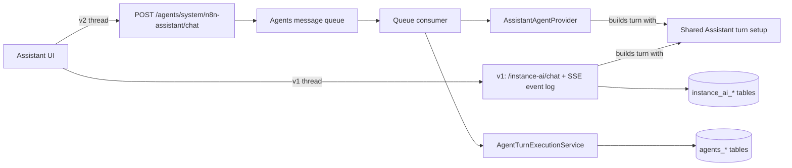
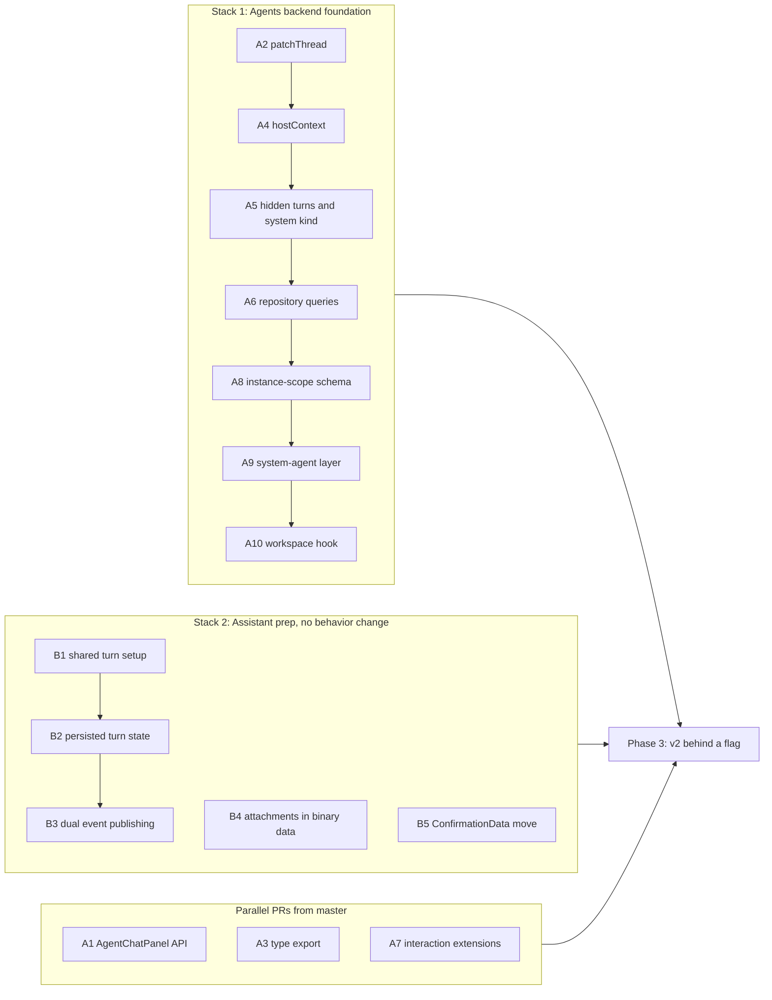

# Plan: n8n Assistant v2 on the Agents runtime (ASS-1573)

Status: living plan. Update it when a step lands or a decision changes.

This plan turns the ASS-1573 proof of concept (PoC) into reviewable changes
on `master`. A future agent or engineer can pick up any open step from it.

## 1. Background

The n8n Assistant ("Instance AI" in code) has its own agent runtime. It has
its own threads, messages, checkpoints, event log, SSE protocol, chat UI and
HITL handling. The Agents module has the same features. Each new Agents
feature (for example steering and message queueing) must be built a second
time for the Assistant.

The PoC showed that the Assistant can run as a code-defined, instance-level
agent on the Agents runtime. The Assistant keeps its tools, prompts, sandbox,
credits, planned tasks and verification. The Agents runtime runs the turn
loop, the queue, steering, cancel, checkpoints, HITL resume and the chat
stream.

PoC facts:

- Branch: `ass-1573-aia-agents-framework-agent` (pushed to origin). Base
  commit: `0280644e775`.
- Diff: about +9.6k / −65k lines. Assistant backend non-test code went from
  45.4k to 36.0k lines. The editor Assistant folder went from 45.0k to 34.7k.
- The Agents side needed about 1.6k lines. The `@n8n/agents` SDK needed one
  type export.
- Verified live: chat, steering, cancel, questions, approvals with "Always
  allow", plan review and follow-up turns, sandbox builds, previews,
  attachments, hand-offs, setup panel, plan checklist.
- PoC report: [AGENTS_RUNTIME_POC_REPORT.md](./AGENTS_RUNTIME_POC_REPORT.md).
  Original PoC plan: [AGENTS_RUNTIME_POC.md](./AGENTS_RUNTIME_POC.md).

The PoC replaced the old runtime in one step. We will **not** merge it. We
rebuild it in reviewable pieces with the approach below.

## 2. Decisions

| Decision | Detail |
|---|---|
| Strangler fig | Build "Assistant v2" next to the current Assistant (v1). A flag selects the runtime for new threads. Switch over later, then delete v1. |
| Runtime per thread | Store the runtime on the thread at creation. A thread never changes runtime. Old threads stay on v1 until v1 is turned off. |
| Rebuild, do not merge | Use the PoC branch as reference code. Extract each step as a clean PR from `master`. |
| Both modules required | The `instance-ai` module may depend on the `agents` module. If the `agents` module is missing, `instance-ai` fails at startup with a clear error. |
| Code location | v2 lives inside the `instance-ai` module, in its own folder (for example `instance-ai/runtime-v2/`). v1 code must not import v2 code. Flags only at routing points. |
| Provider model | The Assistant is a code-defined system agent. Its provider builds the agent, tools and model for each turn. The Agents runtime runs it. |
| Attachments | Store files in n8n binary data. Messages keep references only. Do not port the v1 base64-in-message model. |
| Replay cursor | v2 does not need the v1 SSE replay cursor (`Last-Event-ID`). |
| Unused code | Agents-side prerequisites may land before they have a caller. This is agreed with the Agents team. |
| System agent model | Code-defined providers first. Move pieces into shared registries (privileged system tools, model policy) only when a second agent needs them. |
| Agents admin setting | System agents bypass the Agents admin "enabled" setting. It controls custom project agents only. The Assistant keeps its own enable switch. |
| Queue kind | System-agent turns use a new `system` queue kind, not `preview`. |
| Access | Runtime floor plus provider checks (see A9). System agents get their own routes, without the `agent:execute` guard. |

## 3. Target architecture during the transition

- **Shared:** the Assistant service layer (`instance-ai.adapter.service.ts`),
  tools, prompts, skills, sandbox, model and credits, planned tasks,
  verification, settings, gateway, browser use and MCP.
- **v1 only:** run lifecycle, event log and SSE, `instance_ai_*` thread
  storage, legacy chat UI.
- **v2 only:** the provider, the turn pipeline (`prepareAssistantTurn`,
  `settleAssistantTurn`), the event sink for tools, thread services on the
  Agents tables, the v2 chat view.

## 4. How to use the PoC branch

Find the reference code with `git show <commit>` on the PoC branch.

| Area | PoC commits | Key files on the PoC branch |
|---|---|---|
| Instance agents and system-agent layer | `5acf5ba0e45`, `19728e24284` | `packages/cli/src/modules/agents/system-agents/*`, `agent-message-queue*.ts`, `agent-chat.controller.ts` |
| Assistant provider and turn pipeline | `a18f74f5dfd`, `fa11244c707`, `2ebd9f7d703` | `instance-ai/assistant-agent.provider.ts`, `assistant-turn-options.ts`, `instance-ai.service.ts` (`prepareAssistantTurn`, `settleAssistantTurn`) |
| Hidden machine turns | `8a6209498fa` | `agent-message-queue.service.ts` |
| Thread metadata patch | `de36dc477bb` | `agents/integrations/n8n-memory.ts` (`patchThread`) |
| Client context and attachments | `dae18013de9` | `@n8n/api-types` `agents/dto.ts`, `system-agent-execution.service.ts` |
| Editor on the Agents chat | `1e90e2e53b4`, `e8ba910a1bb`, `9502710cb10`, `3028069fffe`, `737414f3982` | `InstanceAiAgentsConversation.vue`, `components/agentsChat/InstanceAiConfirmationCard.vue`, `agentsChatThreadAdapter.ts`, `AgentChatPanel.vue` |
| System-agent routes, queue kind and access floor | `72a1e54777a`, `0ff0df89705` | `agents/system-agents/system-agent-chat.controller.ts`, `system-agent-access.ts`, `agents/agent-chat-relay.service.ts`, editor `features/agents/utils/agentChatPath.ts` |
| Eval harness v2 mode and queued-turn status | `b19e53a4b64`, `dfc88bd7b39` | `@n8n/instance-ai/evaluations/harness/assistant-v2.ts`, `clients/n8n-client.ts`, `harness/chat-loop.ts`; `system-agent-execution.service.ts` (`getStatus`) |
| Interaction extensions | `18da4fa2e8e` | `ai/shared/agentsChat/interactionRegistry.ts`, `messageMappers.ts`, `instanceAi/assistantConfirmation.ts` |
| Fixes found in review | `abbb17d9d59`, `907953b7131`, `e27ea706d55` | See section 14 |
| Removals (v1 deletion reference) | `a473877b05c`, `0e60c5106da`, `31c32401060`, `0589c56632f`, `e0a0379ced8` | Use only in the final phase |

Do not copy PoC code that deletes or changes v1 behavior into early steps.
Section 7 lists the shared-code changes that must support both runtimes.

## 5. Execution order

Most Phase 1 items do not depend on each other. Land them as parallel PRs
where possible, and as stacked PRs only where one needs another. The
`n8n:gh-stack` skill manages stacks.

- Stack 1 is owned by the Agents team review. A9 needs A2, A4, A5, A6 and
  A8. A10 extends A9. The `system` queue kind can land with A5.
- Stack 2 needs no Agents review. It can start in parallel with Stack 1.
- Phase 3 starts when Stack 1, Stack 2 and the editor items have landed.

### Open explorations

The PoC replaced v1. The strangler plan keeps v1 and v2 side by side. These
assumptions were not tested on the PoC branch:

| # | Exploration | Why | When |
|---|---|---|---|
| E1 | B1 spike on `master`: extract the shared turn setup from `InstanceAiService` with no behavior change | The plan assumes v1 and v2 can share one turn setup. If the extraction is tangled, Phase 2 grows. | Before Stack 2 |
| E2 | Port the eval transport (C1) on the PoC branch and run a subset of the eval suite | All evals are broken on the PoC branch. This is the only quality signal before Phase 3. | **Done on the PoC (first signal).** See "E2 results" below. More cases before Phase 3. |
| E3 | One live turn with LangSmith tracing on the v2 path (EU endpoint) | The code path is wired, but no trace was seen. | Any time; cheap |
| E4 | One live computer-use and one browser-use turn | Not tested in the PoC. | Any time; cheap |
| E5 | Live two-main test | Multi-main is correct by design only. | Before Phase 4 rollout |

### E2 results

The PoC harness runs a case against Assistant v2 with
`N8N_EVAL_ASSISTANT_V2=true` (commit `b19e53a4b64`,
`evaluations/harness/assistant-v2.ts`). Two cases from the nightly suite,
one iteration each, on a local PoC instance (SQLite, Daytona, ephemeral
sandboxes):

| Case | v2 result | Master nightly record |
|---|---|---|
| `http-url-expression-delimiters-not-url-encoded` (case 542) | 6/6 (2 scenarios, 4 expectations). Built in 161 s with one setup card. | Passes on every recent nightly. |
| `reverify-after-node-swap` (case 321, multi-turn) | 4/6. All expectations pass, including both re-verification process checks. Both scenarios fail on an empty Discord webhook URL. | The scenarios pass on about 8 of 14 nightlies (Sep 23 – Oct 7); every failure is the same empty-URL cause. |

This is consistent with no regression, and it exercises multi-turn proxy
conversations, hidden follow-up turns, setup cards answered through
`/chat/resume`, and re-verification. It is not a quality comparison: two
cases, one iteration.

Found on the way: thread status showed idle while a hidden follow-up waited
in the queue. Fixed in commit `dfc88bd7b39` (see A9). The editor needs the
same status to show "finished" correctly.

Not available in the v2 harness mode yet:

- Token and cost data. The run-debug endpoints are gone, so judged
  expectations about cost and the run-debug report get no data. Read token
  totals from the `agent_execution` records instead.
- The observer-threshold override (one memory-compaction case). Map
  `observerThresholdTokens` from `hostContext` into the turn options.
- The builder sub-agent's internal steps. The outcome uses the parent tool
  result, which was enough for these cases.
- The inactivity timeout. The harness polls history and status, so "done" is
  three quiet polls (about 4.5 s per turn).

### Handover notes

- Land this plan on `master` (a docs PR), or link it from the Linear ticket.
  The work happens on `master`, not on the PoC branch.
- Keep the PoC branch. This plan refers to its commits by hash.
- Get IAM sign-off for the A9 access floor before Stack 1 reaches A9.
- Treat the PoC as reference code. Each item lists what to fix when
  extracting. Do not copy the PoC commits that delete v1 code into early
  steps.

## 6. Phase 1: Agents prerequisites

All items in this phase are changes in the Agents module or the shared
Agents chat code. None changes behavior for project agents. Items A1–A7 have
no dependencies on each other and can land in parallel. A8, A9 and A10 come
last.

Each item lists: what to build, the PoC reference, what to fix compared to
the PoC, and the acceptance criteria.

### A1. `AgentChatPanel` host extension API (editor)

**What:** let a host that embeds the Agents chat customize it.

- Slots: `empty`, `inline-offers`, `above-input`, `composer-attachments`,
  `footer-start`.
- Props: `placeholder`, `attachmentAccept`, `showAttachButton`,
  `hostContext` (see A4), `composerResumeData`.
- Event: `message-accepted` with `{ text, files, hostContext }`.
- Exposed: `messages`, `isStreaming`, `isLoadingHistory`, `isDirty`,
  `setDraft`, `openFilePicker`, and `sendMessageFromOutside(text, files)`,
  which returns `false` when the server rejects the message.

**PoC reference:** `AgentChatPanel.vue` diff on the PoC branch (commits
`1e90e2e53b4`, `e8ba910a1bb`, `e27ea706d55`).

**Fix when extracting:**

- `composerResumeData` (answer an open card with the composer text) is the
  least obvious API. Document it with a generic example, or move it to A7.

**Acceptance:**

- All props have defaults that keep the current behavior.
- `AgentChatPanel` tests cover each slot, the new props and the exposed
  methods.

### A2. Atomic thread metadata update (`patchThread`)

**What:** read, update and write one thread's title and metadata in one
transaction. The update replaces the metadata, so a caller can remove keys.
`saveThread` merges metadata and cannot remove keys. Concurrent writers on
different mains can lose updates with `saveThread`.

**PoC reference:** `N8nMemoryImpl.patchThread` in
`agents/integrations/n8n-memory.ts` (commit `de36dc477bb`). It serializes
calls for one thread in the process and uses a pessimistic write lock on
Postgres.

**Fix when extracting:**

- Move the transaction and the `findOne(AgentThreadEntity, { lock })` call
  into a repository method (for example `AgentThreadRepository.patchMetadata`).
  The TypeORM boundary rule does not allow TypeORM calls in
  `integrations/n8n-memory.ts`. See the "Persistence layer" section in the
  root `AGENTS.md`.

**Acceptance:**

- Unit tests: a patch can remove keys; a `null` result writes nothing;
  sequential patches in one process do not lose updates.
- Integration test on Postgres for two concurrent patches.

### A3. Export `ForwardedChildChunk` from `@n8n/agents`

**What:** export the existing type from the package index, so hosts can type
the sub-agent progress they forward with `AgentEvent.SubAgentChunk`.

**PoC reference:** `packages/@n8n/agents/src/index.ts`, one line.

**Acceptance:** the type is importable from `@n8n/agents`.

### A4. `hostContext` on Agents chat messages

**What:** an optional `hostContext: Record<string, unknown>` on
`AgentChatMessageDto`. The editor chat stream sends it with each message.
The backend passes it to the system-agent provider (A9). Project agents
ignore it.

**PoC reference:** `packages/@n8n/api-types/src/agents/dto.ts`;
`useAgentChatStream.ts` `sendMessage(text, files, onAccepted, hostContext)`
(commit `dae18013de9`).

**Acceptance:**

- DTO tests accept and reject the right shapes.
- `useAgentChatStream` sends `hostContext` only when it is set.

### A5. Hidden machine turns and turn options in the queue

**What:** the message queue accepts two optional dispatch fields:

- `hidden: true`: a machine turn. The message is model input only. It is
  stored with `origin.hidden`, stays out of the transcript, and
  `listPending` does not return it. This builds on the existing
  `origin.hidden` support of background jobs.
- `options`: opaque per-turn options for the consumer. Only system agents
  (A9) read them.

Also add the `system` queue kind (decided for A9) here, with
`isInteractiveChatKind` for steering, reordering and editing. PoC reference:
`types/agent-queued-message.ts`, `agent-message-steering.service.ts`,
`repositories/agent-message-queue.repository.ts` (commit `72a1e54777a`).

**PoC reference:** `agent-message-queue.service.ts`,
`types/agent-queued-message.ts` (commits `8a6209498fa`, `5acf5ba0e45`).

**Acceptance:**

- Queue tests: a hidden item is consumed but not listed; `options` reach the
  consumer unchanged.

### A6. Thread repository queries for system agents

**What:** queries on `AgentExecutionThreadRepository` and
`AgentThreadGrantRepository`:

- `findOwnedByAgent(agentId, ownerId, { limit })`: top-level private
  sessions of one user with one agent, newest first.
- `findOwnedById(agentId, ownerId, threadId)`.
- `updateOwned(threadId, { title, projectId })`.
- `findOwnedHistoryPage(agentId, ownerId, limit, search, before)`: keyset
  pagination with title search.
- `findByAgentUpdatedBefore(agentId, cutoff, limit)`: for pruning.
- `AgentThreadGrantRepository.revoke(threadId, grantKey)`.

**PoC reference:** `repositories/agent-execution-thread.repository.ts`,
`repositories/agent-thread-grant.repository.ts`.

**Acceptance:** repository tests for each query, including keyset paging
edge cases (equal `updatedAt`).

### A7. Interaction extensions for the Agents chat (editor)

**What:** a host passes its own interactive card types to `AgentChatPanel`.

- `AgentsChatInteractionExtension<TInput>`: `key`, `parse(toolCall)`,
  `component`, optional `getProps(input)`.
- `InteractivePayload` gets one generic variant:
  `toolName: 'interaction_extension'` with an `extensionKey`. The other
  variants keep their `toolName` narrowing.
- `rebuildInteractiveFromHistory`, `convertDbMessages` and
  `applyOpenSuspensions` take an optional extension list. Extensions run
  after the generic approval parser.
- `useAgentChatStream` takes `interactionExtensions`.
- `AgentChatPanel` takes an `interactionExtensions` prop. It passes the list
  to the stream and provides it to `InteractiveCard`.

Only the chat that receives an extension maps and renders its cards. This
also prevents a project agent payload from being shown as an Assistant card.

**PoC reference:** commit `18da4fa2e8e` (verified live: open card, reload,
resume).

**Fix when extracting:**

- Land only the shared part. Add a test-only extension in the tests. The
  Assistant extension (`instanceAi/assistantConfirmation.ts`) lands with v2.
- Optional: move the built-in `chat_action` and `wait` cards onto the same
  list.
- `session-timeline.utils.ts` calls `convertDbMessages` without extensions.
  Decide if Assistant sessions can appear there.

**Acceptance:**

- A chat without extensions behaves as today.
- Tests: an extension card is parsed, rendered, resolved, and restored from
  history; a chat without the extension does not map the payload.

### A8. Instance-scoped agents (schema)

**What:**

- `agents.scope` column: `'project' | 'instance'`, default `'project'`, with
  an enum check and a column comment.
- `agents.projectId` becomes nullable. Instance agents store `null`. Their
  threads carry the working project.
- `AgentRepository.ensureInstanceAgent(id, name)` seeds a row at startup.
- Instance agents are read-only: project-scoped config, publish and delete
  endpoints must refuse them explicitly.

**PoC reference:** migration `1791238469895-AddInstanceScopeToAgents.ts`
(common and SQLite subclass with `withFKsDisabled`), `entities/agent.entity.ts`,
`repositories/agent.repository.ts` (commit `5acf5ba0e45`).

**Fix when extracting:**

- The PoC kept the TypeScript type of `projectId` as `string`. Change it to
  `string | null` and fix all call sites. This is the main review risk.
- In the PoC, read-only is only a side effect (project-scoped lookups do not
  find the row). Enforce it.
- Create the migration with `pnpm --filter=@n8n/db migration:new`. Follow
  the `n8n:db-migrations` skill. Regenerate the schema docs.

**Acceptance:**

- Migration up and down tested on SQLite and Postgres.
- Project-scoped queries never return instance agents.
- Typecheck passes with the nullable type.

### A9. System-agent layer

**What:** let a module register a code-defined instance agent.

- `SystemAgentProvider`: `agentId`, `name`, `authorize(user, projectId)`,
  `prepareTurn(turn)` (returns the built SDK agent, tool registry, input,
  host metadata, run options, `onChunk`, `onSettled`),
  `chatTurnOptions(user, thread, hostContext)`, `normalizeResumeData(data)`.
- `SystemAgentRegistry`: providers by agent id.
- `SystemAgentExecutionService`: create threads (owner and working
  project), list, get, update and delete threads, status, enqueue (with
  `hidden`), steer into a running turn, consume, resume, cancel, prepare a
  chat message (with `hostContext` and attachments as file references).
- Routing hooks: the queue service, the queue consumer and the chat
  controller check `systemAgents.has(agentId)` and hand off to the
  execution service. With no provider registered, all hooks are inert.

**PoC reference:** `agents/system-agents/*` with tests (about 450 lines of
execution-service tests), routing in `agent-message-queue.service.ts`,
`agent-message-queue-consumer.service.ts`, `agent-chat.controller.ts`
(commits `5acf5ba0e45`, `19728e24284`, `dae18013de9`).

**Depends on:** A2, A4, A5, A6, A8.

**Decisions (made 2026-10-07):**

- **Provider model:** code-defined providers first, as in the PoC. Shared
  registries come later, only when a second agent needs them.
- **Agents admin setting:** system agents bypass it. Turning off custom
  agents does not turn off the Assistant. The PoC already does this.
- **Queue kind:** add a `system` kind. `isInteractiveChatKind` treats
  `preview` and `system` the same for steering, reordering and editing.
- **Access: runtime floor plus provider.** At send, at queue pickup and at
  resume, the runtime checks for every system agent:
  1. the thread belongs to the agent, and the user owns it (`ownerId`,
     `accessScope = 'user'`);
  2. the user has `project:read` on the thread's working project.

  The provider's `authorize(user, projectId)` then adds agent-specific
  checks. For the Assistant: the `instanceAi:message` global scope.
  The floor uses `project:read`, not `agent:execute`: `agent:execute` means
  "may run this project's custom agents", the project chat-user role has it
  without `project:read`, and custom roles can have `project:read` without
  it. This is stricter than v1, which checks `project:read` only when the
  thread is created. Data access is unchanged: every tool call still runs
  with the user's own permissions. Needs IAM sign-off.
- **Routes:** system agents get their own routes (for example
  `/agents/system/:agentId/chat`, `/chat/resume`, queue, cancel, history),
  guarded by the runtime floor. Project-agent routes and their
  `@ProjectScope('agent:execute')` guards stay unchanged. An existing thread
  keeps its working project; a new session takes `projectId` from the query.

**Thread status:** `SystemAgentExecutionService.getStatus` reports a thread
with a queued message (hidden follow-up turns included) as running, unless a
suspension is open. Without this, a client sees the thread as idle between a
turn and its follow-up. PoC commit `dfc88bd7b39`.

**PoC alignment:** the PoC first reused the `preview` kind and the
project-agent routes (so it required `agent:execute` by accident). Commits
`72a1e54777a` (backend) and `0ff0df89705` (editor) align it with the
decisions above:

- `system-agents/system-agent-chat.controller.ts`: the `/agents/system`
  routes (chat, resume, cancel, history, queue, attachments).
- `system-agents/system-agent-access.ts`: `canUseSystemAgent` (the floor plus
  the provider). `SystemAgentExecutionService.getUsableThread` adds thread
  ownership. The queue consumer uses the same check.
- `agent-chat-relay.service.ts`: SSE relay and attachment helpers shared by
  both chat controllers. The project-agent controller has no system-agent
  code left.
- Editor: `features/agents/utils/agentChatPath.ts` picks the route base. The
  system agent ids are a constant there; later they should come from the
  backend settings.
- Verified live: send, approval card, reload, resume, queue steering and
  stop all go through `/agents/system/n8n-assistant/...`.

**Acceptance:**

- Inert when no provider is registered: existing Agents tests pass
  unchanged.
- Tests with a test provider: enqueue, consume, hidden turns, suspend and
  resume with `normalizeResumeData`, cancel, steer, authorization refusal.
- Security review of the authorization paths.

### A10. Workspace source hook for system agents

**What:** an optional `workspace` source on `SystemAgentProvider`. The
provider keeps its own sandbox (identity, images, lifecycle). The runtime
only drives it:

- `acquire(scope)` before each turn (start and resume). It returns an opaque
  lease. It must not start a sandbox: the sandbox starts on first use.
- The runtime passes the lease to `prepareTurn` as `turn.workspace`.
- `release(scope, lease, outcome)` after the turn settles.
- `destroy({ agentId, threadId, userId })` when the thread is deleted, and
  from `SystemAgentExecutionService.destroyThreadWorkspace` for hosts that
  delete threads on their own path.

The provider type is generic over the lease (`SystemAgentProvider<TLease>`),
so the provider gets its own lease type without casts.

**Why:** project agents get their sandbox from `AgentSandboxRuntimeService`
(one sandbox per project, agent and user, persistent, archived after 1 hour).
The Assistant needs a different model: one sandbox per thread, started from
the builder snapshot, ephemeral or stopped soon after use, with a one-time
workspace setup. The hook lets the Assistant keep that model while the
runtime owns the lifecycle events.

**PoC reference:** commit `c63fca86323`.

- Agents: `system-agents/system-agent.types.ts` (`SystemAgentWorkspaceSource`,
  `SystemAgentWorkspaceScope`), `system-agent-execution.service.ts`
  (acquire, release, destroy).
- Assistant: `instance-ai/sandbox/assistant-workspace-source.ts`
  (`AssistantSandboxWorkspaceSource`, `AssistantSandboxLease` with
  `getEntry` and `getSetupEntry(context)`), `forgetSandbox` in
  `instance-ai-sandbox.service.ts`.

**Assistant release policy (PoC):** after a suspended turn, drop the cached
sandbox handle in this process. The remote sandbox stays. The resume
reattaches by its thread-derived name (the Daytona adapter looks up the
sandbox by name before it creates one), or creates a new sandbox if an
ephemeral one was deleted. This removes the stale-handle failure after a long
HITL wait. Other outcomes keep the cached handle.

**Verified live (PoC):** a build turn created the Daytona sandbox and ran the
workspace setup through the lease; a run turn suspended on approval; the
resume reattached the same sandbox (prebaked skills found); thread delete
reached the source with no errors. The remote delete itself was not
observed.

**How the Assistant sandbox is kept between turns:**

| Layer | Lifetime | Notes |
|---|---|---|
| Lease | One turn | `acquire` builds a new lease per turn. It remembers its sandbox entry for the rest of that turn only. |
| Process cache (`InstanceAiSandboxService.sandboxes`) | Until idle for `N8N_INSTANCE_AI_BUILDER_SANDBOX_TTL_MS` (default 15 minutes, reset on each use), a settings change, thread delete, or a suspended turn (A10 release) | Per main, in memory. Also remembers that the one-time workspace setup is done. |
| Remote sandbox | Daytona stops it after `N8N_INSTANCE_AI_SANDBOX_AUTO_STOP_MINUTES` (default 15). With `N8N_INSTANCE_AI_SANDBOX_EPHEMERAL=true`, stop deletes it. Otherwise auto-delete after 7 days (default). | Name derived from the thread id. A turn without a cached handle (other main, restart, idle drop, after a suspend) looks it up by name, reattaches or restarts it, or creates a new one. |

The SDK attach point already exists: `Agent.workspace(ws)` in `@n8n/agents`.
The Assistant used it before A10. A10 only adds runtime-owned lifecycle
events on the system-agent path, where the Agents runtime did not know a
sandbox existed.

**Known gap (not fixed, also on `master`):** the process cache keeps a handle
for 15 minutes regardless of the Daytona auto-stop time. With a shorter
auto-stop (for example `N8N_INSTANCE_AI_SANDBOX_AUTO_STOP_MINUTES=1`) and
ephemeral sandboxes, the sandbox is deleted while the handle is still cached.
A turn in that window can fail with "sandbox not found" (a suspended turn is
safe, because A10 drops the handle). Possible fix: cap the cache TTL at the
auto-stop time when auto-stop is set. With the defaults (both 15 minutes)
the timers match.

**Open points:**

- The runtime does not attach the workspace to the SDK agent. The provider
  does it in `prepareTurn`, because the Assistant also wires a lazy skill
  workspace. Decide if the runtime should attach a `Workspace` when the lease
  exposes one.
- System agents without a source have no sandbox. A later option: fall back
  to the project-agent sandbox (`AgentWorkspaceService`).
- Planned-task dispatch runs outside a turn. It acquires its own lease and
  nothing releases it. This is harmless for the Assistant (release only
  drops a cache entry), but other sources may need a release there.

**Acceptance:** execution-service tests for acquire, release, destroy, a
missing lease, a failed release and a busy thread; source tests for the
lazy lease, retry after a failed acquisition, setup, release policy and
destroy.

## 7. Phase 2: Assistant refactors on master (no behavior change)

These steps prepare v1 code for v2. Each one is a refactor of v1 that ships
on its own.

| # | Step | Detail | PoC reference |
|---|---|---|---|
| B1 | Extract the shared turn setup | Move `createExecutionEnvironment`, agent creation, model and credits, and sandbox setup out of `InstanceAiService` into a service that v1 `executeRun` and v2 `prepareAssistantTurn` both call. This is the main seam. | `instance-ai.service.ts` on the PoC branch |
| B2 | Persist turn state | Move build mode, prompt configuration, computer-use channels, time zone, observer threshold and the setup panel flag from the in-memory `RunStateRegistry` into persisted turn options and thread metadata. Fixes AST-1652. Also covers `domainAccessTrackersByThread`. | `assistant-turn-options.ts` (`AssistantTurnOptions`, `AssistantTurnDefaults`) |
| B3 | Event publishing for both runtimes | Tools and stream consumers in `@n8n/instance-ai` publish through an injected `InstanceAiEventBus`. v1 passes the real bus. v2 passes a small sink that keeps setup items in thread metadata. `build-agent` forwards builder progress as events (v1) and as `AgentEvent.SubAgentChunk` (v2). The PoC removed the v1 publishing; do not copy that. | `event-bus/assistant-event-sink.ts`, `tools/orchestration/build-agent.tool.ts`, `stream/agent-chunk-publisher.ts` |
| B4 | Attachments in binary data | Store attachments in n8n binary data with references in messages. | `dae18013de9` |
| B5 | `ConfirmationData` out of the stream runtime | Move it to `runtime/confirmation-payload.ts` so v2 can use it without the v1 stream code. | PoC branch `@n8n/instance-ai/src/runtime/confirmation-payload.ts` |

## 8. Phase 3: Assistant v2 behind a flag

| # | Step | Detail |
|---|---|---|
| C1 | Eval harness with two transports | Make the PoC v2 mode (`evaluations/harness/assistant-v2.ts`, commit `b19e53a4b64`) production-ready. It sends and resumes through the system-agent routes, polls status and history until the thread is quiet, answers open cards with the existing confirmation strategies, and rebuilds the legacy event shapes from the Agents history, so the outcome, transcript and metrics code stay unchanged. Add: a CLI flag instead of the env var, tests, token totals from `agent_execution`, the observer-threshold mapping, and CI and LangTracer runs against a v2-flagged instance. Estimate: about one week (E2 showed the approach works). Land this early: every later step uses it. |
| C2 | Provider and turn pipeline | Register `AssistantAgentProvider` in `instance-ai/runtime-v2/`. Port `prepareAssistantTurn` and `settleAssistantTurn` on top of B1–B3. Settle runs credits, planned tasks, verification follow-ups (as hidden turns) and title refinement. |
| C3 | Flag and per-thread routing | A flag (PostHog or env, name to decide) selects v2 for new threads. Store the runtime on the thread. Route the controller and the editor by the thread's runtime. |
| C4 | v2 thread services | Thread info, list, history, rename, delete and tabs on the Agents tables. The thread list, search and delete must merge v1 and v2 threads. Use the "turn still running" check of the Agents delete. |
| C5 | v2 editor view | `InstanceAiAgentsConversation` with `AgentChatPanel`, the Assistant interaction extension (A7), the "+" menu in `footer-start`, the side-panel adapter (`agentsChatThreadAdapter.ts`), approval titles and details (`approvalDetails.ts`). |
| C6 | Feature parity | Port, replace or drop each row of section 12 (feature parity table). |

## 9. Phase 4: rollout and comparison

- Internal users first, then a percentage on Cloud.
- Run the eval suites against both runtimes (C1) and compare.
- Compare telemetry: errored and stuck turns, latency, token cost, prompt
  cache hit rate.
- Check live: computer use, browser use, LangSmith traces (EU endpoint),
  multi-main.
- Rollback: turn off the flag. New threads use v1 again.

## 10. Phase 5: switch over and remove v1

1. Make v2 the default for new threads.
2. Old threads: migrate them into the Agents tables, or make them read-only
   and let them age out. Decide this before the switch.
3. Delete v1: run lifecycle, event log and SSE, the old stores, the old
   endpoints, the legacy UI and its i18n keys.
4. Migrations that drop the replaced tables. PoC reference:
   `1791239936967-MoveInstanceAiThreadsToAgents.ts`,
   `1791261269373-DropInstanceAiEvents.ts`,
   `1791261949191-DropInstanceAiThreadTabs.ts`. Also drop the unused
   `instance_ai_observational_memory` and `instance_ai_workflow_snapshots`
   tables (unused on `master` already).
5. Check if this needs to wait for v3 (breaking changes go to `3.x`, see
   `.github/DEVELOPING_V3.md`).

## 11. Phase 6: follow-ups

| Item | Detail |
|---|---|
| Sandbox | With A10, v2 keeps the Assistant sandbox and its lifecycle behind the workspace source hook. Optional later: move `InstanceAiSandboxService` onto `AgentSandboxRuntimeService` with one config source (`SandboxSettingsService`, `AgentsConfig`), a decision on sandbox identity (per thread, or per agent and user with thread folders), and Daytona snapshot images in `@n8n/agents/sandbox`. |
| Side panels on Agents messages | Rewrite `useResourceRegistry.ts`, `canvasPreview.utils.ts`, `useSetupPanelState.ts`, `builderAgents.ts` and `planReview.utils.ts` to read Agents chat messages. Then delete `agentsChatThreadAdapter.ts` and the legacy message types. |
| Feature parity | Port the rows of section 12 that were not ported in Phase 3 (C6), before Phase 5. |
| Cleanup | Unused `instanceAi.*` i18n keys (about 212 in the PoC), dead exports. |

## 12. Feature parity

The PoC dropped some v1 features. Under the strangler approach, v1 keeps all
of them until Phase 5, so v1 users lose nothing. Two rules keep it that way:

- **The B steps keep v1 complete.** Each Phase 2 PR keeps v1 behavior and its
  tests. Do not copy the PoC deletions.
- **Parity gates the switch.** Before v2 becomes the default (Phase 5), each
  row below is ported, replaced, or dropped by a recorded product decision.
  Rows 1, 2 and 4 must be ported before an external rollout (Phase 4):
  users notice them.

Features added to the Assistant after Phase 3 starts must work on both
runtimes, or on v2 only behind the v2 flag. This keeps the list from growing.

Gates are as of the PoC base commit (`0280644e775`). A gated feature only has
to work on v2 for users in that gate, and v2 can port it when the gate rolls
out further.

| # | Feature | v1 behavior | Gate on `master` | v2 approach | Needs | Size |
|---|---|---|---|---|---|---|
| 1 | Preference cards | Saving a preference from chat shows a card with edit, undo and scope choice (`PreferenceCard`, `PreferenceEditModal`, preference-card endpoints) | PostHog `111_context_preferences` = `variant` (backend gate `aiPreferencesEnabled`) | Render the save-preference tool result as a host card. Restore the edit and undo endpoints on the Agents thread storage. | E1 | S–M |
| 2 | "Preferences applied" step | Timeline step listing the preferences a turn used (`preferences-applied` event) | Same as row 1 | Persisted host event, rendered as a step | E3 | S |
| 3 | Instance-context step | Timeline step showing the instance context injected into a turn (`instance-context` event, `InstanceContextStep`) | PostHog `114_instance_activity_context`, checked per instance (`getFeatureFlagForInstance`) | Persisted host event | E3 | S |
| 4 | User-facing error wording | Quota errors, masked stream failures and "attachment removed" mapped to readable text (`getUserFacingErrorMessage`) | None | The provider rewrites the error before the runtime sends and stores it | E4 | S |
| 5 | Status notices | For example "Couldn't reach MCP server X; continuing without its tools" (`status` event) | None (fires on an MCP connection failure) | Persisted host event | E3 | S |
| 6 | @-mentions in the thread composer | Mention picker for workflows, credentials and artifacts (`AssistantAtMentionPicker` in `InstanceAiInput`) | PostHog `116_at_mentions_enabled` (editor experiment `AI_ASSISTANT_AT_MENTIONS_EXPERIMENT`) | Host mention picker in the composer; picked resources go into `hostContext` | E2 | S–M |
| 7 | LangSmith thumbs feedback | Rate the latest settled answer; sent to the LangSmith trace (`useResponseFeedback`, feedback endpoint) | None in the editor. The backend sends feedback only when LangSmith tracing is configured. | Message action; map message → execution → trace id | E2, trace id on the execution | S–M |
| 8 | Onboarding greeting and question card | `/assistant?source=onboarding` (the Cloud signup redirect) opens a thread with a seeded greeting and question card | No flag. Entered only through the Cloud signup redirect. | Seed the greeting into Agents memory. Offer the question as a host card that is answered by a normal message (no fake suspension). | Seeding through memory | S–M |
| 9 | Rich tool results | Image, table, file, code and JSON renderers in the timeline (`ToolResult*`) | None | Upstream into the Agents chat (all agents benefit), or register host renderers | E1 | M |
| 10 | Debug panel | LLM step inspector, cache-break analysis, workflow code snapshots, run debug (`InstanceAiDebug*`, `InstanceAiLlmSteps*`) | Editor: `localStorage['instanceAi.debugMode'] = 'true'`. Backend run debug: `N8N_INSTANCE_AI_RUN_DEBUG_ENABLED`. | Agents session timeline and LangSmith export (the export already reads the same localStorage key), plus per-step LLM records on executions behind a flag | E5 | M–L |
| 11 | Latency and stall telemetry | Time to first token and stall events from SSE timing | None | From Agents stream timing in the editor, or from execution timestamps | E5 (partly) | S |
| 12 | Run metrics | Active-runs gauge; swept, refused and durable-log metrics (`instance-ai-metrics.service.ts`, removed in PoC commit `0589c56632f`) | Prometheus metrics enabled (`N8N_METRICS=true`) | Equivalents from Agents executions; keep only what dashboards use | E5 | S |
| 13 | Small UI details | Archived-artifact dimming; answered-questions summary (`AnsweredQuestions`); status bar with the active builder (`InstanceAiStatusBar`); inline artifact cards (`ArtifactCard`) | None | Compare each with what the Agents chat shows; port or drop | — | S each |
| 14 | Discovery evals | In-process tool and skill selection evals (`evaluations/discovery`) | None (eval tooling) | Restore with a small stream runner | — | S |
| 15 | Old thread history | v1 threads in the `instance_ai_*` tables | — | v1 shows them until the switch; then migrate them or make them read-only | Decision (section 13) | — |

Gated features that are kept or ported already (no parity work), for
reference: the setup panel (`118_instance_ai_setup_overhaul` = `variant`),
config evals (`088_config_evaluations`), node usage
(`109_instance_ai_node_usage`), canvas node context
(`104_canvas_aia_node_context`). Their backend gates resolve in
`InstanceAiAdapterService.resolveExperimentGates`, which v2 reuses.

### Extension points that make late porting possible

Without these, each late feature needs a new change negotiated in the Agents
module. With them, each feature is an Assistant-only change that can land any
time before the switch. Add them to Phase 1 next to the related items.

| | Extension point | Unblocks rows | Fits with |
|---|---|---|---|
| E1 | Tool-result renderers: the host registers a renderer for a finished tool call (A7 covers suspended ones) | 1, 9, part of 13 | A7 |
| E2 | Composer and message extensions: composer hooks (input element, text insertion, attachment chips) and per-message action slots | 6, 7 | A1 |
| E3 | Host event channel: the provider emits typed custom events during a turn; the runtime stores them in history as custom message parts | 2, 3, 5, maybe 8 | A9 |
| E4 | Error formatting hook: the provider maps an error to user-facing text before the runtime sends and stores it | 4 | A9 |
| E5 | Execution records with token usage and, behind a flag, LLM steps | 10, 11, 12, and token data for the eval harness (C1) | A9 |

## 13. Open decisions

| Decision | Options | Notes |
|---|---|---|
| Old threads | Migrate, or read-only and age out. | Decide before phase 5. |
| Flag | PostHog experiment or env var; name. | |
| v3 timing | Ship the switch with v3 or not. | |

Decided (see section 2 and A9): provider model, Agents admin setting, queue
kind, access model and routes.

## 14. Risks and lessons from the PoC

Risks:

- **No quality proof until C1 lands.** All Assistant evals use the v1
  endpoints.
- **Untested in the PoC:** computer use and browser use, LangSmith tracing
  on the v2 path, multi-main, the Assistant Playwright E2E suite.
- **Behavior differences:** the Agents turn loop, steering, cancel and resume
  replace tuned v1 behavior. Hidden turns replace detached background tasks.
- **Two runtimes during the transition:** Assistant features must work on
  both, or wait. Plan a soft freeze on v1-only runtime work.
- **Performance not measured:** queue overhead, metadata rewrites under a row
  lock, per-turn rebuild from the database.
- **Coupling:** Agents runtime changes now affect the Assistant directly.

Regressions found by review in the PoC. Check these in v2:

- Approval cards lost their per-tool title and readable details and showed
  raw JSON (fixed in `907953b7131`).
- The "+" menu (attach files, computer use, browser use, MCP) was missing in
  the thread composer (fixed in `e27ea706d55`).
- Stopping a turn did not clear an unapproved plan (fixed in `abbb17d9d59`).

Practical notes:

- `packages/cli` tests read the built dists of `@n8n/instance-ai`,
  `@n8n/db`, `@n8n/api-types` and `@n8n/agents`. Rebuild them after source
  changes.
- Use `N8N_INSTANCE_AI_SANDBOX_EPHEMERAL=true` for live tests with Daytona.
- Unset `LANGSMITH_API_KEY` for local runs unless you also set the EU
  endpoint.

## 15. Cross-check with the Agents feature list from team review

| Item from team review | Plan item |
|---|---|
| Code-defined, read-only, instance-scoped agents | A8, A9 |
| Agents that run as the requesting user (IAM sign-off) | A9 access decision (runtime floor) |
| Extensible HITL confirmation types | A7 (editor), A9 `normalizeResumeData` (backend) |
| Registry for n8n-managed system tools in privileged contexts | Deferred: code providers first (section 2) |
| Per-turn context hook (time, project, tabs, artifacts) | A4, A9 `chatTurnOptions` and `prepareTurn` |
| Per-agent sandbox preconfiguration | A10 (provider-owned sandbox and setup); Phase 6 sandbox item |
| Backend-started runs with durable suspend and resume | A5, A9 |
| Policy hook to lock an agent's model | Deferred: code providers first (section 2) |

## 16. Progress

| Item | Status | PR |
|---|---|---|
| A1–A10 | Not started | |
| B1–B5 | Not started | |
| C1–C6 | Not started | |
| E1, E3–E5 | Not started | |
| E2 | First signal done on the PoC (2 cases) | |
| Extension points E1–E5 (section 12) | Not started | |
| Feature parity rows 1–15 (section 12) | v1 keeps all; v2 not started | |
