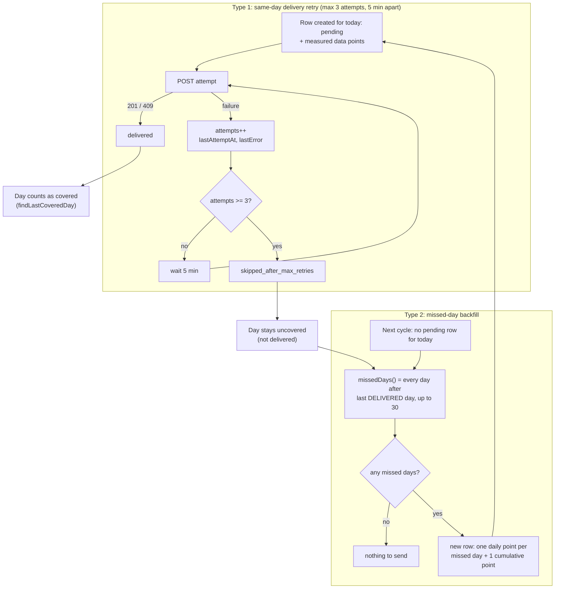

# Retries

The module has two retry mechanisms. The code keeps them separate. Both feed
the same state machine on `instance_monitoring_report`: a row goes from
`pending` to `delivered`, or from `pending` to `skipped_after_max_retries`.

- **Type 1, same-day delivery retry.** Resend today's row until it lands or
  its budget runs out.
- **Type 2, missed-day backfill.** Put every day without a delivered row into
  the next report.

Type 2 decides how many days the next `pending` row must cover. Type 1 then
takes over and delivers that row.

## Type 1: same-day delivery retry

Scope: one row, already created for today, whose last delivery attempt failed.

- The row is created once, as `pending`, with its data points already
  measured. A retry changes only `attempts`, `lastAttemptAt`, `lastError` and,
  in the end, `status`. The data points and the `batchId` stay the same.
- `InstanceReportingService.msUntilRetryAllowed()` reads `lastAttemptAt` from
  the row. The scheduler waits `RETRY_DELAY_MS` (5 minutes) between attempts.
- The budget is `MAX_ATTEMPTS` (3). The attempt that spends the last one flips
  the row to `skipped_after_max_retries` at once. There is no fourth attempt,
  and no new row for today.
- A response of `201` flips the row to `delivered`. A `409` means the receiver
  already holds this `batchId`, so the row is marked `delivered` as well.

Type 1 alone decides whether today's row lands. Because the budget and the
pacing live on the row, a restart resumes them. A fresh process does not get
three new attempts, and it waits out the rest of the five minutes before it
tries again.

## Type 2: missed-day backfill

Scope: no `pending` row exists for today, but one or more calendar days have no
`delivered` row.

- `InstanceMonitoringReportRepository.findLastCoveredDay()` counts only
  `delivered` rows. A day whose row was skipped, or a day the instance was down
  for, is still owed.
- `InstanceReportingService.missedDays()` walks back from yesterday to the day
  after the last delivered day. It stops at `MAX_BACKFILL_DAYS` (30) because
  `insights` buckets a longer range by week, which cannot fill a daily point.
  Older days are dropped.
- The next report creates one new row. It carries one `daily` point for every
  missed day and one `cumulative` point. The cumulative point is a fresh
  lifetime total, not one per missed day.
- That new row is then subject to type 1 if its own delivery fails.

Type 2 is the catch-up layer. It reacts to type 1 giving up, and to any other
gap in delivered rows.

## How the two connect

