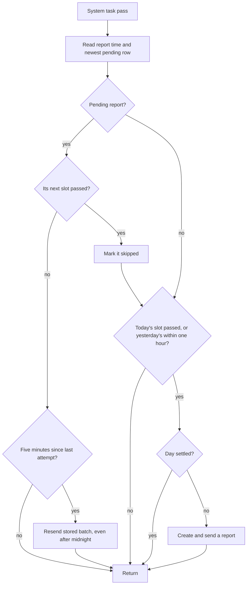
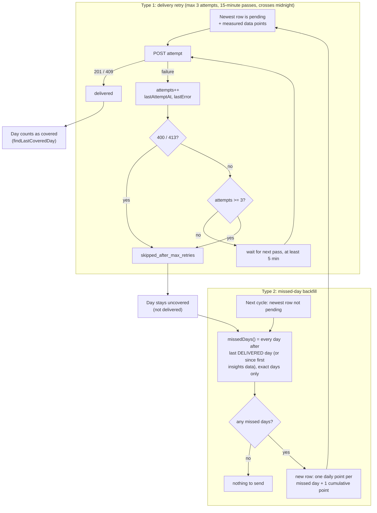

# Retries

The module has two retry mechanisms. The code keeps them separate. Both feed
the same state machine on `instance_monitoring_report`: a row goes from
`pending` through `sending` to `delivered`, or from `pending` to `skipped_after_max_retries`.

- **Type 1, delivery retry.** Resend the pending row until it lands, its budget
  runs out, or its own next slot passes. It continues across the UTC midnight
  boundary.
- **Type 2, missed-day backfill.** Put every day without a delivered row into
  the next report.

Type 2 decides how many days the next `pending` row must cover. Type 1 then
takes over and delivers that row.

## The send decision

`InstanceReportingTask.run()` makes one pass every 15 minutes. The shared system
task runner owns scheduling and leadership. Each pass reads the current report
time and the newest report row. Only a pending row can be retried. A `sending`
row waits for its request to finish, including when the next slot passes. A
claim left by a stopped main returns to `pending` on the first pass after two
minutes. Claim age uses the database clock. A row with no claim timestamp can
be released immediately. Failure writes must match the active claim. A late
`201` or `409` still records delivery after a reclaim or skip. Further results
cannot change a delivered row.

```mermaid
flowchart TD
    T["System task pass"] --> L["Read report time and newest pending row"]
    L --> Q1{"Pending report?"}
    Q1 -- yes --> Q1b{"Its next slot passed?"}
    Q1b -- no --> P{"Five minutes since last attempt?"}
    P -- no --> N["Return"]
    P -- yes --> R["Resend stored batch, even after midnight"]
    Q1b -- yes --> SK["Mark it skipped"] --> Q2
    Q1 -- no --> Q2{"Today's slot passed, or yesterday's within one hour?"}
    Q2 -- no --> N
    Q2 -- yes --> Q3{"Day settled?"}
    Q3 -- yes --> N
    Q3 -- no --> C["Create and send a report"]
    R --> N
    C --> N
```

The report row owns delivery retries. Durable occurrences use `maxAttempts: 1`.
A delivery error fails that occurrence. The next scheduled pass checks the
stored retry delay and budget. It does not get a new delivery budget.

## Type 1: delivery retry

Scope: the newest row while it is `pending`, whose last delivery attempt failed.
It can come from an earlier slot, so the retry crosses midnight. Once its own
next slot has passed, the retry stops: the row is marked
`skipped_after_max_retries` and a new report covers its day instead.

- The row is created once, as `pending`, with its data points already
  measured. A retry changes only `attempts`, `lastAttemptAt`, `lastError` and,
  in the end, `status`. The data points and the `batchId` stay the same.
- `InstanceReportingTask.run()` reads `lastAttemptAt` from the row. A retry
  waits at least `RETRY_DELAY_MS` (5 minutes), then runs on the next 15-minute
  pass. The five-minute floor also applies after a restart or takeover.
- The budget is `MAX_ATTEMPTS` (3). The attempt that spends the last one flips
  the row to `skipped_after_max_retries` at once. There is no fourth attempt,
  and no new row for today.
- A response of `201` flips the row to `delivered`. A `409` means the receiver
  already holds this `batchId`, so the row is marked `delivered` as well.
- A response of `400` (the report fails the receiver's schema) or `413` (the
  report is over the receiver's size limit) flips the row to
  `skipped_after_max_retries` at once and logs an error. The payload of a
  pending row does not change between attempts, so a retry cannot succeed.
  The next slot measures its days again in a new report.

Type 1 alone decides whether the row lands. Because the budget and the
pacing live on the row, a restart resumes them. A fresh process does not get
three new attempts, and it waits out the rest of the five minutes before it
tries again.

## Type 2: missed-day backfill

Scope: no `pending` row is the newest, but one or more calendar days have no
`delivered` row.

- `InstanceMonitoringReportRepository.findLastCoveredDay()` counts only
  `delivered` rows. A day whose row was skipped, or a day the instance was down
  for, is still owed. Skipped rows never shorten the window: only a delivered
  row moves its start.
- `InstanceReportingService.missedDays()` returns every day from the first
  owed day to yesterday. Yesterday is always included.
- The first owed day is the day after the last delivered day, but never
  before the first `insights` data (`InsightsService.getEarliestDataDate()`).
  Before the first delivered report, it is that first day.
  - A report never carries a day older than
    `N8N_INSIGHTS_COMPACTION_HOURLY_TO_DAILY_THRESHOLD_DAYS` minus one: 89
    days with the default settings. Compaction folds older hours into daily
    rows. On Postgres, a daily row holds a day in the session's time zone, so
    it has no exact value for a UTC day. The day of margin covers Postgres,
    which also dates the threshold in the session's time zone.
  - Days before the first data are not reported, not even as `0`. Inside the
    window, a day without data is reported as `0`. `insights` writes rows only
    for executions and never stores a `0`, so a day without executions and a
    day without collected data look the same.
  - Without any data, the report carries only yesterday, so a new instance
    still shows up on the receiver.
- The first report is no special case. It backfills the history that `insights`
  holds instead of sending yesterday alone.
- With the default settings, a full report of 89 daily points comes to less
  than 20 KB, far below the receiver's size limit. If the receiver
  still rejects a report with `413`, the row is skipped. The next report
  carries the same days, so the receiver can reject it again.
- `collectDataPoints()` reads the whole window from `insights` in one query,
  bucketed by UTC day. `InsightsService.getInsightsByTime()` is not used,
  because it buckets a range of more than 30 days by week. The read does not
  apply the license's `insights` history limit. Only the `insights` dashboard
  applies that limit.
- The next report creates one new row. It carries one `daily` point for every
  missed day and one `cumulative` point. The cumulative point is a fresh
  lifetime total, not one per missed day.
- That new row is then subject to type 1 if its own delivery fails.

Example: the module is enabled, but the receiver cannot be reached for three
days. Each day's report fails three times and is skipped. No row is delivered,
so each new report starts again at the first day with `insights` data. When the
receiver is reachable again, the next delivered report holds every day, from
that first day to yesterday.

Type 2 is the catch-up layer. It reacts to type 1 giving up, and to any other
gap in delivered rows.

## How the two connect

```mermaid
flowchart TD
    subgraph T1["Type 1: delivery retry (max 3 attempts, 15-minute passes, crosses midnight)"]
        A["Newest row is pending\n+ measured data points"] --> B["POST attempt"]
        B -->|"201 / 409"| C["delivered"]
        B -->|"failure"| D["attempts++\nlastAttemptAt, lastError"]
        D --> R{"400 / 413?"}
        R -- yes --> G
        R -- no --> E{"attempts >= 3?"}
        E -- no --> F["wait for next pass, at least 5 min"] --> B
        E -- yes --> G["skipped_after_max_retries"]
    end

    C --> H["Day counts as covered\n(findLastCoveredDay)"]
    G --> I["Day stays uncovered\n(not delivered)"]

    subgraph T2["Type 2: missed-day backfill"]
        J["Next cycle: newest row not pending"] --> K["missedDays() = every day after\nlast DELIVERED day (or since first\ninsights data), exact days only"]
        K --> L{"any missed days?"}
        L -- no --> M["nothing to send"]
        L -- yes --> N["new row: one daily point per\nmissed day + 1 cumulative point"]
        N --> A
    end

    I --> K
```

## Known limitations

- **A lost response on the last attempt.** The receiver stores the report, but
  n8n does not get the response. Possible causes: a locked database on the
  receiver, an update, or a proxy that drops the response. n8n marks the row
  as skipped. The next report sends the same days again under a new
  `batchId`, so the receiver holds those days two times. On attempts 1 and 2
  this does not occur: the retry uses the same `batchId`, and the receiver
  answers `409`.
