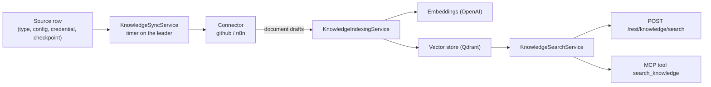

# Knowledge connectors (experimental)

Indexes external and internal data sources into a vector store and makes them
searchable over REST and MCP. A source is synced by a **connector**, chunked and
embedded by the **indexing service**, and queried by the **search service**.

The module is experimental and off by default.



## Enabling

```bash
export N8N_ENABLED_MODULES=knowledge
```

## Configuration flow

1. In the UI, create the two credentials the module needs: an **OpenAI** credential
   (embeddings) and a **Qdrant** credential (vector store). Note their ids.
2. Point the module at them (instance admin, `knowledge:manage`):

   ```bash
   curl -X PUT "$N8N_URL/rest/knowledge/settings" \
     -H 'content-type: application/json' -b cookies.txt \
     -d '{
       "embedding": { "provider": "openai", "credentialId": "<openai-cred-id>", "model": "text-embedding-3-small" },
       "vectorStore": { "provider": "qdrant", "credentialId": "<qdrant-cred-id>", "collectionName": "n8n_knowledge" }
     }'
   ```

   `collectionName` is optional and defaults to `n8n_knowledge`. Omitting a field
   keeps its stored value; passing `null` clears it.

3. Create a source:

   ```bash
   curl -X POST "$N8N_URL/rest/knowledge/sources" \
     -H 'content-type: application/json' -b cookies.txt \
     -d '{
       "name": "n8n repo",
       "type": "github",
       "credentialId": "<github-cred-id>",
       "config": { "owner": "n8n-io", "repo": "n8n", "includeIssues": true, "includePullRequests": true, "historyDays": 90 }
     }'
   ```

4. Sync it (returns immediately; the run continues in the background):

   ```bash
   curl -X POST "$N8N_URL/rest/knowledge/sources/<source-id>/sync" \
     -H 'content-type: application/json' -b cookies.txt -d '{"fullResync": false}'

   curl "$N8N_URL/rest/knowledge/sources/<source-id>/runs" -b cookies.txt   # progress and errors
   ```

5. Search it (any authenticated user):

   ```bash
   curl -X POST "$N8N_URL/rest/knowledge/search" \
     -H 'content-type: application/json' -b cookies.txt \
     -d '{"query": "how is the queue mode configured?", "topK": 5}'
   ```

## Endpoints

| Method   | Path                          | Access                        |
| -------- | ----------------------------- | ----------------------------- |
| `GET`    | `/rest/knowledge/settings`    | `knowledge:manage`            |
| `PUT`    | `/rest/knowledge/settings`    | `knowledge:manage`            |
| `GET`    | `/rest/knowledge/sources`     | any authenticated user        |
| `POST`   | `/rest/knowledge/sources`     | `knowledge:manage`            |
| `PATCH`  | `/rest/knowledge/sources/:id` | `knowledge:manage`            |
| `DELETE` | `/rest/knowledge/sources/:id` | `knowledge:manage`            |
| `POST`   | `/rest/knowledge/sources/:id/sync` | `knowledge:manage` (409 while a sync runs) |
| `GET`    | `/rest/knowledge/sources/:id/runs` | `knowledge:manage`       |
| `POST`   | `/rest/knowledge/search`      | any authenticated user        |

## Source configuration

**`github`** — requires a credential of type `githubApi`. Indexes issues and pull
requests (one pass covers both) together with their comments.

```json
{
  "owner": "n8n-io",
  "repo": "n8n",
  "includeIssues": true,
  "includePullRequests": true,
  "historyDays": 365
}
```

**`n8n`** — no credential. Indexes this instance's own metadata.

```json
{
  "includeWorkflows": true,
  "includeDataTables": true,
  "includeCredentials": true
}
```

## MCP

When the module is active, the instance MCP server exposes a read-only
`search_knowledge` tool, granted by the `knowledge:read` OAuth scope. The scope
and the tool are hidden from the consent screen on instances where the module is
off.

## Environment variables

| Variable                                | Default  | Purpose                                             |
| --------------------------------------- | -------- | --------------------------------------------------- |
| `N8N_KNOWLEDGE_SYNC_INTERVAL_MINUTES`   | `60`     | How often a source becomes eligible for a new sync   |
| `N8N_KNOWLEDGE_CHUNK_SIZE`              | `1500`   | Characters per chunk                                 |
| `N8N_KNOWLEDGE_CHUNK_OVERLAP`           | `200`    | Characters shared between consecutive chunks         |
| `N8N_KNOWLEDGE_MAX_DOCUMENT_CHARS`      | `200000` | Documents longer than this are truncated             |
| `N8N_KNOWLEDGE_EMBEDDING_BATCH_SIZE`    | `100`    | Chunks per embedding request                         |
| `N8N_KNOWLEDGE_DEFAULT_TOP_K`           | `8`      | Results per search when the caller does not say      |

## Limitations

- **Instance-level visibility.** Indexed content is not scoped to projects or
  users: anyone who can call `/rest/knowledge/search` (or hold the
  `knowledge:read` MCP scope) sees everything indexed, regardless of who can see
  the underlying workflow, credential or repository. There is no per-user
  permission mirroring yet — only index sources everyone on the instance may read.
- **GitHub deletions are not pruned.** The GitHub connector cannot enumerate its
  ids cheaply, so issues deleted upstream stay indexed until the source is
  re-created. The `n8n` connector does prune.
- **Single-main sync.** The timer only runs on the leader, and a run is bound to
  the process that started it. A source left in `syncing` by a crashed instance is
  taken over by the next run rather than staying stuck.
- **One embedding model per instance**, and changing it means re-indexing:
  existing vectors keep the old model's dimensions.
- Sync failures never persist a checkpoint, so a failed incremental run re-reads
  the same window next time rather than skipping documents.

## Security notes

- The `n8n` connector indexes **metadata only**. Credential `data` is never read,
  and node `parameters` are never emitted — with one deliberate exception: sticky
  note content, which is user-authored documentation, is indexed. Keep that in
  mind before enabling the `n8n` source on an instance whose sticky notes carry
  sensitive text.
- Settings store credential **ids**, never credential data. Credentials are
  decrypted per sync and handed only to the connector that needs them.
- The vector-store filter is built server-side from source ids; a search caller
  cannot supply a raw filter.
