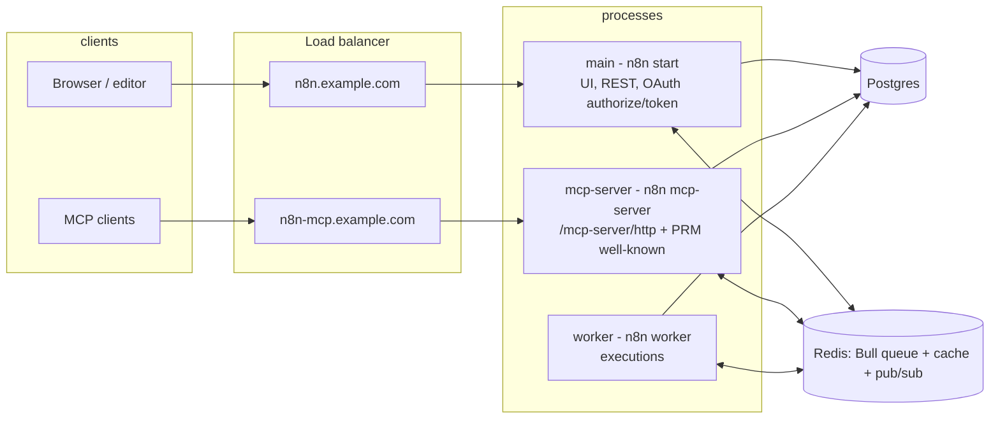

# Investigation: deploying the instance MCP server as a standalone service

**Status:** investigation / design proposal — no code changes yet.

## Problem

The instance-level MCP server (this module, `packages/cli/src/modules/mcp/`) runs only inside
the main n8n process: the module is declared
`@BackendModule({ name: 'mcp', instanceTypes: ['main'] })` in `mcp.module.ts`. That means MCP
traffic — LLM clients speaking Streamable HTTP against `/mcp-server/http` — competes with the
UI and REST API for the main instance's CPU/memory, and cannot be scaled, isolated, or
firewalled independently.

Split-hostname support already exists: `N8N_MCP_BASE_URL` (`mcp.config.ts`) lets a dedicated
MCP hostname front the *same* backend, becoming the canonical resource URL and token audience.
What does not exist is a dedicated **process** for MCP, the way `n8n webhook` and `n8n worker`
exist for webhooks and executions.

This document captures what would be needed to add an `n8n mcp-server` process type.

## Summary of findings

- The MCP endpoint is **stateless by design** (a fresh `McpServer` +
  `StreamableHTTPServerTransport` per request, `mcp.controller.ts`), so it is horizontally
  scalable with no sticky sessions — a good fit for a standalone, replicable service.
- Authentication is **self-contained and DB-backed** (`mcp-server-middleware.service.ts`):
  Bearer JWT → either an OAuth access token (verified through `OAuthTokenVerifierProxy`, whose
  provider the `oauth-server` module registers on *all* instance types) or an MCP API key
  (`McpServerApiKeyService` + `ApiKeyRepository`). It works on any process with DB access.
- A standalone MCP process is **not a slim proxy**. `McpService` injects a large slice of the
  CLI service layer (`WorkflowRunner`, `ActiveExecutions`, `ExecutionService`, the `Workflow*`
  services, `CredentialsService`, `CollaborationService`, `DataTableProxyService`,
  `NodeTypes`/`NodeCatalogService`, `LicenseState`, `PostHogClient`, `Telemetry`,
  `AiGatewayService`, …). The process needs a near-full backend bootstrap — node types loaded,
  DB, license, event bus — i.e. the `n8n webhook` command pattern, not a new lean package.
- **Queue mode is a hard requirement** (same as `n8n webhook`), for three independent reasons
  detailed below: execution semantics, cache backend, and cross-process orchestration.

## How the pieces work today (verified in code)

### Controller mounting

`ControllerRegistry.activate(app)` is called only by main's `Server`
(`packages/cli/src/server.ts`, in `configure()`). `WebhookServer` never calls it — that is why
webhook processes serve no REST controllers. `activate()` mounts **every** controller class
that has been imported (controller files self-register on import; modules import theirs in
`init()`). On a new MCP process, ungated modules (`data-table`, `community-packages`,
`mcp-registry`, …) would import their controllers too, so a naive `activate(app)` would mount
far more than MCP routes on a publicly reachable MCP hostname. A standalone server needs an
**allowlist-capable** `activate()` (small change in `packages/cli/src/controller.registry.ts`).

### Queue-mode execution round-trip

`execute_workflow` / `test_workflow` call `WorkflowRunner.run()`. Run data already carries MCP
correlation metadata (`isMcpExecution`, `mcpType: 'service'`, `mcpMessageId` — see
`tools/execute-workflow.tool.ts`). Workers report results with
`{ kind: 'mcp-response', mcpType: 'service' }` messages over **Bull's `global:progress`
events** (`packages/cli/src/scaling/job-processor.ts`), not the Redis pub/sub command channel.
They are handled by `ScalingService.registerMainOrWebhookListeners()`
(`packages/cli/src/scaling/scaling.service.ts`), registered only when
`instanceType === 'main' || instanceType === 'webhook'`, which routes them to
`McpService.handleWorkerResponse()` to resolve the pending in-memory promise. Bull `global:*`
events are broadcast to every queue client, so a standalone MCP process only needs
`ScalingService.setupQueue()` plus that instance-type gate widened.

(The pub/sub `mcp-relay` channel subscribed in `start.ts` serves the workflow-level **MCP
Trigger node** from `@n8n/nodes-langchain` — unrelated to this module.)

### OAuth topology

The shared OAuth server (`packages/cli/src/modules/oauth-server/`) loads on
`['main', 'webhook', 'worker']` and registers the token verifier everywhere, but imports its
controllers only on main. Endpoint placement for a standalone MCP host:

- **Protected-resource metadata (PRM, RFC 9728)** — `McpProtectedResource
  .getProtectedResourceMetadataUrl()` builds the PRM URL from the *resource URL origin*, i.e.
  the `N8N_MCP_BASE_URL` origin. Clients discover it from the `WWW-Authenticate:
  resource_metadata=...` header on 401s. So the standalone host **must serve**
  `/.well-known/oauth-protected-resource[...]` itself.
- **Authorization server** — the PRM document's `authorization_servers` points at
  `UrlService.getInstanceBaseUrl()` (main). `/authorize`, `/token`, `/register`, `/revoke`,
  consent UI, and RFC 8414 AS metadata **stay main-only** (authorize needs the browser
  session/consent screen that only main has).
- Token verification on the MCP host works as-is once the `oauth-server` module inits there
  (the verifier provider registration is not main-gated).

### State propagation and degradation

- In queue mode, `CacheService` uses Redis, so the `mcp.access.enabled` flag
  (`McpSettingsService`) and collaboration write locks propagate across processes. In regular
  mode they are per-process memory — a standalone process would cache the enable flag stale
  forever. Another reason queue mode is required.
- Push notifications sent from a non-main host are dropped: `Push.sendToUsers()` writes only to
  local connections, with no pub/sub relay. Collaboration *broadcasts* (publish/unpublish
  notifications to open editors) from the MCP host are lost — the same accepted degradation
  documented for multi-main in `collaboration.service.ts`. Lock *enforcement* still works
  because it reads the Redis-backed collaboration state.

### Adding an instance type is cheap

Instance types are `['main', 'webhook', 'worker']`
(`packages/@n8n/constants/src/instance.ts`), derived from `process.argv[2]` in
`packages/core/src/instance-settings/instance-settings.ts`. Nearly all behavior switches in the
codebase are `=== 'main'` / `=== 'worker'` guards that correctly no-op for a new type: pruning,
workflow-history compaction, durable scheduler, auth-roles sync, license renewal (non-main runs
in offline mode — desired), leader election, queue recovery. `ErrorReporter.serverType` is
typed as `InstanceType`, so it extends automatically. Reusing `'webhook'` instead was
considered and rejected: it would mount MCP on every webhook replica, drag in the `insights`
module (`['main', 'webhook']`), and conflate Sentry/event-log/host-ID labeling.

## Proposed implementation blueprint

Deployment topology being enabled:

Changes a PR would make (in dependency order):

1. **New instance type `'mcp'`** — add to `INSTANCE_TYPES` in
   `packages/@n8n/constants/src/instance.ts`; map the `mcp-server` command to it in the
   `InstanceSettings` constructor (`packages/core/src/instance-settings/instance-settings.ts`).
   `hostId` becomes `mcp-<hostname|nanoid>` automatically.
2. **Widen queue-listener gating** — include `'mcp'` in the branch of
   `ScalingService.registerListeners()` that calls `registerMainOrWebhookListeners()`
   (`packages/cli/src/scaling/scaling.service.ts`), so `mcp-response` messages reach
   `McpService.handleWorkerResponse()`.
3. **Allowlist-capable controller activation** — extend
   `ControllerRegistry.activate(app, options?: { include?: Controller[] })` in
   `packages/cli/src/controller.registry.ts`; main's call site is unchanged.
4. **Extract the PRM controller** — move the `/.well-known/oauth-protected-resource[...]`
   GET/OPTIONS handlers (and their rate limit + CORS helpers) from
   `oauth-server/oauth.controller.ts` into a new
   `oauth-server/oauth-protected-resource.controller.ts`. No route paths change.
5. **New server class** — `modules/mcp/mcp-standalone.server.ts`,
   `McpStandaloneServer extends AbstractServer` with `webhooksEnabled = false`; `configure()`
   optionally inits Prometheus metrics (like `WebhookServer`) and activates only
   `McpController` + `OAuthProtectedResourceController` via the allowlist. `AbstractServer`
   already provides `/healthz`, `/healthz/readiness`, body parsing, and compression.
6. **Module gating** —
   - `mcp.module.ts`: `instanceTypes: ['main', 'mcp']`; import `mcp.controller.js` always but
     `mcp.settings.controller.js` only on main (mirrors the oauth-server pattern). The
     `McpProtectedResource` registration stays unconditional (needed for the token audience,
     the 401 `resource_metadata` header, and PRM lookups).
   - `oauth-server.module.ts`: add `'mcp'` to `instanceTypes`; import the new PRM controller on
     `main` and `mcp`; keep authorize/consent/clients controllers main-only.
   - `data-table` needs no change (ungated, so it inits on `'mcp'`, satisfying
     `DataTableProxyService`). `insights` stays `['main', 'webhook']`.
7. **New command** — `packages/cli/src/commands/mcp-server.ts`, modeled on `webhook.ts`
   (`CommandRegistry` auto-discovers commands by filename):
   - Hard-require queue mode, like `webhook.ts`, citing: executions must run on workers, the
     Redis cache is required for enable-flag/lock propagation, and pub/sub is required for
     license reload.
   - `init()`: crash journal → `super.init()` → instance-settings/JWT/binary-data key init →
     license → community packages → orchestration (publisher + command-channel subscription) →
     binary data → dedup → external hooks → event bus → `initModules('mcp')` → post-process
     loaders.
   - `run()`: `ScalingService.setupQueue()` → `server.start()` → `markAsReady()`.
   - `stopProcess()`: external hooks, `McpService.cancelAllPendingExecutions()`,
     `ActiveExecutions.shutdown()`.
8. **Deployment surface** — `command: ["mcp-server"]` flows through
   `docker/images/n8n/docker-entrypoint.sh` unchanged. The container needs the same `DB_*`,
   `QUEUE_BULL_REDIS_*`, `N8N_ENCRYPTION_KEY`, and — critically — the **same base-URL env**
   (`N8N_EDITOR_BASE_URL`/`N8N_HOST`/`N8N_PROTOCOL`) as main, since token audiences and the
   PRM `authorization_servers` value derive from `UrlService.getInstanceBaseUrl()`. A mismatch
   silently breaks token validation, so the command should log the resolved URLs at startup.
   `N8N_MCP_BASE_URL` is set to the public hostname routed to this service; `N8N_PORT` /
   `N8N_LISTEN_ADDRESS` control the listener; `/healthz/readiness` is the probe endpoint. The
   settings UI needs no change — `McpModule.settings()` already surfaces `serverUrl` from
   `N8N_MCP_BASE_URL`. Main keeps serving `/mcp-server/http` too, which is functionally fine:
   `McpProtectedResource.getAudiences()` accepts both the dedicated and instance-derived
   resource URLs.

## Required deployment settings and documented limitations

These two pre-existing gaps become user-visible once MCP tools run off-main. They are scoped
as **documented workarounds**, not code changes:

- **`OFFLOAD_MANUAL_EXECUTIONS_TO_WORKERS=true` is required.** In queue mode,
  `WorkflowRunner.shouldEnqueue` keeps `manual`-mode executions in-process unless that env var
  is set, but the MCP tools' `waitForExecutionResult` (`tools/execution-utils.ts`) waits on the
  worker-response promise purely based on `isQueueMode` — so a locally-run manual
  `test_workflow` / `execute_workflow(manual)` would hang until its timeout. Offloading also
  keeps MCP containers execution-free (no task-runner or execution sizing needed), which is the
  recommended posture anyway.
- **`publish_workflow` / `unpublish_workflow` trigger activation is unsupported from the
  standalone host** in single-main queue deployments on the default (legacy) activation path:
  `ActiveWorkflowManager.add()/remove()` relays `add-webhooks-triggers-and-pollers` /
  `remove-triggers-and-pollers` to the leader only when `isMultiMain`, so from an `'mcp'`
  instance the workflow is marked active in the DB but no webhooks/triggers are registered
  anywhere. The limitation does not apply with `N8N_USE_WORKFLOW_PUBLICATION_SERVICE=true`
  (outbox path) or in multi-main deployments. A proper fix (relay whenever the caller is not a
  leader main and pub/sub is available) is a candidate follow-up.

Additional accepted degradations:

- Collaboration push notifications from the MCP host are dropped (editors heal on refetch) —
  same class of gap as multi-main.
- Main must boot at least once before the MCP process is useful (it applies env-managed
  settings via `InstanceSettingsLoaderService` and seeds roles) — the same ordering constraint
  webhook/worker already have.

## Testing approach for the eventual implementation

- **Unit:** instance-type derivation for `mcp-server`; `ScalingService.registerListeners`
  registering consumer listeners for `'mcp'`; `ControllerRegistry.activate` allowlist
  filtering; `mcp` / `oauth-server` module `init()` controller-import splits by instance type.
- **Integration:** a `mcp-server.cmd.test.ts` modeled on
  `packages/cli/test/integration/commands/worker.cmd.test.ts` (mocked Redis; assert the
  queue-mode requirement, module init set, listener registration). An endpoint-level test that
  boots the standalone app and asserts `/mcp-server/http` and both PRM well-known routes
  respond while `/rest/mcp/*` and other module controllers 404. Existing endpoint coverage in
  `modules/mcp/__tests__/` and `test/integration/mcp/` carries over unchanged.
- **E2E:** docker-compose with main + worker + mcp-server on shared Postgres/Redis; verify the
  OAuth dynamic-client-registration flow with `N8N_MCP_BASE_URL` pointing at the MCP host (PRM
  served there, authorize/token on main); a production `execute_workflow` worker round-trip;
  and enable/disable toggle propagation from the main UI.
