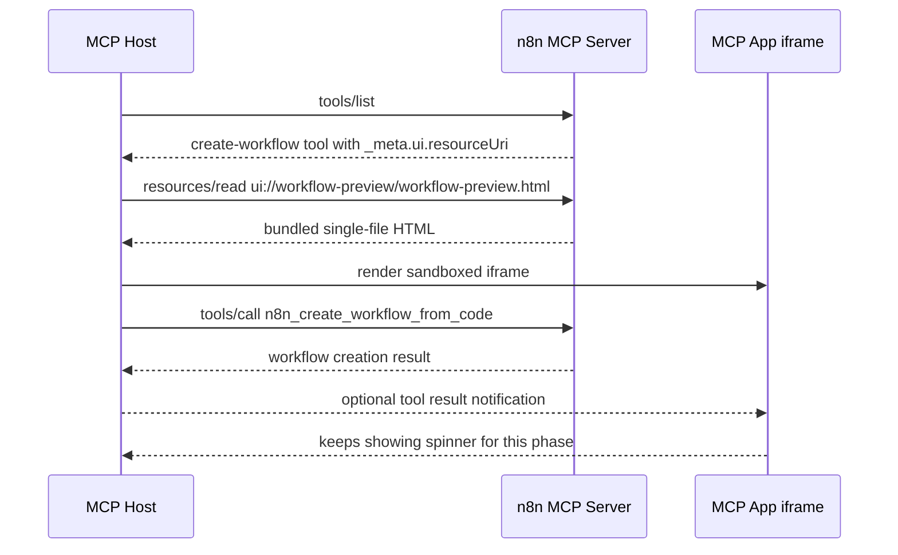

# MCP Apps Implementation Plan: Workflow Preview App

## Goal

Add the first n8n MCP App and attach it to the existing workflow builder tool:

`packages/cli/src/modules/mcp/tools/workflow-builder/create-workflow-from-code.tool.ts`

For this first step, the workflow preview app only renders an indefinite loading spinner. It must be implemented as a separate Vue package under `packages/@n8n/` and should use the n8n design system where possible.

## Confirmed Decisions

| Decision | Choice |
| --- | --- |
| Package location | `packages/@n8n/mcp-apps` |
| Package name | `@n8n/mcp-apps` |
| UI framework | Vue 3 |
| UI component source | `@n8n/design-system` |
| First app name | `workflow-preview` |
| First app behavior | Indefinite spinner only |
| Tool attachment | Attach directly to `n8n_create_workflow_from_code` |
| New MCP tool | No |
| New REST endpoint | No |
| Editor UI changes | No |
| DB migration | No |

## Reference Resources

- [Official MCP Apps overview](https://modelcontextprotocol.io/extensions/apps/overview)
- [Official MCP Apps build guide](https://modelcontextprotocol.io/extensions/apps/build)
- [Official Vue MCP Apps example](https://github.com/modelcontextprotocol/ext-apps/tree/main/examples/basic-server-vue)
- [n8n hacky MCP Apps PoC branch comparison](https://github.com/n8n-io/n8n/compare/master...hackmation-mcp-apps)

## High-Level Architecture



The app resource should be registered only when MCP builder tools are enabled, because the target create-workflow tool is only registered behind `globalConfig.endpoints.mcpBuilderEnabled`.

## Build And Runtime Lifecycle

MCP Apps are not started as a separate process when an n8n instance starts. The Vue app is built into a static single-file HTML artifact, packaged with `@n8n/mcp-apps`, and loaded on demand by the MCP resource handler.

Build-time behavior:

- `packages/cli/package.json` must depend on `@n8n/mcp-apps` via `"@n8n/mcp-apps": "workspace:*"`.
- The root `turbo.json` build task already has `"dependsOn": ["^build"]`, so `pnpm build` builds `@n8n/mcp-apps` before `n8n` once the CLI dependency is added.
- `@n8n/mcp-apps` must include `dist/**/*` in `files`, so published or packaged n8n installs contain `dist/apps/workflow-preview.html` and `dist/server/**`.
- `@n8n/mcp-apps` must export `./server` from built files only. The CLI should never import Vue source files directly.

Runtime behavior:

- `McpService.getServer()` registers the MCP app resource when builder tools are enabled.
- The resource handler reads `@n8n/mcp-apps/dist/apps/workflow-preview.html` from disk via `loadAppHtml()`.
- The HTML is cached in memory after the first read.
- The app iframe is rendered by the MCP host only when the host fetches the `ui://workflow-preview/workflow-preview.html` resource.
- There is no extra port, worker, watcher, or long-running app server to start.

Development behavior:

- Before testing this locally, run `pnpm --filter @n8n/mcp-apps build` at least once so `dist/apps/workflow-preview.html` exists.
- For active UI iteration, add a watch script later if needed, for example `"watch:ui": "vite build --mode workflow-preview --watch"`, and run it alongside `pnpm dev:be`.
- Do not make n8n startup trigger a Vite build. Runtime startup should fail clearly if the packaged app artifact is missing, because production instances should never compile frontend assets on boot.

## Package Structure

Create this package:

```text
packages/@n8n/mcp-apps/
  package.json
  tsconfig.json
  tsconfig.build.json
  vite.config.mts
  vitest.config.mts
  eslint.config.mjs
  src/
    apps/
      workflow-preview/
        App.vue
        index.html
        main.ts
        tokens.scss
    server/
      apps/
        workflow-preview.ts
      constants.ts
      index.ts
      register-mcp-app-tool.ts
      resource-loader.ts
```

Build output should look like this:

```text
packages/@n8n/mcp-apps/dist/
  apps/
    workflow-preview.html
  server/
    apps/
      workflow-preview.js
      workflow-preview.d.ts
    constants.js
    constants.d.ts
    index.js
    index.d.ts
    register-mcp-app-tool.js
    register-mcp-app-tool.d.ts
    resource-loader.js
    resource-loader.d.ts
```

## Step 1: Add Workspace Dependencies

`pnpm-workspace.yaml` uses strict catalog mode, so add catalog entries before adding package dependencies.

Add to `catalog`:

```yaml
'@modelcontextprotocol/ext-apps': 1.3.2
vite-plugin-singlefile: 2.3.3
```

Notes:

- `@modelcontextprotocol/ext-apps` is needed by the Vue app for the client bridge.
- The server helper can avoid importing `@modelcontextprotocol/ext-apps/server` to minimize runtime coupling and avoid SDK-version drift.
- `vite-plugin-singlefile` allows serving the app as one `text/html;profile=mcp-app` resource without extra CSP work for external assets.

## Step 2: Create `@n8n/mcp-apps` Package

Create `packages/@n8n/mcp-apps/package.json` with this shape:

```json
{
  "name": "@n8n/mcp-apps",
  "version": "0.1.0",
  "description": "MCP Apps UI resources and server helpers for n8n",
  "main": "dist/server/index.js",
  "types": "dist/server/index.d.ts",
  "exports": {
    "./server": {
      "types": "./dist/server/index.d.ts",
      "default": "./dist/server/index.js"
    },
    "./package.json": "./package.json"
  },
  "files": ["dist/**/*"],
  "scripts": {
    "clean": "rimraf dist .turbo",
    "build": "pnpm build:ui && pnpm build:server",
    "build:ui": "vite build --mode workflow-preview",
    "build:server": "tsc -p tsconfig.build.json",
    "typecheck": "vue-tsc --noEmit -p tsconfig.json && tsc --noEmit -p tsconfig.build.json",
    "lint": "eslint . --quiet",
    "lint:fix": "eslint . --fix",
    "test": "vitest run",
    "test:dev": "vitest",
    "format": "biome format --write src",
    "format:check": "biome ci src"
  },
  "dependencies": {
    "@n8n/design-system": "workspace:*",
    "vue": "catalog:frontend"
  },
  "devDependencies": {
    "@modelcontextprotocol/ext-apps": "catalog:",
    "@modelcontextprotocol/sdk": "1.26.0",
    "@n8n/eslint-config": "workspace:*",
    "@n8n/typescript-config": "workspace:*",
    "@n8n/vitest-config": "workspace:*",
    "@vitejs/plugin-vue": "catalog:frontend",
    "@vue/test-utils": "catalog:frontend",
    "rimraf": "catalog:",
    "typescript": "catalog:",
    "vite": "catalog:",
    "vite-plugin-singlefile": "catalog:",
    "vitest": "catalog:",
    "vue-tsc": "catalog:frontend"
  },
  "peerDependencies": {
    "@modelcontextprotocol/sdk": "1.26.0"
  }
}
```

Important:

- Do not mark this package as `private` if `n8n` will import it at runtime and publish with it.
- Keep the runtime export limited to `./server` for now.
- Do not export Vue source files from the package.

## Step 3: Configure TypeScript

Create `packages/@n8n/mcp-apps/tsconfig.json`:

```json
{
  "extends": "@n8n/typescript-config/tsconfig.common.json",
  "compilerOptions": {
    "rootDir": "src",
    "outDir": "dist",
    "module": "ESNext",
    "moduleResolution": "bundler",
    "target": "ES2022",
    "lib": ["ES2022", "DOM", "DOM.Iterable"],
    "types": ["node", "vitest/globals", "vite/client"],
    "skipLibCheck": true
  },
  "include": ["src/**/*.ts", "src/**/*.vue"]
}
```

Create `packages/@n8n/mcp-apps/tsconfig.build.json`:

```json
{
  "extends": ["./tsconfig.json", "@n8n/typescript-config/tsconfig.build.json"],
  "compilerOptions": {
    "composite": true,
    "module": "CommonJS",
    "moduleResolution": "node",
    "rootDir": "src",
    "outDir": "dist",
    "tsBuildInfoFile": "dist/build.tsbuildinfo"
  },
  "include": ["src/server/**/*.ts"],
  "exclude": ["src/**/*.test.ts"]
}
```

Reasoning:

- UI code is built by Vite.
- Server helper code is built by `tsc` to CommonJS, matching backend package conventions.
- `src/apps/**/*.vue` should not be part of the server build output.

## Step 4: Configure Vite

Create `packages/@n8n/mcp-apps/vite.config.mts`:

```ts
import vue from '@vitejs/plugin-vue';
import { access, rename } from 'node:fs/promises';
import { resolve } from 'node:path';
import { defineConfig, type Plugin } from 'vite';
import { viteSingleFile } from 'vite-plugin-singlefile';

const appsRoot = resolve(__dirname, 'src/apps');

const apps = {
  'workflow-preview': 'workflow-preview',
} satisfies Record<string, string>;

export default defineConfig(({ mode }) => {
  const appName = apps[mode];

  if (!appName) {
    throw new Error(`Unknown MCP app mode: ${mode}`);
  }

  const appRoot = resolve(appsRoot, appName);

  return {
    root: appRoot,
    plugins: [vue(), viteSingleFile(), renameHtmlOutput('index.html', `${appName}.html`)],
    resolve: {
      alias: {
        '@n8n/design-system': resolve(__dirname, '../../frontend/@n8n/design-system/src'),
      },
    },
    build: {
      assetsInlineLimit: Number.MAX_SAFE_INTEGER,
      emptyOutDir: true,
      outDir: resolve(__dirname, 'dist/apps'),
      rollupOptions: {
        input: resolve(appRoot, 'index.html'),
      },
    },
  };
});

function renameHtmlOutput(fromFileName: string, toFileName: string): Plugin {
  return {
    name: 'rename-mcp-app-html',
    async writeBundle(options) {
      if (!options.dir) return;

      const from = resolve(options.dir, fromFileName);
      const to = resolve(options.dir, toFileName);

      try {
        await access(from);
      } catch {
        await access(to);
        return;
      }

      await rename(from, to);
    },
  };
}
```

Notes:

- This intentionally mirrors the PoC approach but starts with only one app.
- When adding more apps, add a new entry to `apps` and append another `vite build --mode <app-name>` command to `build:ui`. The config should fail fast on unknown modes instead of silently building the wrong app.
- The design-system alias follows `packages/@n8n/mcp-browser-extension/vite.ui.config.mts`.

## Step 5: Add the Vue App

Create `packages/@n8n/mcp-apps/src/apps/workflow-preview/index.html`:

```html
<!doctype html>
<html lang="en">
  <head>
    <meta charset="UTF-8" />
    <meta name="viewport" content="width=device-width, initial-scale=1.0" />
    <title>n8n</title>
  </head>
  <body>
    <div id="app"></div>
    <script type="module" src="main.ts"></script>
  </body>
</html>
```

Create `packages/@n8n/mcp-apps/src/apps/workflow-preview/main.ts`:

```ts
import { createApp } from 'vue';

import App from './App.vue';
import './tokens.scss';

createApp(App).mount('#app');
```

Create `packages/@n8n/mcp-apps/src/apps/workflow-preview/tokens.scss` using the same design-system token bootstrap pattern as the browser extension:

```scss
@use '@n8n/design-system/css/_primitives' as primitives;
@use '@n8n/design-system/css/_tokens' as tokens;

:root {
  color-scheme: light dark;
  @include primitives.primitives;
  @include tokens.theme;
}

@media (prefers-color-scheme: dark) {
  body:not([data-theme]) {
    @include tokens.theme-dark;
  }
}

@font-face {
  font-family: InterVariable;
  font-style: normal;
  font-weight: 100 900;
  font-display: swap;
  src: url('@n8n/design-system/../assets/fonts/InterVariable.woff2') format('woff2');
}

*,
*::before,
*::after {
  box-sizing: border-box;
}

body {
  margin: 0;
  font-family:
    InterVariable,
    -apple-system,
    BlinkMacSystemFont,
    'Segoe UI',
    Roboto,
    sans-serif;
  -webkit-font-smoothing: antialiased;
  background: transparent;
  color: var(--color--text--shade-1);
}
```

Create `packages/@n8n/mcp-apps/src/apps/workflow-preview/App.vue`:

```vue
<script setup lang="ts">
import { onMounted, ref, watchEffect } from 'vue';
import {
  App,
  applyDocumentTheme,
  applyHostFonts,
  applyHostStyleVariables,
  type McpUiHostContext,
} from '@modelcontextprotocol/ext-apps';
import { N8nSpinner } from '@n8n/design-system';

const hostContext = ref<McpUiHostContext>();

watchEffect(() => {
  const context = hostContext.value;

  if (context?.theme) {
    applyDocumentTheme(context.theme);
  }

  if (context?.styles?.variables) {
    applyHostStyleVariables(context.styles.variables);
  }

  if (context?.styles?.css?.fonts) {
    applyHostFonts(context.styles.css.fonts);
  }
});

onMounted(async () => {
  const app = new App({ name: 'n8n Workflow Creation', version: '0.1.0' });

  app.onhostcontextchanged = (params) => {
    hostContext.value = { ...hostContext.value, ...params };
  };

  app.onerror = console.error;

  await app.connect();
  hostContext.value = app.getHostContext();
});
</script>

<template>
  <main class="container" aria-busy="true" aria-label="Creating workflow">
    <N8nSpinner type="ring" />
  </main>
</template>

<style scoped lang="scss">
.container {
  display: flex;
  align-items: center;
  justify-content: center;
  min-height: 100vh;
  padding: var(--spacing--xl);
}
</style>
```

Notes:

- The spinner remains indefinite by design.
- Do not read or render tool output yet.
- Do not add a button or link yet.
- If strict i18n review blocks the `aria-label`, replace it with a package-level i18n setup or add an approved key to `@n8n/i18n`. There is intentionally no visible copy in this first app.
- If `@modelcontextprotocol/ext-apps` causes compatibility issues, the first phase can still ship a static spinner without the `App` bridge. Do not block the resource/tool integration on bridge callbacks.

## Step 6: Add Server Resource Helpers

Create `packages/@n8n/mcp-apps/src/server/constants.ts`:

```ts
export const RESOURCE_MIME_TYPE = 'text/html;profile=mcp-app';
export const RESOURCE_URI_META_KEY = 'ui/resourceUri';

export const WORKFLOW_PREVIEW_APP_URI = 'ui://workflow-preview/workflow-preview.html';
```

Create `packages/@n8n/mcp-apps/src/server/resource-loader.ts`:

```ts
import { readFile } from 'node:fs/promises';
import { createRequire } from 'node:module';
import { dirname, join } from 'node:path';

const appHtmlCache = new Map<string, string>();

export async function loadAppHtml(fileName: string): Promise<string> {
  const cached = appHtmlCache.get(fileName);
  if (cached !== undefined) return cached;

  const html = await readFile(join(getPackageRoot(), 'dist', 'apps', fileName), 'utf8');
  appHtmlCache.set(fileName, html);
  return html;
}

function getPackageRoot(): string {
  const requireFromHere = createRequire(__filename);
  return dirname(requireFromHere.resolve('@n8n/mcp-apps/package.json'));
}
```

Create `packages/@n8n/mcp-apps/src/server/apps/workflow-preview.ts`:

```ts
import type { McpServer } from '@modelcontextprotocol/sdk/server/mcp.js';

import { RESOURCE_MIME_TYPE, WORKFLOW_PREVIEW_APP_URI } from '../constants';
import { loadAppHtml } from '../resource-loader';

export function registerWorkflowPreviewApp(server: Pick<McpServer, 'resource'>): void {
  server.resource(
    'workflow-preview',
    WORKFLOW_PREVIEW_APP_URI,
    {
      description: 'Loading UI shown after creating a workflow from code',
      mimeType: RESOURCE_MIME_TYPE,
    },
    async () => ({
      contents: [
        {
          uri: WORKFLOW_PREVIEW_APP_URI,
          mimeType: RESOURCE_MIME_TYPE,
          text: await loadAppHtml('workflow-preview.html'),
        },
      ],
    }),
  );
}
```

If TypeScript rejects `mimeType` in the `server.resource` metadata object, remove it from the metadata object and keep it only on the returned content. The returned content MIME type is the critical part for hosts.

Create `packages/@n8n/mcp-apps/src/server/register-mcp-app-tool.ts`:

```ts
import type {
  McpServer,
  RegisteredTool,
  ToolCallback,
} from '@modelcontextprotocol/sdk/server/mcp.js';
import type z from 'zod';

import { RESOURCE_URI_META_KEY } from './constants';

export type McpAppToolConfig<InputArgs extends z.ZodRawShape = z.ZodRawShape> = {
  title?: string;
  description?: string;
  inputSchema?: InputArgs;
  outputSchema?: z.ZodRawShape;
  annotations?: {
    title?: string;
    readOnlyHint?: boolean;
    destructiveHint?: boolean;
    idempotentHint?: boolean;
    openWorldHint?: boolean;
  };
  _meta: Record<string, unknown>;
};

export function registerMcpAppTool<InputArgs extends z.ZodRawShape = z.ZodRawShape>(
  server: Pick<McpServer, 'registerTool'>,
  name: string,
  config: McpAppToolConfig<InputArgs>,
  handler: ToolCallback<InputArgs>,
): RegisteredTool {
  return server.registerTool(name, { ...config, _meta: normalizeMcpAppToolMeta(config._meta) }, handler);
}

function normalizeMcpAppToolMeta(meta: Record<string, unknown>): Record<string, unknown> {
  const uiMeta = isRecord(meta.ui) ? meta.ui : undefined;
  const modernUri = typeof uiMeta?.resourceUri === 'string' ? uiMeta.resourceUri : undefined;
  const legacyUri = typeof meta[RESOURCE_URI_META_KEY] === 'string' ? meta[RESOURCE_URI_META_KEY] : undefined;

  if (modernUri && !legacyUri) {
    return { ...meta, [RESOURCE_URI_META_KEY]: modernUri };
  }

  if (legacyUri && !modernUri) {
    return { ...meta, ui: { ...(uiMeta ?? {}), resourceUri: legacyUri } };
  }

  return meta;
}

function isRecord(value: unknown): value is Record<string, unknown> {
  return typeof value === 'object' && value !== null && !Array.isArray(value);
}
```

Create `packages/@n8n/mcp-apps/src/server/index.ts`:

```ts
export {
  RESOURCE_MIME_TYPE,
  RESOURCE_URI_META_KEY,
  WORKFLOW_PREVIEW_APP_URI,
} from './constants';
export { registerMcpAppTool, type McpAppToolConfig } from './register-mcp-app-tool';
export { registerWorkflowPreviewApp } from './apps/workflow-preview';
```

## Step 7: Wire the Package into `n8n` CLI

Add to `packages/cli/package.json` dependencies:

```json
"@n8n/mcp-apps": "workspace:*"
```

Modify `packages/cli/src/modules/mcp/mcp.service.ts`.

Add import:

```ts
import {
  registerMcpAppTool,
  registerWorkflowPreviewApp,
  WORKFLOW_PREVIEW_APP_URI,
} from '@n8n/mcp-apps/server';
```

Inside `registerBuilderTools`, register the app resource before registering the create-workflow tool:

```ts
registerWorkflowPreviewApp(server);
```

Replace the current create-workflow tool registration:

```ts
server.registerTool(createTool.name, createTool.config, createTool.handler);
```

With app-aware registration:

```ts
registerMcpAppTool(
  server,
  createTool.name,
  {
    ...createTool.config,
    _meta: {
      ui: {
        resourceUri: WORKFLOW_PREVIEW_APP_URI,
      },
    },
  },
  createTool.handler,
);
```

Notes:

- Keep the create-workflow tool handler unchanged.
- Keep the create-workflow output schema unchanged.
- Do not add hints or follow-up instructions yet.
- Do not register this app outside the builder feature flag for this phase.

## Step 8: Type Compatibility Check

If TypeScript complains that tool config does not support `_meta`, update `packages/cli/src/modules/mcp/mcp.types.ts`:

```ts
export type ToolDefinition<InputArgs extends z.ZodRawShape = z.ZodRawShape> = {
  name: string;
  config: {
    description?: string;
    inputSchema?: InputArgs;
    outputSchema?: z.ZodRawShape;
    annotations?: {
      title?: string;
      readOnlyHint?: boolean;
      destructiveHint?: boolean;
      idempotentHint?: boolean;
      openWorldHint?: boolean;
    };
    _meta?: Record<string, unknown>;
  };
  handler: ToolCallback<InputArgs>;
};
```

Prefer adding `_meta` here only if needed by the final code shape. If `_meta` is only used inside `registerMcpAppTool`, this change may not be necessary.

## Step 9: Tests

Per repository guidance, confirm final unit test cases with the requester before adding tests. Suggested test coverage for this phase:

| Area | File | Assertion |
| --- | --- | --- |
| MCP app helper | `packages/@n8n/mcp-apps/src/server/register-mcp-app-tool.test.ts` | Adds legacy `ui/resourceUri` when modern `_meta.ui.resourceUri` is provided |
| MCP app helper | `packages/@n8n/mcp-apps/src/server/register-mcp-app-tool.test.ts` | Adds modern `_meta.ui.resourceUri` when legacy `ui/resourceUri` is provided |
| MCP app resource | `packages/@n8n/mcp-apps/src/server/apps/workflow-preview.test.ts` | Resource returns `text/html;profile=mcp-app` and the expected `ui://` URI |
| CLI wiring | `packages/cli/src/modules/mcp/__tests__/mcp.service.test.ts` | When builder is enabled, `registerWorkflowPreviewApp` and `registerMcpAppTool` are called |
| CLI wiring | `packages/cli/src/modules/mcp/__tests__/mcp.service.test.ts` | When builder is disabled, app registration is not called |

Recommended CLI test mocking pattern:

```ts
jest.mock('@n8n/mcp-apps/server', () => ({
  WORKFLOW_PREVIEW_APP_URI: 'ui://workflow-preview/workflow-preview.html',
  registerWorkflowPreviewApp: jest.fn(),
  registerMcpAppTool: jest.fn((server, name, config, handler) =>
    server.registerTool(name, config, handler),
  ),
}));
```

Then assert calls in the existing `getServer` builder-enabled and builder-disabled tests.

## Step 10: Manual QA

Run n8n with MCP builder tools enabled:

```bash
N8N_MCP_BUILDER_ENABLED=true pnpm dev:be
```

Use an MCP host that supports MCP Apps, such as Claude, Claude Desktop, VS Code Copilot, Goose, Postman, or MCPJam.

Expected behavior:

- `tools/list` includes `n8n_create_workflow_from_code`.
- The tool metadata includes `_meta.ui.resourceUri` with `ui://workflow-preview/workflow-preview.html`.
- The host can fetch the `ui://` resource.
- The resource MIME type is `text/html;profile=mcp-app`.
- Calling `n8n_create_workflow_from_code` creates the workflow exactly as before.
- The app iframe renders an indefinite n8n spinner.
- The tool result remains available to the host and model as before.

## Step 11: Validation Commands

Run package checks:

```bash
pnpm --filter @n8n/mcp-apps build
pnpm --filter @n8n/mcp-apps typecheck
pnpm --filter @n8n/mcp-apps lint
pnpm --filter @n8n/mcp-apps test
```

Run focused CLI checks:

```bash
pnpm --dir packages/cli test src/modules/mcp/__tests__/mcp.service.test.ts
pnpm --filter n8n typecheck
```

If the implementation changes package dependencies or cross-package exports, also run:

```bash
pnpm build > build.log 2>&1
```

Inspect `build.log` for errors.

## Acceptance Criteria

- `@n8n/mcp-apps` exists as a separate package under `packages/@n8n/`.
- The package builds a Vue MCP App to `dist/apps/workflow-preview.html`.
- The Vue app uses `N8nSpinner` from `@n8n/design-system`.
- The spinner is indefinite and does not change state after tool completion.
- `n8n_create_workflow_from_code` is registered with MCP Apps metadata.
- The `ui://workflow-preview/workflow-preview.html` resource is registered on the MCP server.
- Existing workflow creation behavior and response payload are unchanged.
- MCP builder disabled mode does not register builder tools or the app resource.
- Typecheck passes for both `@n8n/mcp-apps` and `n8n`.

## Non-Goals For This Phase

- Do not create a workflow preview UI.
- Do not render workflow name, workflow ID, project, URL, or credential assignment details in the app.
- Do not add credential setup UI.
- Do not add app-to-server tool calls from the iframe.
- Do not change workflow creation telemetry.
- Do not add REST endpoints.
- Do not change `WorkflowsView.vue`.

## Risks And Mitigations

| Risk | Mitigation |
| --- | --- |
| MCP Apps host compatibility differs across clients | Include both `_meta.ui.resourceUri` and legacy `_meta['ui/resourceUri']` through `registerMcpAppTool` |
| `@modelcontextprotocol/ext-apps` version does not align with SDK `1.26.0` | Use the package only in the bundled iframe UI; keep server helpers local and minimal |
| Design-system tokens are missing in iframe | Bootstrap primitives and semantic tokens in `tokens.scss` |
| Extra assets fail CSP in MCP host | Use `vite-plugin-singlefile` and inline assets into one HTML resource |
| Published `n8n` package cannot resolve app HTML | Add `@n8n/mcp-apps` as a CLI dependency and include `dist/**/*` in package files |
| App resource gets registered without tool | Register the app only inside `registerBuilderTools` for this phase |

## Follow-Up Opportunities

- Replace the indefinite spinner with a completed state once tool results are consumed.
- Render workflow name, project, node count, and open link after `ontoolresult`.
- Add a workflow preview app using the PoC workflow diagram as a reference.
- Add credential setup app only after the loading app integration is proven.
- Extract shared MCP app helpers if multiple apps need common registration and resource loading behavior.
