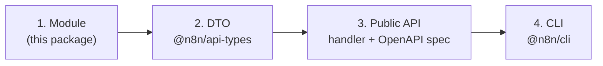

# n8n-packages module — Agent Guidelines

This module powers package **import/export** (`.n8np`). The feature is
**public-API-first; the CLI wraps the API.** A single import/export option
therefore lives in up to four layers across three packages.

## ⚠️ Propagate new properties through every layer

**When you add, rename, or remove a property on the import or export request,
carry it through all four layers below.** A property that stops at the module
is invisible to public-API and CLI users — and an out-of-date OpenAPI spec or
CLI flag is a silent bug, not a compile error.

### Importer rules
- Importers **plan and decide**; they must never touch a repository directly. All persistence and
  lookups go through a **service**.
- Prefer an **existing** domain service from the main n8n codebase (`FolderService`, `ProjectService`,
  `WorkflowService`, …). When the importer needs a capability the service lacks — reusing a source id,
  or a fetch-by-ids for matching — **extend that existing service with a general method** rather than
  reaching for the repository or spinning up an import-only service. Canonical examples:
  `ProjectService.createTeamProject(data, overrides)` (preset id + description) and
  `FolderService.createFolder(dto, projectId, id?)` / `FolderService.getFoldersByIds(ids)`.
- `N8nPackagesService.importPackage` is a thin **dispatcher**: it builds the reader, reads the manifest,
  and delegates to a per-package-shape importer. Shapes mirror export's mutual exclusivity — a **project
  package** (projects defined by the package) → `ProjectPackageImporter`, or a **workflow package** (loose
  workflows + their folder shells + credential deps into a target project) → `WorkflowPackageImporter`.
- `WorkflowPackageImporter` resolves the target scope from the request, then delegates the plan/gate/apply
  work to `ImportOrchestrator` (brings folders + workflows + credential deps into one project scope).
  `ProjectPackageImporter` creates the project shells; reusing `ImportOrchestrator` for a project's own
  contents is a follow-up. Don't split folder vs workflow: they share target resolution, credential
  resolution, and publishing.

### Adding an IMPORT property

1. **Module** (here)
   - `n8n-packages.types.ts` — add the field to `ImportPackageRequest`
     (or `ImportWorkflowProperties` / `ImportCredentialProperties`). For a new
     enum, add a `XxxPolicy` / `XxxMode` const **and** its derived type
     (follow `WorkflowIdPolicy`). New single-value modes are RFC seams — keep
     the function-table convention (`workflow-conflict-policy.ts` etc.), don't
     add handler classes for pure logic.
   - Implement the behaviour (e.g. `entities/workflow/workflow-importer.ts`)
     and thread it through `n8n-packages.service.ts` `importPackage`.
2. **DTO** — `@n8n/api-types/src/dto/packages/import-package-request.dto.ts`
   - Add the field to `ImportPackageRequestDto` (zod), **and** add its name to
     `IMPORT_PACKAGE_REQUEST_FORM_FIELDS` (multipart text fields).
   - Update `__tests__/import-package-request.dto.test.ts`.
3. **Public API** — `packages/cli/src/public-api/v1/handlers/n8n-packages/`
   - `n8n-packages.handler.ts` — pass `payload.data.<field>` into the service.
   - `spec/paths/n8n-packages.import.yml` — add the property to the inline
     `multipart/form-data` request schema (type/enum/description; update
     `required` if needed). **Easy to forget — the spec is hand-written.**
4. **CLI** — `packages/@n8n/cli/`
   - `src/client.ts` — add to `ImportPackageFields`.
   - `src/commands/package/import.ts` — add a `Flags.string({...})` (with a
     kebab-case alias) and pass it into `client.importPackage(...)`.
   - `docs/commands/package.md` + the `README.md` flag table.

### Adding an EXPORT property

1. **Module** — `n8n-packages.types.ts` `ExportPackageRequest`; implement in
   `n8n-packages.service.ts` `exportPackage` (+ `io/` writer or
   `entities/*/` exporter as needed).
2. **DTO** — `@n8n/api-types/src/dto/packages/export-package-request.dto.ts`
   (`ExportPackageRequestDto`, zod).
3. **Public API** — `n8n-packages.handler.ts` `exportPackage` reads from
   `payload.data`; update the **separate** schema file
   `spec/schemas/exportPackageRequest.yml` (export's request schema is a
   `$ref`, unlike import's inline schema).
4. **CLI** — `src/client.ts` `exportPackage(...)`,
   `src/commands/package/export.ts` flag, and the docs/README.

## Reference: the `workflowIdPolicy` change

The in-tree addition of `workflowIdPolicy` is the canonical example — it landed
in the module types + importer, the DTO (+ form-fields list), the handler, and
the CLI. Grep `workflowIdPolicy` to see every site a new import knob must touch.
