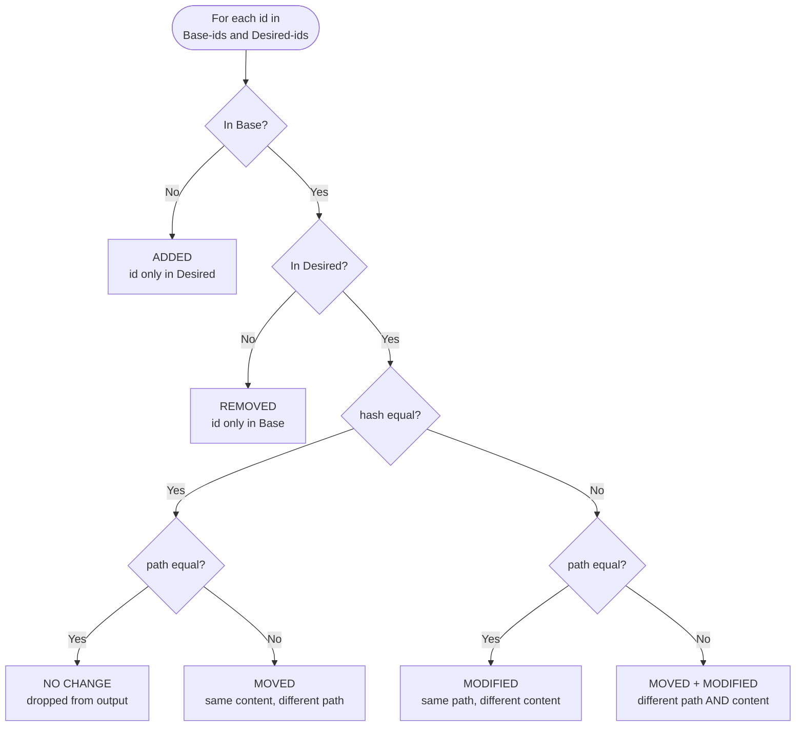

# Promotion diff engine — design and POC status

Status: spike. Branch `promotion-diff-engine-poc`. Nothing here is the real feature yet.

## Context

The promotion feature moves n8n instance content through git. We need a diff
engine. The engine compares an instance's current state to a git ref. It
reports what changed. The UI uses this to build a "select changes" list. The
binding-resolution step uses it to find new credentials and variables.

This design does not build on two things:
- `source-control.ee` (the shipped source-control feature). Its status logic
  is bespoke per entity type and has known O(n²) spots.
- `ligo-885-workflow-promotion-poc` (an experimental, no-changelog branch).

This design does reuse `n8n-packages` (this module) as a library — its
serializers and requirements extractors are real, shipped code.

## Terminology

| Term | Meaning |
| --- | --- |
| Base | The current state, recorded in git. |
| Desired | The state you want to reach. |

The role of "git" and "instance" swaps with direction. On push, Base is git
and Desired is the live instance. On pull, Base is the live instance and
Desired is the incoming git ref.

## Outputs

The engine reports these statuses for each entity:

1. Created
2. Deleted
3. Modified
4. Moved

Internally, the engine also tracks "moved + modified" (both a path change and
a content change). For now, the UI has no separate "Moved" badge. The engine
folds `moved` and `moved+modified` into `modified` in its external output. It
keeps the real classification in an internal field, for later use.

## Assumptions

- We only need to know THAT an entity changed. We do not need to know WHAT
  changed inside it. The existing two-JSON-object workflow differ already
  handles that, on click, for workflows specifically.
- The engine does a full export on every call in v1. It does not do an
  incremental diff. Incremental is a valid v2 optimization (see Option 2
  below), not required now.
- The POC covers workflows only. Other entity types use the same join. Most
  types join by `id`. Variables join by `name` — `$vars.name` resolves
  per-instance, so no id can travel with a variable across instances.
- The file path convention `<slug>-<id>.json` is tracked under its own,
  separate ticket. This design stubs that convention; it does not build it.
- We drop version-counter display data ("v11 → v14") from scope. The real
  `versionCounter` field is excluded from exported content anyway, so this
  data cannot come from diffing file content in any case.
- The engine does not do 3-way conflict detection. If a destination instance
  drifts locally after the last sync, a pull's 2-way diff cannot tell that
  apart from a legitimate source-side change — both just read as `modified`.
  `InstanceWriteAccessService` and `branchWriteAccessMiddleware` already
  exist and already protect data tables this way, but nothing wires them to
  workflow/credential/folder/tag writes yet. Decide later: extend that
  protection to promoted entity types (prevents drift), or accept the risk
  for v1 (detects nothing).

## Algorithm — Option 1: serialize and hash



Steps:

1. Build the Base map. Run `git ls-tree -r <ref>`. This gives `{path,
   blob-sha}` for every file. It reads no file content. Parse the entity id
   from each path's last 16 characters (`generateNanoId()` uses a fixed
   16-character, alphanumeric-only alphabet — the parse is exact, not a
   heuristic).
2. Build the Desired map. Query the DB for everything in scope. Serialize
   each row with the real serializer. Format the result exactly as the
   exporter writes it: `JSON.stringify(serialized, null, '\t')`. Hash those
   bytes with git's own blob format:
   `sha1("blob " + byteLength + "\0" + content)`. This hash is directly
   comparable to Base's blob-shas — the engine never reads Base's file
   content.
3. Join by id (by name for variables) over the union of both maps' keys.
   Classify per the diagram above.
4. For changed workflows, attach dependency data using the existing
   requirements extractors (`entities/*/​*-requirements.extractor.ts`). These
   extractors already read a workflow's own `nodes`/`connections` content —
   they do not need a manifest.
5. Return a flat list: `{id, type, name, status, oldPath?, newPath?,
   dependencies?}`.

### Byte-identical output is the contract

The engine hashes the bytes the exporter would write. Any difference —
indentation, key order, a trailing newline — makes every entity read as
`modified`. Today each exporter formats its JSON inline with
`JSON.stringify(x, null, '\t')`; the engine must not re-implement that by
hand. When the real module lands, extract one shared function in `io/` and
call it from the exporters and the engine. Key order needs no separate
canonicalisation step: the serializer builds each object in code, so its key
order is fixed for a given release. A serializer change that reorders keys
shows every entity as `modified` once, which is visible and acceptable.

### Why not `git diff`

`git diff --no-index` needs no repo and no history, so it was an early
candidate. We rejected it: it adds a subprocess dependency and an unusual
exit-code convention (1 means "there are differences," not "it failed") for
a step that is pure logic once both sides are on disk. It also has no reason
to run rename detection here (see below), so it earns nothing over a plain
hash-map join.

### Why id-keyed, not path-keyed

Every entity's id lives in the path now (`<slug>-<id>.json`). Keying the
comparison on path, instead of id, breaks move detection: a renamed entity's
path changes, so a path-keyed join sees an old path with no match (looks
deleted) and a new path with no match (looks created) — a false delete +
create pair for the same entity. Keying on id avoids this: the same id at a
different path is a real match, classified as `moved`.

This also means the engine does not use git's own `-M` rename-detection
heuristic. That heuristic guesses renames by content similarity, because raw
git blobs carry no identity. Our entities already carry a stable id, so the
match is exact, not probabilistic — and it has no equivalent to git's default
rename-detection cutoff (`diff.renameLimit`, ~1000), which a large reorg
could hit at a 3000-workflow scale.

## Determinism

This answers question 1 of the spike: do repeated exports of an unchanged
workflow produce identical files, and which fields wobble?

- Repeated exports of an unchanged workflow produce identical bytes. The POC
  tests this.
- A save that changes no content does not change the hash. The POC tests
  this by bumping `versionCounter` and `triggerCount` (which also bumps
  `updatedAt`) and re-hashing.
- `WorkflowSerializer` excludes `createdAt`, `updatedAt`, `versionCounter`,
  `triggerCount`, `staticData`, `meta`, `pinData` and `activeVersion`.
- `versionId` is included, but `WorkflowService.update` only regenerates it
  when `nodes`, `connections` or `nodeGroups` differ by deep-equal. A save
  with unchanged content keeps the old value.
- `isPublished` (`activeVersionId === versionId`) is included. Publish or
  unpublish flips it, so the workflow reads as `modified`. That is a real
  state change for promotion; decide in LIGO-1050 whether the UI needs to
  label it differently.

## Alternatives considered

- **Option 2 — timestamp pre-filter.** Track one timestamp per connector: the
  last sync time. Query `WHERE updatedAt > lastSyncTimestamp` before
  serializing, and only serialize+hash that candidate set. Cheap, and safe —
  a stale or missing timestamp just means "diff everything," never a false
  negative. Worth adding later on top of Option 1.
- **Option 3 — event log / changelog.** Hook into save/update/delete events;
  diff becomes "read the log since last sync." Cost scales with actual
  changes, not corpus size. Risk: correctness depends on the log never
  missing an event (a bulk migration, a direct DB write, a restored backup
  can all cause a silent gap). Option 1 recomputes from nothing every time
  and cannot accumulate drift; an event log can. Not recommended for v1.
- **Option 4 — real git tree objects + `git diff-tree`.** Write the Desired
  side as real git blob/tree objects (no working-tree checkout), then diff
  two tree objects natively. Gets git's Merkle-tree subtree pruning for
  free. Still has to hash every entity once to know if its object already
  exists, so the win only shows up on deeply-nested unchanged subtrees. Not
  worth the added complexity (throwaway object management) at a
  3000-workflow scale. Revisit only if scale grows an order of magnitude.

Not worth considering, for completeness: bloom filters (a plain `Map` lookup
is already O(1) at this scale) and rsync-style rolling-checksum diffing
(solves "which bytes changed" — a problem we explicitly do not have, per the
Assumptions above).

## Scope decisions

- New module. Not an extension of `source-control.ee`.
- Consumes `n8n-packages` (this module) as a library: serializers, and the
  requirements extractors for dependency data.
- Once real, this module should follow this module's own layering
  convention (module → DTO in `@n8n/api-types` → public API → CLI) — see
  this directory's own `CLAUDE.md`.

## Surfacing to the UI

Proposed response DTO, scoped to workflows for now:

```ts
type DiffEntry = {
  id: string;
  type: 'workflow';
  name: string;
  status: 'created' | 'modified' | 'deleted'; // moved folds into modified
  dependencies?: { credentials: string[]; variables: string[]; tags: string[] };
};
```

Open question, not yet decided: does the real endpoint return this list
directly, or does the UI need something more (pagination, a separate
dependency-lookup call)? Not resolved yet — resolve before building the real
endpoint.

## POC status

Engine: `packages/cli/src/modules/n8n-packages/diff/diff-engine.ts`. Four pure
functions with no dependencies beyond `node:crypto`: `parseIdFromPath`,
`gitBlobHash`, `parseLsTree` (raw `git ls-tree -r` text to the Base map), and
`diffSnapshots` (the join and classification).

Test: `packages/cli/src/modules/n8n-packages/__tests__/diff-engine-poc.integration.test.ts`.

Two tests pass. The first covers all 6 classifications: created, deleted,
modified, moved, moved+modified, and unchanged (dropped from output). The
second covers determinism (see above) and proves the engine's hash of the
live workflow equals the blob sha git recorded for the exporter's file.

The Base side is written by the real `WorkflowExporter` through the real
`DirectoryPackageWriter`. The Desired side is the real `WorkflowSerializer`
output, formatted as the exporter formats it. The git repository is a real
temp repository (via `simple-git`) — nothing here is mocked. Path generation
is stubbed (see Assumptions above) — it is not the real `<slug>-<id>.json`
implementation.

Run it from `packages/cli`:

```
pnpm test:integration src/modules/n8n-packages/__tests__/diff-engine-poc.integration.test.ts
```

## Open follow-ups

1. Decide the write-lock extension for protected destinations (see
   Assumptions above).
2. Confirm `<slug>-<id>.json` lands consistently across all entity exporters
   (tracked on a separate ticket, referenced above).
3. Manifest generation at import time is a dependency of this design. It is
   out of scope here — it belongs to the import side
   (`ligo-968-import-overwrite-from-filefolders-in-directory`).
4. Resolve the open "surfacing to the UI" question above before building the
   real endpoint.
5. Extend the POC to the other entity types (credentials, tags, folders,
   projects, data tables — all id-keyed; variables name-keyed) once the
   workflow case is validated in the real module.
6. Extract one shared JSON file-content function in `io/` and use it from
   every exporter and from the engine (see "Byte-identical output is the
   contract").
