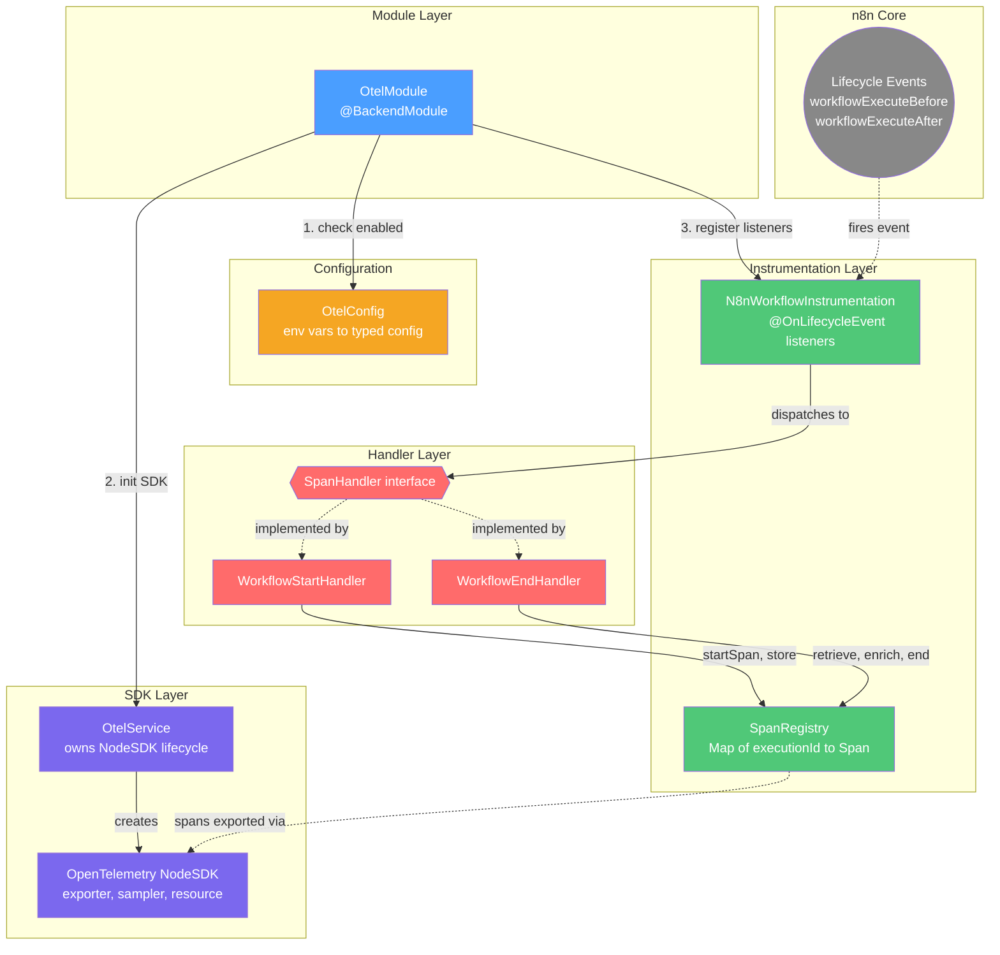

## Workflow level OTEL
This module enables workflow level telemetry

The module should work in complete isolation - plugging into n8n to add tracing. When switched off no otel items should be loaded

It is based upon and an extension of the work done in the community by:
@gabrielhmsantos - https://github.com/gabrielhmsantos/n8n-tracekit

### Testing
Given OTEL often involves events triggered from elsewhere within the n8n system integration testing is preferred.

### Attributes
All attributes are listed in `otel.constants.ts`

### Module architecture


#### Manual validation
1. Create docker-compose files and start them `docker-compose up -d`
	 `docker-compose.yml`
```yaml
services:
  jaeger:
    image: jaegertracing/jaeger:latest
    ports:
      - "16686:16686" # UI
      - "4317:4317"   # OTLP gRPC
      - "4318:4318"   # OTLP HTTP
    command: ["--config", "/etc/jaeger/config.yaml"]
    volumes:
      - ./jaeger-config.yaml:/etc/jaeger/config.yaml:ro
```

`jaeger-config.yaml`
```yaml
service:
  extensions: [jaeger_storage, jaeger_query]
  pipelines:
    traces:
      receivers: [otlp]
      exporters: [jaeger_storage_exporter]

extensions:
  jaeger_storage:
    backends:
      memory:
        memory:
          max_traces: 1000
  jaeger_query:
    storage:
      traces: memory
    ui:
      config_file: ""

receivers:
  otlp:
    protocols:
      grpc:
        endpoint: 0.0.0.0:4317
      http:
        endpoint: 0.0.0.0:4318

exporters:
  jaeger_storage_exporter:
    trace_storage: memory
```

Start n8n & point it at the jaeger instance
```
cd packages/cli
N8N_OTEL_ENABLED=true N8N_OTEL_EXPORTER_OTLP_ENDPOINT=http://127.0.0.1:4318 pnpm run dev
```
