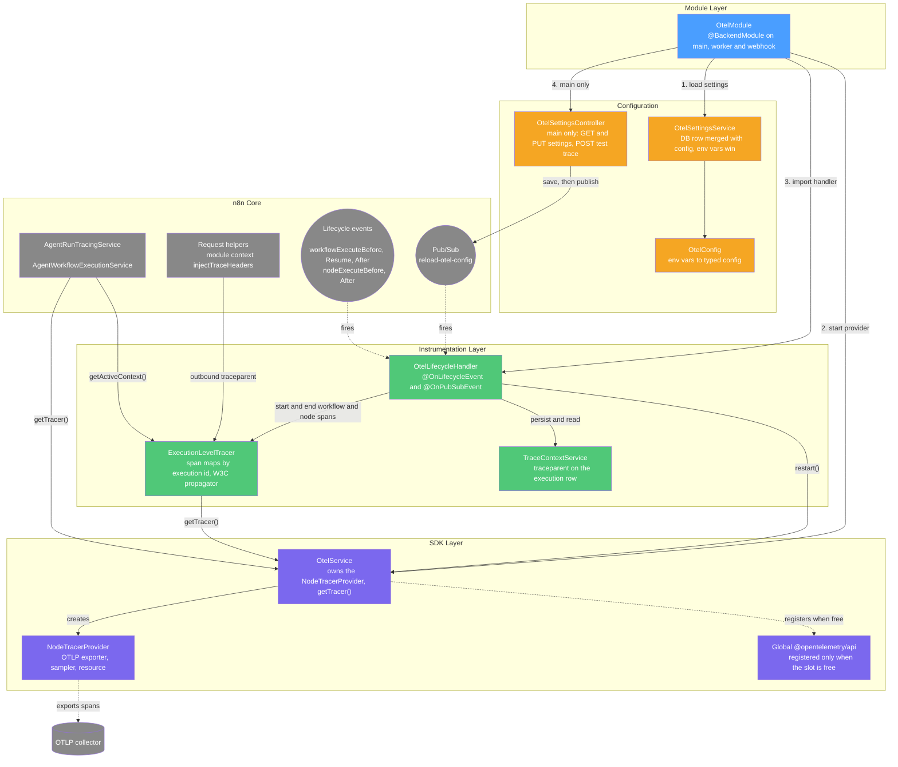

## Workflow level OTEL
This module enables workflow level telemetry

The module should work in complete isolation - plugging into n8n to add tracing. When switched off no otel items should be loaded

It is based upon and an extension of the work done in the community by:
@gabrielhmsantos - https://github.com/gabrielhmsantos/n8n-tracekit

### Testing
Given OTEL often involves events triggered from elsewhere within the n8n system integration testing is preferred.

### Attributes
All attributes are listed in `otel.constants.ts`

### Global API ownership

`OtelService` starts a `NodeTracerProvider` and hands out tracers through `getTracer()`.
The module's own spans never depend on the global `@opentelemetry/api` registry.

At start, the service checks whether another library already registered a global tracer
provider. Sentry does this in `ErrorReporter.init`. A user SDK loaded with `--require` does
it too.

- The slot is free: the service registers its provider, an `AsyncLocalStorageContextManager`
  and the default W3C propagators. A restart swaps only the tracer provider. Shutdown leaves
  the globals in place.
- The slot is taken: the service keeps its provider private and logs one info line. It never
  disables or replaces the other library's globals.

Consequences:

- Workflow spans go to the module exporter only. To get them into Sentry, point the OTel
  settings at Sentry's OTLP endpoint.
- Workflow root spans start on `ROOT_CONTEXT`. They never join a trace that is active in the
  process, such as a Sentry request span or an HTTP server span from a user SDK. An inbound
  `traceparent` header still sets the parent.
- Persisted trace context and outbound headers always use the W3C `traceparent` and
  `tracestate` format, whoever owns the global propagator. `OTEL_PROPAGATORS` has no effect
  on them.
- The resource uses the env, process and host detectors. `OTEL_NODE_RESOURCE_DETECTORS` has
  no effect.

### Module architecture

```mermaid
graph TD
    subgraph Module Layer
        MOD["OtelModule
        @BackendModule on main, worker and webhook"]
    end

    subgraph Configuration
        CFG["OtelConfig
        env vars to typed config"]
        SET["OtelSettingsService
        DB row merged with config, env vars win"]
        CTRL["OtelSettingsController
        main only: GET and PUT settings, POST test trace"]
    end

    subgraph SDK Layer
        SVC["OtelService
        owns the NodeTracerProvider, getTracer()"]
        SDK["NodeTracerProvider
        OTLP exporter, sampler, resource"]
        API["Global @opentelemetry/api
        registered only when the slot is free"]
    end

    subgraph Instrumentation Layer
        LCH["OtelLifecycleHandler
        @OnLifecycleEvent and @OnPubSubEvent"]
        ELT["ExecutionLevelTracer
        span maps by execution id, W3C propagator"]
        TCS["TraceContextService
        traceparent on the execution row"]
    end

    subgraph n8n Core
        LC(("Lifecycle events
        workflowExecuteBefore, Resume, After
        nodeExecuteBefore, After"))
        PUB(("Pub/Sub
        reload-otel-config"))
        REQ["Request helpers
        module context injectTraceHeaders"]
        AGT["AgentRunTracingService
        AgentWorkflowExecutionService"]
    end

    COL[("OTLP collector")]

    MOD -- "1. load settings" --> SET
    SET --> CFG
    MOD -- "2. start provider" --> SVC
    SVC -- "creates" --> SDK
    SVC -. "registers when free" .-> API
    MOD -- "3. import handler" --> LCH
    MOD -- "4. main only" --> CTRL
    CTRL -- "save, then publish" --> PUB
    PUB -. "fires" .-> LCH
    LCH -- "restart()" --> SVC

    LC -. "fires" .-> LCH
    LCH -- "start and end workflow and node spans" --> ELT
    LCH -- "persist and read" --> TCS
    ELT -- "getTracer()" --> SVC
    REQ -- "outbound traceparent" --> ELT
    AGT -- "getActiveContext()" --> ELT
    AGT -- "getTracer()" --> SVC
    SDK -. "exports spans" .-> COL

    classDef module fill:#4a9eff,color:#fff
    classDef config fill:#f5a623,color:#fff
    classDef sdk fill:#7b68ee,color:#fff
    classDef inst fill:#50c878,color:#fff
    classDef core fill:#888,color:#fff

    class MOD module
    class CFG,SET,CTRL config
    class SVC,SDK,API sdk
    class LCH,ELT,TCS inst
    class LC,PUB,REQ,AGT,COL core
```

#### Manual validation
1. Create docker-compose files and start them `docker-compose up -d`
	 `docker-compose.yml`
```yaml
services:
  jaeger:
    image: jaegertracing/jaeger:latest
    ports:
      - "16686:16686" # UI
      - "4317:4317"   # OTLP gRPC
      - "4318:4318"   # OTLP HTTP
    command: ["--config", "/etc/jaeger/config.yaml"]
    volumes:
      - ./jaeger-config.yaml:/etc/jaeger/config.yaml:ro
```

`jaeger-config.yaml`
```yaml
service:
  extensions: [jaeger_storage, jaeger_query]
  pipelines:
    traces:
      receivers: [otlp]
      exporters: [jaeger_storage_exporter]

extensions:
  jaeger_storage:
    backends:
      memory:
        memory:
          max_traces: 1000
  jaeger_query:
    storage:
      traces: memory
    ui:
      config_file: ""

receivers:
  otlp:
    protocols:
      grpc:
        endpoint: 0.0.0.0:4317
      http:
        endpoint: 0.0.0.0:4318

exporters:
  jaeger_storage_exporter:
    trace_storage: memory
```

Start n8n & point it at the jaeger instance
```
cd packages/cli
N8N_OTEL_ENABLED=true N8N_OTEL_EXPORTER_OTLP_ENDPOINT=http://127.0.0.1:4318 pnpm run dev
```

### Wire protocol (OTLP/HTTP vs OTLP/gRPC)

`N8N_OTEL_EXPORTER_OTLP_PROTOCOL` selects how spans are delivered. It mirrors the
upstream `OTEL_EXPORTER_OTLP_PROTOCOL` spec and accepts:

| Value                     | Exporter                                   | Conventional port |
| ------------------------- | ------------------------------------------ | ----------------- |
| `http/protobuf` (default) | `@opentelemetry/exporter-trace-otlp-proto` | 4318              |
| `grpc`                    | `@opentelemetry/exporter-trace-otlp-grpc`  | 4317              |

```
cd packages/cli
N8N_OTEL_ENABLED=true \
  N8N_OTEL_EXPORTER_OTLP_PROTOCOL=grpc \
  N8N_OTEL_EXPORTER_OTLP_ENDPOINT=http://127.0.0.1:4317 \
  pnpm run dev
```

Notes:

- Pick `grpc` only when the collector requires it (or for high span volume through
  infrastructure that passes HTTP/2 through cleanly). `http/protobuf` traverses
  proxies and firewalls more reliably and is easier to debug.
- The endpoint scheme controls TLS for **both** protocols: `https://` uses TLS,
  `http://` does not. There is no `grpc://` scheme.
- Because the scheme is load-bearing, `N8N_OTEL_EXPORTER_OTLP_ENDPOINT` must be an
  `http://` or `https://` URL. n8n logs a warning and uses the default endpoint if
  the value has another scheme or no scheme, e.g. `localhost:4318`. The scheme is
  matched case-insensitively, and n8n lowercases it before it reaches the exporter.
- gRPC endpoints take **no URL path**, so `N8N_OTEL_EXPORTER_OTLP_TRACING_PATH` is
  ignored when the protocol is `grpc`.
- `N8N_OTEL_EXPORTER_OTLP_HEADERS` entries are sent as gRPC metadata. Keys are
  lowercased (gRPC metadata keys are lowercase ASCII); an entry grpc-js rejects is
  skipped with a warning instead of failing startup.
- The startup connectivity check waits for a grpc-js channel to become ready for
  `grpc` (an HTTP `HEAD` request is meaningless against an HTTP/2-only server).
  The channel dials the host and port of the endpoint, so readiness proves TCP,
  the TLS handshake for `https://`, and an HTTP/2 connection. It is not proof that
  OTLP/gRPC is served there — use "Send test trace" in Settings → OpenTelemetry
  for the real check.
- An endpoint without a port dials the grpc-js default port 443, not 4317. Always
  give the port, e.g. `http://127.0.0.1:4317`.
- The check uses the default TLS trust store. It does not use the certificate
  material that the exporter reads from `OTEL_EXPORTER_OTLP_CERTIFICATE`,
  `OTEL_EXPORTER_OTLP_CLIENT_KEY` and `OTEL_EXPORTER_OTLP_CLIENT_CERTIFICATE`, so a
  collector behind a private CA, or one that needs mTLS, can fail the check and
  still receive spans.
- n8n has no setting for a custom CA or mTLS. Use the upstream
  `OTEL_EXPORTER_OTLP_*` certificate variables above, or `NODE_EXTRA_CA_CERTS`.
