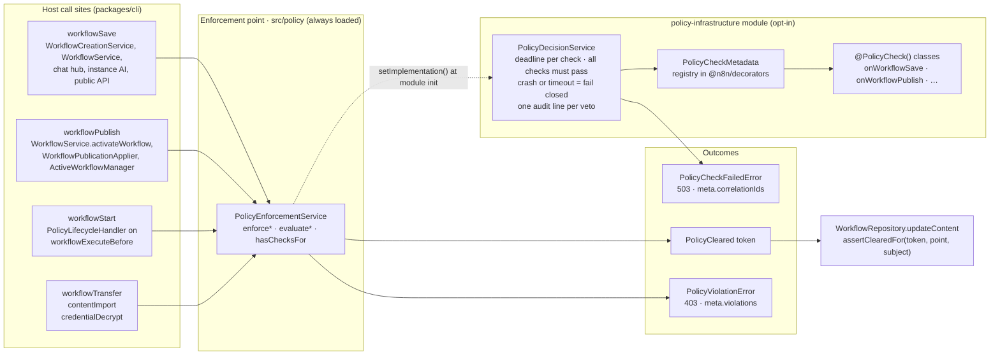
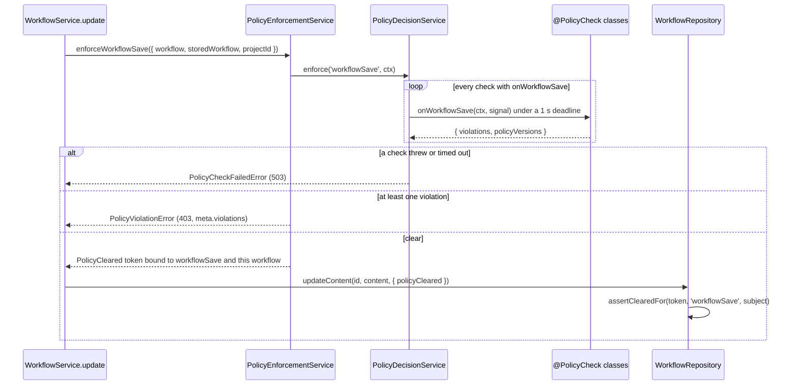

# Policy infrastructure module

The shared layer that every policy feature is built on. It runs the registered
`@PolicyCheck()` classes at fixed points in n8n and turns their answers into one
of three outcomes: cleared, blocked by policy, or blocked because a check failed.

The module holds no policy of its own. A policy feature adds a check class and a
store for its rules. It does not add an enforcement path, an error shape, or an
audit gap.

Why these six points, why every check must pass, and why a check that does not
answer blocks: read the policy infrastructure RFC in Notion. This README is the
working reference for writing a check. It does not restate the RFC.

Opt-in while it is built out: `N8N_ENABLED_MODULES=policy-infrastructure`.
With the module off, nothing is checked and everything is allowed. That is the
documented break-glass lever.

## Architecture



Without the module, `PolicyEnforcementService` has no implementation. `enforce*`
then returns a cleared token and `evaluate*` returns an empty decision. A feature
that is absent is not a security failure.

## One save, end to end



`storedWorkflow` is loaded from the database by the host, never taken from the
request. A check can compare it with `workflow` to judge only what the save adds.

## Enforcement points

| Point | Deadline | Subject the token binds to | Where it fires |
|---|---|---|---|
| `workflowSave` | 1000 ms | row id, or node hash for a create | editor, public API, chat hub, instance AI, eval thread restore |
| `workflowPublish` | 1000 ms | row id | activate, publication applier, activation on startup |
| `workflowStart` | 250 ms | row id | `workflowExecuteBefore` on main, workers, sub-executions, manual runs |
| `workflowTransfer` | 1000 ms | row id | move to another project |
| `contentImport` | 1000 ms | row id | CLI import, source control import, package and git-connection import |
| `credentialDecrypt` | 250 ms | credential id | credential resolution during a run or a test |

Deadlines are tight on the two points that sit inside a running execution. A
wedged policy store there pins worker slots instead of failing one request.

## Contexts

Each point hands its check a different context. The types are in
`@n8n/decorators/src/policy-check/policy-check.ts`.

| Point | Context type | Fields |
|---|---|---|
| `workflowSave` | `WorkflowSaveContext` | `workflow`, `storedWorkflow` (`null` for a create), `projectId` |
| `workflowPublish` | `WorkflowPublishContext` | `workflow`, `projectId` |
| `workflowStart` | `WorkflowStartContext` | `workflow`, `projectId` |
| `workflowTransfer` | `WorkflowTransferContext` | `workflow`, `targetProjectId` — the project it moves *into*, whose policy applies |
| `contentImport` | `ContentImportContext` | `workflow`, `projectId`, `transport` |
| `credentialDecrypt` | `CredentialDecryptContext` | `credentialType`, `credentialId`, `consumer` (`null` for a credential test), `projectId` |

`workflow` is a `PolicedWorkflow`: `id` (`null` before the first save), `name`,
`nodes`. Nothing else, so a check cannot start to depend on unrelated fields.
Every field is `readonly` — a check reads, it never writes.

`transport` is `cli`, `source-control`, `package`, or `git-connection`. Read it
to hold an unattended sync to a different standard than a hand-run import. The
host reads it too, to pick its fail posture: a package import refuses the whole
package, a source-control pull skips and reports the workflow.

## Fail posture

- **No check registered for a point:** allowed.
- **A check returns violations:** `PolicyViolationError`, HTTP 403. Every violation
  from every check is in `meta.violations`, so a user fixing a workflow sees the
  whole list. On `workflowStart` the run is stored as `error` with the same
  violations on `resultData.error`.
- **A check throws or overruns its deadline:** `PolicyCheckFailedError`, HTTP 503.
  Check internals never reach the response. The `correlationIds` tie the response
  to the server log lines that hold the real errors.
- **`evaluate*` (advisory):** never throws and never mints. A failed check lands
  in `checkErrors` next to the other results, so a crash never reads as "no
  violations".

## The decision audit line

Every veto writes one line, from one place: `PolicyDecisionService.audit`. A policy
feature gets uniform enforcement logging without building any. If SIEM-forwardable
enforcement events are wanted later, they land here too.

```
warn  Policy blocked workflowSave  {
  "point": "workflowSave", "outcome": "violation", "durationMs": 12,
  "checkIds": ["node-types"],
  "violations": [{ "checkId": "node-types", "kind": "node-type-unavailable",
                   "subject": "n8n-nodes-base.slack", "subjectType": "nodeType",
                   "scope": "instance", "matchedRuleId": "rule-7" }],
  "policyVersions": [{ "scope": "instance", "version": 4 }],
  "workflowId": "wf-1", "workflowName": "My workflow", "projectId": "proj-1",
  "scopes": ["policy"]
}
```

- **Both ways of blocking write a line.** A violation gives `outcome: "violation"`.
  A check that threw or overran gives `outcome: "checkFailure"` with `correlationIds`,
  which tie it to the per-check error lines holding the real errors.
- **`evaluate*` writes nothing.** Previews must not pollute the trail.
- **The violation `message` is not on the line.** It is free text saying what the
  structured fields already say.
- **A create has no `workflowId`.** It logs `null` and the name instead. The line does
  not reproduce the `PolicyCleared` subject, which hashes a create's content — that is
  the enforcement point's to compute, and mirroring it here would let the two drift.
- **`warn`, not `info`**, so the line survives an operator quietening logs. It matches
  the `warning` level `PolicyViolationError` already gives itself.

Two logging facts to know before relying on this:

- **The default text format prints the message only.** The structured half needs
  `N8N_LOG_FORMAT=json`, file output, or `debug` level. The message names the point on
  its own for that reason.
- **`N8N_LOG_SCOPES` can drop the line.** A configured scope set drops every line
  outside it, unscoped lines included, so no log line is immune. `N8N_LOG_SCOPES=policy`
  is the switch that keeps only these.

Policy *mutation* audit — who changed a policy — is a different surface, owned by the
feature that has a policy to mutate, on the existing audit-event infrastructure.

## The seal

A cleared write needs a `PolicyCleared` token minted by the enforcement point.
`WorkflowRepository.updateContent` and its siblings call `assertClearedFor`, which
checks that the token exists, was minted for this point, and binds to this
subject. Only `PolicyEnforcementService` may import the minter; a lint rule
enforces that.

A second lint rule, `no-unsealed-workflow-entity-write`, flags direct
`save`/`insert`/`update`/`upsert` calls on `WorkflowEntity` in runtime code. It is
syntactic. It catches `save({ id, nodes })` and `update(id, { nodes })`, not a
payload built off-site or an aliased receiver. The runtime check is the enforcing
half.

## Add a check

```typescript
@PolicyCheck()
export class NodeTypePolicyCheck implements RegisteredPolicyCheck {
	readonly id = 'node-type-availability';

	async onWorkflowSave({ workflow, storedWorkflow, projectId }: WorkflowSaveContext, signal: AbortSignal) {
		return { violations: await this.violationsFor(workflow, storedWorkflow, projectId, signal) };
	}
}
```

Rules:

- Report violations. Do not throw for them. A throw means the check broke.
- Read state only. `evaluate*` must be safe to call from advisory UI.
- Implement only the points you need. An `on*` method that matches no point is a
  startup error.
- Pass `signal` to anything that accepts it. The deadline holds either way, but the
  signal lets the check stop its own work.

Import the file for its side effect from the module that owns the feature. The
registry is read on every decision, so load order cannot hide a check.

## Files

| File | Role |
|---|---|
| `policy-infrastructure.module.ts` | Registers `PolicyDecisionService` into the enforcement point and loads the lifecycle handler |
| `policy-decision.service.ts` | Runs the checks with deadlines, combines their results, and emits the audit line |
| `policy-decision-audit.ts` | The audit line's shape and how it reads a target off each context |
| `policy-lifecycle-handler.ts` | The `workflowStart` host, one hook for every way an execution starts |
| `policy-check-failed.error.ts` | The 503 for a check that did not answer |
| `../../policy/policy-enforcement.service.ts` | The enforcement point the hosts call, always loaded |
| `../../policy/policy-violation.error.ts` | The 403 that carries `meta.violations` |
| `../../policy/policy-enforcement-backend.ts` | The interface `PolicyDecisionService` implements and the module registers |
| `@n8n/decorators/src/policy-check/` | `@PolicyCheck()`, the registry, the contexts, the `PolicyCleared` token |
