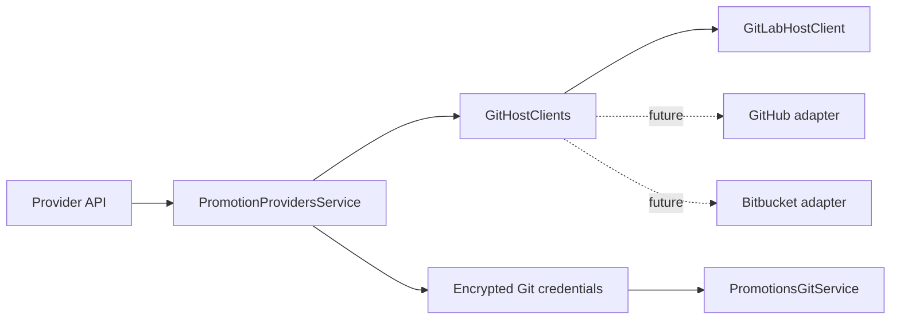

# Git host adapters

Providers own authentication and host configuration. Connections own repository
targets. Promotion configs own branches. Keep this separation when adding a host.

## Adapter contract

`GitHostClient` validates authenticated API access and lists repositories.
An adapter converts host responses into `PromotionRepository` values. It returns
credential-free clone URLs. It maps public paging and search to its host API.
The provider service does not read host response fields or build API requests.

Git operations use the existing username and password payload. Shared provider
capabilities define the transport username when the host needs a fixed value.
A null username means the user supplies it. Tokens stay encrypted at rest.

## Add another host

1. Add the provider type and its capabilities in `@n8n/api-types`.
2. Add a database migration for the provider type constraint.
3. Implement `GitHostClient` with `@n8n/backend-network`.
4. Register the adapter in the typed `GitHostClients` map.
5. Add the provider label and setup copy in the typed frontend maps.
6. Test validation, repository paging, and Git transport with the host.

The typed maps require an entry for each host. Connections, project assignment,
promotion, and apply do not need a host-specific branch.

Do not add methods for future features before a caller needs them. Add a separate
capability interface for merge requests or other optional host features.

## GitLab setup

Use the GitLab base URL and an access token. Use a group access token for
self-managed automation. A personal access token uses the same code path.
Grant `read_api` and `write_repository`. Protected branches can require the
Maintainer role. Merge Request operations are not part of this adapter yet.

The API client keeps certificate verification enabled. Configure the Node trust
store for an internal certificate authority. The Git transport supports
`GIT_SSL_CAINFO` and `GIT_SSL_CAPATH`. Configure both clients to trust the host.
