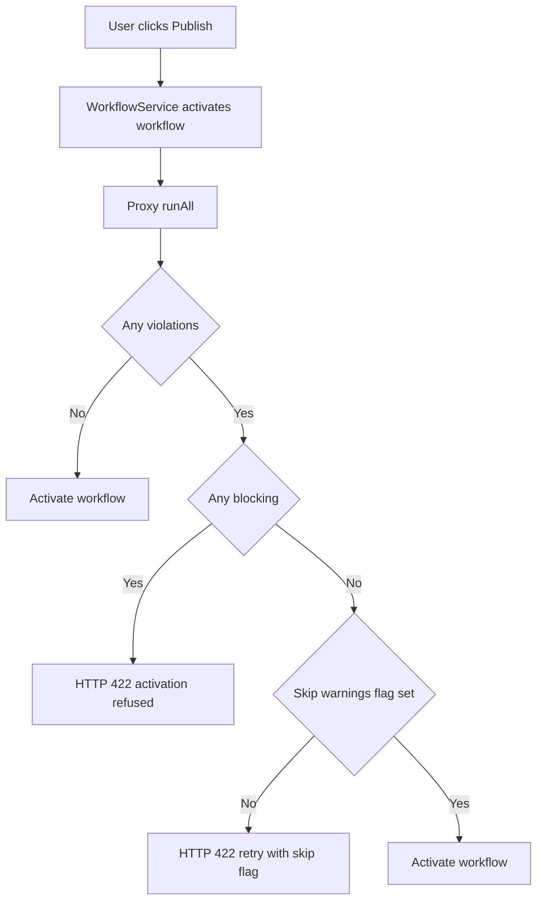

# workflow-authoring-checks

Pre-publish lint-like checks for workflows. A check inspects a workflow draft
(nodes, connections, settings) and reports violations with one of two
severities:

- `warning` — the user may still publish ("publish anyway").
- `blocking` — the user must resolve the violation before publishing.

"Publish" means activation; the check pipeline runs whenever a workflow is
activated or explicitly previewed from the editor.

## Publish flow



## Check types vs. check instances

The module separates **what a check does** from **how it is configured**:

- **Check type** (`WorkflowCheckType`) — the behaviour. Registered in the
  in-memory registry at boot. Declares a `type` key, a title/description, a
  `defaultSeverity`, a `configSchema` that the UI turns into a form, and the
  `evaluate(ctx, config)` function.
- **Check instance** (`WorkflowCheck` entity) — a persisted row that binds a
  type to a concrete `config`, `severity`, `enabled` flag, and
  user-facing `name`. Only instances run against workflows.

A type can have any number of instances. For example, the
`node-has-direct-parent` type can be instantiated as "Agent must have a
Guardrail parent" and "HTTP Request must have a Set parent" — two rows, same
type, different `config`.

### Static vs. non-static checks

The `static` flag on a type controls whether users can create, rename,
reconfigure, or delete its instances.

| Aspect                   | Non-static type                                                 | Static type (`static: true`)                        |
| ------------------------ | --------------------------------------------------------------- | --------------------------------------------------- |
| `configSchema.fields`    | One or more fields (e.g. `childNodeType`, `parentNodeType`)     | Empty (`{ fields: [] }`)                            |
| Instances per type       | Zero or many; each with its own config and name                 | Exactly one, auto-seeded at startup                 |
| Created via              | `POST /workflow-authoring-checks` (user)                        | `ensureStaticInstances()` on module `init`          |
| Instance `id`            | Generated UUID                                                  | Equals the type key (stable, predictable)           |
| Allowed mutations        | `name`, `config`, `severity`, `enabled`                         | `severity`, `enabled` only                          |
| Deletable                | Yes                                                             | No — `deleteInstance` throws `UserError`            |
| Exposed in `GET /types`  | Yes (listed as user-creatable)                                  | No (filtered out — creating instances is forbidden) |

Currently registered types:

- `node-has-direct-parent` — non-static. Requires every enabled node of the
  configured `childNodeType` to have an enabled node of `parentNodeType`
  connected directly to its main input.
- `no-dangling-nodes` — static. Requires every enabled non-trigger node to be
  reachable from an enabled trigger, following main connections as well as
  sub-node wiring (language models, tools, memory, etc.).

Both types live under [checks/](checks/).

## Module layout

```
workflow-authoring-checks/
├── workflow-authoring-checks.module.ts      // @BackendModule entry point
├── workflow-authoring-checks.controller.ts  // REST endpoints
├── workflow-authoring-checks.service.ts     // Orchestrates types + instances
├── workflow-check-registry.service.ts       // In-memory type registry
├── workflow-authoring-checks.types.ts       // Runtime types (context, result, type interface)
├── workflow-authoring-checks.constants.ts   // WORKFLOW_CHECK_TYPES keys
├── checks/
│   ├── node-has-direct-parent.check.ts
│   └── no-dangling-nodes.check.ts
├── database/
│   ├── entities/workflow-check.entity.ts
│   └── repositories/workflow-check.repository.ts
└── __tests__/
```

## Lifecycle

`WorkflowAuthoringChecksModule.init()` runs on startup and:

1. Loads the controller (so its routes are registered).
2. Instantiates the registry and each check type via the DI container.
3. Registers every type with the `WorkflowCheckRegistry`.
4. Calls `service.ensureStaticInstances()` — creates a row for every static
   type that does not yet have one. The row's `id` is set to the type key.
5. Wires `WorkflowAuthoringChecksService` into
   `WorkflowAuthoringChecksProxy` ([authoring-checks-proxy.service.ts](../../workflows/authoring-checks-proxy.service.ts)),
   the null-safe facade used by the activation pipeline.

`entities()` exports the `WorkflowCheck` TypeORM entity so the module's
migrations and entity metadata are picked up by the main DB connection.

## Core concepts

### `WorkflowCheckType`

Each type implements:

```ts
interface WorkflowCheckType {
  readonly type: WorkflowCheckTypeKey;
  readonly title: string;
  readonly description: string;
  readonly defaultSeverity: 'warning' | 'blocking';
  readonly configSchema: WorkflowCheckConfigSchema;
  readonly static?: boolean;
  validateConfig(config: unknown): unknown;
  evaluate(ctx: WorkflowCheckContext, config: unknown): Promise<WorkflowCheckViolation[]>;
}
```

`configSchema.fields[]` describes the form the admin UI renders; each field
has a `kind` of `nodeType` or `string`. `validateConfig` is called before
every `evaluate` call and also before any persisted mutation; it must throw
on bad input.

`WorkflowCheckContext` gives the check the raw workflow plus a
destination-indexed connection map (`connectionsByDestination`) so parent
lookups via `getParentNodes` are cheap.

### `WorkflowCheckRegistry`

In-memory `Map<typeKey, type>`. Rejects duplicate type keys. Types register
themselves in `WorkflowAuthoringChecksModule.init()`; third-party modules
can register additional types the same way.

### `WorkflowAuthoringChecksService`

- `runAll(input)` — loads every instance, filters to enabled ones, looks up
  each instance's type in the registry, validates the stored config, and
  runs `evaluate`. Instances whose type is unknown or whose config fails
  validation are skipped with a warning log. Returns only instances that
  produced violations.
- `listTypes()` — every registered type as a DTO.
- `listInstances()` — every persisted instance as a DTO (joined with its
  type's title).
- `createInstance(input)` — validates config, persists a new row. Refuses
  instances of static types.
- `updateInstance(id, patch)` — partial update. For static types, rejects
  changes to `name` or `config`; `severity` and `enabled` are always
  allowed.
- `deleteInstance(id)` — refuses to delete static instances.
- `ensureStaticInstances()` — called once on module init to seed rows for
  every static type that does not yet have one.

### `WorkflowCheck` entity

Persisted instance:

| Column      | Type              | Notes                                                |
| ----------- | ----------------- | ---------------------------------------------------- |
| `id`        | `varchar(36)` PK  | UUID for user-created; equals `type` for static      |
| `name`      | `varchar(128)`    | Human label shown in list UI and violation results   |
| `type`      | `varchar(64)`     | Matches a `WorkflowCheckType.type` key               |
| `config`    | `json`            | Type-specific config; validated by the type          |
| `enabled`   | `boolean`         | Default `true`                                       |
| `severity`  | `varchar(32)`     | `warning` or `blocking`                              |
| `createdAt` | timestamp         | From `WithTimestampsAndStringId`                     |
| `updatedAt` | timestamp         | From `WithTimestampsAndStringId`                     |

Two migrations back the schema:

- `1778000000000-CreateWorkflowCheckConfigTable` — legacy
  `workflow_check_config` table (enabled + severity override only).
- `1778500000000-ReplaceWorkflowCheckConfigWithWorkflowCheck` — drops the
  legacy table and creates the current `workflow_check` table with
  `name`/`type`/`config` columns to support multiple named instances.

### Activation integration

`WorkflowService` depends on `WorkflowAuthoringChecksProxy` rather than on
this module directly, so the rest of the CLI stays independent of whether
the module is loaded. On activate:

1. `proxy.runAll(...)` — empty array if the module is disabled.
2. Any `severity === 'blocking'` violations → throw
   `WorkflowAuthoringChecksFailedError` (HTTP 422, activation refused).
3. Any `severity === 'warning'` violations → throw the same error unless
   the caller passed `skipAuthoringChecksWarnings=true` ("publish anyway").

## Endpoints

All routes are mounted under `/workflow-authoring-checks`.

### `GET /preview/:workflowId`

Returns the checks that would fire for a workflow draft.

- **Scope:** `@ProjectScope('workflow:publish')`
- **Access:** the caller must also have `workflow:read` on the target
  workflow (enforced via `WorkflowFinderService`).
- **Query:** `WorkflowAuthoringChecksPreviewQueryDto`
  - `versionId?` — if present and different from the current draft, loads
    `nodes` + `connections` from workflow history instead. Missing versions
    surface as 404.
- **Response:** `WorkflowAuthoringChecksPreviewResponse`
  ```ts
  {
    results: WorkflowCheckResult[];
    summary: { blocking: number; warning: number };
  }
  ```
  `summary` is computed by `summarize(results)` in the controller.

### `GET /types`

Lists every registered **user-creatable** check type (static types are
filtered out). Used by the admin UI to populate the "Add check" form.

- **Scope:** `@GlobalScope('workflowAuthoringCheck:list')`
- **Response:** `WorkflowAuthoringCheckTypesListResponse`
  ```ts
  { types: WorkflowCheckTypeDto[] }
  ```

### `GET /`

Lists every persisted check instance (static + non-static).

- **Scope:** `@GlobalScope('workflowAuthoringCheck:list')`
- **Response:** `WorkflowAuthoringChecksListResponse`
  ```ts
  { checks: WorkflowCheckDto[] }
  ```
  Each DTO carries a `static: boolean` so the UI can hide delete/rename
  controls for static instances.

### `POST /`

Creates a new instance of a non-static type.

- **Scope:** `@GlobalScope('workflowAuthoringCheck:create')`
- **Body:** `CreateWorkflowCheckDto` — `name`, `type`, `config`, `severity`,
  optional `enabled`.
- **Response:** the created `WorkflowCheckDto`.
- Rejects (via `UserError`) if `type` is unknown, is static, or if `config`
  fails the type's `validateConfig`.

### `PATCH /:id`

Updates an existing instance.

- **Scope:** `@GlobalScope('workflowAuthoringCheck:update')`
- **Body:** `UpdateWorkflowCheckDto` — all fields optional: `name`,
  `config`, `severity`, `enabled`.
- **Response:** the merged `WorkflowCheckDto`.
- **404** when `id` is not found.
- For **static** instances, `name` and `config` cannot be changed; the
  service throws `UserError` if they are provided.

### `DELETE /:id`

Deletes a non-static instance.

- **Scope:** `@GlobalScope('workflowAuthoringCheck:delete')`
- **Response:** `{ success: true }`.
- **404** when `id` is not found.
- Rejects static instances with `UserError`.

## Adding a new check type

1. Add the type key to `WORKFLOW_CHECK_TYPES` in
   [workflow-authoring-checks.constants.ts](workflow-authoring-checks.constants.ts).
2. Create a class under [checks/](checks/) that implements `WorkflowCheckType`
   and is decorated with `@Service()`. Decide whether it is static:
   - **Non-static:** declare a non-empty `configSchema.fields` and implement
     a strict `validateConfig` that returns a typed config.
   - **Static:** set `readonly static = true`, use an empty `configSchema`,
     and have `validateConfig` return `{}`.
3. Register it in `WorkflowAuthoringChecksModule.init()`:
   ```ts
   registry.register(Container.get(YourCheck));
   ```
4. Add unit tests under [\_\_tests\_\_/](__tests__/).

No DB migration is required — for non-static types, instance rows are
created by `createInstance`; for static types they are seeded by
`ensureStaticInstances` on the next boot.

## Tests

Backend test files live in [\_\_tests\_\_/](__tests__/):

- `workflow-authoring-checks.service.test.ts` — registry skip-empty,
  disabled-skip, unknown-type and invalid-config skips, static-instance
  guards, create/update/delete DTO shape, static seeding.
- `workflow-authoring-checks.controller.test.ts` — preview (draft vs.
  history, version-not-found → 404, summary), list, types, create, update,
  delete.
- `no-dangling-nodes.check.test.ts` — static check behaviour including
  sub-node reachability.
- `node-has-direct-parent.check.test.ts` — configured-type check behaviour.

Run with `pnpm --filter n8n test workflow-authoring-checks`.
