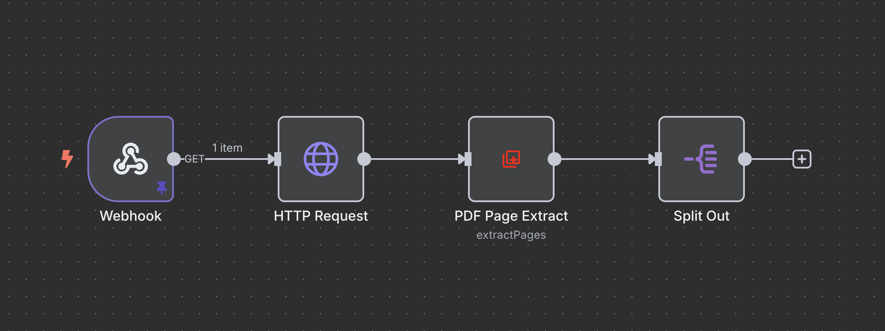

# PDF Page Extract - n8n Custom Node

This n8n community node allows you to extract text from each page of a PDF file. It's ideal for structured document processing in your workflows.

## ✨ Features

- Extracts text from every page in a PDF
- Optionally includes the full raw text
- Optionally includes PDF metadata (title, author, etc.)
- Works with binary files in n8n

## 🛠 Usage

1. Install the node via the **n8n Community Nodes** interface.
2. Use a node like HTTP Request or Webhook to provide a PDF file.
3. Attach the PDF to the binary property (default is `data`).
4. Configure the following options:
   - `Include Raw Text`: adds the full unstructured text output
   - `Include Metadata`: adds document metadata (e.g., title, author)

## 🖼 Example Workflow

The following example shows how to download a PDF from a URL and extract its pages:



1. **Webhook** – Triggers the workflow (e.g. via browser or automation).
2. **HTTP Request** – Downloads the PDF file.
3. **PDF Page Extract** – Extracts page-by-page text.
4. **Split Out** – Splits the array of pages into individual items for further handling (e.g. AI, validation, extraction).

## 🔁 Output

Each item returned looks like this:

```json
{
  "filename": "example.pdf",
  "totalPages": 5,
  "pages": [
    "Page 1 text...",
    "Page 2 text..."
  ],
  "text": "Full document text (optional)",
  "metadata": {...},
  "info": {...}
}
```

## 🧩 Tips

Use this node in combination with:
- The `Set` node to isolate values
- The `If` node for conditionals based on page content
- The `HTTP Request` node to send data to another API

---

For issues or feedback, please open an issue on GitHub.
